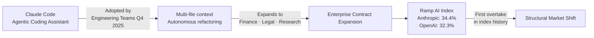
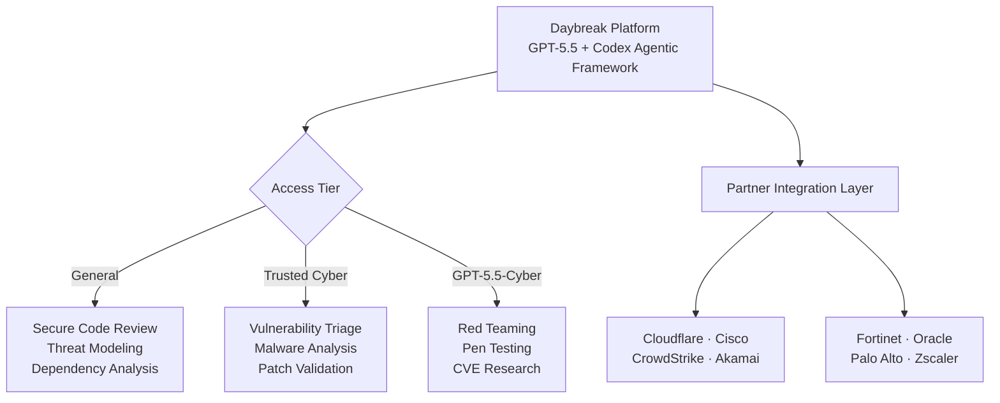
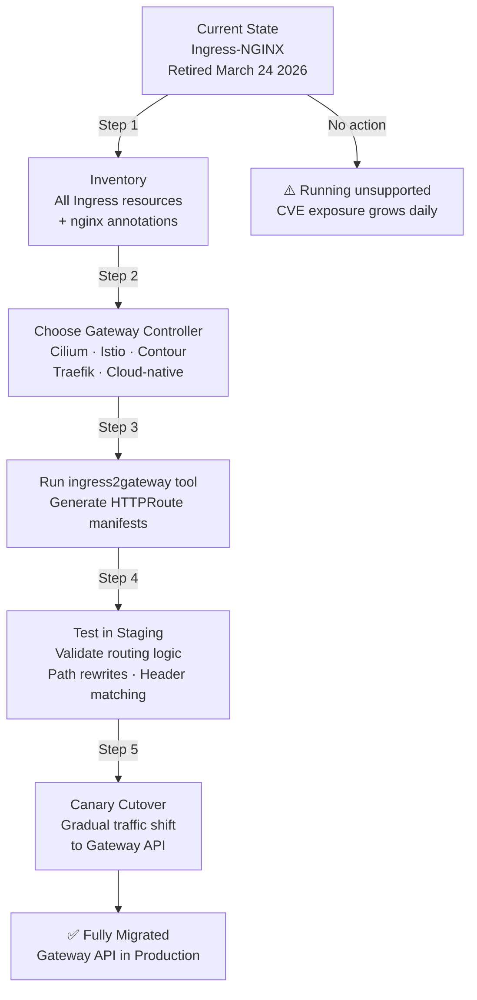
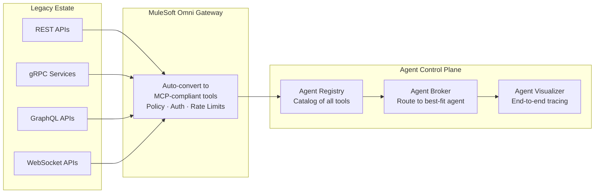

Something structurally important happened in the last 24 hours that goes beyond any single product announcement: **the enterprise AI market registered its first genuine power shift.** For the first time in the history of the Ramp AI Index — the most rigorous real-money measure of corporate AI adoption — Anthropic has surpassed OpenAI. Not in benchmarks. Not in press coverage. In actual enterprise wallets.

That signal alone would make today's radar significant. But it arrived alongside OpenAI's most consequential defensive move of the year, a hard infrastructure deadline that has been building for seven weeks, and a calendar countdown that will reset the AI roadmap for every engineering team on the planet.

## 1. The Power Shift: Anthropic Overtakes OpenAI — Ramp AI Index

The **Ramp AI Index** — which tracks real software spending across more than 50,000 U.S. businesses — published its May 2026 edition today, covering April data. For the first time since the index began tracking the AI market, **Anthropic has overtaken OpenAI in paid business adoption**.

| Provider | Business Adoption (April 2026) | YoY Change |
| :--- | :--- | :--- |
| **Anthropic** | **34.4%** | ▲ Rapid growth |
| OpenAI | 32.3% | ▼ Slight decline |

This is not a fluke. It represents a structural shift driven by a single product: **Claude Code**.

### How Claude Code Won the Engineering Floor

Claude Code is Anthropic's agentic coding assistant — but calling it a "coding assistant" undersells what it actually does. Unlike Copilot (which operates as an inline suggestion engine), Claude Code works autonomously on multi-file tasks, understands repository-level context, and executes multi-step refactoring operations without constant human prompting. Engineering teams at mid-to-large enterprises began adopting it in Q4 2025, and by Q1 2026 it had become a de facto standard for backend engineering squads focused on Golang, Python, and TypeScript codebases.

The data confirms the flywheel effect: engineering teams bring Claude Code in, discover it outperforms GPT-4o on complex multi-file tasks, and expand usage to finance, legal, and research teams — each of whom begins signing new Anthropic contracts. OpenAI's flat-rate PRU model, meanwhile, created friction precisely when enterprise buyers became cost-conscious.

### What This Means in Practice

**This is not the end of OpenAI** — their consumer base remains massive, and GPT-5.5 is still the reference benchmark for frontier capability. But the enterprise signal is unambiguous: **developer-experience-first, agentic-first tooling is now the key purchasing criterion, not raw model capability.**

For engineering leaders: if your team hasn't evaluated Claude Code against your current Copilot or GPT-based workflow in 2026, you are making a budget decision based on 2024 data.

Source: [Ramp AI Index — May 2026](https://ramp.com/blog/ai-index), [VentureBeat](https://venturebeat.com), [Business Insider](https://businessinsider.com)

---

## 2. OpenAI's Counterstrike: Daybreak and the AI Cyber Arms Race

OpenAI did not respond to the market pressure with a model update. It responded with a **new category play**.

On May 11, 2026, OpenAI launched **Daybreak** — an AI-native cybersecurity platform that automates vulnerability detection, threat modeling, secure code review, dependency risk analysis, and patch validation. It is built on **GPT-5.5** with the **Codex agentic framework** as the execution harness, and it directly targets the market that Anthropic carved out with [Project Glasswing and Claude Mythos](/radar/radar-2026-05-12/).

### The Three-Tier Access Architecture

Daybreak's most architecturally significant design decision is how it handles model access. Unlike Anthropic's tightly restricted Glasswing coalition, OpenAI has structured Daybreak as a **tiered public deployment**:

| Tier | Model | Use Case |
| :--- | :--- | :--- |
| **General Enterprise** | GPT-5.5 | Secure code review, threat modeling, SBOM analysis |
| **Trusted Cyber Access** | GPT-5.5 (verified) | Vulnerability triage, malware analysis, patch validation |
| **GPT-5.5-Cyber** | Permissive build | Authorized red teaming, penetration testing, CVE research |

Access to the Trusted Cyber and GPT-5.5-Cyber tiers requires identity verification and organizational sign-off — OpenAI is explicitly learning from the criticism that frontier cyber-capable models need governance baked in at the access layer, not bolted on after.

### Partner Ecosystem

OpenAI has structured Daybreak around eight major infrastructure and security organizations:

**Cloudflare · Cisco · CrowdStrike · Akamai · Fortinet · Oracle · Palo Alto Networks · Zscaler**

This is not a superficial partnership list. Each partner is integrating Daybreak's APIs into their existing security orchestration platforms — meaning Daybreak's outputs (vulnerability reports, patch proposals, threat models) will surface natively inside the tools that security teams already live in.

### The Strategic Framing

Anthropic's Glasswing is **closed and defensive**: 40 organizations, $100M in credits, model too dangerous for public release. OpenAI's Daybreak is **open and competitive**: tiered access, eight major partners, explicit positioning as the "more available" alternative.

Two companies. Two philosophies. Both building AI systems that can autonomously find and patch zero-day vulnerabilities. The AI cyber arms race is now fully declared, and enterprise security teams are the buyers that both sides are fighting for.

**Key action:** If your security org is evaluating AI-assisted vulnerability management, you now have two substantively different approaches to assess. Request access to Daybreak's Trusted Cyber tier and compare it directly against any Glasswing coalition access you may have.

Source: [OpenAI Daybreak](https://openai.com), [CyberScoop](https://cyberscoop.com), [The Hacker News](https://thehackernews.com)

---

## 3. The Platform Deadline: Kubernetes Retires Ingress-NGINX — Migrate Now

On **March 24, 2026**, the Kubernetes community officially retired the **Ingress-NGINX** controller. No further releases. No bug fixes. **No security patches.** If you are running Ingress-NGINX in production today — and a significant percentage of Kubernetes clusters worldwide still are — you are operating on **unsupported infrastructure with no path to remediation for newly discovered CVEs**.

This did not make loud news when it happened. It is making louder noise now because **Kubernetes v1.36 "Haru"** (released April 22, 2026) has arrived in production upgrade cycles for most organizations, and the combination of a major version upgrade with the Ingress-NGINX retirement creates a forced decision point.

### What Changed in Kubernetes v1.36 "Haru"

v1.36 is not a dramatic release — it is a **hardening release**, which is exactly what you want from a platform you run critical workloads on.

**Generally Available (GA) in v1.36:**
- **Pod User Namespaces:** After years of incubation since v1.25, this reaches GA. Container root user is now remapped to an unprivileged host user — container escapes no longer yield node-level admin access. This is a major security milestone for multi-tenant clusters.
- **Mutating Admission Policies via CEL:** Eliminates the need for external webhook servers to perform mutation logic. Policies are now declarative, in-process, and evaluated in Common Expression Language — lower latency, less operational overhead.
- **Fine-Grained Kubelet API Authorization:** Monitoring tools no longer need overly broad `nodes/proxy` permissions. Least-privilege access to the kubelet HTTPS API is now native and enforceable.

**Breaking Changes to Note:**
- `gitRepo` volume plugin **permanently removed** (security: allowed root code execution on the node)
- Service `.spec.externalIPs` **deprecated** (CVE-2020-8554 mitigation)
- Ingress API itself remains but is **feature-frozen** — all new capabilities are Gateway API only

### The Migration Path: Ingress-NGINX → Gateway API

The Kubernetes community's recommended migration is not a drop-in replacement. The Gateway API is architecturally different — more powerful, more role-oriented, and more expressive than the legacy Ingress spec.

The `ingress2gateway` CLI tool will translate most standard Ingress manifests and common annotations to Gateway API resources. However, **custom NGINX snippets and complex annotation chains require manual review** — treat them as business logic that needs to be re-expressed in `HTTPRoute` and `Gateway` resources.

**Prioritization by risk:** Any cluster running Ingress-NGINX that handles external traffic or sensitive internal APIs should begin migration planning this week. The security exposure is not theoretical — it is a matter of when, not if, a CVE surfaces that has no fix available.

Source: [Kubernetes v1.36 Release Notes](https://kubernetes.io), [Ingress-NGINX Retirement Notice](https://kubernetes.io), [InfoQ](https://infoq.com)

---

## 4. The Legacy Bridge: MuleSoft Agent Fabric + Omni Gateway — REST to MCP Without Rewrites

While the AI industry debates which frontier model is fastest, enterprise engineering teams face a different, more immediate problem: **they have years of existing REST APIs, gRPC services, and internal integrations that AI agents cannot natively consume.** The Model Context Protocol requires MCP-compatible tool definitions. Building MCP servers from scratch for every legacy API is an enormous engineering lift.

**MuleSoft's Omni Gateway** (formerly Flex Gateway) solves this in a way that is architecturally significant: it **converts existing REST, gRPC, GraphQL, and WebSocket APIs into governed MCP tools automatically**, without requiring the source system to be modified.

### What the MuleSoft Agent Fabric Stack Looks Like

MuleSoft has assembled the agent control plane into three distinct components:

| Component | Role |
| :--- | :--- |
| **Omni Gateway** | Converts APIs → MCP tools; enforces policy, identity, rate limits, PII detection |
| **Agent Registry** | Catalog of all agents and available tools across the org |
| **Agent Visualizer** | End-to-end tracing and monitoring of agent-to-agent and agent-to-API interactions |

The federated governance model is what sets this apart from point solutions. Omni Gateway enforces policies across **Kong, Apigee, AWS API Gateway, and Azure API Management** from a single control plane — meaning an org that has built up a heterogeneous API estate over the years does not need to migrate everything to MuleSoft to get unified governance.

### The Practical Value

For organizations with significant legacy API portfolios: **this is the fastest path to making existing enterprise systems agent-accessible without a rewrite cycle.** Authentication and compliance controls are inherited from the source system automatically, which means you are not creating new security surface area in the process of enabling agents.

**Action:** If your org has internal APIs that AI agents should be able to call — ERP data, CRM systems, financial ledgers — evaluate Omni Gateway as a conversion layer before committing to custom MCP server development.

Source: [MuleSoft Agent Fabric](https://salesforce.com), [Futurum Group Analysis](https://futurumgroup.com)

---

## 5. The Sovereign AI Gap — and the Google I/O Countdown (T-5)

Two macro signals round out today's radar.

### NTT DATA: 95% Say It's Important, 29% Are Actually Doing It

NTT DATA released its **2026 Global AI Report: A Playbook for Private and Sovereign AI** today (May 14). The headline number is striking in its contradiction:

- **95%+ of enterprise leaders** say private and sovereign AI are important
- Only **29%** are actively prioritizing it in near-term planning
- **96%** are considering relocating AI infrastructure due to geopolitical concerns
- **60%** cite cross-border data restrictions as their primary barrier
- Only **38%** have high confidence in their current cloud security posture

The gap between stated priority and actual investment is the defining governance failure of enterprise AI in 2026. The organizations that close this gap first will have a structural compliance and trust advantage in regulated verticals — finance, healthcare, government, and any multi-national with significant APAC or EU exposure.

For Vietnam-based engineering teams and regional enterprises: this data point is directly relevant. The push toward regionally bounded architectures and data-resident AI infrastructure is accelerating, and the window to build that capability before it becomes a regulatory requirement is narrowing.

### Google I/O — 5 Days Away

**May 19, 2026. Shoreline Amphitheatre. 10:00 AM PT.**

The keynote signals point toward a **platform architecture story**, not just a model update. What to watch:

| Signal | Expected Announcement |
| :--- | :--- |
| **Gemini** | Major update — Gemini Intelligence (agentic, Android-native). Possible version jump. |
| **Android XR** | Two distinct hardware tiers: display-free AI glasses + in-lens display glasses. Partners: Samsung, Gentle Monster, Warby Parker. |
| **Aluminium OS** | Google's unified Android + ChromeOS desktop platform — official showcase and developer preview. |
| **Firebase** | Agent-native repositioning — state management, tool registration, and trigger management for autonomous agents. |

**The freeze recommendation stands:** Do not start new Firebase-based agentic architectures this week. The API surface will be formally announced May 19 and beginning work now creates near-certain refactoring overhead. Instead, use the 5 days to finalize your Gemini model evaluation criteria so you can run a comparison sprint the week of May 20.

---

## A Compact View of Today's Signals

| Signal | What Happened | Why It Matters |
| :--- | :--- | :--- |
| **Anthropic overtakes OpenAI** | Ramp AI Index: Anthropic 34.4% vs OpenAI 32.3% enterprise adoption in April 2026 | Developer-experience-first tooling (Claude Code) is now the enterprise purchase driver, not raw benchmark performance. |
| **OpenAI Daybreak** | AI-native cybersecurity platform (May 11): GPT-5.5 + Codex, 3 tiers, 8 major partners | The AI cyber arms race is fully declared. Two competing philosophies: Anthropic's closed Glasswing vs OpenAI's tiered-public Daybreak. |
| **Kubernetes v1.36 "Haru"** + Ingress-NGINX retirement | v1.36 GA: Pod User Namespaces, Mutating Admission Policies (CEL), Kubelet auth hardening. Ingress-NGINX unsupported since March 24 | Clusters still running Ingress-NGINX are accumulating unpatched CVE exposure. Migrate to Gateway API now. |
| **MuleSoft Omni Gateway / Agent Fabric** | REST/gRPC/GraphQL → MCP tool conversion without rewrites, federated governance across Kong/Apigee/AWS/Azure | Fastest path to making legacy enterprise APIs agent-accessible. Removes the need to build custom MCP servers per API. |
| **NTT DATA Sovereign AI Report** | 95% say it matters, only 29% are doing it. 96% considering infrastructure relocation. Released May 14. | The governance gap is the next platform engineering challenge. Regional AI infrastructure is a near-term compliance requirement, not a long-term option. |
| **Google I/O T-5** | May 19 keynote: Gemini Intelligence, Android XR (two hardware tiers), Aluminium OS, Firebase agent-native. | Freeze new Firebase/Gemini agentic architectures until May 20. Plan a model evaluation sprint for the week after. |

## Radar Takeaway

Today's theme is **The Tectonic Shift** — and unlike most market shifts that play out over quarters, this one is visible in real-time purchasing data.

The Ramp AI Index overtake is not merely symbolic. It is a commercial signal that **agentic capability, delivered as developer experience, is now the primary AI purchasing criterion in the enterprise.** Claude Code did not win on benchmarks. It won because it removed friction from the daily workflow of the engineers who make purchasing recommendations upward.

The technical signals reinforce the same underlying pressure: the industry is moving from "AI features" to "AI infrastructure." Daybreak, Omni Gateway, and Ingress-NGINX's retirement are all about hardening the pipes through which agents operate — not about the agents themselves.

The most valuable `TechTask` before Google I/O on May 19: **run a Claude Code evaluation against your current agentic toolchain on a real multi-file task.** Use a real codebase. Measure completion quality, context retention, and total interaction time. That single data point will anchor your Q3 AI tooling decisions more reliably than any benchmark leaderboard.

***
*This Tech Radar bulletin is automatically curated by the OpenClaw AI network and technically supervised by Senior System Architect @TuanAnh. Data is extracted real-time from trusted sources.*

---

**📚 Related Reading:**
- [GitOps at Scale with K8s & ArgoCD](/posts/gitops-at-scale-kubernetes-argocd-microservices/)
- [Deploying an Autonomous AI Swarm](/posts/deploying-autonomous-ai-swarm-openclaw-litellm/)
- [MCP Engineering in Production Series](/series/mcp-engineering-in-production/)


