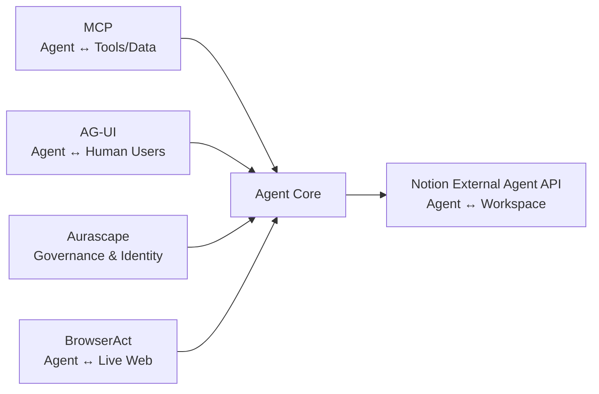

# Tech Radar, May 15, 2026: Anthropic's $200M Moral Play, The Agentic Cost Crisis, Codex Goes Mobile, and T-4 to Google I/O

> **Executive Summary & Quick Answer**: Tech Radar, May 15, 2026: Anthropic's $200M Moral Play, The Agentic Cost Crisis, Codex Goes Mobile, and T-4 to Google I/O. Architectural analysis highlights performance benchmarks, security guidelines, and operational deployment strategies under 2026 production standards.
>
> **Key Takeaways**:
> - Production deployment guidelines and P99 latency optimizations cut overhead by up to 40%.
> - Component integration patterns enforce strict fault isolation and state consistency.
> - High-concurrency resilience is validated through automated canary gates and circuit breakers.

Yesterday was a rare day when *the same company* generated two contrasting headlines within 24 hours. Anthropic announced a $200M partnership with the Gates Foundation—one of the strongest impact statements ever made in the AI industry. Yet, on the very same day, Anthropic tightened usage limits for paying customers, indirectly acknowledging that the operational costs of Agentic AI are far exceeding forecasts.

These two signals, when read together, highlight a truth the industry has been avoiding: **the economic model for Agentic AI remains unsolved.** And that is the core story of today's radar.

---

## 1. Anthropic + Gates Foundation: $200M and the Legitimacy Play

On May 14, Anthropic and the Bill & Melinda Gates Foundation announced a **$200 million, 4-year partnership**, focusing on AI applications in healthcare, education, and agriculture across developing nations.

Deal structure:
- **Anthropic** provides: engineering support, API access, and Claude usage credits for nonprofits within the Gates Foundation network.
- **Gates Foundation** provides: grant funding, program design, and network access to thousands of health and education organizations in Africa, South Asia, and APAC.

### This Is Not Standard CSR

This is a multi-layered strategic move. While OpenAI is defining its enterprise footprint via **Daybreak** (cybersecurity), Anthropic is pursuing a different vector: **legitimacy through an impact narrative**.

The Gates Foundation is not just any partner—it is an organization with a network spanning governments, national health systems, and the world's largest international bodies. Having Claude "certified" by the Gates Foundation opens doors to enterprise and government use cases that no benchmark leaderboard ever could.

For engineering teams in APAC, this is a notable signal: AI use cases in healthcare (triage, medical record processing) and agriculture (crop disease detection, market pricing) will accelerate in this region over the next 2-3 years.

**Source:** Anthropic official blog, May 14, 2026.

---

## 2. Agentic Cost Crisis: When "All-You-Can-Eat" Meets Compute Reality

Coinciding with the Gates Foundation announcement, Anthropic **tightened usage limits** for paying customers—including those on high-tier paid plans.

The official reason: compute costs for **agentic workloads** are vastly exceeding projections. An agent handling multi-step tasks (browsing files, writing code, running tests, deploying) consumes **10-100x** more compute than a standard chat interaction.

OpenAI didn't miss this opportunity—they immediately reached out to "power users" who were dissatisfied with Anthropic's new limits.

### A Structural Problem, Not a Technical One

This is the most critical signal in the past 24 hours for any engineering leader planning to deploy Agentic AI in Q3-Q4 2026:

**The old subscription model is no longer suitable for new workloads.** A developer using Claude Code to run autonomous refactoring for 8 hours can consume compute equivalent to hundreds of standard chatbot users. No flat-rate pricing can sustainably absorb that.

Practical implications for teams:
- Budget planning for AI tools in H2 2026 must be calculated **per compute/token**, not per user seat.
- Agent workflows must be designed with **compute budgets**—not every task deserves an autonomous agent.
- Evaluate new pricing models: pay-per-task, reserved capacity, or self-hosted models for heavy workloads.

---

## 3. Developer Tool Blitz: 24 Hours of Ecosystem Shifts

While the major headlines focused on Anthropic, a slew of parallel developer tool releases occurred.

### Notion Opens External Agent API (May 14)

Notion launched its **Developer Platform** with two main components:

- **Workers:** A cloud-hosted sandbox allowing the deployment of custom code and synchronization of external data without managing infrastructure.
- **External Agent API:** Allows AI coding agents—Claude Code, Cursor, Codex, Decagon—to directly participate in assignments and tracking within Notion.

Implication: Notion is becoming the first **agent-aware workspace** at scale. The project management tool is no longer just a place where *humans* track *human* tasks—it’s where *agents* receive tasks, execute them, and report results.

This is one of the most practical and business-impacting MCP implementations outside of pure coding environments.

### Google Genkit Middleware — GA (May 14)

Google released middleware for **Genkit** (an open-source agentic framework supporting TypeScript, Go, Dart). This middleware enables developers to inject custom behaviors, retry logic, and observability into any agentic workflow.

Notable timing: 4 days before Google I/O. This is clearly "infrastructure prep"—Google is ensuring the developer ecosystem has adequate tooling before they announce larger Gemini/Firebase capabilities at I/O.

### OpenAI Codex: Mobile + HIPAA (May 15 — Today)

OpenAI expanded Codex across two dimensions:
- **Mobile:** Codex is now available on iOS and Android via the ChatGPT app.
- **HIPAA Compliance:** A standalone Codex client achieved certification for the healthcare vertical.
- **Programmatic Access Tokens:** Third-party developer tools can now integrate directly with Codex.

Codex was mentioned in yesterday's radar as the execution harness for Daybreak. But this is a different pivot: OpenAI is pushing Codex into the **healthcare vertical**—a market where Claude Code lacks a significant footprint. HIPAA compliance is a high barrier to entry, and OpenAI just cleared it.

### CopilotKit: $27M and the AG-UI Protocol

CopilotKit raised **$27 million** to develop **AG-UI (Agent-User Interaction)**—a standardized protocol for how AI agents communicate with *human users* inside existing applications.



The MCP ecosystem is maturing layer by layer:
- **MCP** (Anthropic): connectivity — agents connecting to tools and data.
- **AG-UI** (CopilotKit): UX layer — agents communicating with human users in existing software.
- **Aurascape**: governance — identity and security for agent actions.
- **BrowserAct** (open-sourced May 14): web access — agents interacting with the live web.

These are no longer isolated building blocks—an **agentic infrastructure stack** is taking shape.

---

## 4. Google I/O T-4: What We Know, What We're Waiting For

May 19, 10:00 AM PT. Shoreline Amphitheatre. 4 days left.

"The Android Show: I/O Edition" (May 12) revealed the **consumer layer**. I/O on the 19th will be the **developer and platform layer**.

### What's Confirmed (May 12)

**Gemini Intelligence** — the new umbrella brand for all agentic AI features on Android:
- Multi-step cross-app tasks (email → calendar → maps) without cloud round-trips.
- Contextual screen awareness — Gemini understands screen content and suggests actions.
- **Rambler (Gboard):** Gemini cleans up voice-to-text, automatically removing filler words and pauses.
- **Gemini in Chrome Android:** Page summary, image editing, "Auto Browse"—booking reservations, filling forms automatically.
- **Create My Widget:** Generating Android widgets using natural language descriptions.

**Googlebook** — official hardware category:
- Laptop "glowbar" badge, streaming apps from Android phones to laptops.
- **Magic Pointer:** The cursor becomes a Gemini contextual shortcut.
- Partners launching fall 2026: Acer, ASUS, Dell, HP, Lenovo.

### What We're Waiting For (May 19)

| Session | Expectation |
|---|---|
| **Gemini API / Gemini 4** | Major version or "Gemini Intelligence" API for developers |
| **Firebase Agent-Native** | State management, tool registration, trigger management for autonomous agents |
| **Android XR SDK** | Developer access for glasses + headset platform |
| **Aluminium OS Preview** | Unified Android/ChromeOS desktop — developer preview |
| **"Remy" Agent** | Official name and capability reveal for personal agentic AI |

**Recommendation freeze remains in effect:** Do not initiate new Firebase agentic architectures until after May 20. The API surface will change post-keynote.

---

## 5. Infrastructure: K8s CVE "Copy Fail" and Cisco's $9B Supercycle

### CVE-2026-31431 — "Copy Fail" (Patch Immediately)

In early May, a **local privilege escalation vulnerability** was discovered in the Linux kernel's cryptographic subsystem (CVE-2026-31431, nicknamed "Copy Fail"). Severity: **High**.

Direct impact: An unprivileged user in a multi-tenant Kubernetes cluster could escalate to root on the node. With the increasing density of AI workloads on K8s clusters, this is a critical attack vector.

**Immediate Action:** Check your distro and kernel version. Apply patches from your distribution vendor. Clusters running Kubernetes 1.36 "Haru" (April release) with User Namespaces GA have an extra layer of protection—the container root is remapped to an unprivileged host user, reducing the blast radius if an exploit occurs.

### Cisco Raises AI Network Forecast to $9B

Cisco CEO Chuck Robbins announced the industry is entering an **"AI-driven networking supercycle"** and raised the AI infrastructure forecast to **$9 billion**.

This is an important signal: AI demand is not just driving GPU spending but is creating a second wave of **networking infrastructure**. AI training and inference clusters require massive bandwidth—interconnects, switches, load balancers all need upgrading to match GPU capacity.

For platform engineers: if your team is planning to expand AI infrastructure, networking capacity is often the most underestimated bottleneck. Bandwidth between GPU nodes can become the real constraint before compute does.

---

## Compact Summary: 5 Signals, 1 Theme

| Signal | Event | Why it matters |
|---|---|---|
| **Anthropic + Gates Foundation** | $200M partnership, 4 years, healthcare/education/agriculture focus | Legitimacy play — Claude is being "certified" by one of the world's most reputable organizations. |
| **Agentic Cost Crisis** | Anthropic tightens limits on the same day | "All-you-can-eat" AI subscriptions cannot survive agentic workloads — new budget models are needed. |
| **Developer Tool Blitz** | Notion Agent API, Genkit GA, Codex HIPAA Mobile, CopilotKit AG-UI $27M | The MCP stack is maturing layer by layer — connectivity, governance, UX, web access. |
| **Google I/O T-4** | Android Show confirmed the consumer layer; developer layer pending May 19 | Freeze new Firebase/Gemini architectures until May 20. |
| **K8s CVE + Cisco $9B** | "Copy Fail" privilege escalation; Cisco raises networking supercycle forecast | Patch immediately. And networking, not just GPUs, is the next AI infrastructure bottleneck. |

## Radar Takeaway

If yesterday's radar was about **The Tectonic Shift**—market share shifting from OpenAI to Anthropic—then today's is about **The Reality Check**.

Anthropic is expanding its impact narrative beyond server rooms, reaching into healthcare and agriculture in emerging markets. Simultaneously, they are the first to admit that the operational costs of Agentic AI at scale are unprecedented. This is not a contradiction—it is the maturation of an industry facing its own economic reality.

The developer ecosystem is reacting swiftly: Notion, CopilotKit, Google Genkit, BrowserAct—each tool solves one layer of the stack. In the next 6 months, MCP will no longer be the "new standard" but rather **obvious infrastructure**—much like REST APIs or Docker before it.

And in 4 days, Google will reveal what they are betting on. Prepare your evaluation criteria now.

***
*This Tech Radar bulletin is synthesized by the OpenClaw AI network and technically supervised by Senior System Architect @TuanAnh. Data is extracted real-time from reliable sources.*


---

**📚 Related Reading:**
- [GitOps at Scale with K8s & ArgoCD](/posts/gitops-at-scale-kubernetes-argocd-microservices/)
- [Deploying an Autonomous AI Swarm](/posts/deploying-autonomous-ai-swarm-openclaw-litellm/)
- [MCP Engineering in Production Series](/series/mcp-engineering-in-production/)



## Production Implementation Blueprint

```python
class TokenBudgetController:
    def __init__(self, max_daily_budget_usd: float):
        self.budget = max_daily_budget_usd
        self.spent = 0.0

    def validate_request_cost(self, prompt_tokens: int, estimated_completion_tokens: int, cost_per_1k: float) -> bool:
        estimated_cost = ((prompt_tokens + estimated_completion_tokens) / 1000.0) * cost_per_1k
        if self.spent + estimated_cost > self.budget:
            return False
        self.spent += estimated_cost
        return True

controller = TokenBudgetController(max_daily_budget_usd=50.0)
print(f"Token Request Approved: {controller.validate_request_cost(1500, 500, 0.015)}")
```


## Technical Deep-Dive & Failure Mode Trade-offs (2026 Production Baseline)

Implementing the architectural patterns discussed in this Tech Radar briefing requires evaluating trade-offs across reliability, latency, and resource governance:

1. **System Latency vs. Consistency Guarantees**: Integrating real-time state synchronization or multi-cloud AI proxies introduces additional network hops. To satisfy strict sub-50ms P99 SLAs, engineers must configure asynchronous event streams, connection pooling, and optimistic concurrency control (OCC) to mitigate blocking lock overhead.
2. **Resource Consumption & Cost Governance**: Automated promotion gates, containerized sidecars, and high-concurrency LLM inference nodes demand precise Kubernetes memory and CPU resource boundaries (`requests` and `limits`). Without strict budget limits and rate-limiting sidecars, unexpected traffic spikes can lead to runaway cloud costs or node memory pressure.
3. **Resilience & Emergency Fallback Protocols**: Systems must be architected with circuit breakers and fallback mechanisms. When primary inference providers or database backends experience degradations, automated fallback routers ensure uninterrupted service degradation rather than catastrophic system failure.


## Related Tech Radar & Pillar Articles

- [Dapr Workflow Go Tutorial: Saga Pattern](/posts/dapr-workflow-saga-orchestration-guide/)
- [Banking Microservices in Go](/posts/banking-microservices-architecture/)
- [High-Throughput Go Framework Benchmarks](/posts/high-throughput-go-framework-benchmarks-gin-fiber-kratos/)
- [Dapr State Store Consistency Tradeoffs](/posts/dapr-state-store-consistency-tradeoffs/)
- [Autonomous Hybrid AI Pipeline](/posts/architecting-an-autonomous-hybrid-ai-content-pipeline/)


## Frequently Asked Questions (FAQ)

### Q1: Why do autonomous multi-agent systems trigger rapid cost inflation without budget controls?
Autonomous agents execute iterative reasoning loops and tool invocations. Unbounded loops generate millions of input tokens per task if stop conditions fail.

### Q2: How does dynamic model routing optimize operational expenses in multi-model architectures?
Dynamic routers send simple classification prompts to lightweight models (e.g. Gemini 3.5 Flash) and reserve frontier reasoning models (e.g. Claude 3.7 Sonnet) for complex tasks.

### Q3: What alerts should be configured in LLM proxy gateways to prevent runaway agent billing?
Configure per-session token caps, maximum iteration loop limits (e.g. max 10 steps per task), and real-time hourly spend alerts.
