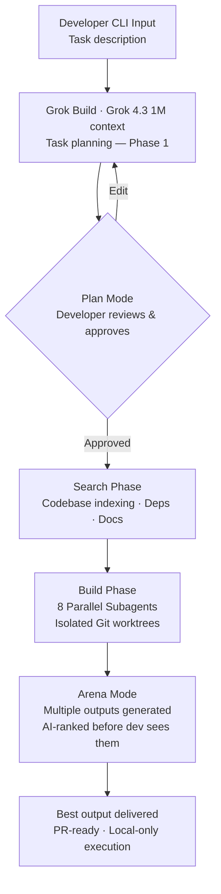
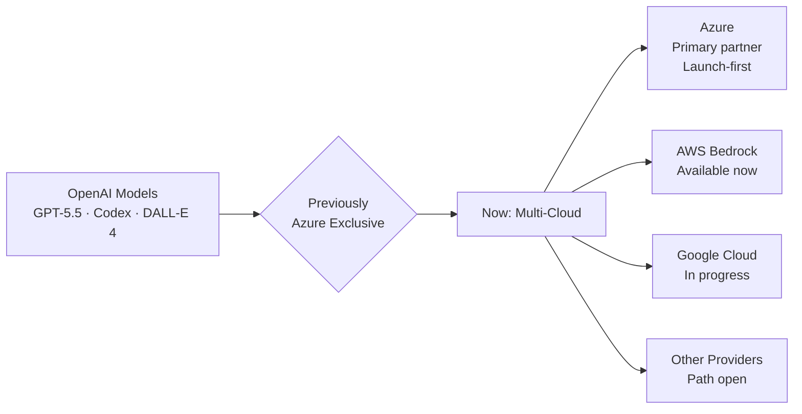
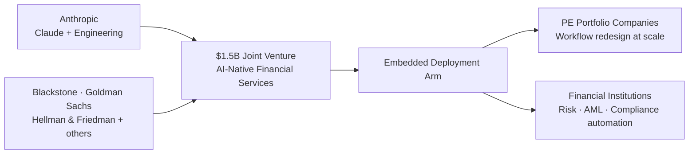

xAI retired Grok 3 and its entire legacy lineup — then launched **Grok Build**, a local-first coding agent where source code never leaves your machine. OpenAI ended its Azure exclusivity arrangement; **GPT-5.5 is now available on AWS Bedrock**. Anthropic closed a **$1.5B JV with Blackstone, Goldman Sachs, and Hellman & Friedman** to embed Claude directly inside financial institutions. The EU AI Act Omnibus extended high-risk deadlines — but the **August 2026 transparency obligation is unchanged**. Meta went two-track: open Llama 4 for the ecosystem, closed Muse Spark for itself. And in three days, **Google I/O resets every AI roadmap on the planet**.

Three days out from Google I/O, the market is not pausing. The signals of May 15–16 span five distinct layers — competitive tooling, cloud infrastructure, enterprise finance, open-source strategy, and regulation — and they converge on a single observation: **the AI race has moved from product launches to structural entrenchment.** The decisions being made this week are not experimental. They are bets that will define the landscape of 2027.

---

## 1. xAI's Double Move: Grok 3 Is Dead, Grok Build Is Born

Yesterday was a decisive day for xAI — and it went largely unreported amid the Anthropic headlines. xAI executed two moves simultaneously:

### Move A: Model Consolidation — Grok 4.3 Is Now the Only Grok

Effective **May 15, 2026 at 12:00 PM PT**, xAI retired a significant portion of its model lineup, including `grok-3` and all legacy `grok-4.x` fast variants. The full retirement list:

`grok-3` · `grok-4-1-fast-reasoning` · `grok-4-1-fast-non-reasoning` · `grok-4-fast-reasoning` · `grok-4-fast-non-reasoning` · `grok-4-0709` · `grok-code-fast-1` · `grok-imagine-image-pro`

All deprecated model slugs now **automatically redirect to Grok 4.3** — xAI's current flagship, featuring a **1 million token context window** and configurable reasoning effort (`none`, `low`, `medium`, `high`). Pricing has changed: $1.25 / $2.50 per 1M input/output tokens. Developers who were hitting deprecated endpoints are now silently on different pricing — xAI has strongly recommended explicit model specification in API calls.

**Action for teams using xAI APIs:** Audit your model slugs immediately. Silent billing changes are the worst kind.

### Move B: Grok Build — A Third Agentic Coding Agent

On the same day, xAI released **Grok Build** in early beta to **SuperGrok Heavy** subscribers. This is the third credible entrant in the agentic coding category, after Anthropic's Claude Code and OpenAI's Codex. But Grok Build's architecture makes a set of design bets that neither competitor has made.

**Local-First, Zero Data Exfiltration**

The most significant architectural decision: Grok Build runs entirely on the developer's machine. **Source code, project data, and credentials are not transmitted to xAI's servers.** This makes it compatible with air-gapped environments and directly addresses the #1 adoption blocker for agentic coding agents in regulated industries: IP and compliance exposure.

**Three-Stage Workflow: Plan → Search → Build**

Grok Build decomposes every task into three explicit phases before touching the codebase:
1. **Plan:** The agent surfaces a logical plan the developer can review, edit, comment on, and explicitly approve before any execution.
2. **Search:** The agent reads and indexes relevant codebase context, documentation, and dependencies.
3. **Build:** Execution occurs — and at scale, up to **8 parallel subagents** are spawned, each working in isolated **Git worktrees** to prevent conflicts.

**Arena Mode: AI-Evaluated Code Quality**

Grok Build's most distinctive feature is **Arena Mode** — an automated evaluation layer where multiple code outputs are generated and ranked against each other before the developer sees them. Rather than presenting one solution and asking the developer to judge quality, Grok Build runs a competition and surfaces the winner. This reduces the cognitive load on the developer and addresses a known failure mode of single-output agents: quietly producing mediocre code that passes a surface-level review.

**Protocol Stack**

- MCP servers (tool connectivity)
- ACP — Agent Client Protocol (custom orchestration)
- `AGENTS.md` files, hooks, plugins
- Headless mode (`-p` flag) for CI/CD and script automation

**Competitive Matrix**

| Agent | Model | Local Execution | Context | Arena Mode | Parallel Agents |
|:---|:---|:---|:---|:---|:---|
| **Claude Code** | Claude Opus 4.7 | No | Up to 200K | No | No |
| **Codex CLI** | GPT-5.5 | No | Up to 128K | No | No |
| **Grok Build** | Grok 4.3 | **Yes (local-first)** | **1M tokens** | **Yes** | **8 subagents** |

The local-first advantage is not purely philosophical. For any organization in finance, healthcare, defense, or any sector with strict data residency rules, Grok Build is currently the **only production-capable agentic coding agent that doesn't require trusting a cloud endpoint with your source code.** That is a non-trivial market.

**Sources:** [xAI official](https://x.ai/blog/grok-build) · [TheNeuralFeed](https://theneuralfeed.com) · [DevOps.com](https://devops.com) · [TechLoy](https://techloy.com) · [PCMag](https://pcmag.com) · [Engadget](https://engadget.com)

---

## 2. OpenAI's Real-Time Bet: Three New Voice Models, GPT-5-Class Reasoning in Live Audio

On **May 7, 2026**, OpenAI launched a new suite of real-time voice models — a move that has received less coverage than it deserves given its downstream impact on enterprise applications.

### The Three Models

| Model | Purpose | Key Capability |
|:---|:---|:---|
| **GPT-Realtime-2** | Flagship live conversation | GPT-5-class reasoning, 128K context, parallel tool calls, interruption handling |
| **GPT-Realtime-Translate** | Live speech-to-speech translation | 70+ input languages, 13 output languages, no segmented pipeline |
| **GPT-Realtime-Whisper** | Streaming transcription | Low-latency, real-time speech-to-text |

GPT-Realtime-2 is the step-change here. Previous realtime models had to trade off reasoning quality against latency. The 128K context window (4× the prior 32K) and parallel tool-call support mean that a live voice conversation can now trigger multi-step agent actions — looking up records, updating databases, routing tasks — without breaking conversational flow.

### Enterprise Adoption Already Live

- **Zillow:** Using GPT-Realtime-2 to build a voice assistant that reasons through complex real estate searches (budget + location + amenities) and autonomously schedules property tours — in a single unbroken voice session.
- **Vimeo:** Using GPT-Realtime-Translate to deliver live, real-time translation of content for global audiences — replacing the traditional "transcribe first, translate second" pipeline.

### Why This Matters for Platform Engineers

The traditional voicebot stack was: ASR → NLU → Dialog Management → TTS. Each handoff introduced latency, context loss, and error amplification. GPT-Realtime-2 collapses this into a unified model with native reasoning. **The "stitched-together" voice AI architecture is now technical debt.**

If your product roadmap includes voice interfaces, customer service automation, or multilingual accessibility, this is the moment to re-evaluate your audio pipeline architecture. The Zillow and Vimeo deployments are not experiments — they are production customers signaling that GPT-5-class reasoning in live audio is ready for enterprise scale.

**Sources:** [OpenAI official](https://openai.com/blog/realtime-audio-models) · [eWeek](https://eweek.com) · [The Next Web](https://thenextweb.com) · [Microsoft](https://microsoft.com/ai) · [Heyloha.ai](https://heyloha.ai)

---

## 3. The Cloud Lock-In Ends: OpenAI Goes Multi-Cloud

In late April 2026, OpenAI and Microsoft **restructured their landmark partnership**, ending Azure's exclusive hold on OpenAI's models. As of mid-May 2026, **GPT-5.5 is available on AWS Bedrock**, and integration with Google Cloud is in progress.

### What Changed

| Dimension | Previous Arrangement | New Arrangement |
|:---|:---|:---|
| **Model exclusivity** | Azure only | Multi-cloud — AWS, Google Cloud, others |
| **Revenue share** | Ongoing % to Microsoft | Capped at $38B total through 2030 |
| **Launch sequencing** | Azure-first (all products) | Azure-first *unless* Azure cannot support |
| **IP license** | Tied to investment terms | Non-exclusive, through 2032 |
| **Microsoft → OpenAI payment** | Revenue share on Azure API usage | Eliminated |

### The Enterprise Impact

For three years, enterprises wanting GPT-class models at scale had one cloud choice: Azure. That constraint shaped multi-cloud strategies, data residency decisions, and platform architecture across tens of thousands of organizations. **That constraint is now lifted.**

**GPT-5.5 pricing context (API):** $5.00 / $30.00 per 1M input/output tokens. Cached input: $0.50 / 1M. Regional data residency adds 10%. Prompts >272K tokens: 2× input, 1.5× output multiplier.

**Practical implication:** If your organization chose Azure specifically to access OpenAI models — and Azure isn't your preferred data platform — this is the moment to revisit that architecture. The GPT-5.5 Thinking, Pro, and Instant variants are all now accessible through AWS Bedrock. Model selection is no longer a cloud vendor selection.

**Sources:** [The AI Forest](https://theaiforest.com) · [OpenAI official](https://openai.com)

---

## 4. Anthropic Goes to Wall Street: $1.5B JV with Blackstone, Goldman Sachs, and Hellman & Friedman

In early May 2026, Anthropic launched a **$1.5 billion joint venture** structured as an "AI-native financial services firm."

| Investor | Commitment |
|:---|:---|
| Anthropic | ~$300M (+ Claude models + engineering talent) |
| Blackstone | ~$300M |
| Hellman & Friedman | ~$300M |
| Goldman Sachs | ~$150M |
| Other Wall Street firms | ~$450M (completing total) |

This is not a capital raise. It is a **deployment vehicle**: Anthropic engineers embed directly into private equity portfolio companies and financial institutions to redesign workflows around Claude — due diligence, risk modeling, AML, performance tracking, regulatory compliance.

### The Three-Vector Legitimacy Strategy

Three signals in one week tell the same story about Anthropic's market posture:

1. **Gates Foundation $200M** (May 14) — healthcare, education, agriculture in emerging markets. *Legitimacy through impact.*
2. **Wall Street JV $1.5B** (early May) — direct deployment inside the firms managing global capital. *Legitimacy through institutional trust.*
3. **Ramp AI Index overtake** — Anthropic 34.4% vs OpenAI 32.3% enterprise paid adoption. *Legitimacy through wallets.*

Each vector reinforces the others. A moat built from three directions simultaneously is significantly harder to dismantle than a moat built from benchmark performance alone.

**Sources:** [Forbes](https://forbes.com) · [Business Insider](https://businessinsider.com) · [TechTimes](https://techtimes.com) · [Tipranks](https://tipranks.com)

---

## 5. Meta's Two-Track: Open Llama 4, Closed Muse Spark — the Open-Source Bet Hedges

In April 2026, Meta quietly made one of the most consequential strategic pivots in the open-source AI space: **it went two-track.**

### Track 1: Muse Spark (Closed, Proprietary)

Meta's newly formed **Meta Superintelligence Labs (MSL)**, led by Chief AI Officer Alexandr Wang, launched **Muse Spark** — a **closed-weights, proprietary model** designed to power Facebook, Instagram, WhatsApp, Messenger, and Meta AI Glasses. It is not available for download, not available on Hugging Face, and not accessible via external API.

The rationale: Muse Spark is trained on Meta's behavioral data across 3+ billion users. That data is Meta's core competitive asset — making it available via open weights would gift the training signal to every competitor. The monetization loop (ads, recommendations, engagement) requires keeping the model private.

### Track 2: Llama 4 (Open Weights, Enterprise-Deployable)

The Llama 4 family remains the flagship open offering:

| Model | Active Params | Total Params | Context Window | Best For |
|:---|:---|:---|:---|:---|
| **Scout** | 17B | 109B | 10M tokens | Document analysis, long-context reasoning |
| **Maverick** | 17B | 400B (MoE) | Standard | General assistant, enterprise balance |
| **Behemoth** | 288B | ~2T | — | Still in training / internal only |

Llama 4 Maverick is currently the production-ready flagship for self-hosted enterprise deployment. The Llama Community License applies — open weights, but with commercial restrictions including a 700M MAU threshold and specific training prohibitions.

### Why This Matters

Meta's pivot signals a limit on how far open-source commitment extends when the stakes are high enough. **The "open by default" era of frontier AI is ending** — even for Meta, historically the strongest open-source advocate among major labs.

For enterprise AI teams: if your stack relies on open Llama models for regulated-use inference, Maverick and Scout are stable through 2026. But watch whether Behemoth ever releases — its delay suggests the performance gap between Meta's open and closed tiers is widening, not narrowing.

**Sources:** [VentureBeat](https://venturebeat.com) · [OpenDataScience](https://opendatascience.com) · [Meta AI](https://ai.meta.com/llama)

---

## 6. Regulation: The EU AI Act Gets an Omnibus — But August 2026 Still Hits

On **May 7, 2026**, EU legislative bodies reached a political agreement on an **"AI Act Omnibus"** that significantly amends compliance timelines for high-risk AI systems (HRAIS).

### The Revised Timeline

| Category | Original Deadline | New Deadline |
|:---|:---|:---|
| Stand-alone High-Risk AI Systems | August 2, 2026 | **December 2, 2027** |
| HRAIS embedded in regulated products | August 2, 2026 | **August 2, 2028** |
| **Article 50 — Transparency Obligations** | August 2, 2026 | **Unchanged** |
| Generative AI watermarking (pre-Aug 2026 systems) | August 2, 2026 | December 2, 2026 |
| New: Nudifier AI prohibition, AI-generated CSAM | — | December 2, 2026 |

### The False Confidence Risk

The Omnibus does not create a compliance pause. It creates **false confidence risk** — the dangerous read that "deadlines extended = nothing urgent to do."

**Article 50 is non-negotiable in August 2026.** Chatbot disclosure, AI-generated content labeling, and synthetic media identification obligations apply to any system interacting with EU users — regardless of risk category or industry. If your product:
- Uses conversational AI interfaces
- Generates synthetic text, images, or video
- Operates recommendation or personalization systems visible to EU users

...then you have an **August 2026 compliance action item that has not moved.**

The formal adoption by European Parliament is expected July 2026. Monitor the Official Journal for the final published text to confirm the exact obligations for your specific deployment context.

**Sources:** [Latham & Watkins](https://lw.com) · [White & Case](https://whitecase.com) · [Tech Policy Press](https://techpolicy.press) · [WSGR](https://wsgr.com)

---

## 7. US Government Closes the Five-Lab Grid: CAISI Covers Every Major Frontier Lab

On **May 5, 2026**, the **Center for AI Standards and Innovation (CAISI / NIST)** formalized pre-deployment evaluation agreements with **Google DeepMind, Microsoft, and xAI** — completing the grid that already included OpenAI and Anthropic.

**All five major U.S. frontier AI labs are now in mandatory-equivalent pre-deployment testing.**

Under these agreements, agencies receive pre-release access to frontier models — including versions with reduced safety guardrails — to evaluate for national security risk across cybersecurity, biosecurity, CBRN, and autonomous behavior. Testing occurs in classified environments via the **TRAINS Taskforce**.

The Trump administration is reportedly considering an executive order to make a version of this process formally mandatory. Whether or not that EO materializes, the practical effect is already in place: **every major U.S. AI lab is now doing government red-teaming before public release.**

The procurement implication: CAISI evaluation status is becoming a de facto gate for government-adjacent enterprise customers in regulated industries. xAI joining with Grok Build launching the same week is a coordinated credentialing move, not a coincidence.

**Sources:** [NIST/CAISI](https://nist.gov/artificial-intelligence) · [CIO Dive](https://ciodive.com) · [The Guardian](https://theguardian.com) · [Microsoft](https://microsoft.com)

---

## 8. MCP Ecosystem: Two New Infrastructure Connectors Ship This Week

While the major narratives dominated headlines, two practical infrastructure releases deserve engineering attention:

### TestGrid MCP Connector

TestGrid launched an **MCP connector** that links AI coding environments (Claude, Cursor) directly to live browser and device testing infrastructure. A developer can now prompt in natural language to spin up a real test session on a Pixel 9 or Galaxy S24 — without leaving their IDE or manually configuring device labs.

The beta focuses on manual testing and visual validation; AI-driven automation is planned for future phases. This is the MCP ecosystem expanding beyond code generation into the full software delivery lifecycle — test environments, not just editors.

### Amazon Bedrock Advanced Prompt Optimizer

Simultaneously (May 14–15), Amazon Bedrock launched **Advanced Prompt Optimization** — a tool that compares prompts across up to 5 models simultaneously, using metric-driven feedback loops (accuracy, cost, latency) to iteratively refine prompt templates. It supports multimodal inputs (images, PDFs) and outputs evaluation scores and cost estimates alongside the optimized template.

This is Bedrock positioning itself as the **prompt engineering control plane** for organizations that want to work across model providers rather than lock into one. Combined with GPT-5.5 now available on Bedrock, the multi-model, multi-cloud AI architecture is no longer aspirational — it is operational.

**Sources:** [GlobeNewswire / TestGrid](https://globenewswire.com) · [Amazon Bedrock Docs](https://docs.aws.amazon.com/bedrock) · [InfoWorld](https://infoworld.com)

---

## 9. Google I/O — T-3: Gemini Omni Surfaces, "Remy" Agent Expected

**May 19, 2026. Shoreline Amphitheatre. 10:00 AM PT. Three days.**

Two new pre-I/O signals since yesterday's T-4 update:

**Gemini Omni (UI leak):** Users discovered a Gemini video generation UI string reading *"Powered by Omni"* alongside the existing Veo 3.1-based "Toucan" pipeline. The working theory: Gemini Omni is a **natively multimodal unified architecture** — text, image, video, and audio in a single model, eliminating the current component-routing model. Unconfirmed. I/O is the venue.

**Veo 4 (speculated):** Veo 3.1 (released Oct 2025, 4K + native audio) remains the current state. Industry rumor suggests **Veo 4** could be revealed at I/O — but this remains speculation. Watch the creative AI sessions at the keynote.

### Updated I/O Expectation Grid

| Session | Status | What to Watch |
|:---|:---|:---|
| **Gemini Omni** | UI leaked, unconfirmed | Unified multimodal — text + image + video + audio in one architecture |
| **"Remy" Personal Agent** | Multiple leaks | Full capability reveal for Gemini's autonomous personal AI |
| **Firebase Agent-Native** | Pre-I/O signals shipped | Official API for agent state, tool registration, triggers |
| **Android XR SDK** | Confirmed track | Developer access: AI glasses + headset platform |
| **Aluminium OS** | Confirmed track | Unified Android/ChromeOS — developer preview |
| **Veo 4** | Speculated | Next-gen video generation — watch creative AI sessions |

**Recommendation freeze remains in effect.** Do not initiate new Firebase agentic architectures or commit to Gemini API surface decisions until May 20. Use the 3 remaining days to finalize your evaluation criteria — so your team can execute a structured comparison sprint the week of May 20 with real tasks, not benchmarks.

---

## Compact Summary: 8 Signals, 1 Theme

| Signal | Event | Why It Matters |
|:---|:---|:---|
| **xAI Model Consolidation** | Grok 3 + legacy Grok 4.x retired May 15 → all traffic to Grok 4.3 (1M context, $1.25/$2.50 per 1M tokens) | Audit API model slugs immediately — silent billing changes are in effect |
| **Grok Build** | Local-first CLI agent: Arena Mode, 8 parallel subagents, no code exfiltration, air-gap compatible | First enterprise-safe agentic coding agent for regulated industries. Evaluate alongside Claude Code and Codex. |
| **OpenAI Realtime Suite** | GPT-Realtime-2/Translate/Whisper (May 7) — Zillow and Vimeo in production | "Stitched-together" voice AI stacks are now technical debt. Unified real-time reasoning in live audio is production-ready. |
| **OpenAI Multi-Cloud** | Azure exclusivity ended — GPT-5.5 on AWS Bedrock now, Google Cloud in progress | AI model procurement is no longer a cloud vendor decision. Revisit architecture if Azure was chosen purely for model access. |
| **Anthropic $1.5B Wall Street JV** | Blackstone, Goldman Sachs, H&F — embedded AI deployment in financial services | Three-vector legitimacy strategy (impact + institutional + developer) builds a moat benchmarks cannot replicate. |
| **Meta Two-Track** | Muse Spark (closed, proprietary) + Llama 4 Maverick (open-weights, enterprise-deployable) | The "open by default" era is ending even for Meta. Open weights are now a community strategy, not the flagship product. |
| **EU AI Act Omnibus** | HRAIS deadlines extended to Dec 2027/Aug 2028 — Article 50 transparency stays at August 2026 | Do not misread extensions as a compliance pause. Chatbot disclosure and synthetic content obligations are live in August. |
| **CAISI Five-Lab Grid** | Google + Microsoft + xAI join OpenAI + Anthropic in US pre-deployment testing | Government safety credentialing is becoming a procurement gate for regulated-sector AI. |
| **MCP Infrastructure** | TestGrid MCP connector + Amazon Bedrock Advanced Prompt Optimizer | MCP is expanding into the full delivery lifecycle — from code generation to live device testing and cross-model optimization. |
| **Google I/O T-3** | Gemini Omni UI leaked; Remy agent expected; Firebase Agent-Native API pending | Freeze extends 3 more days. Finalize evaluation criteria now for a fast post-May 19 sprint. |

## Radar Takeaway

Yesterday's radar was about **The Reality Check** — the agentic cost crisis exposing the unsustainability of flat-rate AI pricing. Today's radar is about **The Entrenchment Phase.**

Look at what happened in the last 48 hours through a structural lens:

- xAI **retired an entire generation of models** and launched a new category of agent on the same day. That is not a product update — it is a platform consolidation signal.
- OpenAI **dissolved a 5-year cloud exclusivity arrangement** with its most important partner, choosing competitive freedom over guaranteed distribution. That is not a commercial adjustment — it is a market-structure bet.
- Anthropic **deployed $300M of its own capital** into a JV rather than using a client's money. That is not a partnership — it is a direct operational commitment.
- Meta **quietly bifurcated its entire AI philosophy** — one model for the community, one model for itself. That is not a product decision — it is an admission that frontier AI is now a core competitive asset that cannot be shared.

These are not hedges. They are structural bets made with real capital, real architecture decisions, and real organizational commitment. The companies making them cannot easily reverse course.

For engineering leaders: **the window for observation without decision is closing.** Every major signal in H1 2026 has been pointing toward the same conclusion — agentic tooling, multi-cloud AI infrastructure, and AI governance are now foundational investment categories, not optional experiments. The organizations that treated Q1-Q2 as an evaluation period and emerge from Google I/O with a decision framework will define their AI capability posture for the next 18 months. Those that continue to observe will find themselves evaluating options that others have already locked in.

Google I/O on May 19 is the last major catalyst of the half. **What you decide by May 23 is what you build in Q3.**

***
*This Tech Radar bulletin is synthesized by the OpenClaw AI network and technically supervised by Senior System Architect @TuanAnh. Data is extracted real-time from reliable sources.*

---

**📚 Related Reading:**
- [GitOps at Scale with K8s & ArgoCD](/posts/gitops-at-scale-kubernetes-argocd-microservices/)
- [Deploying an Autonomous AI Swarm](/posts/deploying-autonomous-ai-swarm-openclaw-litellm/)
- [MCP Engineering in Production Series](/series/mcp-engineering-in-production/)


