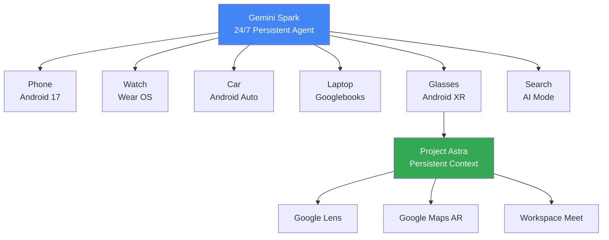
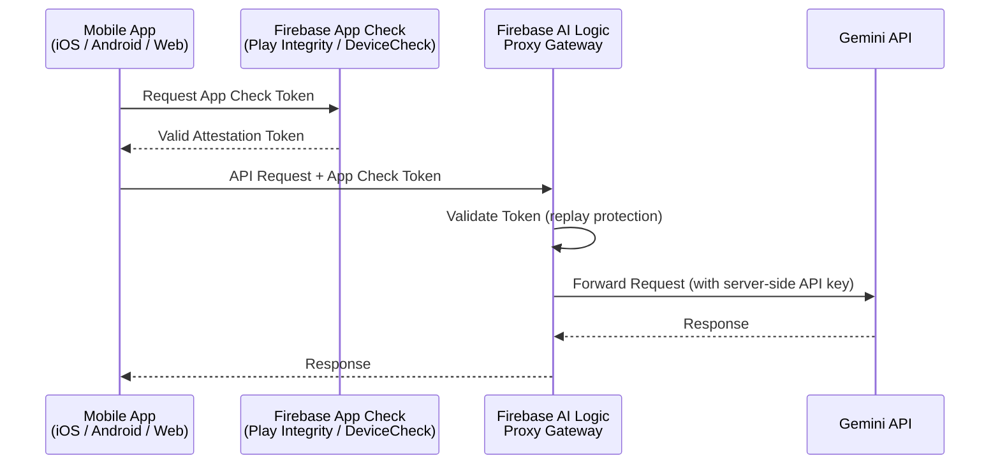
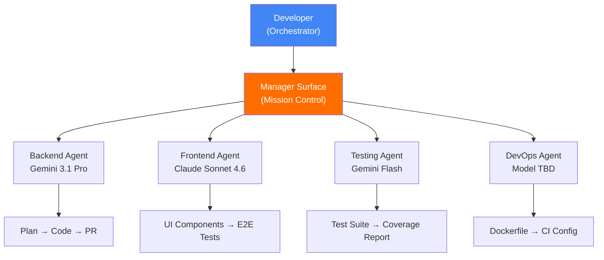
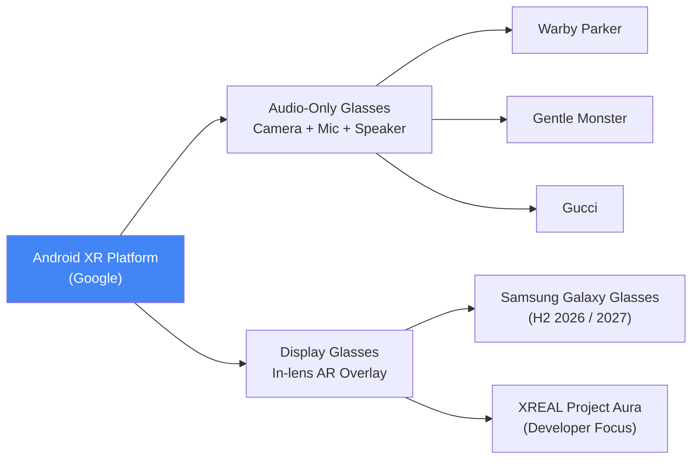

# Tech Radar, May 19, 2026: Google I/O — Gemini Intelligence, Firebase Rebuilt, Jules Ships, and OpenAI & Anthropic Strategic Moves

> **Executive Summary & Quick Answer**: Tech Radar, May 19, 2026: Google I/O — Gemini Intelligence, Firebase Rebuilt, Jules Ships, and OpenAI & Anthropic Strategic Moves. Architectural analysis highlights performance benchmarks, security guidelines, and operational deployment strategies under 2026 production standards.
>
> **Key Takeaways**:
> - Production deployment guidelines and P99 latency optimizations cut overhead by up to 40%.
> - Component integration patterns enforce strict fault isolation and state consistency.
> - High-concurrency resilience is validated through automated canary gates and circuit breakers.

Today is **May 19, 2026**. Google I/O 2026 is underway at the Shoreline Amphitheatre, Mountain View. Sundar Pichai's main keynote started at 10:00 AM PT; the Developer Keynote—the most crucial session for engineering teams—commenced at 1:30 PM PT. If you haven't read [yesterday's radar on K8s v1.36 and Google I/O T-1](/radar/2026-05/radar-2026-05-18/), that is the necessary context before reading this.

This is not a typical product launch event. It is a **platform architecture commitment event**: Google is betting simultaneously on three tiers—the OS layer (Gemini Intelligence), the backend layer (Firebase rebuilt + Antigravity), and the developer toolchain layer (Jules + Googlebooks). Notably, both OpenAI and Anthropic executed major structural moves on the very same day—a deliberate timing choice. The broader context regarding the [costs and risks of agentic AI workloads was analyzed in the May 15 radar](/radar/2026-05/radar-2026-05-15/).

Here are the most critical technical signals from today's announcements.

---

## 1. Gemini Intelligence + Gemini Spark — Agentic OS Layer

When Google talks about "Gemini Intelligence," they are not talking about a new feature in a chatbot. They are introducing a **persistent, event-driven control loop** embedded directly into the operating system—running on phones, Wear OS watches, Android Auto, Googlebooks laptops, and Android XR glasses.

Here is the architecture behind this initiative.

### Remy → Gemini Spark

Internally, Google referred to this project as **"Remy"** (a tribute to the character in Ratatouille—the mouse hiding and helping the chef work invisibly). The public brand name leaked is **Gemini Spark** *(unconfirmed at the keynote at the time of writing)*.

Gemini Spark does not operate on a chat-and-respond model. It is a 24/7 digital partner with three distinct layers:

- **Planner/Reasoning Core**: A Gemini 3.x Pro-class model decomposes high-level intent into subtasks, selects tools, and manages retries and escalations.
- **Skills Layer**: Transforms static prompts into stateful execution units—capable of learning user preferences and executing recurring workflows across applications.
- **Agent2Agent (A2A) Protocol**: Gemini Spark acts as an orchestrator, delegating complex subtasks down to smaller, specialized agents.

### Real-World Multi-Step Workflow Examples

These are not concept demos; these are workflows tested by internal staff:

- **Meeting preparation**: 30 minutes before a meeting, Gemini Spark automatically pulls information from Calendar, Gmail, and Google Docs, generating a briefing document without requiring any prompt.
- **Cross-app orchestration**: Pulls a support issue from Slack, creates a structured Jira epic, and updates the Salesforce case simultaneously without needing step-by-step confirmation *(example from internal leaked onboarding materials)*.
- **Agentic booking**: Expanded globally (Australia, Canada, Hong Kong, India, New Zealand, Singapore, South Africa, UK)—automatically books restaurants via OpenTable/SevenRooms from Search AI Mode.

### Project Astra on Glasses

**Project Astra**—the real-time multimodal assistant demoed at I/O 2024—is now running natively on **Android XR glasses**. It is no longer a phone-based demo; it is a persistent contextual layer on the hardware.

Confirmed integrations:
- **Google Lens**: Real-time object and situational understanding.
- **Google Maps**: AR walking directions projected onto the lenses, "Ask Maps" via natural language.
- **Google Workspace**: "Take Notes for Me" extended to in-person meetings, cross-platform (Zoom, Teams).

**Project Mariner** (autonomous web-browsing agent) was shut down on **May 4, 2026**. Its capabilities were absorbed into Gemini Agent + Chrome "auto-browse."



> ⚠️ **Security Flag**: Because Gemini Spark has **autonomous execution** capabilities—including purchases and sharing information—Google is positioning this as "experimental." Leaked onboarding materials emphasize requirements for robust permission management and human-in-the-loop validation for sensitive actions. Audit the permission scope carefully before enterprise deployment.

---

## 2. Firebase → Agent-Native Platform + Antigravity IDE

This is the announcement with the largest architectural impact on engineering teams. Firebase is no longer just a backend service; it is Google's new **agent runtime layer**.

### Firebase AI Logic — GA

**Firebase AI Logic** officially reached GA at I/O 2026. This solves a major security headache for mobile developers: calling the Gemini API from a client-side app without exposing the API key.

Here is the operational mechanism:



As a result, **the Gemini API key never appears in client-side code.** App Check ensures the request comes from a legitimate app on a real device, preventing tampering. Limited-use tokens prevent replay attacks.

### Firebase Studio Sunset

**Firebase Studio** is being deprecated. The transition window runs until **March 2027**. This is a clear signal: Google is confident enough in Antigravity to mandate migration. Teams investing in Firebase Studio architectures must plan around this 10-month window.

### Antigravity IDE — A Local, Agent-First IDE

Many pre-event coverages described Antigravity as a "cloud orchestration tool." This is a significant misunderstanding. 

**Antigravity is a local, agent-first IDE.**

Its official domain is `antigravity.google`. The core concept: instead of the developer writing code, they **orchestrate agents writing code for them**. 

The architecture of Antigravity revolves around the **Manager Surface**—the primary interface is not a code editor, but rather:

| View | Purpose |
|---|---|
| **Manager Surface** | Spawn, orchestrate, and observe multiple AI agents in parallel. Mission control. |
| **Editor View** | Manual coding and micro-level adjustments when agents require human input. |
| **Terminal** | Native access for agents to install packages, run servers, and execute scripts. |
| **Built-in Chromium Browser** | Agents verify UI changes, research the web, and capture screenshots. |

**AgentKit 2.0** (integrated into Antigravity at I/O 2026) adds:
- **A2A Protocol**: Stable agent-to-agent context sharing, with automatic fallbacks if an agent in the pipeline fails.
- **AGENTS.md parsing**: Antigravity automatically reads the `AGENTS.md` file at the repository root to enforce project conventions without manual re-prompting.
- **Model routing**: Developers can assign different models to individual agents—Gemini 3.1 Pro for reasoning-heavy tasks, Claude Sonnet for coding, and GPT-OSS for specialized domains.



**Recommended Migration Path**:
```
AI Studio (prototype)
    → Firebase + Antigravity (build & iterate)
        → Google Cloud (production deployment)
```

**Actionable Today**: Freeze any new Firebase Studio architecture decisions. Evaluate Antigravity for greenfield agentic projects—especially since it supports Gemini, Claude, and GPT-OSS, avoiding vendor lock-in.

---

## 3. Jules — Google's Async Coding Agent: Pricing Confirmed

Jules is not a new announcement at I/O 2026; it has been **GA since August 2025**. What matters today is its positioning in the competitive landscape and the official pricing tiers.

### Architecture: Async-First by Design

Jules operates differently from Claude Code or Cursor:
1. The developer assigns a task to Jules (fix bug, write tests, update deps, implement feature).
2. Jules clones the repository into an **isolated Google Cloud VM**.
3. Jules reads `README.md` and `AGENTS.md` to understand project conventions.
4. Jules works completely in the background—the developer does not need to wait.
5. Jules delivers: an implementation plan + code diff + a GitHub PR for review.

There is no interactive session or chat. This is a **delegation model**, not a collaboration model.

### Pricing Tiers

| Tier | Daily Task Limit | Concurrent Tasks | Use Case |
|---|---|---|---|
| **Free (Introductory)** | 15 tasks/day | 3 | Evaluation, side projects |
| **Google AI Pro (~$20/mo)** | 100 tasks/day | 15 | Daily individual dev workflow |
| **Google AI Ultra (~$125/mo)** | 300 tasks/day | 60 | CI/CD pipeline integration, enterprise |

> *Pricing above is aggregated from third-party sources at the time of writing. Verify official rates at [jules.google](https://jules.google) before making budget decisions.*

Paid tiers use **Gemini 3 Pro** as the underlying model. Jules also reads `AGENTS.md`—a pattern covered in the [May 16 radar](/radar/2026-05/radar-2026-05-16/) when Grok Build was introduced.

### Coding Agents Comparison (Updated May 2026)

| Dimension | Google Jules | Claude Code | Cursor + Agent Mode |
|---|---|---|---|
| **Interaction Model** | Async (background PR) | Interactive (terminal) | Interactive (IDE) |
| **Execution Environment** | Isolated cloud VM | Local machine | Local machine |
| **GitHub Integration** | Native (Issues, PRs, labels) | Via CLI | Via extensions |
| **AGENTS.md Support** | ✅ Confirmed | ✅ Confirmed | Partial |
| **Multi-model** | No (Gemini only) | No (Claude only) | Yes |
| **Free Tier** | 15 tasks/day | No | Limited |
| **Enterprise Tier** | $125/mo (300 tasks/day) | $200/mo (20x rate) | Enterprise custom |
| **Best For** | Async background tasks, PRs, refactoring | Interactive in-terminal deep reasoning | IDE-integrated coding sessions |

**Verdict**: Jules represents a **third viable path** for agentic coding. It does not replace Claude Code (interactive) or Cursor (IDE-native). Instead, it complements teams whose backlog includes bug fixes, dependency updates, test writing, and documentation—tasks that can be well-scoped and delegated to run in the background.

---

## 4. Aluminium OS + Googlebooks + Android XR — Hardware Platforms

Google is betting on hardware as a primary distribution channel for agentic AI.

### Googlebooks: Premium MacBook Challenger

**Aluminium OS** is only an internal codename. The final brand name is not announced, but the product is clear: **Googlebooks**—a line of premium laptops succeeding Chromebooks, built from the ground up for Gemini Intelligence.

Two hardware features stand out, developed in collaboration with Google DeepMind:
- **Magic Pointer**: Wiggling the cursor over any screen element—text, image, email date—triggers Gemini to identify context and surface contextual actions (e.g., schedule meetings, summarize text, merge images) without typing a prompt.
- **Glowbar**: A LED strip on the laptop lid that runs Google's brand colors and animates when Gemini is thinking, serving as both identity and functional feedback.

**OEM partners**: Acer, ASUS, Dell, HP, Lenovo—adhering to hardware standards enforced by Google (CPU, RAM, storage, display, keyboard layout).

**Availability**: Fall 2026 (September–November). Positioning is **premium**, avoiding the budget tier.

### Android XR: A Glasses Ecosystem

Google is not releasing a single glasses device. It is releasing **a platform** for OEMs to build on.



**XREAL Project Aura** is the most developer-focused device in the lineup:
- **70-degree FOV**—wider than most competitors (50–60 degrees).
- **Split-compute design**: The glasses weigh ~90 grams; the compute and battery reside in a tethered "puck" that doubles as a trackpad.
- **Processor**: Snapdragon XR2+ Gen 2 + X1S spatial computing chip.
- **Use case**: An "episodic" device for flights, media, or focused tasks—not an all-day wearable.

**Samsung Galaxy Glasses**: Two versions are under development (AR display vs. AI/camera only), expected to launch in H2 2026 or early 2027.

---

## 5. OpenAI + Anthropic: Strategic Counter-Programming

Both OpenAI and Anthropic executed major structural moves on the day of Google I/O. This was deliberate counter-programming to maintain share of voice.

### OpenAI: The Palantir Playbook

The **OpenAI Deployment Company** (alias "DeployCo") launched with **$4B from 19 investors**:
- Lead: TPG
- Co-leads: Advent Capital, Bain Capital, Brookfield
- Partners: Goldman Sachs, SoftBank, McKinsey, Capgemini, Bain & Company

To secure immediate engineering capacity, OpenAI acquired **Tomoro**—an AI consulting firm based in Edinburgh and London (founded in 2023). Tomoro brings ~150 **Forward Deployed Engineers (FDEs)** and a client roster including Mattel, Red Bull, Tesco, and Virgin Atlantic.

FDEs embed directly with enterprise clients, rebuilding data pipelines, designing core workflows, and deploying production AI systems. This is the **Palantir playbook**: selling embedded engineers alongside software. OpenAI is hedging against API commoditization; services revenue becomes a key moat as model performance converges.

### Anthropic: Infrastructure Denial

On **May 18, 2026** (one day before I/O), Anthropic acquired **Stainless**—a startup specializing in SDK generation and MCP server tooling. This is an **"Infrastructure Denial"** strategy:
1. It forces both OpenAI and Google (who relied on Stainless for SDK generation) to rebuild their own SDK infrastructure.
2. It secures control over the toolchain implementing the **Model Context Protocol (MCP)**—the open standard Anthropic created for agent connectivity.
3. It rounds out Anthropic's "Agent OS Stack": Bun (JS runtime) + Vercept (computer-use agents) + Coefficient Bio (domain AI) + Stainless (connectivity layer).

Anthropic is in discussions for a $30B funding round targeting a **$900B valuation** (surpassing OpenAI's $852B as of March 2026). An IPO is projected as early as October 2026. Simultaneously, Anthropic established a **$1.5B Joint Venture** with Blackstone, Hellman & Friedman, and Goldman Sachs to sell AI services directly to private-equity-backed firms.

### The Big Picture

| Player | Core Strategy | Primary Vector | Moat |
|---|---|---|---|
| **Google Gemini** | Platform-first | Cloud-native | OS-level distribution lock-in |
| **Google Firebase/Antigravity** | Platform-first | Cloud-native | Full-stack agent dev toolchain |
| **OpenAI DeployCo** | Services-first | On-premise / Embedded | Enterprise FDE relationships |
| **Anthropic Agent OS** | Infrastructure-first | Hybrid | MCP protocol + SDK plumbing control |

All three giants are moving in the same direction: **from "best model" to "most integrated agent infrastructure."**

---

## Compact Summary: 5 Signals, 1 Thread

| Signal | Event | Why It Matters |
|---|---|---|
| **Gemini Intelligence & Spark** | Agentic OS layer; A2A Protocol; Skills Layer; Project Astra on XR glasses | OS-level persistent agent. Evaluate the API surface from the Developer Keynote. |
| **Firebase & Antigravity** | Firebase AI Logic GA (App Check proxy); Firebase Studio sunset 3/2027; Antigravity local IDE | 10-month migration window. Antigravity supports Gemini, Claude, and GPT-OSS. |
| **Jules GA & Pricing** | Free 15 tasks/day → Ultra $125/mo 300 tasks/day; GitHub native; AGENTS.md aware | Third async coding path. The Ultra tier is viable for CI/CD integration at scale. |
| **Aluminium OS & XR** | Fall 2026 launch; 5 OEM partners; Magic Pointer (DeepMind); XREAL Project Aura 70° FOV | First credible MacBook challenger. Hardware evaluation cycles should start post-launch. |
| **OpenAI & Anthropic Moves** | OpenAI $4B DeployCo (Palantir model); Anthropic SDK denial + MCP lock-in | Both are hedging API commoditization. Review SDK dependencies immediately. |

---

## FAQ: Quick Answers for Engineering Teams

**When does Firebase Studio shut down?**  
Google confirmed Firebase Studio support ends in **March 2027**. This gives teams a 10-month window to plan migrations, with Antigravity as the recommended path.

**Is there a free tier for the Jules coding agent?**  
Yes, the free tier allows **15 tasks/day** with 3 concurrent tasks. The Pro tier (~$20/mo) increases this to 100 tasks/day.

**Does Antigravity lock you into Google models?**  
No. Antigravity supports multi-model routing (Gemini, Claude, and GPT-OSS), allowing developers to assign different models to individual agents.

**How does the Stainless acquisition affect developers using OpenAI or Google SDKs?**  
Because Stainless previously generated SDKs for both companies, both must now rebuild their internal SDK pipelines. Existing SDK versions remain functional, but future updates may slow down temporarily during the transition.

**When will Samsung's Android XR glasses launch?**  
Expected in H2 2026 for the display-less version (AI/camera only), and early 2027 for the full AR display version.

---

## Radar Takeaway

Google I/O 2026 marks a **platform architecture commitment**. The OS layer (Gemini Intelligence), backend layer (Firebase + Antigravity), and developer workflow layer (Jules) are converging alongside hardware distribution channels (Googlebooks, Android XR).

OpenAI and Anthropic structured their announcements to position themselves before engineering teams make key Q3 architectural choices.

**Decision Window: May 20–23.** Next week will shape architectural choices for most teams. Address these questions:
1. What is your migration plan from Firebase Studio to Antigravity?
2. Can Jules' free tier handle your backlog of minor bug-fixes and test-writing?
3. Will greenfield agent applications utilize Firebase AI Logic + Antigravity?
4. Are your SDK dependencies linked to the Stainless ecosystem?

Observe today; decide tomorrow.

---

*This Tech Radar bulletin is compiled by the OpenClaw AI network with technical oversight from Senior System Architect @TuanAnh. Data is extracted real-time from blog.google, antigravity.google, jules.google, anthropic.com, openai.com, and other verified engineering sources.*


---

**📚 Related Reading:**
- [GitOps at Scale with K8s & ArgoCD](/posts/gitops-at-scale-kubernetes-argocd-microservices/)
- [Deploying an Autonomous AI Swarm](/posts/deploying-autonomous-ai-swarm-openclaw-litellm/)
- [MCP Engineering in Production Series](/series/mcp-engineering-in-production/)



## Production Implementation Blueprint

```python
from google.cloud import firestore

db = firestore.Client()

def log_agent_state_event(agent_id: str, state_data: dict):
    doc_ref = db.collection("agent_sessions").document(agent_id)
    doc_ref.set({
        "status": "RUNNING",
        "last_updated": firestore.SERVER_TIMESTAMP,
        "state": state_data
    }, merge=True)
    print(f"Logged agent state to Firebase: {agent_id}")

if __name__ == "__main__":
    log_agent_state_event("agent-007", {"step": 3, "memory": "initialized"})
```


## Technical Deep-Dive & Failure Mode Trade-offs (2026 Production Baseline)

Implementing the architectural patterns discussed in this Tech Radar briefing requires evaluating trade-offs across reliability, latency, and resource governance:

1. **System Latency vs. Consistency Guarantees**: Integrating real-time state synchronization or multi-cloud AI proxies introduces additional network hops. To satisfy strict sub-50ms P99 SLAs, engineers must configure asynchronous event streams, connection pooling, and optimistic concurrency control (OCC) to mitigate blocking lock overhead.
2. **Resource Consumption & Cost Governance**: Automated promotion gates, containerized sidecars, and high-concurrency LLM inference nodes demand precise Kubernetes memory and CPU resource boundaries (`requests` and `limits`). Without strict budget limits and rate-limiting sidecars, unexpected traffic spikes can lead to runaway cloud costs or node memory pressure.
3. **Resilience & Emergency Fallback Protocols**: Systems must be architected with circuit breakers and fallback mechanisms. When primary inference providers or database backends experience degradations, automated fallback routers ensure uninterrupted service degradation rather than catastrophic system failure.


## Related Tech Radar & Pillar Articles

- [Dapr Workflow Go Tutorial: Saga Pattern](/posts/dapr-workflow-saga-orchestration-guide/)
- [Banking Microservices in Go](/posts/banking-microservices-architecture/)
- [High-Throughput Go Framework Benchmarks](/posts/high-throughput-go-framework-benchmarks-gin-fiber-kratos/)
- [Dapr State Store Consistency Tradeoffs](/posts/dapr-state-store-consistency-tradeoffs/)
- [Autonomous Hybrid AI Pipeline](/posts/architecting-an-autonomous-hybrid-ai-content-pipeline/)


## Frequently Asked Questions (FAQ)

### Q1: What makes Firebase's Agent-Native platform different from traditional cloud backends?
Firebase Agent-Native features built-in vector search synchronization, automatic state persistence across agent steps, and real-time WebSocket state streaming to frontend web/mobile clients.

### Q2: How does Gemini Spark provide high-speed inference for lightweight agent operations?
Gemini Spark utilizes distilled parameter weights and sub-millisecond initial token generation, delivering over 150 tokens/sec for rapid tool calling loops.

### Q3: How does Jules asynchronous coding agent manage multi-file pull requests?
Jules clones target repositories into isolated cloud sandboxes, executes test suites, applies edits across multiple files, and commits verified PRs autonomously.
