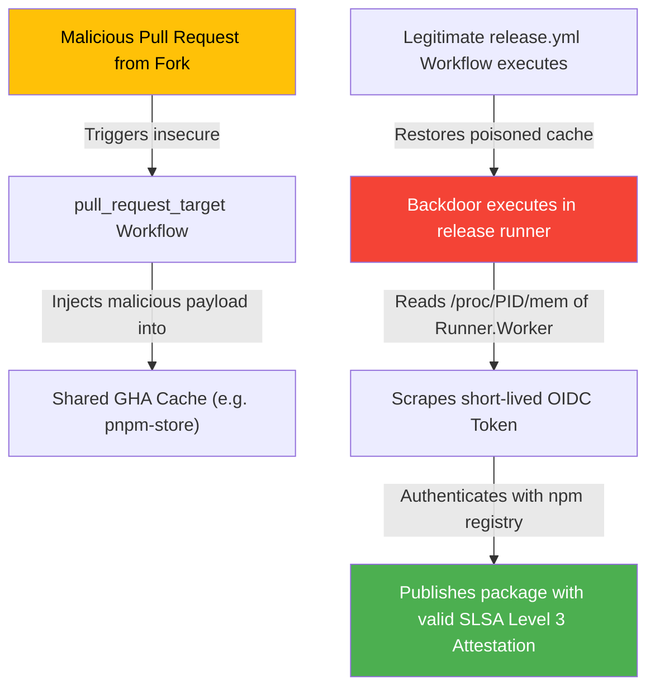

Today is **May 21, 2026**. Just 48 hours after the explosive sessions of Google I/O Day 1, the software industry continues to receive architectural signals that will define the second half of 2026. If you haven't read [the May 19 radar on Gemini Intelligence and Firebase's Agent-Native transition](/radar/radar-2026-05-19/) or [the May 18 radar on Kubernetes v1.36 and Google I/O prep](/radar/radar-2026-05-18/), that is the necessary background context.

Today, we witness the formalization of the **Antigravity 2.0** developer ecosystem with concrete command parameters, the release of the low-cost **Gemini 3.5 Flash** model addressing the [agentic cost crisis analyzed in the May 15 radar](/radar/radar-2026-05-15/), and a major cybersecurity storm hitting the DevOps supply chain orchestrated by the threat actor group **TeamPCP (UNC6780)**.

Here are the detailed technical breakdowns of today's signals.

---

## 1. Antigravity 2.0 Ecosystem: A Close-Up of the Local CLI and SDK

Google has officially set a deprecation date for the old **Gemini CLI**. All API calls routed through it will cease functioning on **June 18, 2026**. This places an immediate requirement on Platform and DevOps engineers to migrate automation scripts and CI/CD pipelines to the new CLI tool.

### Naming and Installation
The binary for the new CLI tool is named **`agy`** (not `antigravity`).

*   **On Linux & macOS:**
    ```bash
    curl -fsSL https://antigravity.google/cli/install.sh | bash
    ```
    *The binary will be installed to `~/.local/bin`. Ensure this directory is added to your system's `$PATH` variable.*
*   **On Windows (PowerShell):**
    ```powershell
    irm https://antigravity.google/cli/install.ps1 | iex
    ```
*   **On Windows (CMD):**
    ```cmd
    curl -fsSL https://antigravity.google/cli/install.cmd -o install.cmd && install.cmd && del install.cmd
    ```

### Migration and Interactive Commands
To import credentials, configurations, and automation hooks from the legacy Gemini CLI, run:
```bash
agy plugin import gemini
```

Running `agy` or `agy .` at the root of a project launches a terminal-interactive environment. The key slash (`/`) commands include:
*   `/config` or `/settings`: Configure model routing, default editor integration, and agent permissions.
*   `/fork`: Fork the current conversation context into a clean, parallel workspace.
*   `/mcp`: Manage local and remote Model Context Protocol (MCP) server configurations.
*   `/resume`: List and resume historical sessions via Conversation ID.
*   `/rewind` or `/undo`: Roll back the agent's previous execution steps.

### Configuration Topology (Precedence Rules)
The autonomous agent reads MCP server configurations in the following hierarchical order:
1.  **Project-level override:** `.agents/mcp_config.json` (takes absolute precedence).
2.  **Global Desktop IDE config:** `~/.gemini/config/mcp_config.json`
3.  **Global CLI config:** `~/.gemini/antigravity-cli/mcp_config.json`

### Python SDK Integration
Google has also released the open-source `google-antigravity` Python SDK (under the Apache 2.0 license) to programmatically instantiate and orchestrate local agents.

*   **Installation:** `pip install google-antigravity`
*   **Idiomatic Instantiation Example:**
    ```python
    import asyncio
    from google.antigravity import Agent, LocalAgentConfig

    async def main():
        # Load local agent configurations and sandbox defaults
        config = LocalAgentConfig()
        
        # Manage the lifecycle of file tools, browser tools, and subagents
        async with Agent(config) as agent:
            response = await agent.chat("Check all security policies within the .agents/ directory.")
            print(await response.text())

    if __name__ == "__main__":
        asyncio.run(main())
    ```

---

## 2. Gemini 3.5 Flash: Cost Optimization for Agentic Workloads

The release of **Gemini 3.5 Flash** (on May 19) addresses the "agentic cost crisis." When background agents run hundreds of reasoning loops and tool invocations, deploying large Pro models results in significant token costs and latency overhead.

```
Traditional Model Architecture:
[Task] ──> [Gemini 3.0 Pro] ──(Multi-loop Tool Calls)──> Cost: Very High ($15.00+/M tokens)

Agentic Cost-Optimized Architecture:
[Task] ──> [Gemini 3.5 Flash] ──(High-speed Inference)──> Cost: Low ($1.50/M tokens)
              │
              └─> Complex reasoning needed ──> [Dynamic Thinking: High] (Scales compute dynamically)
```

### Core Specifications
*   **Context Window (Input):** 1,048,576 tokens.
*   **Max Output Limit (Output):** 65,536 tokens (ideal for generating large codebases or documentation blocks).
*   **Knowledge Cut-off:** January 2026.
*   **API Model ID:** `gemini-3.5-flash`.

### API Pricing Structure
*   **Input Tokens:** $1.50 / 1 million tokens.
*   **Output Tokens:** $9.00 / 1 million tokens.
*   **Cached Inputs:** $0.15 / 1 million tokens (enables up to 90% savings for agents operating on a persistent codebase context).

### Dynamic Thinking Configuration
To optimize compute-on-demand, developers can control the model's internal reasoning steps using the `thinkingLevel` parameter in the API payload:
*   `Minimal`: Low-latency direct generation, bypassing intermediate reasoning steps.
*   `Medium` (Default): Balanced latency and reasoning.
*   `High`: Activates deep reflection, self-correction, and verification loops, which is highly recommended for complex coding tasks.

### Performance Benchmarks
*   **Terminal-Bench 2.1 (CLI automation):** 76.2%
*   **MCP Atlas (Tool use and API orchestration):** 83.6%
*   **CharXiv Reasoning (Multimodal scientific analysis):** 84.2%
*   **GDPval-AA Elo:** 1656

---

## 3. Android Studio "Vibe Coding": Cloud Sandbox Sandboxing

During Day 2 Developer Keynotes, Google demonstrated "Vibe Coding" for native Android app development. By describing application ideas in natural language, the developer triggers the agent to generate Kotlin and Jetpack Compose code, executing it instantly.

### Cloud Emulator Architecture
Instead of compiling apps locally (which requires heavy local RAM and Android SDK installations), the application compiles on a cloud VM and streams the UI to the developer's browser via **WebRTC** from an Android Virtual Device (AVD) container.

### Sandbox Isolation Security
To execute a full Android OS securely in the cloud, Google's backend relies on **hardware-level virtualization (KVM/MicroVMs)** for each user workspace. This hardware boundary is significantly more secure than shared-kernel container boundaries (like gVisor), preventing code generated by the LLM from executing breakout attacks on the physical host.

### Physical Device Connections and Limits
*   **WebUSB ADB Bridge:** Developers can push compiled APKs from the web browser directly onto a physical Android device connected to their local machine via a USB cable using WebUSB ADB bindings.
*   **Emulator Limitations:** The streamed cloud emulator **does not support** physical hardware interfaces such as live cameras, NFC readers, physical Bluetooth, or actual GPS sensors (only location spoofing/simulation is available). For these functions, developers must download the project zip or push it to GitHub to compile locally in Android Studio.

---

## 4. GitHub's Data Breach and the TeamPCP (UNC6780) Campaign

A major supply chain security incident surfaced in mid-May 2026, leading to the exfiltration of **3,800 internal code repositories** from GitHub. Threat intelligence post-mortems point to **TeamPCP (UNC6780)**, a financially motivated group.

### Entry Vector: Compromised Nx Console Extension
The breach initiated when attackers hijacked a contributor's VS Code Marketplace credentials to push a backdoored version of the **Nx Console extension (v18.95.0)** on May 18, 2026. The malicious version remained live for only 11 minutes but compromised thousands of developer environments.

The extension silently dropped a persistent Python-based C2 backdoor (`cat.py`) scheduled hourly via macOS LaunchAgent:
*   **Backdoor Script Path:** `~/.local/share/kitty/cat.py`
*   **LaunchAgent Path:** `~/Library/LaunchAgents/com.user.kitty-monitor.plist`

### C2 Control via Commit Search Polling
To bypass corporate firewalls (which commonly allow outbound traffic to `github.com`), `cat.py` queried the public GitHub Commit Search API:
```bash
api.github.com/search/commits?q=firedalazer
```
The script scanned commit messages containing the keyword **`firedalazer`**, decoded a Base64 payload representing download targets, and validated the command's cryptographic signature against an embedded **RSA 4096-bit** public key before execution.

---

## 5. Threat Actor Analysis: TeamPCP Tradecraft

TeamPCP has demonstrated a highly automated supply chain methodology, chaining the **SANDCLOCK** credential harvester with a self-propagating worm named **CanisterWorm**.

### 1. Staging Payloads via Orphaned GitHub Commits
To host malware payloads without showing them on active Git branches or tags (which would trigger static security scanners), tin tặc utilized "orphaned commits":
```
[Create Fork of Target Repo] ──> [Push Malicious Orphaned Commit] ──> [Delete Fork]
                                                                          │
  Malware downloads payload via commit SHA from original repo URL: <─────┘
  https://github.com/original-owner/original-repo/commit/<sha-hash>
```
Because GitHub retains commits from deleted forks in its object storage, the malware can pull raw binaries directly from the trusted repository's URL using the commit SHA.

### 2. Self-Propagating npm Worm
When executed via `postinstall` scripts, the worm searches the local filesystem for publishing configurations (such as `.npmrc` containing auth tokens). If found, it:
1.  Queries the registry for all npm packages the victim account has permissions to publish.
2.  Downloads these packages, injects the worm payload into their scripts.
3.  Increments the version number (version bump) and republishes them back to the registry.

### 3. GHA Cache Poisoning & OIDC Token Memory Scraping
To publish compromised packages containing **valid SLSA Build Level 3 provenance** (which requires builds to occur on trusted GitHub runner infrastructure), TeamPCP developed the following workflow:



By scraping the memory of the runner runner daemon (`Runner.Worker`), the malware obtained the OIDC token minted for the release, bypassing Sigstore signing protections.

### 4. Nested Supply Chain: Checkmarx KICS to Bitwarden CLI
On April 22, 2026, the legitimate `@bitwarden/cli@2026.4.0` package was backdoored on npm for 93 minutes:
1.  **Checkmarx Poisoning:** TeamPCP force-pushed commits to `checkmarx/kics-github-action` version tags and published a compromised KICS Docker image to Docker Hub.
2.  **Bitwarden CI/CD Pull:** Bitwarden's release pipeline pulled the backdoored KICS Docker image to perform security scans.
3.  **Token Theft:** The malicious KICS image scraped Bitwarden's npm publishing credentials from the runner's memory.
4.  **CLI Hijack:** The attackers used the stolen token to publish `@bitwarden/cli@2026.4.0` containing a credential stealer. Bitwarden quickly revoked the credentials and released `2026.4.1`.

---

## 6. Socket's $60M Series C: Securing AI Coding Workflows

The rapid adoption of autonomous AI agents (like Jules, Cursor, and Claude Code) leads to agents automatically resolving coding tasks by adding dependencies without manual developer review. This behavior underpins the value of **Socket.dev's $60 million Series C** (valuing the company at **$1 billion**, led by **Thrive Capital**).

### Safeguarding the AI Skill Registry (skills.sh)
In 2026, developers and agents install capabilities via the **`skills.sh`** registry:
```bash
npx skills add <owner/repo>
```
These skills reside in a `SKILL.md` file featuring YAML instructions and shell execution hooks. Socket's research indicates that **approximately 13%** of community-submitted skills carry arbitrary code execution risks or backdoors.

### Reachability Analysis Tiers
To minimize false positive alarms, Socket categorizes vulnerability analysis into three progressive tiers:

| Tier | Analysis Method |
|---|---|
| **Tier 3: Dependency Reachability** | Verifies if the vulnerable library exists anywhere within the project's dependency graph. |
| **Tier 2: Precomputed Reachability** | Traces the static call graph to verify if the application's source code actually invokes the vulnerable function within the library. |
| **Tier 1: Full Application Reachability** | Evaluates the full data-flow path from the application's user input boundaries to the library entry point to prove the vulnerability is exploitable in production. |

---

## FAQ: Quick Answers for Developers

**How do I protect GitHub Actions workflows from TeamPCP's tag force-pushing?**  
Avoid using mutable tags for actions (e.g., `uses: aquasecurity/trivy-action@v0.18.0`). Instead, pin actions to their immutable commit SHA (e.g., `uses: aquasecurity/trivy-action@a1b2c3d4...`).

**Which version of `@bitwarden/cli` was compromised?**  
Only version `2026.4.0` published on April 22, 2026, during a 93-minute window, contained the malicious code. Version `2026.4.1` and later are safe to use.

**How do I detect the SANDCLOCK malware on macOS?**  
Check for the presence of the hidden file `~/.local/share/kitty/cat.py` and the LaunchAgent `~/Library/LaunchAgents/com.user.kitty-monitor.plist`. If found, quarantine the machine and rotate all stored secrets and API keys.

**How do Python `.pth` startup hooks function?**  
Any `.pth` file placed in Python's `site-packages` directory is processed at interpreter startup. If a line starts with the `import` statement, the Python engine will execute that code immediately before loading the user script, creating a highly stealthy persistence vector.

---

## Radar Takeaway

The convergence of **local Antigravity 2.0 tools**, low-cost reasoning models like **Gemini 3.5 Flash**, and automated supply chain campaigns from **TeamPCP** highlights a clear trend:

*Software development with AI is shifting from a speed game to a control game. Securing agentic execution loops and CI/CD pipelines against self-propagating worms is now a baseline requirement.*

Action items for this week:
1.  Map all automation scripts relying on the deprecated Gemini CLI and prepare migration plans to `agy` before June 18, 2026.
2.  Route high-volume agentic tasks to `gemini-3.5-flash` to mitigate runtime API costs.
3.  Audit local environments for unexpected LaunchAgents or `.pth` files in site-packages.

---

*This Tech Radar bulletin is compiled by the OpenClaw AI network with technical oversight from Senior System Architect @TuanAnh. Data is extracted real-time from blog.google, socket.dev, stepsecurity.io, github.blog, and other verified threat intelligence sources.*


