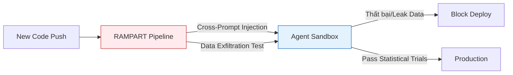

Hôm nay là **22/05/2026**, tuần lễ hậu sự kiện Google I/O chứng kiến sự chuyển mình mạnh mẽ từ các AI Copilot (chỉ có khả năng tóm tắt và khuyến nghị) sang các **AI Agent tự trị** (có quyền chủ động thực thi lệnh). Trong khi giới lập trình hào hứng với [Gemini Intelligence](/radar/radar-2026-05-19/) và các kiến trúc [Autonomous AI Swarm](/posts/deploying-autonomous-ai-swarm-openclaw-litellm), giới an ninh mạng lại đối mặt với bài toán lớn: Làm sao để kiểm soát các tác nhân phi con người này?

Bản tin Radar hôm nay tập trung giải phẫu những bước đi chiến lược từ NSA, Microsoft và Zscaler trong việc thiết lập ranh giới bảo mật cho "Agentic Web".

---

## 1. NSA Guidelines: Tái định nghĩa bảo mật Model Context Protocol (MCP)

Ngày 20/05/2026, **NSA's Artificial Intelligence Security Center (AISC)** đã chính thức ban hành bộ tài liệu *Security Design Considerations for AI-Driven Automation*, nhắm trực tiếp vào các hệ thống sử dụng **Model Context Protocol (MCP)**.

MCP hiện là chuẩn giao tiếp phổ biến giúp các LLM kết nối với các công cụ (tools) và dữ liệu nội bộ. Tuy nhiên, NSA chỉ ra rằng mô hình này tiềm ẩn rủi ro "Over-permissioned Agents" (Agent được cấp quyền quá mức). Khi một tác nhân độc hại thực hiện **Prompt Injection**, nó có thể thao túng Agent để gọi các tool nội bộ với đặc quyền cao.

**3 Nguyên tắc phòng thủ cốt lõi từ NSA:**
1. **Least Privilege Protocol:** Áp dụng nguyên tắc đặc quyền tối thiểu ở cấp độ Schema của tool. Nếu một Agent chỉ cần đọc Log, MCP server tuyệt đối không expose các endpoint có hàm `WRITE` hay `DELETE`.
2. **Treat Inputs as Untrusted:** Không bao giờ tin tưởng luồng dữ liệu (Input) được trả về từ một hệ thống bên ngoài hoặc từ chính LLM, đòi hỏi lớp kiểm tra và validate nghiêm ngặt trước khi thực thi lệnh hệ thống.
3. **Human-in-the-Loop:** Bắt buộc có sự phê duyệt của con người trước khi Agent thực hiện các High-consequence actions (thao tác có hậu quả cao như đổi cấu hình hạ tầng hay xóa database).

---

## 2. Stress-Testing AI Agents: Microsoft RAMPART & Clarity Frameworks

Để cụ thể hóa các tiêu chuẩn bảo mật trên, Microsoft đã Open-source hai công cụ thiết yếu nhằm hỗ trợ đội ngũ DevSecOps kiểm thử AI Agent.

### Clarity: Đánh giá rủi ro từ vòng thiết kế
Clarity là một "Structured design review tool" hoạt động ở phase thiết kế kiến trúc. Trước khi viết bất kỳ dòng code nào, Clarity buộc kỹ sư phải vạch rõ:
- Boundary (Ranh giới) truy cập dữ liệu của Agent nằm ở đâu?
- Điều gì xảy ra nếu hệ thống mất kết nối hoặc LLM bị "hallucination"?
Sự can thiệp sớm này giúp loại bỏ các rủi ro kiến trúc mà testing thông thường khó phát hiện.

### RAMPART: Đưa AI Safety vào CI/CD
**RAMPART (Risk Assessment and Measurement Platform for Agentic Red Teaming)** là một công cụ mang tính cách mạng được xây dựng hoàn toàn "Pytest-native". Dựa trên nhân PyRIT, RAMPART cho phép kỹ sư chuyển hóa các kịch bản tấn công (Red-team findings) thành các bài test tự động trên pipeline CI/CD.

Điểm đặc biệt của RAMPART là khả năng chạy **Statistical Trials**. Do bản chất xác suất của AI (không phải lúc nào cũng trả về cùng một output), RAMPART sẽ chạy một test case nhiều lần và đánh giá tỷ lệ fail để cấp chứng nhận an toàn.

---

## 3. Sự trỗi dậy của Agentic SOC & Mạng lưới Identity

Trong khi chúng ta cố gắng bảo vệ hệ thống khỏi AI Agents độc hại, chính AI Agents cũng đang định hình lại các Trung tâm điều hành an ninh mạng (SOC).

Trong năm 2026, **Agentic SOC** đã chứng minh được năng lực đáng kinh ngạc:
- **Giảm 80% đến 94% MTTR (Mean Time to Respond):** Các công việc Triage (phân loại cảnh báo) vốn mất 30-45 phút của con người nay được Agent tự trị xử lý trong **dưới 2 phút**.
- **Lọc nhiễu:** Loại bỏ 67% đến 90% False Positives (cảnh báo giả).

Sự thay đổi này khiến cho metric **MTTR** dần lui về dĩ vãng, nhường chỗ cho các KPI mới như *Precision of Autonomous Triage* và *Risk Avoidance* (khối lượng rủi ro được chặn đứng).

Để bắt kịp xu hướng này, ngày 21/05, **Zscaler** đã công bố thương vụ thâu tóm **Symmetry Systems**. Trái tim của thương vụ là công nghệ **Access Graph** - một hệ thống đối xử với AI Agent như một thực thể danh tính độc lập (First-Class Principals). Access Graph sẽ map toàn bộ quyền hạn, lịch sử truy cập và "blast radius" (bán kính ảnh hưởng) nếu một Agent cụ thể bị xâm nhập, giải quyết triệt để bài toán mù mờ danh tính phi con người.

---

## 4. Chrome DevTools cho Kỷ nguyên Agent

Cuối cùng, không thể bỏ qua việc công cụ hóa cho chính các Agent. Việc sử dụng [Antigravity 2.0 CLI](/radar/radar-2026-05-21/) và các nền tảng AI hiện tại vừa được củng cố thêm sức mạnh nhờ bộ **Chrome DevTools for Agents** ra mắt tại Google I/O.

Dựa trên chuẩn **MCP**, bộ công cụ (tích hợp qua package `chrome-devtools-mcp`) cấp cho AI khả năng:
- **Tương tác DOM trực tiếp:** Đọc, hiểu và chỉnh sửa các Accessibility Tree.
- **Can thiệp Network & Console:** Bắt lỗi, phân tích network payload.
- **Tự động Audit:** Thực thi Lighthouse audits (Performance, SEO) và tự viết lại code frontend để vá lỗi.

Điều này biến trình duyệt từ một công cụ hiển thị đơn thuần thành một "Sandbox Testing" có thể được giao tiếp trực tiếp bởi Autonomous Agents.

---

## FAQ

**Tại sao Model Context Protocol (MCP) cần tiêu chuẩn bảo mật riêng?**  
Bởi vì MCP cấp cho mô hình ngôn ngữ lớn (vốn mang tính xác suất và dễ bị lừa) chiếc chìa khóa để "hành động" trên hệ thống nội bộ, xóa mờ ranh giới giữa một ứng dụng chat vô hại và một Shell Script có quyền thực thi.

**Sự khác biệt giữa Microsoft Clarity và RAMPART trong kiểm thử AI?**  
Clarity tập trung vào việc rà soát kiến trúc trên giấy (Design Review) trước khi lập trình, nhằm phát hiện lỗ hổng logic. Trong khi RAMPART là công cụ thực thi tự động (Continuous Testing) trong CI/CD nhằm stress-test mã nguồn Agentic đã được xây dựng.

---

*Bạn có suy nghĩ gì về tương lai của DevSecOps trong bối cảnh các "nhân sự máy" ngày càng nhiều quyền hạn? Hãy để lại bình luận.*

---

**📚 Related Reading:**
- [Deploying an Autonomous AI Swarm](/posts/deploying-autonomous-ai-swarm-openclaw-litellm/)
- [MCP Engineering in Production Series](/series/mcp-engineering-in-production/)


