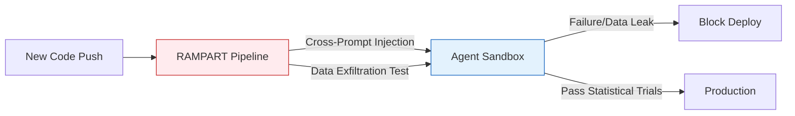

Today is **May 22, 2026**, the week following Google I/O, witnessing a massive transition from AI Copilots (limited to summarizing and recommending) to **autonomous AI Agents** (capable of proactive execution). While developers are excited about [Gemini Intelligence](/radar/radar-2026-05-19/) and [Autonomous AI Swarm](/posts/deploying-autonomous-ai-swarm-openclaw-litellm) architectures, the cybersecurity community faces a major challenge: How do we control these non-human actors?

Today's Radar bulletin dissects the strategic moves from the NSA, Microsoft, and Zscaler in establishing security boundaries for the "Agentic Web".

---

## 1. NSA Guidelines: Redefining Model Context Protocol (MCP) Security

On May 20, 2026, the **NSA's Artificial Intelligence Security Center (AISC)** officially released *Security Design Considerations for AI-Driven Automation*, directly targeting systems utilizing the **Model Context Protocol (MCP)**.

MCP is currently the standard interface allowing LLMs to connect with internal tools and data. However, the NSA points out that this model harbors the risk of "Over-permissioned Agents". When a malicious actor performs a **Prompt Injection**, they can manipulate the Agent into calling internal tools with high privileges.

**3 Core Defense Principles from the NSA:**
1. **Least Privilege Protocol:** Apply the principle of least privilege at the tool schema level. If an Agent only needs to read logs, the MCP server must absolutely never expose endpoints containing `WRITE` or `DELETE` functions.
2. **Treat Inputs as Untrusted:** Never trust the data stream (Input) returned from an external system or the LLM itself, requiring rigorous validation and inspection layers before executing system commands.
3. **Human-in-the-Loop:** Human approval is mandatory before an Agent executes High-consequence actions (e.g., changing infrastructure configuration or deleting a database).

---

## 2. Stress-Testing AI Agents: Microsoft RAMPART & Clarity Frameworks

To materialize these security standards, Microsoft has open-sourced two essential tools to assist DevSecOps teams in testing AI Agents.

### Clarity: Risk Assessment at the Design Phase
Clarity is a "Structured design review tool" operating at the architectural design phase. Before a single line of code is written, Clarity forces engineers to explicitly define:
- Where is the data access Boundary for the Agent?
- What happens if the system loses connection or the LLM "hallucinates"?
This early intervention helps eliminate architectural risks that standard testing struggles to detect.

### RAMPART: Bringing AI Safety to CI/CD
**RAMPART (Risk Assessment and Measurement Platform for Agentic Red Teaming)** is a revolutionary tool built entirely "Pytest-native". Based on the PyRIT core, RAMPART allows engineers to translate attack scenarios (Red-team findings) into automated tests within the CI/CD pipeline.

The standout feature of RAMPART is its ability to run **Statistical Trials**. Due to the probabilistic nature of AI (it does not always return the same output), RAMPART executes a test case multiple times and evaluates the failure rate to grant a safety certification.

---

## 3. The Rise of the Agentic SOC & Identity Networks

While we attempt to secure systems from malicious AI Agents, AI Agents themselves are reshaping Security Operations Centers (SOC).

In 2026, the **Agentic SOC** demonstrated incredible capabilities:
- **Reduced MTTR (Mean Time to Respond) by 80% to 94%:** Triage tasks (alert categorization) that previously took humans 30-45 minutes are now handled by autonomous Agents in **under 2 minutes**.
- **Noise Filtering:** Eliminates 67% to 90% of False Positives.

This shift is making the **MTTR** metric increasingly obsolete, giving way to new KPIs such as *Precision of Autonomous Triage* and *Risk Avoidance* (the volume of risk intercepted).

To keep pace with this trend, on May 21, **Zscaler** announced the acquisition of **Symmetry Systems**. The heart of this acquisition is the **Access Graph** technology — a system that treats AI Agents as First-Class Principals. The Access Graph will map all permissions, access history, and the "blast radius" if a specific Agent is compromised, thoroughly solving the ambiguity of non-human identities.

---

## 4. Chrome DevTools for the Agent Era

Finally, we cannot ignore the tooling built for the Agents themselves. The usage of the [Antigravity 2.0 CLI](/radar/radar-2026-05-21/) and current AI platforms has been further empowered by the **Chrome DevTools for Agents** unveiled at Google I/O.

Based on the **MCP** standard, the toolkit (integrated via the `chrome-devtools-mcp` package) grants AI the ability to:
- **Direct DOM Interaction:** Read, understand, and modify Accessibility Trees.
- **Network & Console Intervention:** Catch errors and analyze network payloads.
- **Automated Audits:** Execute Lighthouse audits (Performance, SEO) and autonomously rewrite frontend code to patch issues.

This transforms the browser from a simple display tool into a "Sandbox Testing" environment that can be communicated with directly by Autonomous Agents.

---

## FAQ

**Why does the Model Context Protocol (MCP) require a dedicated security standard?**  
Because MCP grants large language models (which are inherently probabilistic and easily deceived) the keys to "act" on internal systems, blurring the line between a harmless chat application and a highly privileged Shell Script.

**What is the difference between Microsoft Clarity and RAMPART in AI testing?**  
Clarity focuses on conceptual architectural review (Design Review) before coding, aiming to detect logic flaws. RAMPART is an automated execution tool (Continuous Testing) in CI/CD designed to stress-test the compiled Agentic source code.

---

*What are your thoughts on the future of DevSecOps as "machine personnel" gain more privileges? Leave a comment.*

---

**📚 Related Reading:**
- [Deploying an Autonomous AI Swarm](/posts/deploying-autonomous-ai-swarm-openclaw-litellm/)
- [MCP Engineering in Production Series](/series/mcp-engineering-in-production/)


