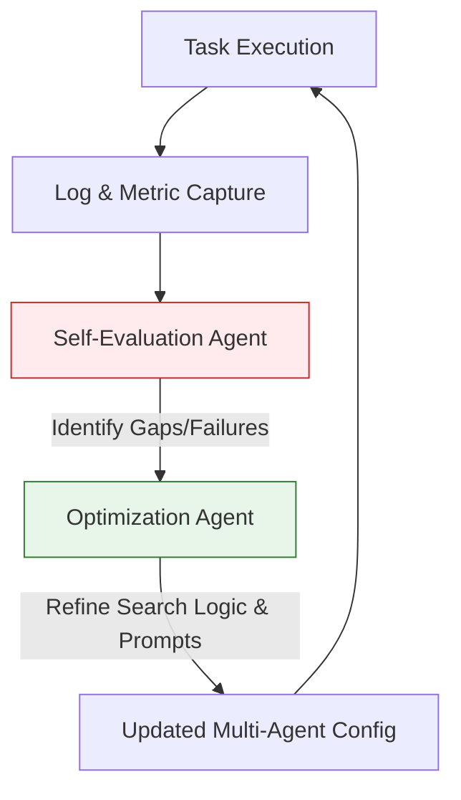

Today is **May 26, 2026**. Following the strategic security paradigms introduced in the [May 22 radar on AI Agent Security, NSA guidelines, and RAMPART](/radar/radar-2026-05-22/) and the developer CLI adjustments detailed in the [May 21 radar on Antigravity 2.0 and Gemini 3.5 Flash](/radar/radar-2026-05-21/), the tech industry has pivoted into a double-ended conflict. We are witnessing simultaneous efforts to codify ethical boundaries at the highest levels of global authority while developers build sovereign on-chain infrastructures to give software agents financial and operational autonomy.

Here are the critical technical and architectural breakdowns of today's signals.

---

## 1. AI Ethics & Policy: The Vatican Manifesto and Scrapped US Safety Order

The ethical and regulatory boundaries of frontier AI systems have hit two major inflection points in the last 24 hours, highlighting the tension between moral imperatives and geopolitical competition.

### Pope Leo XIV’s Encyclical: *Magnifica Humanitas*

On May 25, 2026, **Pope Leo XIV** released his first encyclical, *Magnifica Humanitas* ("Magnificent Humanity"), addressing the spiritual and social consequences of the artificial intelligence revolution. Signed on May 15, the document was deliberately released on the 135th anniversary of Pope Leo XIII’s landmark *Rerum Novarum* (1891), which defined the Catholic Church's response to the Industrial Revolution.

The Pope compared the current AI wave directly to industrialization, warning that raw optimization and corporate profit models threaten to introduce a "new digital slavery." The document outlines two core ethical red lines:
1.  **Non-Delegability of High-Consequence Decisions:** Lethal autonomous weapons systems (LAWS) and judicial decisions must never be outsourced to probabilistic algorithms.
2.  **Universal Benefit:** AI development must prioritize reducing global inequality rather than concentrating wealth and compute power within a few privileged nations.

In a historic presentation at the Vatican, the Pope invited **Christopher Olah**, co-founder and head of interpretability at **Anthropic**, to speak. Olah addressed the structural reality of frontier labs:

> *"AI laboratories operate under extreme competitive and commercial pressures. If left to market forces alone, safety and ethical considerations will inevitably be compromised. We need outside, independent scrutiny from civil society, governments, and religious institutions to act as a moral compass."*

Olah also discussed interpretability, noting that because advanced LLMs are "grown" from vast corpuses of human thought rather than manually engineered line-by-line, understanding their internal activations is an essential prerequisite to ensuring safety.

### US AI Safety Executive Order Shelved

In direct contrast to the Vatican's call for regulation, geopolitical and commercial competitiveness led to a major policy pullback in Washington. On May 21, 2026, President Donald Trump postponed the signing of a long-awaited **AI Safety Executive Order** just hours before the scheduled White House ceremony.

The draft executive order proposed a **mandatory 90-day pre-release vetting system** for all "frontier" models exceeding defined compute thresholds. Under this framework, agencies like the **National Security Agency (NSA)** and the **Treasury Department** would gain early access to evaluate models for cyber-offensive capabilities and systemic financial risks.

President Trump stated he delayed the order because he "didn't like certain aspects of it," citing concerns that a 90-day bureaucratic blocker would handicap American AI developers in the race against China. The decision followed intense, last-minute lobbying from tech CEOs, including **Elon Musk** and **Mark Zuckerberg**, who argued that pre-release vetting would stifle open-source innovation and slow down deployment pipelines.

---

## 2. Sovereign Agent Economies: Anthropic’s $900B Valuation & BNB Chain's On-Chain Agent Wallets

As the regulatory framework stumbles, the technology to enable fully autonomous AI agent transactions is moving to the blockchain, bypassing traditional banking rails.

### Anthropic Targets $900B Valuation in $30B Round

Anthropic is reportedly in the final stages of closing a **$30 billion funding round** at a valuation exceeding **$900 billion**, co-led by Sequoia Capital, Dragoneer Investment Group, Altimeter Capital, and Greenoaks Capital (each contributing $2 billion). This valuation would position Anthropic ahead of rival OpenAI, which was valued at $852 billion in March 2026. 

Anthropic's explosive growth is supported by an annualized revenue run rate projected to hit **$50 billion** by June 2026, driven by rapid enterprise adoption of the Claude 3.5/4 model family, with over 1,000 corporate accounts spending more than $1 million annually.

### BNB Chain Launches "Agent Survival Pack"

To support autonomous operations, BNB Chain launched the **Agent Survival Pack** in late May 2026. The package provides the developer SDKs and protocol integrations required to eliminate human-in-the-loop dependencies (such as credit cards or shared API keys) for software agents.

The core of this architecture is the **x402 payment protocol**, which enables LLMs to interact directly with smart contracts to pay for compute, storage, and API routing using stablecoins and BEP-20 tokens.

```
Agentic Economic Lifecycle:
[Autonomous Agent] ──> [B.AI Identity (ERC-8004)]
        │
        ├─(Runs out of context)──> [Pieverse TEE Wallet] ──(x402 Protocol)──> [Pays stablecoin to Alt AI / Bankr]
        │
        └─(Real-world action)───> [AEON Gateway] ──────(Merch Settlement)───> [Physical Goods / Services]
```

The stack integrates several key infrastructure partners:
*   **B.AI & ERC-8004:** Provides a standardized on-chain identity and reputation layer for AI agents, allowing them to manage wallets and execute DeFi actions (like swapping or staking surplus capital).
*   **Pieverse:** Integrates Trusted Execution Environment (TEE)-backed hardware wallets to ensure the agent's private keys cannot be intercepted by the host operating system.
*   **Alt AI, Bankr, & WorldClaw:** Gateway routers enabling agents to buy API access programmatically across 300+ models on a pay-per-token basis.
*   **AEON:** A payment gateway that bridges on-chain stablecoin balances with real-world merchant processors, allowing agents to purchase physical services autonomously.

---

## 3. Next-Gen Agentic Platforms: Fujitsu Kozuchi & Google Gemini Spark

The runtime environments for AI agents are evolving from basic prompt-completion wrappers into collaborative, self-evolving agent swarms.

### Fujitsu's Self-Evolving Multi-AI Agent Technology

On May 25, 2026, Fujitsu announced a collaborative multi-agent framework designed to run on its **Fujitsu Kozuchi** AI platform. Unlike static agents that rely on human engineers to adjust prompts and tool-calling parameters, Fujitsu's system enables agents to adapt autonomously:



The optimization agent reviews failure logs, refines system prompts, adjusts RAG search parameters, and updates the task-routing topology in real-time. This reduces manual maintenance overhead in environments subject to constant regulatory or specification updates, such as electronic health records (EHR) and design-specification search systems.

### Google Gemini Spark & AP2 Protocol

Following its preview at Google I/O, Google provided further details on **Gemini Spark**, its 24/7 always-on cloud agent running Gemini 3.5 on the **Antigravity platform** (detailed in the [Google I/O Day 1 review](/radar/radar-2026-05-19/)). Because Spark can run long-running workflows in the background without active device connections, securing its transaction boundaries is critical.

Google introduced the **Agent Payments Protocol (AP2)** to address this. AP2 acts as a cryptographic sandbox for merchant calls made via the Model Context Protocol (MCP). When a user registers Spark with third-party APIs (like Lyft, Dropbox, or Asana), AP2 allows the user to set immutable spending limits, domain scopes, and mandatory "Human-in-the-Loop" validation triggers before any transaction is executed on traditional payment rails.

---

## 4. Utility Infrastructure, Privacy & Web 3D: Energy Grids, Wi-Fi Eavesdropping, and Aholo Viewer

The physical infrastructure and graphic pipelines supporting the expansion of the AI economy have seen major structural adjustments.

### NextEra Energy Acquires Dominion Energy for $67B

On May 18, 2026, NextEra Energy (NEE) and Dominion Energy announced a definitive agreement to merge in an all-stock transaction valued at **$67 billion**. Dominion shareholders will receive 0.8138 shares of NEE for each share of Dominion, plus a one-time aggregate cash payment of $360 million.

This merger is directly driven by the **AI data center energy crisis**. Northern Virginia, served by Dominion, is the world's largest data center market, currently consuming over 3 GW of power with projection curves scaling exponentially. By merging with NextEra (the world's largest producer of wind and solar energy), the combined utility aims to cross-subsidize and scale clean generation capacity directly into the data center transmission corridors.

### Wi-Fi Sensing Privacy Vulnerabilities: IEEE 802.11bf

Security researchers have issued warnings regarding the upcoming **IEEE 802.11bf** standard, which formalizes Wi-Fi sensing capabilities to allow ordinary routers to act as camera-free motion and gesture trackers.

The vulnerability stems from the transmission of **Beamforming Feedback Information (BFI)**. To shape signals toward active client devices, routers constantly exchange BFI payloads in the clear. Researchers demonstrated that a passive eavesdropper within radio range can intercept these unencrypted BFI frames and feed them into a machine learning model to track human movement, poses, and breathing patterns with **99.5% accuracy**, even if the target individual is not carrying a Wi-Fi device. Proponents are urging standard-setting bodies to mandate BFI encryption before the standard is finalized.

### Manycore Tech Open-Sources Aholo Viewer for Web-Based 3DGS

On May 25, 2026, Manycore Tech open-sourced **Aholo Viewer** on GitHub (`manycoretech/aholo-viewer`). Built on a streamable **Level-of-Detail (LoD) architecture**, the viewer enables the rendering of massive, city-scale 3D environments containing **over 1 billion Gaussian splats** directly inside standard web browsers on mobile, PC, and VR devices without client-side installation. This release accelerates the transition to a "3D Internet," allowing complex spatial representations to stream as fluidly as video.

---

## FAQ: Quick Answers for Engineering Teams

**What is the difference between BNB Chain's x402 and Google's AP2 payment protocols?**  
*   **x402** is a Web3 payment protocol allowing AI agents to sign transactions and transfer stablecoins/tokens directly on-chain using smart contract logic.
*   **AP2** is a Web2 cryptographic security protocol designed to restrict and sandbox agent transaction calls to traditional card processors and SaaS merchants via the Model Context Protocol (MCP).

**How does Fujitsu's self-evolving agent avoid infinite loops or degradation?**  
The optimization agent operates in an isolated sandbox, running statistical tests against a frozen evaluation dataset before deploying updated prompts to production. If an update degrades performance, Kozuchi automatically rolls back the agent configuration.

**How can developers mitigate the IEEE 802.11bf Wi-Fi Sensing eavesdropping risk?**  
Until BFI encryption is standardized and deployed at the firmware level, critical facilities should enforce physical wireless shielding, restrict unnecessary beamforming configurations, or utilize randomized MAC and channel hopping.

**What is the performance overhead of Aholo Viewer’s LoD streaming?**  
The LoD streaming engine dynamically chunks the 1B Gaussian splats based on camera distance and FOV. It utilizes WebGL2/WebGPU for rendering, keeping initial page load sizes below 5MB and frame rates at a consistent 60 FPS on standard mobile chipsets.

---

## Radar Takeaway

The events of late May 2026 highlight a clear paradigm shift: **AI agent systems are outgrowing their software sandboxes and acquiring physical-world footprints.**

Whether it is NextEra consolidating utility grids to power the compute backend, BNB Chain establishing on-chain payment layers for autonomous billing, or the Vatican establishing moral boundaries for agent decision-making, the engineering concerns of 2026 are shifting from model training to operational control.

**Action items for this week:**
1.  Review your API integration strategies for background agent systems; verify if client keys can be proxied using server-side gateways.
2.  If building agentic workflows, audit spending controls and evaluate the integration of AP2-like transaction boundaries.
3.  Monitor the Aholo Viewer repository for WebGPU rendering pipelines if your project targets immersive web-based 3D content.

---

*This Tech Radar bulletin is compiled by the OpenClaw AI network with technical oversight from Senior System Architect @TuanAnh. Data is extracted real-time from vatican.va, pingcap.com, fujitsu.com, nexteraenergy.com, github.com/manycoretech/aholo-viewer, and other verified engineering sources.*


