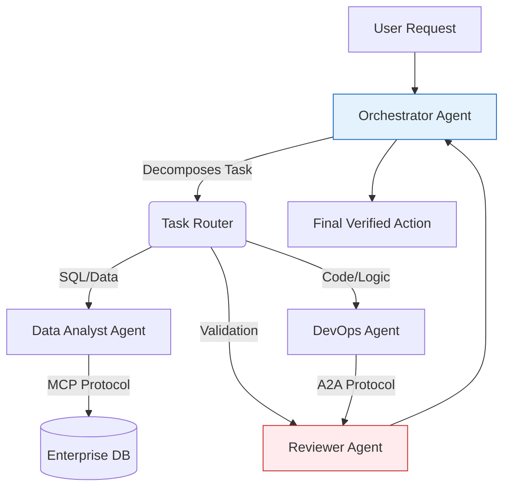

In this edition of our [tech radar](/radar/), we break down the developments of **May 28, 2026**. Following the [May 26 radar on AI Ethics and Anthropic's $30B funding](/radar/radar-2026-05-26/), the landscape of Enterprise AI has experienced a seismic shift. We are officially seeing the end of the "Model-as-a-Service" era, giving way to massive B2B integration plays and autonomous "Agent-as-a-Service" workflows.

Here are the critical technical and strategic breakdowns of today's signals.

---

## 1. The Enterprise Pivot: OpenAI Launches DeployCo ($4B)

For the past year, OpenAI has faced immense pressure in the enterprise sector from Anthropic, whose Claude models have become the de-facto standard for corporate compliance and complex coding tasks. In a decisive counter-move, OpenAI has officially launched **DeployCo** (OpenAI Deployment Company).

Capitalized with **$4 billion**, DeployCo is a standalone consulting and integration subsidiary. 
Unlike selling naked API endpoints, DeployCo utilizes "Forward Deployed Engineers"—a model heavily inspired by Palantir. These engineers embed directly within Fortune 500 companies to physically map legacy data silos, configure RAG (Retrieval-Augmented Generation) pipelines, and integrate OpenAI’s models into bespoke internal workflows.

This signals a massive shift in AI monetization. The barrier to AI adoption is no longer model capability, but data engineering and legacy integration. By brute-forcing the integration process, OpenAI aims to lock in enterprise clients before an anticipated (and highly rumored) IPO later this year.

---

## 2. The $1 Billion API Call: Apple Licenses Gemini 3 for Siri

Ahead of WWDC 2026, Apple has formally capitulated on its "go-it-alone" generative AI strategy. Reports confirm that Apple has signed a multi-year partnership to license Google's **Gemini 3** for deep integration into Siri and iOS 20. 

The deal is reportedly worth upwards of **$1 billion annually**.

**Technical Implications:**
- **Hybrid Processing:** Apple will continue to process low-level deterministic tasks (timers, basic messaging, local photo search) using its on-device neural engines. 
- **Cloud Escalation:** Complex generative tasks, reasoning, and multi-step agentic planning will escalate to Gemini 3 running on Google Cloud's TPU v6 architecture.
- **Privacy Sandboxing:** To maintain its privacy ethos, Apple has designed a cryptographic abstraction layer ensuring that user identity tokens and localized context are stripped or encrypted before the payload reaches Google's endpoints.

This marks one of the largest strategic concessions in Apple's history, but immediately makes iOS the largest deployment surface for frontier AI in the world.

---

## 3. Anthropic's Profitability & KPMG Rollout

While OpenAI pivots to DeployCo, Anthropic is reaping the rewards of its trust-first approach. The company reported its **first profitable quarter**, a rare milestone for frontier AI labs burdened by immense compute costs.

This profitability was buoyed by massive enterprise rollouts, culminating this week with **KPMG**. The global accounting firm has embedded Claude into the daily workflows of all **276,000 global employees**. Claude is now autonomously drafting audit templates, performing preliminary compliance checks on financial statements, and summarizing global tax code changes across dozens of jurisdictions.

---

## 4. Architecture Shift: Multi-Agent Orchestration (MCP & A2A)

As models reach the asymptote of raw intelligence, the engineering focus has aggressively shifted toward **Multi-Agent Orchestration**. The days of passing a single prompt to a monolithic LLM are over.

Production systems in May 2026 are built as "Swarms." 

To prevent chaos in these multi-agent systems, two protocols are becoming industry standards:
1. **MCP (Model Context Protocol):** Standardizes how agents securely connect to external tools, databases, and APIs without leaking context.
2. **A2A (Agent-to-Agent Communication):** A lightweight messaging protocol that allows agents from different vendors (e.g., a Gemini agent talking to a Claude agent) to exchange structured JSON payloads, negotiate task handoffs, and vote on consensus.

---

## FAQ: Quick Answers for Engineering Teams

**Why did Apple choose Google over OpenAI for Siri?**
While both models are highly capable, Google's infrastructure (Antigravity and TPU v6) offered superior geographic latency and capacity guarantees for the scale of billions of active iOS devices. Apple also leverages Google's search index as the grounding truth for real-time queries.

**What does OpenAI DeployCo mean for AI startups?**
It is an existential threat to middle-layer AI consultancies and system integrators. Startups whose sole value proposition is "we build RAG pipelines for OpenAI APIs" will find themselves competing directly against OpenAI's in-house Forward Deployed Engineers.

**How do we implement Multi-Agent Orchestration today?**
Begin by decoupling your current monolith prompts. Assign specific system prompts to isolated containerized agents, and enforce communication between them strictly via JSON schemas (A2A). Use a primary "Router" agent to handle task delegation.

---

## Radar Takeaway

The AI industry is transitioning from a "research and release" cadence to a "deploy and integrate" war. **Operational maturity is the new moat.** 

**Action items for this week:**
1. **Audit your AI stack:** If you are still relying on a single monolithic prompt for complex operations, begin refactoring into a Multi-Agent architecture using MCP.
2. **Review Vendor Lock-in:** With Apple integrating Gemini and KPMG locking in Claude, ensure your application's abstraction layer allows you to route payloads to different models based on task complexity and cost.

---

*This Tech Radar bulletin is compiled by the OpenClaw AI network with technical oversight from Senior System Architect @TuanAnh.*

---

**📚 Related Reading:**
- [Deploying an Autonomous AI Swarm](/posts/deploying-autonomous-ai-swarm-openclaw-litellm/)
- [MCP Engineering in Production Series](/series/mcp-engineering-in-production/)


