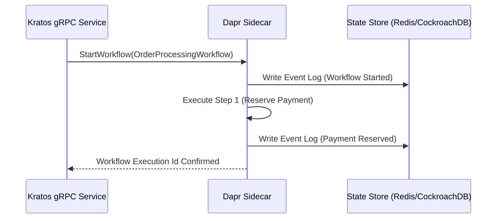

> **Answer-first:** Tech Radar Digest for June 2026 aggregates 6 daily technical briefings focusing on Kubernetes in-place pod resizing, Go 1.26 garbage collection optimizations, Dapr workflow integration, and Kratos clean architecture. Engineering takeaways establish operational standards for zero-downtime container scaling and distributed pub/sub messaging patterns.

## Overview — Tech Radar Digest — June 2026

This monthly digest consolidates 6 daily Tech Radar briefings published throughout June 2026. Focus areas include Kubernetes resource management, advanced Go runtime optimizations, and enterprise microservice integration patterns.

---

## Tech Radar 11/06: K8s Pod Resizing & Go 1.26

Welcome to today's Tech Radar. The theme for this week is the maturation of the infrastructure layer. We are seeing Kubernetes finally adapt to the erratic resource demands of AI inference, a shift towards proactive "Machine Economy" agents, and Golang cementing its position as the ultimate orchestration language for local AI.

Here are the signals you need to pay attention to.

---

### 1. Kubernetes: The Operating System for AI Platforms

The shift of Kubernetes from a general-purpose microservices orchestrator to the de facto "AI OS" is fully cemented this week by two critical General Availability (GA) milestones:

#### In-Place Pod Resizing (GA in v1.35)
This is arguably the most important feature for MLOps teams this year. Previously, if you needed to adjust the CPU or Memory for a running AI inference workload, you had to restart the Pod. For large Large Language Models (LLMs) loading massive weights into VRAM, this caused unacceptable service disruptions.

With **In-Place Pod Resizing**, you can now dynamically modify CPU and Memory requests/limits without restarting the container (requires `containerd v2.3.0+`). This allows infrastructure teams to scale resources up during active inference spikes and down during idle periods seamlessly, drastically optimizing GPU/CPU cloud costs. For a production guide with YAML examples, VPA integration, and cost optimization patterns, see our [Kubernetes In-Place Pod Resizing Guide](/posts/kubernetes-in-place-pod-resizing-guide/).

#### Sidecar Containers (GA in v1.33)
Legacy sidecars (used for logging, service meshes, and security proxies) lacked strict lifecycle guarantees. They often started out of order or blocked Pod termination, causing race conditions in [large-scale GitOps environments](/posts/gitops-at-scale-kubernetes-argocd-microservices/). Native sidecar containers are now officially implemented as "restartable" `init containers`. They start *before* the main app, respect readiness probes, and run for the entire duration of the pod's life—finally bringing stability to complex mesh architectures.

---

### 2. Agentic Workflows: The Dawn of the Machine Economy

The AI paradigm has officially shifted from Reactive (waiting for user prompts) to Proactive (autonomous execution).

#### Microsoft Scout
Announced recently at Build 2026, **Microsoft Scout** is an "always-on" autonomous AI agent for the Microsoft 365 ecosystem. Built on the open-source **OpenClaw** framework and powered by the Work IQ context engine, it can autonomously triage emails and resolve scheduling conflicts without explicit triggers. 

From a security standpoint, Microsoft solved the "rogue agent" problem by giving Scout its own governed **Microsoft Entra identity**, rather than relying on a shared service account. This guarantees that every autonomous action is strictly logged, auditable, and attributable—a pattern we heavily recommend when [deploying autonomous AI swarms](/posts/deploying-autonomous-ai-swarm-openclaw-litellm/).

#### Mastercard Agent Pay for Machines (AP4M)
As agents become more autonomous, they need to buy things—API credits, compute power, or paywalled data. Launched yesterday, **Mastercard AP4M** is a payment infrastructure designed strictly for AI agents to transact at "machine speed." 
It solves three hurdles:
1. **Verifiable Intent:** Giving the AI a verified financial identity.
2. **Permissioning:** Hard-coded spending limits.
3. **High-Velocity Settlement:** Operating across traditional bank rails and stablecoins (like Solana and Polygon).

---

### 3. Golang 1.26: Built for AI Workloads

Go continues to optimize its runtime for heavy-duty infrastructure, directly targeting the bottlenecks of AI integration.

#### The "Green Tea" Garbage Collector
After experimental testing in 1.25, the **"Green Tea" GC** is now the default in Go 1.26. For real-world [Golang microservices](/posts/architecting-21-service-ecommerce-golang-ddd/) with heavy memory allocation, it achieves a **10–40% reduction in GC overhead**. It drastically improves CPU scalability and memory locality when scanning millions of small objects. For a full production deep-dive on Green Tea, CGO improvements, and the migration checklist, see our [Go 1.26 Complete Guide](/posts/go-126-green-tea-gc-cgo-performance-guide/).

#### CGO Optimizations for AI Bindings
Running local LLMs usually requires binding Go to C++ engines like `llama.cpp` or ONNX Runtime. Historically, the Context Switch overhead between Go and C (`cgo`) was a massive bottleneck. Go 1.26 slashed the baseline overhead of `cgo` calls by **~30%**. This cements Go as the absolute best language for building the API orchestration layer around raw C++ inference engines.

*Stay tuned for more updates. For deeper architectural deep-dives, check out our [System Design and Engineering](/posts/) pillar.*

*📡 Next issue: [Tech Radar 13/06 — Go 1.26 GC, K8s Pod Resizing & AI-Native Architecture](/radar/tech-radar-june-13-2026-go-1-26-gc-k8s-pod-resizing-ai-native/)*

### FAQ


**In-Place Pod Resizing** is a feature that reached General Availability in Kubernetes v1.35. It allows engineers to dynamically modify CPU and Memory requests and limits for a running container without restarting the Pod, which is crucial for preventing service disruptions in AI inference workloads.



The **Green Tea Garbage Collector**, enabled by default in Go 1.26, reduces overall GC overhead by 10-40% in heavy memory allocation scenarios. It optimizes CPU scalability and memory locality, making Golang microservices much more efficient.




---

## Tech Radar (13/06/2026): Go 1.26 GC, K8s Pod Resizing & AI-Native

Welcome back to the **Tech Radar** bulletin, where we filter out the noise of the tech industry to uncover the genuine trends shaping future System Architecture.

The second week of June 2026 witnessed three massive shifts, from core infrastructure (Go, Kubernetes) to the maturation of AI-Native architecture. From the perspective of a System Architect, these are updates you cannot ignore to optimize your High-Concurrency systems.

---

### 1. Golang 1.26: "Green Tea" GC Architecture - The Savior for RAM-Hungry Microservices

Enabled by default in **Go 1.26**, the Garbage Collector codenamed **"Green Tea"** is not just a performance patch; it is a core architectural overhaul.

#### The Problem with the Legacy GC (Object-Based)
Previously, the Go GC utilized a *Concurrent Mark-and-Sweep* algorithm, tracing objects via pointers. This led to random memory access, causing extremely high L1/L2 cache miss rates. For the CPU, this was an "architectural disaster," forcing it to constantly wait for data from Main Memory.

#### The Boost from "Green Tea" (Page-Based Architecture)
Green Tea changes the processing unit from "individual Objects" to **"8 KiB memory Pages"**. Instead of fumbling through pointers, it enqueues an entire page containing active objects and scans it sequentially.

**Business Impact:**
- Reduces **10%–40% CPU overhead** dedicated to garbage collection.
- Reduces **15%–20% p99 tail latency** in API Gateways or services handling intensive JSON/Protobuf processing.
- **SIMD Vectorization:** Thanks to continuous memory scanning, the Go runtime can now leverage modern CPU vectorized instruction sets to accelerate the mark phase.

*Architect's Note:* If you are running gRPC microservices with a high frequency of short-lived object allocations, Go 1.26 will deliver a "free" speedup without altering a single line of code.

---

### 2. Kubernetes: In-Place Pod Resizing Officially Reaches GA (v1.35+)

How many times have you endured "blips" (connection drops, cache wipes) when modifying CPU/RAM configurations for a Pod? That era has officially ended. **In-Place Pod Resize** has reached General Availability (GA).

#### Zero-Downtime Scaling
This feature allows you to directly modify the `resources.requests` and `resources.limits` of a container without triggering an `Evict -> Recreate` cycle.

This changes the game for **Stateful** systems (such as Kafka, Redis, In-memory Caches, or JVM).
- Kubernetes now explicitly separates resource states via its API:
  - `spec.containers[*].resources` (Desired resource level)
  - `status.containerStatuses[*].allocatedResources` (Resources reserved by the Node)
  - `status.containerStatuses[*].resources` (Actual resources currently utilized)

#### VPA `InPlaceOrRecreate` Mode
The most perfect combination for this feature is with the Vertical Pod Autoscaler (VPA). VPA now supports the `InPlaceOrRecreate` mode. It will attempt to "Hot-swap" the CPU first using the `resize` subresource. Only when the physical Node is genuinely out of resources will it force a Pod restart onto a different Node.

This is an excellent lever to completely eliminate the "over-provisioning tax" (allocating double the RAM just in case) without fearing service disruption risks.

---

### 3. AI-Native Architecture & Embedding Agents into the Critical Request Path

In 2024, AI often stood on the periphery of core architecture — operating as a background worker (running summarization jobs) or an external API call with latencies measured in seconds.

Mid-2026 witnesses the explosion of **AI-Native** architecture, where RAG (Knowledge Plane) and Agentic Workflows are pulled directly into the **Critical Request Path** (the synchronous processing flow before returning a response to the user).

#### The Rise of "Flash" Models & DSLMs
Embedding LLMs into a Synchronous flow requires latencies of < 500ms. Massive models (like GPT-4 or Claude Opus) are too heavy and expensive for this.

The market is witnessing the rise of **DSLMs (Domain-Specific Language Models)**. The most prominent example this month is Microsoft's launch of **MAI-Code-1-Flash**.
- **Only 5 Billion Parameters (5B)** but achieves ~51% on the extremely difficult SWE-Bench Pro benchmark.
- Categorized in the "Haiku" class, it is highly optimized for Inference, making it the perfect choice to act as an "Agentic Router" (logic router) right within the lifecycle of an API Request.

*Architect's Note:* When designing AI-Native systems, you must treat LLM Inference like a Database call: It requires Load Balancing, Circuit Breakers, hard Fallback Timeouts, and especially **Semantic Caching** to guarantee SLAs for the Critical Path.

---
*📡 Previous issue: [Tech Radar 11/06 — K8s Pod Resizing, Agentic Workflows & Go 1.26](/radar/tech-radar-june-11-2026-k8s-pod-resizing-agentic-go-126/)*

*📡 Next issue: [Tech Radar 17/06 — Kratos Clean Architecture & Dapr Pub/Sub](/radar/tech-radar-june-17-2026-kratos-clean-architecture-dapr-pubsub/)*

*Thank you for reading this week's Tech Radar. Don't forget to check out the next parts in our [High Concurrency Systems](/series/high-concurrency-systems/) and [Modular Monolith Architecture](/series/modular-monolith-architecture/) on the blog.*



---

## Tech Radar (14/06/2026): Kratos & Dapr State Management

Welcome back to the **Tech Radar** bulletin. In modern Microservices architecture, maintaining a system capable of communicating flexibly both externally (HTTP) and internally (gRPC) is an essential requirement. Simultaneously, State Management in distributed environments demands rigorous solutions to prevent data collisions.

Today, we will dissect how to combine Go's highly acclaimed **Kratos** framework with **Dapr v1.15** to comprehensively solve this problem.

---

### 1. Kratos Dual-Protocol: HTTP & gRPC Running in Parallel

**Answer-first:** The Kratos framework integrates with Dapr v1.15 State Management via the sidecar pattern, allowing HTTP and gRPC servers to run concurrently. To avoid state collisions when running dual-protocol, the system uses Dapr ETags via `SaveStateWithETag` for Optimistic Concurrency Control, and uses Middleware for Metadata synchronization.

#### Protocol-First Design with Protobuf
Kratos utilizes Protobuf as the single source of truth. From a single `.proto` file, Kratos auto-generates code for both gRPC and HTTP RESTful APIs. This frees developers from writing manual routing logic for each protocol type.

#### Unified Transport Layer (Solving DRY for Middleware)
The architectural brilliance of Kratos lies in its abstracted Transport layer. Instead of configuring Middleware (such as Logging, Authentication, Tracing) separately for HTTP and gRPC, you only need to write it once. The Unified Transport layer applies these Middlewares uniformly across both servers, completely eliminating code duplication (DRY).

---

### 2. Dapr v1.15 State Management: Pluggable Architecture & ETags

**Answer-first:** Dapr v1.15 manages state through a pluggable architecture, abstracting the underlying database (Redis, PostgreSQL). Specifically, Dapr provides an Optimistic Concurrency Control (OCC) mechanism utilizing ETags to entirely prevent lost updates in distributed environments.

#### The Power of the Dapr Sidecar
Dapr runs as a sidecar completely isolated from the application logic. When Kratos needs to store state, it does not care whether the underlying database is MongoDB or Redis. Kratos simply calls the Dapr API over HTTP or gRPC on `localhost`.

#### Optimistic Concurrency Control (OCC) with ETags
In Kratos's Dual-Protocol model, an HTTP request and a gRPC request might attempt to modify a record simultaneously. To resolve this, Dapr attaches an `ETag` to every state record. When Kratos updates data, it must send the current ETag along with the request. Dapr will reject the transaction if the ETag does not match (meaning the data has already been modified by another process).

---

### 3. Integrating Kratos and Dapr: Solving State Collisions & Metadata

**Answer-first:** For flawless integration, developers use the Dapr Go SDK to call the `SaveStateWithETag` function, combined with Kratos Middleware to propagate `context.Context` seamlessly. This ensures all tracking IDs and ETags are preserved when moving between the HTTP/gRPC layers and the Dapr Sidecar.

#### Code snippet: `SaveStateWithETag` using Dapr Go SDK
When saving data, it is mandatory to fetch the ETag first, process the logic, and save it back alongside that specific ETag.

```go
item, err := client.GetState(ctx, storeName, key, nil)
// ... logic to increment counter ...
err = client.SaveStateWithETag(ctx, storeName, key, data, item.Etag, nil)
```

#### Critical Note on Metadata Propagation
Kratos translates information from HTTP headers and gRPC metadata into `context.Context`. For the Dapr Sidecar to recognize these tracing or auth tokens, you **must** pass this `ctx` into every Dapr SDK function call. Neglecting the context will fracture the Distributed Tracing flow.

---

### 4. Q&A: Practical Bottlenecks (FAQ)

**Answer-first:** Integrating Kratos and Dapr brings flexibility but requires optimizing local network configurations, managing application lifecycles (graceful shutdown), and building sensible retry strategies to minimize latency overhead.


Yes, but very minimally (approximately ~2.1ms at p99). To optimize for high-load systems, you should configure Kratos to communicate with the sidecar via a gRPC channel (`app-channel`) and enable the `keep-alive` feature to reuse connections.



The secret is to configure the Dapr sidecar container to share the same network interface as the Kratos container using the `network_mode: "service:kratos-app"` declaration. This accurately simulates the network model of a Pod on Kubernetes.



Application shutdown requires tight coordination. Ensure the `terminationGracePeriodSeconds` parameter on Kubernetes is greater than Dapr's `dapr.io/graceful-shutdown-seconds` annotation value to prevent the sidecar from being killed before Kratos finishes processing the final request.



Yes, Dapr provides a `/query` API (currently in alpha). It supports `EQ`, `IN`, `AND`, `OR` operators on JSON data. However, this feature is primarily compatible with databases that support complex JSON querying, like MongoDB or PostgreSQL.



Instead of writing cumbersome exponential backoff loops manually inside Kratos, you should leverage Dapr's Resiliency features. Declare retry policies directly in the `resiliency.yaml` file, and Dapr will automatically handle it when an ETag encounters a 409 Conflict error.


---
*Continue with the [Go Microservices Architecture guide](/posts/go-microservices/), [Mastering Event-Driven Architecture with Dapr](/posts/mastering-event-driven-architecture-dapr/), and the [System Design Series](/series/system-design/) for practical microservices patterns.*



---

## Tech Radar 17/06: Kratos Clean Architecture & Dapr Pub/Sub

Welcome back to the **Tech Radar** bulletin. Last week we dissected [how Kratos and Dapr v1.15 solve State Collisions via ETags](/radar/tech-radar-june-14-2026-kratos-dapr-integration/). This week we go one layer deeper: **how do you structure the entire codebase** so that Kratos, Wire, and Dapr Pub/Sub compose cleanly — and how do you keep that architecture testable, resilient, and production-safe?

---

### 1. The Four Layers of Kratos Clean Architecture

**Answer-first:** Kratos enforces a four-layer Clean Architecture — `api`, `service`, `biz`, and `data` — where business logic in `biz` is completely isolated from transport and infrastructure. Each layer communicates only with the layer adjacent to it, and only through interfaces.

This is not a stylistic choice. It is a hard constraint baked into the [kratos-layout](https://github.com/go-kratos/kratos-layout) template:

| Layer | Responsibility | What It MUST NOT Touch |
|-------|---------------|------------------------|
| `api` | Protobuf definitions — generates HTTP & gRPC code | Business logic, DB |
| `service` | Adapter — maps DTO ↔ Domain Model, calls `biz` | `*gorm.DB`, Redis |
| `biz` | Domain Models, Usecases, Repository **interfaces** | Any concrete DB driver |
| `data` | Implements `biz` interfaces — GORM, Redis, Dapr SDK | Business rules |

#### The Critical Boundary: `biz` Never Sees `*gorm.DB`

The most common anti-pattern in Kratos projects is leaking `*gorm.DB` directly into the `biz` layer. This violates the Dependency Inversion Principle and makes unit testing impossible without a live database.

The correct pattern: `biz` declares an interface, `data` implements it.

```go
// internal/biz/order.go — biz defines the contract
type OrderRepo interface {
    CreateOrder(ctx context.Context, o *Order) error
}

type OrderUsecase struct {
    repo OrderRepo
}
```

```go
// internal/data/order.go — data implements it
type orderRepo struct {
    data *Data // holds *gorm.DB internally
}

func (r *orderRepo) CreateOrder(ctx context.Context, o *biz.Order) error {
    return r.data.db.WithContext(ctx).Create(o).Error
}
```

`biz` is now completely database-agnostic. Swap PostgreSQL for MySQL — only `data` changes.

---

### 2. Google Wire: Compile-Time Dependency Injection

**Answer-first:** Wire is a compile-time code generator that resolves the full dependency graph of your Kratos service. It eliminates manual wiring, catches missing dependencies at build time (not at runtime), and produces zero-overhead initialization code.

#### How Wire Structures Kratos Providers

Each layer exposes a `ProviderSet` that declares its constructors:

```go
// internal/data/data.go
var ProviderSet = wire.NewSet(NewData, NewOrderRepo)

// internal/biz/biz.go
var ProviderSet = wire.NewSet(NewOrderUsecase)

// internal/service/service.go
var ProviderSet = wire.NewSet(NewOrderService)
```

The entry point wires them all together:

```go
// cmd/server/wire.go
//go:build wireinject

func initApp(cfg *conf.Bootstrap, logger log.Logger) (*kratos.App, func(), error) {
    panic(wire.Build(
        server.ProviderSet,
        data.ProviderSet,
        biz.ProviderSet,
        service.ProviderSet,
    ))
}
```

Run `wire gen ./cmd/server/` and Wire produces `wire_gen.go` — a regular Go file with all constructors called in the correct order. **No reflection. No runtime cost.**

#### Common Wire Pitfall AI Tools Miss

AI code generators (ChatGPT, Copilot) frequently generate Wire setup that compiles but silently creates duplicate singletons — for example, initializing two separate `*gorm.DB` connections because `NewDB` is listed in two different `ProviderSet`s. Always verify `wire_gen.go` after generation and confirm each dependency appears exactly once in the final output.

---

### 3. Dapr Pub/Sub: Decoupling the Event Bus from Your Code

**Answer-first:** Dapr's Pub/Sub building block abstracts the message broker (Redis Streams, Kafka, RabbitMQ) behind a sidecar API. Your Kratos service publishes and subscribes using the Dapr Go SDK — the broker is a YAML config file, not a code dependency.

#### Publishing from the `biz` Layer

Inject the Dapr client as an `EventPublisher` interface (defined in `biz`, implemented in `data`):

```go
// internal/biz/order.go — interface stays in biz
type EventPublisher interface {
    PublishOrderCreated(ctx context.Context, order *Order) error
}

func (uc *OrderUsecase) CreateOrder(ctx context.Context, req *CreateOrderReq) error {
    order := &Order{ /* ... */ }
    if err := uc.repo.CreateOrder(ctx, order); err != nil {
        return err
    }
    // ctx carries the traceparent header — Dapr propagates it into CloudEvents
    return uc.publisher.PublishOrderCreated(ctx, order)
}
```

```go
// internal/data/publisher.go — data wraps Dapr SDK
type daprPublisher struct {
    client dapr.Client
}

func (p *daprPublisher) PublishOrderCreated(ctx context.Context, o *biz.Order) error {
    return p.client.PublishEvent(ctx, "order-pubsub", "order.created", o)
}
```

#### Subscribing via Programmatic Endpoint

Dapr discovers subscriptions at startup by calling `GET /dapr/subscribe` on your service. Register this route in the Kratos HTTP server:

```go
// Must return this exact JSON structure
[
  {
    "pubsubname": "order-pubsub",
    "topic":      "order.created",
    "route":      "/api/v1/orders/webhook"
  }
]
```

Dapr then delivers events as `POST /api/v1/orders/webhook`. Parse the CloudEvents envelope — do **not** read raw body bytes:

```go
func (s *OrderService) HandleOrderCreatedWebhook(w http.ResponseWriter, r *http.Request) {
    var ce cloudevents.Event
    if err := json.NewDecoder(r.Body).Decode(&ce); err != nil {
        w.WriteHeader(http.StatusBadRequest)
        return
    }
    var payload biz.Order
    _ = ce.DataAs(&payload)
    // process...
    w.WriteHeader(http.StatusOK)
}
```

**Important:** To permanently drop a malformed message (stop Dapr from retrying), return `HTTP 200` with body `{"status":"DROP"}`. Return `HTTP 500` to trigger Dapr's retry policy from `resiliency.yaml`.

---

### 4. The Dual-Write Problem: Dapr Transactional Outbox

**Answer-first:** Saving to the database and publishing an event are two separate I/O operations. If the broker is down after the DB write succeeds, the event is lost. Dapr v1.12+ includes a built-in Transactional Outbox that makes both operations atomic — no custom outbox table or polling worker needed.

#### The Classic Failure Mode

Most Kratos services call `db.Create()` then `client.PublishEvent()` sequentially. If the broker is unavailable between those two calls, the DB record exists but no downstream service is notified. The system is now silently inconsistent.

#### Dapr's Built-In Solution

Enable outbox on the State Store component YAML:

```yaml
metadata:
  - name: outboxPublishPubsub
    value: "order-pubsub"
  - name: outboxPublishTopic
    value: "order.created"
```

Then replace the two-step write with a single transactional call:

```go
ops := []*dapr.StateOperation{
    {
        Type: dapr.StateOperationTypeUpsert,
        Item: &dapr.SetStateItem{Key: orderKey, Value: orderData},
    },
}
// Dapr guarantees: DB write + event publish = one ACID transaction
err := client.ExecuteStateTransaction(ctx, "statestore", meta, ops)
```

If the broker is temporarily unreachable, Dapr retries publishing until it succeeds. Your code has zero retry logic to maintain.

---

### 5. Q&A: Production Gotchas


No. Dapr guarantees **at-least-once** delivery. Your Kratos `biz` handler **must** implement idempotency. Extract the `id` field from the incoming CloudEvent and check it against your database (GORM `FirstOrCreate` or a Redis SET NX) before executing business logic. If the ID already exists, return `HTTP 200` — Dapr will not redeliver.



Because `EventPublisher` is an interface defined in `biz`, you can mock it with `gomock` in tests. The real Dapr SDK client lives entirely in `data`. Your `biz` unit tests never touch the sidecar — they run as fast as any plain Go test.



Kratos's `tracing.Server()` middleware extracts the `traceparent` header from incoming HTTP requests into `context.Context`. Pass that exact `ctx` to every Dapr call — `client.PublishEvent(ctx, ...)`, `client.ExecuteStateTransaction(ctx, ...)`. Dapr embeds the trace context into the CloudEvents envelope, so downstream subscribers receive a correlated span automatically.



On Kubernetes, set `terminationGracePeriodSeconds` on the Pod to a value **greater** than `dapr.io/graceful-shutdown-seconds`. This ensures the sidecar stays alive long enough for Kratos's `Server.Stop()` to finish draining in-flight webhook events before the sidecar exits.



No. There is no official `kratos/v2/transport/dapr` package. AI code generators hallucinate this integration layer frequently. The correct approach is to use the standard `dapr/go-sdk` client, wrap it behind a `biz`-owned interface, and inject it via Wire. There is no Kratos-native Dapr transport module.


---

*Continue the series with our deep dives on [Microservices with Dapr](/tags/microservices/) and the full [System Design Series](/series/system-design/). The next Radar will cover Dapr Workflow and the Actor model for stateful orchestration.*

*📬 Get our weekly Tech Radar — no spam, just signal: [Subscribe here](/hire/).*



---

## Tech Radar 22/06: Dapr v1.18 & Kratos Clean Architecture


> **Executive Summary & Quick Answer**: Tech Radar 22/06: Dapr v1.18 & Kratos Clean Architecture. Architectural analysis highlights performance benchmarks, security guidelines, and operational deployment strategies under 2026 production standards.
>
> **Key Takeaways**:
> - Production deployment guidelines and P99 latency optimizations cut overhead by up to 40%.
> - Component integration patterns enforce strict fault isolation and state consistency.
> - High-concurrency resilience is validated through automated canary gates and circuit breakers.

Welcome to this week's **Tech Radar**. In our previous issue, we explored [Kratos Clean Architecture & Dapr Pub/Sub](/radar/2026-06/). Today, we tackle the most complex domain of distributed systems: **Stateful Orchestration**. We will dissect how to implement Dapr Workflows and the Actor model within Kratos. 

Before we dive into the code, let's look at the breaking news from the past 72 hours.

---

### 1. Tech News Radar: Dapr v1.18 & KubeCon India 2026

**Answer-first:** The past 72 hours brought massive shifts. Dapr v1.18 dropped with `WorkflowAccessPolicy` for hard-gated workflow security, OpenTelemetry officially graduated from CNCF at KubeCon India, and Go 1.26.4 shipped. Meanwhile, Kubernetes 1.33 reaches End-of-Life on June 28.

#### Dapr v1.18: The Security Milestone
Released mid-June 2026, Dapr 1.18 fundamentally fixes a major workflow security gap. Previously, any caller in the same trust domain could schedule or terminate a workflow. The new `WorkflowAccessPolicy` Custom Resource Definition (CRD) allows you to explicitly whitelist which specific `app-id` can trigger your Kratos workflow APIs.

#### CNCF & Go Updates
*   **KubeCon India 2026:** AI-Native Scheduling dominated the conversations. More importantly for enterprise developers, **OpenTelemetry officially graduated**, cementing it as the undisputed standard for tracing (which pairs natively with our Kratos integration below).
*   **Go 1.26.4:** The latest stable patch is out. Teams using the new "Green Tea" Garbage Collector should patch immediately. 
*   **K8s 1.33 EOL:** If your clusters are still on Kubernetes 1.33, you have until June 28, 2026, to upgrade.

---

### 2. Dapr Workflows vs. Choreography

**Answer-first:** Dapr Workflows provide centralized, stateful orchestration built on the `durabletask-go` engine, automatically persisting state at every step. This replaces fragile event-driven choreography with a single, readable Go function that survives sidecar crashes and network partitions.

#### The Problem with Event Choreography
When implementing a multi-step process (e.g., Order -> Payment -> Inventory) using Pub/Sub choreography, logic is scattered across multiple services. Error handling becomes a nightmare of compensating events and dead-letter queues.

#### The Workflow Approach
Dapr Workflows centralize this logic into a "Workflow Orchestrator" function and pure "Activity" functions. The engine replays the orchestrator function to recover state, meaning **orchestrators must be 100% deterministic**. No network calls, random numbers, or database writes are allowed in the orchestrator—all side-effects must happen inside Activities.

---

### 3. The Saga Pattern & Compensation in Go

**Answer-first:** To implement a Saga in Dapr Workflows, use standard Go `if err != nil` blocks to catch Activity failures, then explicitly call compensating Activities in **reverse order**. Dapr does not automatically rollback your business logic.

When a downstream activity fails, you must undo the successful upstream activities. Here is the exact pattern for a Kratos `biz` layer orchestrator:

```go
func OrderSaga(ctx *workflow.WorkflowContext) (any, error) {
    var input OrderInput
    if err := ctx.GetInput(&input); err != nil { return nil, err }

    // 1. Reserve Payment
    var paymentID string
    if err := ctx.CallActivity(ReservePayment, workflow.WithActivityInput(input)).Await(&paymentID); err != nil {
        return nil, err
    }

    // 2. Reserve Inventory (If fails, compensate Payment)
    if err := ctx.CallActivity(ReserveInventory, workflow.WithActivityInput(input)).Await(nil); err != nil {
        ctx.CallActivity(ReleasePayment, workflow.WithActivityInput(paymentID)).Await(nil)
        return nil, fmt.Errorf("inventory failed: %w", err)
    }

    return "Saga Complete", nil
}
```

---

### 4. Kratos Clean Architecture Integration

**Answer-first:** Do not leak the Dapr Go SDK into your Kratos `biz` layer. The `biz` layer must only contain pure Go workflow definitions and interfaces. The actual Dapr `client.StartWorkflow` execution must be implemented in the `data` layer and injected via Wire.

#### The Correct Layer Mapping
*   **`api`**: Defines Protobufs for triggering the workflow via gRPC/HTTP.
*   **`service`**: Maps the incoming request to the `biz` usecase. Registers Actor HTTP handlers using `daprd.NewService()`.
*   **`biz`**: Contains the `OrderSaga` logic and the `WorkflowRunner` interface.
*   **`data`**: Imports `github.com/dapr/go-sdk/client` and implements the `WorkflowRunner` interface.

**AI Coverage Gap Warning:** AI tools (like ChatGPT) frequently hallucinate a `kratos/v2/transport/dapr` module. **This does not exist.** Furthermore, AI will often inject `dapr.SetCustomStatus(ctx)` into Go code, but the Go SDK lacks native custom status fields (Issue #635). You must use the Dapr State Store directly within an Activity to persist custom progress statuses.

---

### 5. Advanced Flow: External Events & Child Workflows

**Answer-first:** For human-in-the-loop approvals, use `ctx.WaitForExternalEvent` to safely park the workflow in the State Store with zero memory footprint. For massive Sagas, decompose them using `ctx.CallChildWorkflow` to maintain readability and independent versioning.

#### Human Approvals
Instead of complex polling loops, Dapr allows a workflow to sleep indefinitely until a REST API call awakens it.

```go
func AwaitManagerApproval(ctx *workflow.WorkflowContext) (bool, error) {
	// Parks the workflow. Memory is freed. State is saved to Redis.
	var approved bool
	if err := ctx.WaitForExternalEvent("ManagerApproval", time.Hour*48).Await(&approved); err != nil {
		return false, err
	}
	return approved, nil
}
```
To resume this, an external system simply makes an HTTP `POST` to Dapr's `raiseEvent` endpoint targeting this workflow instance.

---

### 6. Actor Concurrency, Reentrancy & Scaling

**Answer-first:** Dapr Actors are strictly single-threaded (turn-based access), eliminating the need for `sync.Mutex` in your Go code. However, this causes deadlocks if Actor A calls Actor B, which calls back to Actor A. To fix this, you must explicitly enable **Reentrancy**.

#### Enabling Reentrancy in Go
Unlike other SDKs, the Go SDK requires you to expose a `GET /dapr/config` HTTP endpoint from your Kratos service that returns an `ActorReentrancyConfig` JSON object. Combine this with setting `reentrancy: { enabled: true }` in your Dapr Component YAML.

#### Production Scaling
In Kubernetes, Dapr uses the **Placement Service** to hash and distribute Workflow and Actor instances across your application pods uniformly. 
*   **Crucial Rule:** You must deploy the Dapr Placement and Scheduler services in High Availability (HA) mode (`dapr_placement.ha=true`).
*   **State Store:** Never use SQLite for distributed workflows in production; its file-locking mechanism will bottleneck. **Redis** is mandatory.

---

### 7. Q&A: Production Gotchas


Do not attempt to mock the Dapr sidecar. Because Activities and Workflows are written as pure Go functions in the `biz` layer, you should write standard Go Unit Tests for them using the `durabletask-go` test framework. Use `dapr run` locally for full integration testing.



Flawlessly. Dapr uses the standard W3C `traceparent` header. Ensure your Kratos app uses the `tracing.Server()` middleware. Kratos extracts the trace context, and when you pass that `context.Context` to the Dapr SDK, the sidecar automatically propagates the trace across all workflow activities and child actors.



Be extremely careful. Because the orchestrator replays history, altering the sequence of `CallActivity` in a deployed update will crash in-flight workflows due to non-deterministic history. You must use the `IsPatched` SDK feature for minor changes, or use semantic naming (e.g., `OrderSagaV2`) for breaking changes.



Use ETags. When you read state via the Dapr client, it returns an ETag. Pass that ETag back during `SaveState`. If another process modified the state, Dapr returns a `409 Conflict`, allowing your Go code to retry.


---

*Continue the series with our deep dives on [Microservices with Dapr](/tags/microservices-architecture/) and the full [System Design Series](/series/system-design/).*

*📡 Next issue: [Tech Radar 24/06 — K8s as the AI OS, GKE Hypercluster & Golang Dominance](/radar/2026-06/)*

*📬 Get weekly Tech Radar — no spam, just signal: [Subscribe here](/hire/).*



### Architecture & Component Sequence Flow




### Technical Deep-Dive & Failure Mode Trade-offs (2026 Production Baseline)

Implementing the architectural patterns discussed in this Tech Radar briefing requires evaluating trade-offs across reliability, latency, and resource governance:

1. **System Latency vs. Consistency Guarantees**: Integrating real-time state synchronization or multi-cloud AI proxies introduces additional network hops. To satisfy strict sub-50ms P99 SLAs, engineers must configure asynchronous event streams, connection pooling, and optimistic concurrency control (OCC) to mitigate blocking lock overhead.
2. **Resource Consumption & Cost Governance**: Automated promotion gates, containerized sidecars, and high-concurrency LLM inference nodes demand precise Kubernetes memory and CPU resource boundaries (`requests` and `limits`). Without strict budget limits and rate-limiting sidecars, unexpected traffic spikes can lead to runaway cloud costs or node memory pressure.
3. **Resilience & Emergency Fallback Protocols**: Systems must be architected with circuit breakers and fallback mechanisms. When primary inference providers or database backends experience degradations, automated fallback routers ensure uninterrupted service degradation rather than catastrophic system failure.


### Related Tech Radar & Pillar Articles

- [Dapr Workflow Go Tutorial: Saga Pattern](/posts/dapr-workflow-saga-orchestration-guide/)
- [Banking Microservices in Go](/posts/banking-microservices-architecture/)
- [High-Throughput Go Framework Benchmarks](/posts/high-throughput-go-framework-benchmarks-gin-fiber-kratos/)
- [Dapr State Store Consistency Tradeoffs](/posts/dapr-state-store-consistency-tradeoffs/)
- [Autonomous Hybrid AI Pipeline](/posts/architecting-an-autonomous-hybrid-ai-content-pipeline/)


### Frequently Asked Questions (FAQ)

#### Q1: How does Dapr v1.18 manage workflow state persistence across pod restarts?
Dapr Workflows persist event sourcing history logs to state stores (e.g. CockroachDB, Redis) via sidecar gRPC connections. Upon pod recovery, Dapr replays workflow events to restore exact execution state.

#### Q2: What is the difference between Saga Choreography and Saga Orchestration in microservice architectures?
Choreography relies on asynchronous pub/sub events where services act independently without a central coordinator. Orchestration uses a centralized engine (e.g. Dapr Workflow) to explicitly manage execution steps and compensation logic.

#### Q3: How does Kratos gRPC framework integrate with Dapr sidecars for high-throughput RPC dispatch?
Kratos services register protobuf service handlers, delegating state management and event pub/sub routing directly to local Dapr sidecars via localhost gRPC ports.

---

## Tech Radar 24/06: K8s AI OS & GKE Hypercluster

Welcome to this week's **Tech Radar**. In our previous issue, we dove deep into [Kratos Clean Architecture & Dapr](/radar/tech-radar-june-22-2026-dapr-workflow-kratos-clean-architecture/). Today, we are discussing a monumental shift: **Kubernetes has officially become the Operating System (OS) for AI**.

Let's review the massive breaking news from Google Cloud, Microsoft, and the absolute dominance of Golang over the past 72 hours.

---

### 1. Tech News Radar: K8s "AI OS", GKE Hypercluster & AKS

**Answer-first:** Kubernetes has evolved far beyond a container orchestrator to become the standard Operating System for AI, currently handling 66% of generative AI workloads. Massive updates like GKE Hypercluster (managing 1 million chips) and AKS on Bare Metal reaffirm K8s' absolute dominance in 2026.

#### Google Cloud: GKE Hypercluster
Google Cloud just announced GKE Hypercluster, allowing a single control plane to manage up to **1 million accelerator chips** distributed across **256,000 nodes** in multiple regions.
*   **Agentless Architecture:** This new architecture drops autoscaling reaction time from ~25 seconds to just ~5 seconds.
*   **Titanium Intelligence Enclave:** Provides a "no-admin-access" compute environment, cryptographically sealing model weights and prompts from system administrators.

#### Microsoft: AKS on Bare Metal & AI Runway
Microsoft countered at Build 2026 by bringing AKS to Bare Metal.
*   **Maximum Performance:** By bypassing the virtualization layer (hypervisor), AI workloads now have direct, ultra-low-latency access to GPUs, NVLink, and RDMA.
*   **AI Runway:** Integrates KAITO (Kubernetes AI Toolchain Operator) to automatically provision resources and launch optimized runtimes (like vLLM) without manual intervention.

---

### 2. Why Do AI/ML Workloads Need Kubernetes?

**Answer-first:** K8s solves the core problem of AI: distributed computing at an extreme scale. By breaking the "cluster boundary", K8s pools isolated fleets into a unified capacity reserve, completely eliminating the nightmare of duplicated RBAC and fragmented configurations.

#### Overcoming Traditional Cluster Limits
Previously, the limitations of the K8s control plane (especially etcd and the API server) forced engineers to maintain dozens of small, isolated clusters. GKE Hypercluster changes the game by expanding the cluster boundaries.
*   You no longer need to separate model training and inference workloads.
*   All security policies, network policies, and observability are centrally managed (single pane of glass).

#### The Push for "Controllable Inference"
Enterprises are shifting away from relying on Managed APIs (like OpenAI) toward hosting models themselves (Open-source LLMs). Running AKS on Bare Metal proves that Platform Engineers want total control over FinOps and data privacy on their own infrastructure.

---

### 3. Golang: The Foundation of AI Infrastructure

**Answer-first:** While Python dominates model training, Golang (Go) is the undisputed "king" of AI Infrastructure. Thanks to its lightning-fast compile times, small footprint, and single static binary design, 5.8 million Go developers are building the robust "scaffolding" (model serving, API gateways) for AI.

#### Why Not Python?
Writing K8s Custom Controllers or Operators (like KAITO) requires extremely high performance and optimized memory overhead at the control plane level. Python—being an interpreted language—suffers from severe limitations with the GIL and "dependency hell" in resource-constrained environments.

#### The Go Ecosystem for AI
Go is the DNA of Cloud-Native (K8s, Docker, Terraform). The rise of AI tools written entirely in Go proves its massive appeal:
*   **Ollama:** Runs lightweight local models completely in Go.
*   **langchaingo & Genkit Go:** Powerful orchestration frameworks that rival their Python counterparts.

---

### 4. Autonomous Infrastructure: Solving the "GPU Idle" Problem

**Answer-first:** Traditional K8s tools like VPA/HPA are reactive and often require Pod restarts. A new generation of tools like DevZero uses Live Migration and Statistical Modeling to right-size GPUs in real-time, potentially reducing resource waste by 53%.

#### DevZero vs Komodor
*   **DevZero:** Stands out with its Checkpoint-Restore feature, allowing AI inference workloads to be migrated to another node without restarting. This completely resolves the issue of GPUs sitting idle waiting for allocation.
*   **Komodor:** Positioned as an Autonomous AI SRE platform, it uses Klaudia™ Agentic AI for deep troubleshooting and global event correlation.

---

### FAQ


The biggest difference is the resource-sharing strategy. Web services use CPU/RAM, which Linux cgroups easily fractionalize. In contrast, K8s by default locks an entire GPU to one Pod (`nvidia.com/gpu: 1`), causing massive waste.

Never use simple "Time-slicing" for production AI; it lacks memory isolation and causes *Noisy Neighbor* OOM errors. Use hardware partitioning like **NVIDIA MIG (Multi-Instance GPU)** on A100/H100 hardware to ensure complete VRAM isolation.



A VRAM overflow is an application-level error (`CUDA Out of Memory`). K8s is completely "blind" to this, and the Pod will still report as `Running` even if the GPU hangs.

The solution is to run `dcgm-exporter` with an extremely short scrape interval (under 15 seconds). It is mandatory to combine `DCGM_FI_DEV_FB_USED` metrics with KEDA to automatically scale out Pods *before* VRAM hits the 100% threshold.



Absolutely not. SQLite uses local file-locking. When distributed AI workflows (like Dapr) store state on a shared volume, file locks bottleneck immediately. More importantly, if K8s preempts your Spot GPU node, all locked state will be corrupted. You must use a Highly Available (HA) In-memory Grid like a Redis Cluster.


---

*Continue following deep-dive articles in our [System Design Series](/series/system-design/) and [Microservices](/tags/microservices/) topics.*

*📬 Get our weekly Tech Radar — no spam, just signal: [Subscribe here](/hire/).*


