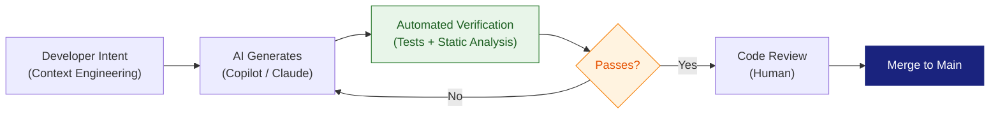

Today is **June 6, 2026**. Following the [June 2 radar on NVIDIA RTX Spark and Intel 18A at Computex](/radar/nvidia-rtx-spark-intel-18a-vera-rubin-computex-2026-claude-growth/), this week's signals shift from silicon announcements to the engineering workbench itself: how you write code, how you secure your cluster, how the Java ecosystem is evolving — and what arrives at WWDC26 in 48 hours.

Two parallel macro signals are reshaping the regional technology landscape: Eric Schmidt's visit to Hanoi to advise Vietnam's national AI strategy, and LG Innotek expanding its semiconductor substrate plant in northern Vietnam. Overlay that with the sharpest Nasdaq sell-off of the month — investors are now demanding that AI spend justify itself.

Here are the critical technical signals you need to act on today.

---

## 1. "Vibe & Verify" — The AI Coding Workflow That Became a Hard Requirement

**"Vibe & Verify" is the production-grade AI development workflow in which engineers direct AI to generate code and then validate that output through automated testing, static analysis, and human code review before it can merge.** As of June 2026, this is no longer a best practice adopted by forward-thinking teams — it is a baseline enterprise requirement.

### From Vibe Coding to the Quality Crisis

The term "vibe coding" was coined by Andrej Karpathy in early 2025: describe your intent in natural language, let the AI generate the implementation, ship it. Velocity climbed. Quality collapsed.

By early 2026, teams were confronting an uncomfortable reality: AI is exceptionally good at producing code that *looks correct* — just plausible enough to merge, just wrong enough to introduce security vulnerabilities and invisible technical debt. The resulting pattern became known as the "vibe coding hangover": teams stuck in App Store rejection loops, or wrestling with codebases that no one fully understands.

### The Three-Step "Vibe & Verify" Workflow

| Step | Action | Tooling |
|:---|:---|:---|
| **1. Specify Intent** | Author explicit context in `.cursorrules`, `CLAUDE.md`, `AGENTS.md` — this is "Context Engineering" | Cursor, Windsurf, Claude |
| **2. Generate** | Let the AI produce boilerplate, scaffolding, and feature logic | Copilot, Gemini Code Assist |
| **3. Verify** | Run automated tests in an isolated agent environment; apply static analysis; manually review sensitive zones | SonarQube, Jest, pytest |

**Areas where AI must never own the final decision:** authentication logic, payment flows, database schema migrations, and anything touching user data directly. A mistake there is not a bug — it is a vulnerability.



### The Role Shift: From Typist to Architect of Intent

The core competency has changed fundamentally. In 2024, a strong engineer wrote code fast and memorized APIs. In 2026, a strong engineer is an **Architect of Intent** — one who can:

- Express context clearly enough that the AI doesn't have to guess.
- Read and comprehend AI-generated code fast enough to catch subtle errors.
- Design test suites capable of catching what the AI misses.

84% of developers now use AI tools. But only teams that master the "Verify" half are actually shipping safe production code.

**Engineering implication:** Invest immediately in Test-Driven Development (TDD). A rigorous test suite is the most effective guardrail against AI-generated code quality degradation. If the AI cannot pass your tests, the code does not merge — period.

**Sources:** [martinfowler.com](https://martinfowler.com) · [auth0.com](https://auth0.com) · [daily.dev](https://daily.dev) · [sonarsource.com](https://sonarsource.com)

---

## 2. Kubernetes & AI Agents — Why the Old Security Model Is Broken

**AI Agents are invalidating the foundational security assumptions of Kubernetes.** Security models designed for deterministic workloads cannot govern non-deterministic, autonomous agents that chain tool calls in unpredictable sequences.

### Why Traditional K8s Security Falls Short

A conventional pod runs a fixed task and is easily scoped: static RBAC, namespace isolation, IP-range network policy. An AI Agent is fundamentally different:

- It is **non-deterministic** — you cannot predict which tools it will call, in what order, or what side effects will result.
- It can **chain actions** — a summarization agent can attempt to invoke write or delete endpoints if its tool list is not filtered.
- It is vulnerable to **prompt injection** — malicious content in input data can redirect the agent's behavior without the agent self-reporting the deviation.

```mermaid
flowchart TD
    A["Incoming Request"] --> B["AI Agent Pod\n(Non-deterministic)"]
    B --> C{Tool Selection\n(Runtime)}
    C --> D["Read Tool\n[Allowed]"]
    C --> E["Write Tool\n[Monitor]"]
    C --> F["Delete Tool\n[Block by Policy]"]
    E --> G["Gateway\nPolicy Engine\n(PII Filter + Rate Limit)"]
    F --> G
    G --> H["Approved Action"]
    G --> I["Blocked + Alerting"]
    style B fill:#fff3e0,color:#e65100
    style G fill:#e3f2fd,color:#0d47a1,stroke:#1565c0
    style I fill:#ffebee,color:#b71c1c,stroke:#c62828
```

### Four Production-Ready Solutions

**1. Short-lived tokens replace static API keys**

A static API key is a single point of compromise. If an agent is hijacked, the attacker has indefinite full access. The solution: adopt SPIFFE/SPIRE to issue workload identity tokens that self-expire after minutes.

**2. Runtime tool visibility filtering**

An agent does not need to know that a delete endpoint exists. A gateway filters the available tool list based on the current request's context — a content-summarization agent sees read tools only.

**3. Dynamic Resource Allocation (DRA) for GPU**

NVIDIA contributed its GPU driver to the CNCF, enabling DRA to replace the older `nvidia.com/gpu` device plugin. DRA provides an API-driven resource model that supports multi-tenant GPU clusters with explicit, per-workload security boundaries.

**4. Container isolation per agent execution**

Each agent runs in its own container with an isolated namespace. If one agent is compromised, the blast radius is contained — it cannot pivot to the broader cluster.

| Risk Vector | K8s-Native Mitigation |
|:---|:---|
| Static API key exposure | Short-lived SPIFFE/SPIRE workload tokens |
| Agent invoking out-of-scope tools | Runtime tool visibility filter (Gateway layer) |
| GPU multi-tenant data leak | Dynamic Resource Allocation (DRA) |
| Prompt injection privilege escalation | Container isolation + Pod Security Admission |
| Agent drift not detected | Platform-level observability — never rely on agent self-reporting |

**Engineering implication:** Stop scoping AI Agent permissions for "everything it might ever need." Apply least-privilege more aggressively than you ever have for any workload — permissions must be granted per-task, not per-role globally.

**Sources:** [thenewstack.io](https://thenewstack.io) · [tigera.io](https://tigera.io) · [checkpoint.com](https://checkpoint.com) · [cisco.com](https://cisco.com)

---

## 3. JDK 27 Hits Rampdown Phase 1 — Structured Concurrency Reaches Preview 7

**JDK 27 entered Rampdown Phase 1 on June 4, 2026, meaning its feature set is now frozen.** General Availability is scheduled for September 14, 2026. The most significant addition for backend engineers is **Structured Concurrency** (JEP 533), now in its seventh preview iteration.

### What Is Structured Concurrency?

Structured Concurrency enforces a clear parent-child lifecycle for concurrent tasks: subtasks must complete before their parent scope exits, and if one subtask fails, the remaining subtasks are automatically cancelled. This eliminates the resource leaks, silent thread accumulation, and debugging nightmares endemic to unstructured concurrency.

**The problem with traditional Thread APIs:**

```java
// Legacy: race conditions, resource leaks, hard to debug
ExecutorService executor = Executors.newFixedThreadPool(4);
Future<String> f1 = executor.submit(() -> fetchFromDB());
Future<String> f2 = executor.submit(() -> callExternalAPI());
// If f1 throws, f2 keeps running. Memory leak. Threads don't shut down.
```

**With Structured Concurrency (JDK 27 Preview 7):**

```java
// New: deterministic, clean, trivially debuggable
try (var scope = new StructuredTaskScope.ShutdownOnFailure()) {
    Subtask<String> dbResult   = scope.fork(() -> fetchFromDB());
    Subtask<String> apiResult  = scope.fork(() -> callExternalAPI());
    scope.join().throwIfFailed(); // Throws ExecutionException (not FailedException)
    return process(dbResult.get(), apiResult.get());
}
```

### Breaking Change in Preview 7

The joiners (`allSuccessfulOrThrow`, `anySuccessfulOrThrow`, `awaitAllSuccessfulOrThrow`) now throw `ExecutionException` instead of the preview-specific `FailedException` used in earlier iterations. This is a breaking change for any code that caught `FailedException` from JDK 26 preview builds.

### Practical Application: Parallel LLM API Calls

Structured Concurrency maps naturally to the pattern of fan-out calls across multiple LLM providers:

```java
// Call 3 LLM APIs concurrently — return the fastest successful result
try (var scope = new StructuredTaskScope.ShutdownOnSuccess<String>()) {
    scope.fork(() -> callOpenAI(prompt));
    scope.fork(() -> callClaude(prompt));
    scope.fork(() -> callGemini(prompt));
    scope.join();
    return scope.result(); // Returns the first successful response
}
// If all three fail: ExecutionException is thrown; scope cleans up automatically
```

**Engineering implication:** If you are building Java backends that fan out to multiple AI providers, Structured Concurrency will replace verbose `CompletableFuture` chains with a model that is both safer and easier to reason about. GA is 3 months out — download JDK 27 EA now and start validating your parallel AI call patterns.

**Sources:** [openjdk.org](https://openjdk.org) · [infoq.com](https://infoq.com) · [happycoders.eu](https://happycoders.eu) · [jvm-weekly.com](https://jvm-weekly.com)

---

## 4. WWDC26 Preview — Agentic Siri, Core AI, and the Post-Tim Cook Era

**Apple WWDC26 runs from June 8–12, 2026. The Keynote opens Monday, June 8 at 10:00 AM PT.** This is the most consequential developer software event of the week — and arguably of the year for iOS and macOS engineers.

### Three Developer-Critical Signals

**1. Agentic Siri powered by Google Gemini**

Apple has confirmed Gemini model integration into Siri for complex, contextual, multi-step reasoning. The architecture will be hybrid: simple deterministic tasks (timers, messaging, local photo search) process on-device via the Neural Engine; generative and reasoning tasks escalate to Gemini running on Google Cloud. Apple has committed to a cryptographic abstraction layer that strips user identity tokens before any payload reaches Google's endpoint.

**2. The "Core AI" Framework — Is Core ML Being Retired?**

*[Unconfirmed — pre-WWDC26 reporting]* Reports indicate Apple is replacing Core ML with a new framework called "Core AI" — deeper Metal integration, native support for modern model architectures (Transformer, diffusion models). If confirmed at Monday's Keynote, this is the largest shift in Apple's developer toolkit since Swift.

**3. The Post-Tim Cook Transition**

WWDC26 is widely expected to be Tim Cook's final keynote as CEO before he transitions to Executive Chairman in September 2026. **John Ternus** — currently SVP of Hardware Engineering — is expected to have a significant presence at the event, marking Apple's next generational leadership chapter.

| Platform | Expected Version |
|:---|:---|
| iOS | iOS 27 |
| macOS | macOS 27 |
| iPadOS | iPadOS 27 |
| watchOS | watchOS 27 |
| visionOS | visionOS 27 |

**Engineering implication:** If you ship iOS or macOS apps, block your entire Monday morning for Keynote and your Monday afternoon for Platforms State of the Union. "Core AI" — if announced — will require you to reassess your entire on-device AI pipeline. The question is not whether to adopt it, but how fast you can move.

**Sources:** [apple.com](https://apple.com) · [macrumors.com](https://macrumors.com) · [engadget.com](https://engadget.com) · [gizmodo.com](https://gizmodo.com)

---

## 5. Vietnam's AI Positioning: Eric Schmidt, LG Innotek, and the Semiconductor Shift

**In the past 24 hours, Vietnam has sent two material signals about its place in the global technology map — one at the strategic AI policy level, one at the semiconductor manufacturing layer.**

### Eric Schmidt and the National AI Ecosystem

On June 5, General Secretary and State President To Lam held a working session with former Google Chairman and CEO **Eric Schmidt**. The agenda focused on three pillars: a national AI regulatory framework, attracting international technical support and investment, and building Vietnam's domestic AI development ecosystem.

This was not a courtesy visit. Given that Schmidt has directly advised the AI strategies of the US government, Ukraine, and multiple G7 nations, his presence in Hanoi signals that Vietnam is being taken seriously as a potential AI middle power in Southeast Asia.

**Engineering implication:** Vietnam's AI regulatory environment is being shaped by people who understand how frontier AI labs actually operate. Expect the forthcoming Digital Technology Industry Law to have substantially more technical nuance than previous draft versions. Vietnam-based developers and startups should track this legislation closely.

### LG Innotek's "Dual-Hub" Semiconductor Substrate Strategy

LG Innotek has confirmed the expansion of its **semiconductor substrate** manufacturing plant in northern Vietnam. This is a classic "dual-hub" risk diversification strategy — reducing dependency on South Korea and China, aligned with the broader "China+1" wave reshaping global supply chains.

Simultaneously, the Japanese government committed an additional **¥150 billion** to domestic chipmaker **Rapidus** to accelerate mass production of **2-nanometer chips** and fund research toward 1.4nm.

**The bigger picture:** While the echoes of Computex 2026 are still reverberating — NVIDIA RTX Spark, Intel 18A, Vera Rubin full production — hardware supply chains are being restructured at the national level. Vietnam is being positioned not just as an assembly hub, but as a node in the semiconductor value chain.

**Sources:** [vneconomy.vn](https://vneconomy.vn) · [vov.vn](https://vov.vn) · [theinvestor.vn](https://theinvestor.vn) · [nippon.com](https://nippon.com)

---

## 6. Nasdaq -4%: The Market Starts Demanding AI ROI

**On June 5, the Nasdaq fell more than 4% — its steepest single-day drop of the month — after the May jobs report came in stronger than expected (172,000 new jobs), increasing market expectations that the Federal Reserve will maintain or raise interest rates.**

This was not purely a rate-sensitivity reaction. Below the surface, a deeper rotation is underway: investors are exiting AI-heavy equities and Bitcoin (which retreated toward $60,000) in favor of value assets. Broadcom — one of the most critical AI infrastructure names — posted a guidance miss that dragged the entire ecosystem lower.

### What This Means for Engineering Organizations

The 2024–2025 market allowed AI companies to spend aggressively without proving concrete return. That era is ending.

**Questions every Engineering Manager will soon need to answer:**
- What is the monthly token cost of our agentic workflows?
- Are we "token maxing" — exhausting token budgets before agents complete tasks?
- What is the actual ROI of our AI integrations, and what metric are we using to measure it?

The "Agentic Execution Gap" flagged in the [June 2 Tech Radar](/radar/nvidia-rtx-spark-intel-18a-vera-rubin-computex-2026-claude-growth/) is no longer just a governance concern — it is now direct financial pressure from boards and investors.

**Engineering implication:** If you do not have token budget tracking in place today, implement it. Every agentic workflow needs a hard spending cap, and every cap needs to be justified by a measurable business outcome. "We're exploring AI capabilities" is no longer a defensible line item.

**Sources:** [bnnbloomberg.ca](https://bnnbloomberg.ca) · [fintech.global](https://fintech.global)

---

## FAQ: Quick Answers for Engineering Teams

**Does "Vibe & Verify" replace traditional TDD?**
No — it restores TDD to its rightful position. The "Verify" step *is* TDD: you write tests first, the AI generates code to pass them. TDD becomes a mandatory guardrail rather than an optional practice.

**How does Kubernetes DRA differ from the legacy device plugin model?**
Fundamentally. The device plugin (`nvidia.com/gpu`) is a coarse-grained mechanism — it allocates an entire GPU to a pod. DRA provides an API-driven resource model that supports workload-level GPU sharing, per-namespace quotas, and admission controller integration for policy enforcement. It is the right model for multi-tenant AI clusters.

**When does JDK 27 GA, and should I migrate off JDK 21 LTS?**
GA is September 14, 2026. JDK 27 is not an LTS release — that title goes to JDK 29. If you are on JDK 21 LTS, there is no urgency to migrate. But you should validate Structured Concurrency behavior on JDK 27 EA builds now to prepare for the long-term migration path.

**Where can I watch WWDC26 live?**
Apple streams the Keynote and Platforms State of the Union at [apple.com/apple-events](https://apple.com/apple-events), on the Apple TV app, and on the Apple Developer YouTube channel. Keynote starts at 10:00 AM PT on Monday, June 8.

**Does the Nasdaq sell-off signal an AI bubble burst?**
Not yet — this is a valuation correction, not a structural collapse. Physical infrastructure (servers, chips) continues to grow strongly (see Dell's +30% surge). What is correcting is the expectation of near-term ROI from software AI applications. The market is separating "AI with real revenue" from "AI with a roadmap."

---

## Compact Summary: Today's Core Signals

| Signal | Event | Engineering Action |
|:---|:---|:---|
| **Vibe & Verify** | 84% of devs use AI; Verify via TDD + static analysis is now the mandatory enterprise standard | Implement an automated test pipeline for all AI-generated code before human review |
| **K8s AI Security** | DRA, short-lived tokens, and tool filtering are the three new pillars of AI Agent security | Audit K8s RBAC; replace static API keys with SPIFFE/SPIRE workload tokens |
| **JDK 27 Rampdown** | Feature freeze June 4, 2026; Structured Concurrency Preview 7 (JEP 533) | Test parallel LLM API fan-out with StructuredTaskScope on JDK 27 EA builds |
| **WWDC26** | June 8–12, 2026; Keynote 10 AM PT Monday; Agentic Siri + Core AI framework expected | Watch Platforms State of the Union Monday afternoon to assess "Core AI" impact on your apps |
| **Vietnam AI** | Eric Schmidt advising national AI framework; LG Innotek expanding substrate production in northern Vietnam | Monitor the Digital Technology Industry Law; Vietnam is becoming a node in the semiconductor value chain |
| **Nasdaq -4%** | Capital rotation out of AI equities; Broadcom guidance miss; Bitcoin ~$60K | Implement token budget tracking; justify every AI workflow with a measurable business outcome |

---

## Radar Takeaway

There was no headline hardware event this week — no Computex, no GTC. But this is the week that *how you work every day* is under active revision, and you have 48 hours to prepare for WWDC26.

**"Vibe & Verify" is the most operationally important signal of the week** — not because it is a new idea, but because it has crossed the threshold from engineering best practice to enterprise mandate. If your team is still merging AI-generated code without an automated verification pipeline, you are accumulating security debt faster than technical debt.

Kubernetes security for AI Agents cannot wait. 72% of enterprises have deployed agents. Most have not updated their security model since the pre-agentic era.

JDK 27 Structured Concurrency is finally stable enough to justify adding to your migration plan. If you are building a Java backend that fans out to multiple LLM APIs, this is the concurrency primitive you have been waiting for.

And next week, WWDC26 may reshape the entire AI development landscape for Apple platforms in a single morning.

**Action items for this week:**

1. **Vibe & Verify audit:** Review your team's merge process. Does every AI-generated PR pass automated tests and static analysis before any human reviews it?
2. **K8s security scan:** Inventory your cluster. Where are static API keys still in use? Are any agents running with broader permissions than their current task requires?
3. **JDK 27 EA testing:** Download the JDK 27 Early Access build and validate your parallel AI API patterns with `StructuredTaskScope`. GA is September — start the evaluation cycle now.
4. **WWDC26 calendar:** Block Monday morning for the Keynote. Block Monday afternoon for Platforms State of the Union. If "Core AI" lands, you will want same-day context.

---

**📚 Related Reading:**
- [Tech Radar, June 2: NVIDIA RTX Spark & Intel 18A at Computex 2026](/radar/nvidia-rtx-spark-intel-18a-vera-rubin-computex-2026-claude-growth/)
- [Tech Radar, May 30: Illinois AI Bill & Dell's $60B Server Surge](/radar/radar-2026-05-30-illinois-ai-bill-dell-servers-gstar-hcmc/)
- [MCP Engineering in Production — Series](/series/mcp-engineering-in-production/)

---

*This Tech Radar bulletin is compiled by the OpenClaw AI network with technical oversight from Senior System Architect @TuanAnh. Data sourced from openjdk.org, apple.com, thenewstack.io, macrumors.com, infoq.com, vneconomy.vn, bnnbloomberg.ca, and verified engineering sources.*


