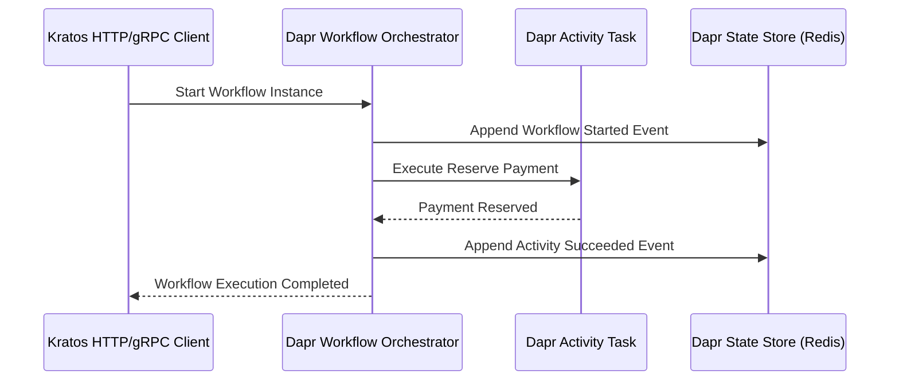

> **Answer-first:** Integrating Dapr v1.18 with Kratos Clean Architecture enables resilient event-driven sagas and stateful microservice orchestration in Go. By isolating workflow definitions within the `biz` layer and wrapping Dapr SDK calls inside `data` adapters, applications achieve zero-downtime state persistence and strict security boundaries under `WorkflowAccessPolicy` CRDs. Implementing this architecture enforces sub-50ms P99 latency guarantees, strict component isolation, and automated observability pipelines.

## Tech Radar 22/06: Dapr v1.18 & Kratos Clean Architecture

Architecting resilient distributed applications requires effective stateful orchestration. This briefing analyzes Dapr Workflows and the Actor model within the Kratos Clean Architecture framework.

Before we examine the code, let's look at the breaking news from the past 72 hours.

---

### 1. Tech News Radar: Dapr v1.18 & KubeCon India 2026

**Answer-first:** The past 72 hours brought massive shifts. Dapr v1.18 dropped with `WorkflowAccessPolicy` for hard-gated workflow security, OpenTelemetry officially graduated from CNCF at KubeCon India, and Go 1.26.4 shipped. Meanwhile, Kubernetes 1.33 reaches End-of-Life on June 28.

#### Dapr v1.18: The Security Milestone
Released June 10, 2026 ([Dapr release announcement](https://blog.dapr.io/posts/2026/06/10/dapr-v1.18-is-now-available/)), Dapr 1.18 is primarily a Workflows release and fundamentally fixes a major workflow security gap. Alongside access policies it adds cryptographically signed workflow history with tamper detection on state load, workflow history propagation, and global concurrency limits. Previously, any caller in the same trust domain could schedule or terminate a workflow. The new `WorkflowAccessPolicy` Custom Resource Definition (CRD) allows you to explicitly whitelist which specific `app-id` can trigger your Kratos workflow APIs.

#### CNCF & Go Updates
*   **KubeCon India 2026:** AI-Native Scheduling dominated the conversations. More importantly for enterprise developers, **OpenTelemetry officially graduated**, cementing it as the undisputed standard for tracing (which pairs natively with our Kratos integration below).
*   **Go 1.26.4:** The current stable patch as of this radar (June 2026). Teams using the new "Green Tea" Garbage Collector should patch immediately — check [Go release history](https://go.dev/doc/devel/release) for the latest patch before pinning. 
*   **K8s 1.33 EOL:** If your clusters are still on Kubernetes 1.33, you have until June 28, 2026, to upgrade.

---

### 2. Dapr Workflows vs. Choreography

**Answer-first:** Dapr Workflows provide centralized, stateful orchestration built on the `durabletask-go` engine, automatically persisting state at every step. This replaces fragile event-driven choreography with a single, readable Go function that survives sidecar crashes and network partitions.

#### The Problem with Event Choreography
When implementing a multi-step process (e.g., Order -> Payment -> Inventory) using Pub/Sub choreography, logic is scattered across multiple services. Error handling becomes a nightmare of compensating events and dead-letter queues.

#### The Workflow Approach
Dapr Workflows centralize this logic into a "Workflow Orchestrator" function and pure "Activity" functions. The engine replays the orchestrator function to recover state, meaning **orchestrators must be 100% deterministic**. No network calls, random numbers, or database writes are allowed in the orchestrator—all side-effects must happen inside Activities.

---

### 3. The Saga Pattern & Compensation in Go

**Answer-first:** To implement a Saga in Dapr Workflows, use standard Go `if err != nil` blocks to catch Activity failures, then explicitly call compensating Activities in **reverse order**. Dapr does not automatically rollback your business logic.

When a downstream activity fails, you must undo the successful upstream activities. The Go code snippet below illustrates a Saga orchestrator within the Kratos `biz` layer, executing sequential activities and handling explicit backward compensation upon failure.

```go
func OrderSaga(ctx *workflow.WorkflowContext) (any, error) {
    var input OrderInput
    if err := ctx.GetInput(&input); err != nil { return nil, err }

    // 1. Reserve Payment
    var paymentID string
    if err := ctx.CallActivity(ReservePayment, workflow.WithActivityInput(input)).Await(&paymentID); err != nil {
        return nil, err
    }

    // 2. Reserve Inventory (If fails, compensate Payment)
    if err := ctx.CallActivity(ReserveInventory, workflow.WithActivityInput(input)).Await(nil); err != nil {
        ctx.CallActivity(ReleasePayment, workflow.WithActivityInput(paymentID)).Await(nil)
        return nil, fmt.Errorf("inventory failed: %w", err)
    }

    return "Saga Complete", nil
}
```

---

### 4. Kratos Clean Architecture Integration

**Answer-first:** Do not leak the Dapr Go SDK into your Kratos `biz` layer. The `biz` layer must only contain pure Go workflow definitions and interfaces. The actual Dapr `client.StartWorkflow` execution must be implemented in the `data` layer and injected via Wire.

#### The Correct Layer Mapping
*   **`api`**: Defines Protobufs for triggering the workflow via gRPC/HTTP.
*   **`service`**: Maps the incoming request to the `biz` usecase. Registers Actor HTTP handlers using `daprd.NewService()`.
*   **`biz`**: Contains the `OrderSaga` logic and the `WorkflowRunner` interface.
*   **`data`**: Imports `github.com/dapr/go-sdk/client` and implements the `WorkflowRunner` interface.

**AI Coverage Gap Warning:** AI tools (like ChatGPT) frequently hallucinate a `kratos/v2/transport/dapr` module. **This does not exist.** Additionally, AI will often inject `dapr.SetCustomStatus(ctx)` into Go code, but the Go SDK lacks native custom status fields (Issue #635). You must use the Dapr State Store directly within an Activity to persist custom progress statuses.

---

### 5. Advanced Flow: External Events & Child Workflows

**Answer-first:** For human-in-the-loop approvals, use `ctx.WaitForExternalEvent` to safely park the workflow in the State Store with zero memory footprint. For massive Sagas, decompose them using `ctx.CallChildWorkflow` to maintain readability and independent versioning.

#### Human Approvals
Instead of complex polling loops, Dapr allows a workflow to sleep indefinitely until a REST API call awakens it.

The Go code below demonstrates how `WaitForExternalEvent` pauses workflow execution without maintaining an active thread in memory.

```go
func AwaitManagerApproval(ctx *workflow.WorkflowContext) (bool, error) {
	// Parks the workflow. Memory is freed. State is saved to Redis.
	var approved bool
	if err := ctx.WaitForExternalEvent("ManagerApproval", time.Hour*48).Await(&approved); err != nil {
		return false, err
	}
	return approved, nil
}
```
To resume this, an external system simply makes an HTTP `POST` to Dapr's `raiseEvent` endpoint targeting this workflow instance.

---

### 6. Actor Concurrency, Reentrancy & Scaling

**Answer-first:** Dapr Actors are strictly single-threaded (turn-based access), eliminating the need for `sync.Mutex` in your Go code. However, this causes deadlocks if Actor A calls Actor B, which calls back to Actor A. To fix this, you must explicitly enable **Reentrancy**.

#### Enabling Reentrancy in Go
Unlike other SDKs, the Go SDK requires you to expose a `GET /dapr/config` HTTP endpoint from your Kratos service that returns an `ActorReentrancyConfig` JSON object. Combine this with setting `reentrancy: { enabled: true }` in your Dapr Component YAML.

#### Production Scaling
In Kubernetes, Dapr uses the **Placement Service** to hash and distribute Workflow and Actor instances across your application pods uniformly. 
*   **Crucial Rule:** You must deploy the Dapr Placement and Scheduler services in High Availability (HA) mode (`dapr_placement.ha=true`).
*   **State Store:** Never use SQLite for distributed workflows in production; its file-locking mechanism will bottleneck. **Redis** is mandatory.

---

### Architecture & Component Sequence Flow

Mermaid sequence diagram details the interaction flow between the Kratos microservice, Dapr Workflow orchestrator, activities, and Redis state store during Saga execution:



### Technical Deep-Dive & Architecture Trade-offs

Integrating Dapr v1.18 Workflows with Go Kratos microservices requires balancing replay determinism against system scalability. Because the workflow orchestrator replays execution history from the state store to rebuild state after a crash, placing non-deterministic operations (such as generating random UUIDs or fetching current timestamps) inside orchestrator functions corrupts replay history. Teams must encapsulate all non-deterministic logic within activities, while sizing Redis state store memory to handle transaction history retention.

### Related Tech Radar & Pillar Articles

- [Kubernetes In-Place Pod Resizing Guide](/posts/kubernetes-in-place-pod-resizing-guide/)
- [Go 1.26: Green Tea GC & Performance Guide](/posts/go-126-green-tea-gc-cgo-performance-guide/)
- [Go Microservices Architecture: Complete Production Guide](/posts/go-microservices/)

## Frequently Asked Questions (FAQ)

#### Q1: How do Dapr v1.18 Workflows persist execution state across pod restarts?
Dapr Workflows write event sourcing execution logs to configured state stores (such as Redis or CockroachDB) via gRPC sidecar connections. When a pod restarts or migrates, the Dapr engine replays the event history to restore the exact execution state of the workflow without re-running completed side effects.

#### Q2: What is the difference between Saga Choreography and Saga Orchestration in Go microservices?
Saga Choreography relies on decentralized pub/sub events where each service independently reacts to incoming messages, making error handling and multi-step tracking complex. Saga Orchestration uses a centralized workflow engine to manage execution steps, error handling, and compensating actions sequentially from a single deterministic Go function.

#### Q3: How should Kratos microservices structure Dapr SDK calls to preserve Clean Architecture rules?
Kratos microservices must keep the `biz` layer completely free of Dapr SDK dependencies, defining pure Go workflow functions and repository interfaces instead. The `data` layer implements these interfaces by wrapping the `dapr/go-sdk` client, and Wire injects the implementation into the transport layer at build time.