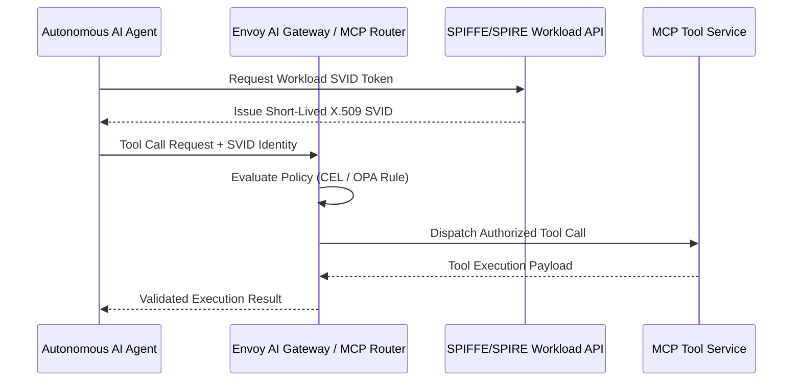

> **Answer-first:** Tech Radar Digest for July 2026 aggregates 6 daily technical briefings detailing autonomous AI swarms, WasmEdge SLM runtime execution, zero-trust MCP authorization, and modular monolith agentic governance. Production guidelines detail edge deployment topologies, liquid neural networks, and multi-agent coordination frameworks.

## Overview — Tech Radar Digest — July 2026

This monthly digest consolidates 6 daily Tech Radar briefings published throughout July 2026. The edition explores cutting-edge developments in autonomous AI agent swarms, WebAssembly on edge infrastructure, Model Context Protocol (MCP) authorization models, and agentic governance.

---

## Tech Radar 03/07: Autonomous AI Swarms & OpenClaw on K8s

**Answer-first:** LLMs are now commodities; the new battleground is orchestrating Autonomous Swarms (multi-agent systems) on Kubernetes. To run these swarms safely in 2026, Platform Engineers must merge advanced K8s scheduling, Zero Trust identity, and robust state management.

Here is the definitive blueprint for operating AI Swarms on Kubernetes.

### Core Orchestration: State & Scale

**Answer-first:** Treat AI agents as stateless Deployments while offloading memory and workflows to external vector databases and Dapr. This prevents data loss during pod restarts and ensures horizontal scalability.

#### The Golang Advantage & OpenClaw
Most legacy AI scripts use Python, but production swarms demand massive concurrency. Frameworks like **OpenClaw** leverage Golang's Goroutines for scatter-gather workflows. Go’s minimal memory footprint allows running thousands of lightweight agents per node. 

#### Distributed State & Caching
- **Dapr Workflows:** Provide durable state. If an agent crashes, Dapr resumes the exact step without re-calling expensive LLM APIs.
- **LMCache & vLLM:** KV Cache is no longer siloed per node. LMCache offloads context blocks to Redis or NVMe, allowing any replica to reuse precomputed prompt prefixes.
- **KEDA Autoscaling:** Standard CPU autoscaling fails for AI because GPUs hit 100% instantly. Use KEDA to scale pods based on queue depth instead.

### Zero Trust Security & Sandboxing

**Answer-first:** Never trust an LLM prompt or its generated code. You must secure agent-to-tool communication with SPIFFE/SPIRE mTLS and sandbox tool execution inside WebAssembly.

#### Defending the Swarm
- **LLM Firewalls:** Use Kubernetes Gateway API extensions (like `agentgateway`) to block Prompt Injections via `PromptGuard` policies before they hit inference pods.
- **SPIFFE/SPIRE:** Agents dynamically assume cryptographically verifiable identities (SVIDs) to access internal tools. No more static API keys in config maps.
- **WebAssembly (Wasm) Sandboxing:** When an agent generates code to solve a problem, execute it in a Wasm RuntimeClass. Unlike Docker containers, Wasm offers instruction-level isolation, preventing catastrophic container escapes.
- **Confidential Containers (CoCo):** For finance or healthcare, wrap agent pods in AMD SEV or Intel SGX enclaves. This encrypts the memory so even hypervisor admins cannot extract the agent's context.

### Day-2 Ops: FinOps & Edge Survival

**Answer-first:** Swarm operations require optimizing egress costs via Istio Locality Load Balancing and handling abrupt `OOMKilled` events using watchdog sidecars.

#### Managing Failure and Costs
- **OOMKilled Resilience:** When an agent uses too much RAM, the Linux kernel issues a `SIGKILL` (Exit Code 137). Since graceful shutdown is impossible, deploy a lightweight watchdog sidecar to clean up orphaned state locks in Dapr.
- **CRIU Checkpointing:** To survive Spot Instance preemption, use CRIU (Checkpoint/Restore In Userspace) to freeze the agent's memory and migrate the pod seamlessly.
- **FinOps Egress Optimization:** Agent-to-Agent chat generates massive cross-AZ traffic. Istio's Locality Load Balancing ensures traffic stays within the same availability zone, slashing cloud egress bills.
- **Edge Swarms:** Running swarms on K3s? Skip heavy Transformers. Liquid Neural Networks (LNN) require fractions of the parameters, allowing Edge agents to run purely on CPU constraints.

### FAQ

#### How do we handle LLM API rate limits?
Centralize all outbound LLM traffic through a proxy like LiteLLM or Kong AI Gateway. These proxies use Power of Two Choices (P2C) load balancing and automatically fall back to secondary providers when encountering HTTP 429 errors.

#### What is the "Thundering Herd" problem in AI swarms?
When a transient network error occurs, thousands of agents might retry a vector database query simultaneously, crashing the DB. Implement Exponential Backoff with Jitter and prioritize P2C routing to mitigate this.

#### How do we manage agent memory for SOC2 compliance?
Vector databases (like Milvus or Qdrant) must have strict lifecycle policies. Use Milvus TTL (`collection.ttl.seconds`) to automatically purge hot memory, and archive critical agent decision logs to encrypted cold storage.

---

## Tech Radar 06/07: Edge AI, Liquid Neural Networks & WasmEdge on K3s

**Answer-first:** AI doesn't have to run on massive GPU clusters in the Cloud. The combination of ultra-lightweight Liquid Neural Networks (LNNs) and the WebAssembly runtime WasmEdge on K3s delivers a cutting-edge Edge AI architecture — one that directly solves the two biggest enterprise challenges: Cloud costs (FinOps) and Data Privacy.

### Liquid Neural Networks (LNN): AI Without a GPU

**Answer-first:** Unlike heavy Transformers, LNNs process information using continuous-time dynamical equations. The Closed-form Continuous-time (CfC) variant eliminates the costly ODE solver entirely, enabling inference to run directly on the CPU of an Edge node like a Raspberry Pi.

Most Edge AI optimization efforts today revolve around quantizing Transformer models like LLaMA or Mistral. Even after compression, they still consume significant RAM and compute.

LNNs, by contrast, require a shockingly small number of parameters. Research has demonstrated that an LNN needs only **19 neurons** to control an autonomous vehicle. The arrival of the CfC (Closed-form Continuous-time) architecture solved the biggest weakness of traditional LNNs: the mathematical cost of the ODE solver. By using a mathematical shortcut, CfC allows LNNs to process real-time data streams without any hardware accelerator (GPU/NPU).

### WasmEdge and K3s: Ultra-Lightweight Orchestration

**Answer-first:** Docker is too heavy for Edge AI. WasmEdge provides a WebAssembly sandbox with a footprint of just 1–10 MB and a cold-start time of 1–10 ms. K3s manages WasmEdge workloads through runtime shims (CRUN/runwasi) exactly like any standard container.

At the Edge, every megabyte of RAM matters. A Docker container running a Python AI stack typically requires **50–200 MB** as a base image. WasmEdge, by contrast, executes WebAssembly binaries with a minimal footprint of just 1–10 MB.

LNN frameworks written in Rust (such as zLNN) can compile directly to WebAssembly. K3s — the lightweight Kubernetes distribution for Edge — orchestrates these Wasm workloads seamlessly through container runtime shims (runwasi or CRUN). The result is a self-healing AI cluster that boots in **1–10 milliseconds**, ready to respond to real-time IoT data streams.

### Solving FinOps and Data Privacy

**Answer-first:** Running LNN through WasmEdge on K3s allows enterprises to pack 10–100× more instances onto the same hardware, while completely eliminating egress costs from streaming data back to the Cloud. Sensitive data never leaves the device.

1. **FinOps Optimization:** WasmEdge's high consolidation ratio dramatically reduces infrastructure cost. Eliminating the need to continuously stream video or sensor data to AWS/GCP can save organizations thousands of dollars in network egress fees.
2. **Data Privacy:** Inference happens directly on the physical device. WasmEdge's capability-based security model also ensures that untrusted AI code cannot access the host network or filesystem without explicit permission.

### FAQ

#### Can LNN replace LLMs at the Edge?

Not entirely. LNNs are purpose-built for processing continuous time-series data streams — IoT sensors, radar, video feeds — to make physical decisions. They are not designed for chat or text generation like LLMs.

#### Does WasmEdge support GPUs?

Currently, WasmEdge excels in CPU inference environments. CUDA/GPU ecosystem integration is still under development and is not yet as mature as the traditional Docker/Python runtime.

---

## Tech Radar 14/07: Zero-Trust AI Swarms & MCP

Welcome to this week's **Tech Radar**. In our previous issue, we discussed [Cloud-Native AI Architecture](/radar/radar-2026-07-10/). Once we have a robust infrastructure (Envoy, K8s Inference), the next problem immediately arises: How do we control this AI Swarm? Do not let AI Agents roam free in production. Today, we dive deep into **Zero-Trust Security for Multi-Agent Swarms**.

### 1. Tech News Radar: Agentic Vulnerabilities and the Rise of Non-Human Identity

**Answer-first:** The explosion of AI Agents brings severe security risks (OWASP ASI02). Static API keys are no longer suitable; the system demands Non-Human Identity (NHI) through technologies like SPIFFE to control each Agent independently.

Recently, the security community has consistently warned about Agent systems being exploited through Prompt Injection, leading to RCE or maliciously hallucinated Tool calls. When an LLM Agent is autonomous, traditional mTLS between microservices is insufficient. mTLS verifies that Service A is allowed to call Service B, but it does not know *what the AI Agent inside Service A* is intending to do.

The concept of "Non-Human Identity" is becoming the core buzzword of Platform Engineering in 2026.

### 2. The Problem: OWASP ASI02 (Tool Misuse)

**Answer-first:** OWASP ASI02 (Tool Misuse) is the largest execution-layer risk of Agentic AI. When an Agent is hijacked (goal hijack), it leverages its legitimate permissions to call destructive APIs.

If an Agent is granted access to the `delete_user` tool for legitimate purposes, an "indirect prompt injection" attack from an email could trick the Agent into executing this tool on unintended targets. This is a direct consequence of Excessive Agency (LLM06 in OWASP 2025). Granting broad permissions to a generic "AI Service" is extremely risky behavior.

### 3. Solution Part 1: Identity with SPIFFE/SPIRE

**Answer-first:** SPIFFE/SPIRE provides short-lived, cryptographic identities (SVIDs) directly to Agent pods in Kubernetes. This solution completely eliminates static API keys, laying the foundation for Zero-Trust.

Instead of using static tokens, when an AI agent pod starts, the SPIRE Agent (running as a DaemonSet) authenticates the pod via the Kubernetes TokenReview API and issues an X.509 certificate (SVID).

*   **Independence:** Each agent has its own distinct `spiffe://` ID. For example: `spiffe://tanhdev.com/ns/ai/sa/database-agent` vs `spiffe://tanhdev.com/ns/ai/sa/support-agent`.
*   **Dapr Integration:** Dapr v1.18 treats `MCPServer` as a first-class resource. The Dapr Sidecar automatically handles mTLS and SPIFFE Identity for AI Agents. This allows developers to focus on Agent logic rather than managing certificates.

### 4. Solution Part 2: MCP Authorization via AI Gateway

**Answer-first:** The Model Context Protocol (MCP) does not have built-in RBAC (it only supports OAuth 2.1). Permission enforcement must be done at the Edge by a K8s AI Gateway to strip Tools right at the "tool-discovery" phase.

Even if an Agent has a valid identity, which Tools is it allowed to run?
*   **Gateway-Based Enforcement:** Envoy AI Gateway or Agentgateway acts as the Policy Enforcement Point (PEP).
*   **Tool Filtering:** The Gateway uses K8s CRDs or the `MCPRoute` API to "strip" unauthorized tools from the discovery response. If the LLM model does not see the tool, it cannot mistakenly call (hallucinate) it.
*   **Gateway Wars:** Envoy focuses on native K8s performance; Kong uses plugins to translate REST into MCP; WSO2 pushes hard for an Enterprise Catalog ("MCP Hub").

### 5. Solution Part 3: Parameter Validation with CEL and OPA

**Answer-first:** Blocking the Tool name is not enough; Platform Teams must validate the input parameters passed into the Tool using Common Expression Language (CEL) or Open Policy Agent (OPA).

For example, the Database Agent is allowed to call the DB Tool but **is only permitted to pass strings starting with `SELECT`**. Envoy uses inline CEL policies extremely fast to block these privilege escalation attempts. OPA provides higher flexibility but faces challenges when LLMs generate constantly changing JSON schemas.

### Conclusion & Impact

**Answer-first:** The Zero-Trust architecture combining SPIFFE, MCP Gateway, and Dapr allows AI Swarms to scale to thousands of Agents without exposing the Platform Team to security risks.

Bringing MCP to Kubernetes, managing it via the Gateway API, and securing it with Non-Human Identity is the pinnacle of true Platform Engineering in 2026. Do not let your Agents roam free!

### FAQ

#### 1. Why not use API Keys instead of SPIFFE?
API Keys are static secrets, prone to leaks, and hard to revoke automatically. Furthermore, they cannot prove the dynamic identity of ephemeral Agent pods in Kubernetes.

#### 2. Does MCP have built-in RBAC?
No. MCP focuses on the connection protocol and OAuth 2.1 authentication. You are required to use an additional Gateway layer (like Envoy) to handle Authorization/RBAC.

---
*Continuing the [Agentic System Architecture](/series/agentic-system-architecture/) and [MCP Engineering](/series/mcp-engineering-in-production/) series. Subscribe to ensure you do not miss our weekly in-depth analyses.*

---

## Tech Radar 17/07: WasmEdge for Edge AI Models

The rise of **Small Language Models (SLMs)** such as Llama-3 (8B) and Phi-3 is pushing the AI processing trend to the Edge. However, inherited from distributed architectures in [Agentic System Architecture](/series/agentic-system-architecture/), the toughest challenge in Platform Engineering lies not in the Model itself, but in the **Runtime**. Running AI using Docker containers at the Edge is exposing too many weaknesses in memory and speed.

### 1. The Problem with Docker Containers at the Edge

**Answer-first:** Edge AI runtimes must be compared using the model, accelerator, image, device, isolation needs, and cold-start SLO. Containers and WebAssembly have different operational trade-offs; neither is universally lighter or safer for every workload.

When deployed on resource-constrained devices like NVIDIA Jetson Orin or small Edge servers, Docker hits physical barriers (as we previously warned in [Tech Radar 14/07: Zero-Trust Security](/radar/radar-2026-07-14/)):
* **Python & CUDA Overhead:** Docker is inherently just an OS virtualization layer. To run AI, you still have to package the entire Python, PyTorch, and CUDA environments. Consequently, the runtime "eats up" over 1 GB of RAM even before loading model weights.
* **Sluggish Cold-starts:** Initializing namespaces, cgroups, mounting OverlayFS, and loading massive Python libraries takes 5 to 15 seconds. In Event-driven AI systems demanding immediate responses, this latency is unacceptable.
* **Memory Sharing (Multi-tenancy) Issues:** Although Linux supports `mmap`, sharing memory pages between independent Docker containers requires complex bind-mount configurations and breaks easily if the image is improperly packaged.

### 2. WasmEdge: The Future of AI Runtimes

**Answer-first:** WasmEdge can reduce runtime overhead for compatible workloads, but model weights, host plugins, accelerator drivers, and KV cache usually dominate memory use. Benchmark the complete inference path on the target device.

Real-world benchmark data when running Llama-3-8B-Instruct (Q4_K_M) with WasmEdge yields overwhelming figures:
* **Ultra-lightweight:** The application size (Wasm bytecode) is only around **1.2–3.5 MB**. During execution, the WasmEdge runtime occupies just **~15–30 MB** of RAM at idle. This is an 80x reduction compared to Docker Python.
* **Light-speed execution:** WasmEdge compiles Ahead-of-Time (AOT), allowing sandbox initialization and binary loading in **< 1 ms** (under one millisecond).
* **Multi-tenant mmap:** WasmEdge maps GGUF files directly into virtual address space. The OS Kernel automatically shares physical memory pages across all Wasm instances running the same model. You can run 10 instances with negligible RAM increase (only consuming extra RAM for the KV Cache).

### 3. WASI-NN Architecture (Hardware Interaction)

**Answer-first:** WASI-NN (WebAssembly System Interface for Neural Networks) acts as a bridge, enabling the ultra-light Wasm sandbox to directly invoke high-performance backend libraries (CUDA, OpenVINO) on the host machine.

Theoretically, WebAssembly is constrained by a 4GB linear memory limit and cannot access the GPU. WasmEdge circumvents this limitation via the WASI-NN plugin architecture:
* **Out-of-Sandbox Execution:** Model weights and computation (compute graph) are executed entirely outside the sandbox, on the host process. The Guest Wasm only passes tensor pointers outward.
* **Diverse Backends:** WasmEdge currently supports the most powerful backends such as **llama.cpp (GGML standard)**, PyTorch, OpenVINO (Intel), and TFLite. Notably, the llama.cpp backend is augmented by WasmEdge to maintain the KV Cache state directly on the host.

### 4. Sandbox Security: Absolute Protection

**Answer-first:** WebAssembly provides a useful capability boundary, but its security depends on host configuration, enabled WASI capabilities, plugins, and patching. It complements rather than replaces host hardening, supply-chain controls, and authorization.

Deploying Multi-tenant workloads at the Edge always faces the risk of cross-tenant data leakage:
* **Docker Exposes the Kernel:** Docker containers fundamentally share the Host Kernel, exposing over **300+ syscalls**. A Kernel vulnerability can allow a malicious Agent to "escape".
* **Capability-based Security:** WasmEdge adheres to the Zero Privileges principle. Malicious code inside Wasm cannot call syscalls directly. It can only invoke the ~40 functions authorized by the host (WASI).
* **Memory Isolation:** The Linear Memory system combined with hardware guard zones (Page Guard Regions) renders buffer overflow or ROP (Return-Oriented Programming) attacks completely ineffective.

---
**References & Benchmark Data:**
1. *WasmEdge: A High-Performance WebAssembly Runtime for Edge Computing* (IEEE Software, 2023).
2. WasmEdge documentation for the runtime and WASI-NN plugins.
3. A reproducible benchmark for the target model, device, and deployment configuration.

---

## Tech Radar 20/07: Governing Multi-Agent Systems at Scale with AWS Loom and AIOS

The explosion of multi-agent systems has led to a critical enterprise bottleneck: governance. When hundreds of autonomous agents interact, delegate tasks, and consume infrastructure resources, the traditional "API Gateway" approach fails to provide adequate oversight. The July 20, 2026 news cycle highlights a definitive industry pivot from building standalone agents to designing robust Agentic Operating Systems and Governance Layers.

### 1. AWS Loom: The Open-Source Governance Control Plane

**Answer-first:** AWS Loom addresses the severe lack of identity propagation and Role-Based Access Control (RBAC) in multi-agent environments. It provides a standardized framework for human-in-the-loop approvals, ensuring sensitive agentic actions are explicitly authorized before execution.

Enterprise adoption of AI agents has been blocked by the "black box" delegation problem: if Agent A asks Agent B to modify a database, whose credentials does Agent B use? AWS Loom acts as a foundational governance layer that intercepts these interactions. 
* **Identity Propagation:** It ensures that the original user's identity and permission boundaries travel with the task payload across the entire multi-agent mesh. 
* **Human-in-the-Loop (HITL):** Loom introduces native "checkpointing" APIs. If an agent attempts a high-risk mutation (e.g., executing a deployment or deleting records), Loom automatically pauses the execution thread and routes an approval request to a designated human administrator. 

### 2. Alation AIOS: The Intelligence Operating System

**Answer-first:** Moving beyond scattered agent deployments, Alation's AIOS (Intelligence Operating System) sits atop existing Data Catalogs, serving as a unified routing and coordination layer for enterprise models, agents, and analytics.

The industry is realizing that AI cannot function as a superficial "overlay" on legacy architectures. To achieve Continuous Intelligence, the core operations must be redesigned.
* **Context-Aware Routing:** AIOS acts as a traffic controller, understanding which specific specialized agent or underlying model is best suited for a given query based on cost, latency, and required domain knowledge.
* **Centralized Registry:** It provides a singular repository for discovering and auditing all active AI agents within an organization, preventing shadow IT and redundant agent development.

### 3. Infrastructure Economics: The GPT-5.6 Paradigm

**Answer-first:** The release of the GPT-5.6 model family signals the end of the brute-force capability race. The new competitive frontier is "ruthless cost optimization" and token efficiency, forcing architects to optimize the I/O of their agentic workflows.

As models become increasingly commoditized, the differentiator for engineering teams is no longer raw intelligence but operational efficiency. 
* **Token Efficiency as a Metric:** Multi-agent systems inherently consume massive amounts of context tokens as they converse. The latest infrastructure updates demand that agents are engineered to compress their contexts, utilize prompt caching aggressively, and minimize redundant reasoning cycles. 
* **Workflow Integration:** The focus has shifted from building "smarter" agents to building agents that integrate flawlessly and cheaply into existing CI/CD pipelines and data lakes without causing cost overruns.

---
**References:**
1. *AWS Open Source: Loom Documentation and RBAC Patterns*.
2. *Alation AIOS: Coordinating Enterprise Intelligence*.
3. *Infrastructure Economics: Token Efficiency in the GPT-5.6 Era*.

---

## Tech Radar 21/07: Modular Monolith Optimizing AI Agents

When the Multi-Agent trend exploded, the natural reflex of most Backend Engineers was: "Let's package each Agent as a Microservice!". This mindset makes perfect sense for traditional Web/App systems. However, for the AI Agents ecosystem, [inherited from the Agentic System Architecture problem](/series/agentic-system-architecture/), this is the genesis of a performance disaster.

### 1. The "Translation Tax" Bottleneck of Microservices

**Answer-first:** Network communication via gRPC/HTTP between Microservices introduces a 1-5ms latency per hop, plus a massive "Translation Tax" from continuously converting between the LLM's JSON and Protobuf. A Modular Monolith solves this with in-memory speeds (nanoseconds).

LLMs inherently communicate using text strings (JSON for Function Calling). When you split the system into Microservices:
* **Network Tax:** When an Agent makes 1,000 calls to small Tools (e.g., data scraping, text chunking), it consumes 1,000 to 5,000 ms just for TCP/TLS handshakes and internal network transit.
* **Translation Tax:** The amount of CPU burned for meaningless serialization: `LLM generates JSON -> Backend parses JSON -> Packages into Protobuf -> Transmits via gRPC -> Decodes Protobuf at the Tool -> Returns the result back`.
* **Modular Monolith:** Inheriting concepts from [Modular Monolith Architecture](/series/modular-monolith-architecture/), by grouping Agents and Tools into a single process while separating logical boundaries (Modules), communication becomes merely passing memory pointers (Objects). Latency drops to a few **nanoseconds**, completely eliminating network and serialization costs.

### 2. State Management with the Dapr Actor Model

**Answer-first:** Dapr Virtual Actors provide a "Turn-based Concurrency" mechanism, allowing each Agent to possess an independent State memory region without ever worrying about race conditions.

An AI Agent needs to maintain Memory, conversational history (Context), and planning (Reasoning).
* If you use standard Stateless REST APIs, you must constantly pull and push massive Context data (tens of thousands of tokens) in and out of the Database, causing horrific IOPS costs.
* By modeling each Agent as a **Dapr Virtual Actor**, that Agent's state is preserved entirely in-memory. Dapr's **Turn-based Concurrency** mechanism guarantees that at any given time, only a single thread is permitted to update that Actor's state. You do not need to write lock or mutex code, nor fear data synchronization loss.

### 3. "In-Process" MCP Integration (Local stdio)

**Answer-first:** Instead of running the Model Context Protocol (MCP) as independent services via REST/SSE, embedding the MCP Server to run locally (`stdio`) inside the Modular Monolith completely eliminates redundant Gateways and Service Meshes.

The Model Context Protocol (MCP) is the "USB-C port" for connecting external Tools to the LLM. However:
* **The Problem with Standalone MCP:** If each team develops its own MCP Server, you will quickly have dozens of Microservices requiring internal mTLS, Authentication, and Rate-limiting management (as warned in [Tech Radar 14/07: Zero-Trust Security](/radar/radar-2026-07-14/)).
* **Local `stdio` Integration:** In a Modular Monolith architecture, the host process (AI Agent) will directly invoke MCP Tools via the OS's standard `stdin/stdout` streams. JSON-RPC communication happens at blistering speeds over the local pipe system, ensuring absolute Encapsulation without exposing an API over a network port.

---
**References:**
1. *Dapr Concepts: Virtual Actors & Turn-based Concurrency*.
2. *Model Context Protocol (MCP) Transports Documentation*.
3. *Vercel & Daily.dev: Microservices Network Tax Benchmarks*.

---

### Architecture & Component Sequence Flow

