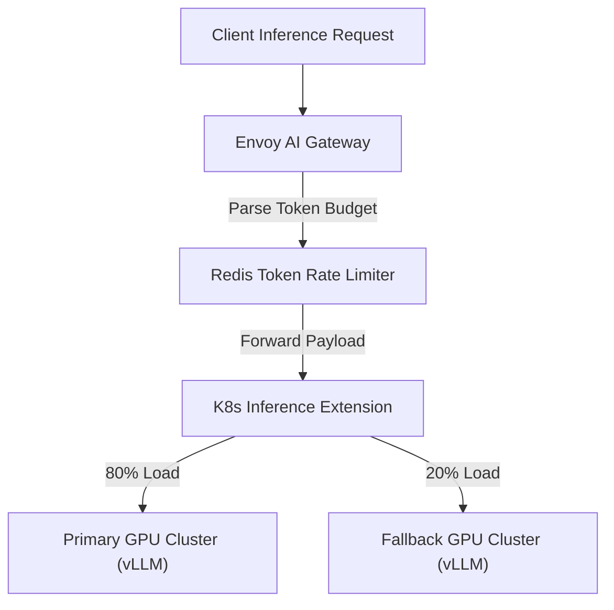

> **Answer-first:** Production cloud-native AI architectures combine Envoy AI Gateway for token-level FinOps quota enforcement, Kubernetes Gateway API Inference Extensions for KV-cache-aware GPU routing, and Dapr Agents for durable state recovery. These infrastructure primitives prevent runaway token costs and optimize LLM inference throughput.

## Tech Radar 10/07: Cloud-Native AI Architecture — Envoy Gateway, K8s Inference Extension & Dapr Agents

Platform engineering for production AI focuses on token cost governance, intelligent GPU inference routing, and resilient agent state recovery. CNCF projects like Envoy AI Gateway, K8s Gateway API Inference Extension, and Dapr Agents solve these challenges at the infrastructure layer.

---

## Layer 1 — FinOps: Envoy AI Gateway Controls Tokens Like a Financial Budget

Envoy AI Gateway (v1.0+, mid-2026) places a `QuotaPolicy` at the infrastructure layer. Instead of measuring requests per second, it measures actual token consumption and fires HTTP `429` as a *financial circuit breaker* before an agent loop can burn through the entire quota.

The core problem: traditional gateways (NGINX, vanilla Kong) cannot inspect the body of an LLM request. They have no idea whether a request consumes 50 tokens or 50,000. Platform teams only discover they've blown the budget when the monthly invoice arrives.

### QuotaPolicy: Token Budget Per-Tenant

Envoy AI Gateway solves this by integrating an `ext_proc` (External Processing) filter into Envoy to parse the LLM response body and extract actual token counts from response metadata.

The Kubernetes manifest below demonstrates how Envoy AI Gateway enforces tenant token quotas and differential pricing for input, output, and reasoning tokens using a `QuotaPolicy` resource.

```yaml
apiVersion: aigateway.envoyproxy.io/v1alpha1
kind: AIGatewayRoute
metadata:
  name: tenant-a-route
spec:
  rules:
  - matches:
    - headers:
      - name: x-tenant-id
        value: "team-backend"
    backendRefs:
    - name: openai-backend
      weight: 100
    - name: azure-openai-fallback   # automatic provider fallback
      weight: 0
---
apiVersion: aigateway.envoyproxy.io/v1alpha1
kind: QuotaPolicy
spec:
  limits:
  - tokenBudget: 500000          # 500K tokens/day per team
    window: 24h
    selector:
      header: "x-tenant-id"
    costs:
      inputToken: 1
      outputToken: 3              # CEL expression: output costs 3x more
      reasoningToken: 5           # thinking tokens are the most expensive
```

When `team-backend` exceeds 500K tokens, the gateway returns `429 Too Many Requests` *before the request ever reaches OpenAI*. Not a single token wasted.

### Model Virtualization: Code That Doesn't Know Which Provider It's Using

A strategically key feature for large teams is **Model Virtualization**. Application code calls `model: "gpt-production"`, and the gateway maps it to `gpt-4o` or `claude-sonnet-4` according to policy — no redeploy needed when switching providers.

**Combining with LiteLLM:** Many teams use LiteLLM at the application layer to normalize calls across 100+ providers, while using Envoy AI Gateway at the infrastructure layer for token-level FinOps enforcement. The two tools are not mutually exclusive.

---

## Layer 2 — Smart Routing: K8s Gateway API Inference Extension Brings GPU Routing Into the CNCF Standard

[`InferencePool` + `InferenceModel`](https://kubernetes.io/blog/2026/01/gateway-api-inference-extension/) are two new CRDs from K8s SIG Network (Q1/2026) that allow an Endpoint Picker (EPP) to route AI traffic based on real-time KV cache state and GPU queue depth — instead of the blind round-robin of a standard Kubernetes Service.

When you use a plain Kubernetes Service to load balance vLLM pods, traffic is distributed evenly. But LLM inference is inherently uneven: one pod may already hold the KV cache for the exact prompt prefix a new request needs, while another pod would have to recompute from scratch. The result: unnecessarily high TTFT (Time To First Token) and GPU hotspotting.

### InferencePool and Endpoint Picker: Intelligent Routing

The Kubernetes manifest below illustrates how `InferencePool` and `InferenceModel` CRDs configure an Endpoint Picker for KV cache-aware GPU pod routing.

```yaml
apiVersion: inference.networking.k8s.io/v1alpha2
kind: InferencePool
metadata:
  name: llama-3-pool
spec:
  targetPortNumber: 8000
  selector:
    app: vllm-llama3
  extensionRef:
    name: endpoint-picker-epp    # the routing "brain"
---
apiVersion: inference.networking.k8s.io/v1alpha2
kind: InferenceModel
metadata:
  name: llama-3-70b
spec:
  modelName: "meta-llama/Meta-Llama-3-70B-Instruct"
  criticality: Standard          # Low | Standard | Critical
  poolRef:
    name: llama-3-pool
```

**Endpoint Picker (EPP)** is a plugin using the `ext_proc` protocol to query each pod for:
- Current KV cache utilization
- GPU queue depth (pending requests)
- Loaded LoRA adapters

EPP routes each request to the pod with the highest cache hit for that request's prompt prefix → significant TTFT reduction, hotspot elimination.

### llm-d: Disaggregated Inference — CNCF Sandbox Project

**llm-d** (Red Hat/Google/IBM/NVIDIA, CNCF Sandbox 2026) goes one step further: it splits *prefill* (prompt processing — compute-heavy) and *decode* (token generation — memory-bandwidth-heavy) into two separate GPU pools.

- **Prefill pool:** High tensor-parallelism A100 GPUs — fast prompt processing
- **Decode pool:** GPUs with large HBM — sustained token generation throughput

Combined with InferencePool and KV cache-aware routing, llm-d routes requests sharing the same prompt prefix to the same decode worker → maximizes cache hit rate, increasing throughput by 30–50% according to the project's internal benchmarks.

> **Maturity note:** llm-d is still a CNCF Sandbox project (not yet Graduated). Suitable for teams who want to move early, but production readiness requires careful evaluation.

---

## Layer 3 — Reliability: Dapr Agents GA — An Agent Is a Workflow, Not a Stateless Pod

[Dapr Agents v1.0 reached GA in March 2026](https://dapr.io/blog/2026/03/dapr-agents-ga/) at KubeCon Europe. The `DurableAgent` abstraction turns an AI agent into a Dapr Workflow: every Thought → Observation → Action step is checkpointed to Redis/Postgres. When a pod is OOMKilled, the workflow resumes exactly where it was interrupted — no context lost.

This is a core architectural shift: instead of trying to make LLM agents "stateless and idempotent" (nearly impossible with multi-turn reasoning), Dapr Agents accepts that agents are *stateful by nature* and provides infrastructure to manage that state durably.

### DurableAgent: Real Crash Recovery

The Python example below shows a `DurableAgent` definition where tool calls are decorated to ensure state persistence across pod evictions.

```python
from dapr_agents import DurableAgent, tool

class ResearchAgent(DurableAgent):
    """An agent that survives pod restarts."""

    @tool
    async def search_web(self, query: str) -> str:
        """Search — results are persisted."""
        ...

    @tool
    async def analyze_document(self, url: str) -> dict:
        """Each tool call = 1 Dapr Activity = checkpointed."""
        ...
```

Every `@tool` call in a `DurableAgent` is handled by the Dapr Workflow engine as an **Activity**: the result is persisted after execution. When the workflow replays (due to a crash or restart), the orchestrator reads the cached result instead of re-calling the LLM or an external API.

**Critical rule:** LLM calls must live inside an Activity, never inside the Orchestrator. The Orchestrator must be *deterministic* — the same input must always produce the same output. LLMs are not. Breaking this rule will break the Dapr Workflow's ability to replay correctly.

### Virtual Actor Model: Automatic Scale, No Locks Required

Each `DurableAgent` instance is a Dapr Virtual Actor — an addressable stateful unit with a unique ID. The Dapr runtime handles:
- **Migration:** when a pod is evicted, the actor migrates to another pod automatically
- **Turn-based concurrency:** each actor processes one message at a time → no mutex, no race conditions
- **Lazy activation:** actors are only loaded into memory when needed → thousands of concurrent agents consume no memory while idle

### MCP Integration: Zero-Config Tool Discovery

Dapr v1.18 introduced the **MCPServer Resource** — the sidecar automatically discovers MCP tools and exposes them to agents. The Kubernetes manifest below demonstrates how Dapr v1.18 configures an `MCPServer` resource with automatic PII redaction and RBAC access rules.

```yaml
apiVersion: dapr.io/v1alpha1
kind: MCPServer
metadata:
  name: internal-tools
spec:
  tools:
    - name: database-query
      rbac:
        allowedAgents: ["research-agent", "audit-agent"]
      piiRedaction: true          # automatically redacts PII from logs
      auditLog: true
```

No discovery logic needed in the agent. The sidecar handles everything.

### Dapr v1.18 Security Upgrades (June 2026): Mandatory for Multi-Tenant

Before v1.18, any app in the same trust domain could schedule or terminate another app's workflows. In an environment where multiple teams share a cluster, this was a serious security hole.

**WorkflowAccessPolicy CRD** fixes this. The YAML manifest below details how Dapr v1.18 uses `WorkflowAccessPolicy` CRDs to restrict workflow invocation to authorized application caller IDs.

```yaml
apiVersion: dapr.io/v1alpha1
kind: WorkflowAccessPolicy
metadata:
  name: research-agent-policy
spec:
  targetWorkflows:
    - "research-agent-workflow"
  allowedCallers:
    - appId: "orchestration-service"
    - appId: "admin-dashboard"
```

Additional v1.18 upgrades:
- **Tamper Detection:** workflow history is cryptographically signed → state tampering is detected immediately on load
- **Concurrency Limits:** `maxConcurrentWorkflows: 50` per namespace → prevents agent swarms from exhausting cluster resources

---

## Go Backend Integration (Kratos + Dapr)

Wrap the Dapr Go SDK behind an interface in `internal/data`, inject via Wire into `internal/biz`. Business logic must never know Dapr exists — it only interacts through the Go interface.

The Go code snippet below shows how a Kratos `biz` layer interface decouples business logic from Dapr SDK workflow invocation details in `data`.

```go
package biz

// internal/biz/agent.go — biz layer has no knowledge of Dapr
type AgentWorkflow interface {
    StartResearch(ctx context.Context, req *ResearchRequest) (string, error)
    GetStatus(ctx context.Context, instanceID string) (*WorkflowStatus, error)
}

// internal/data/dapr_workflow.go — data layer implements with Dapr SDK
type daprWorkflowRepo struct {
    client dapr.Client
}

func (r *daprWorkflowRepo) StartResearch(ctx context.Context, req *ResearchRequest) (string, error) {
    resp, err := r.client.StartWorkflow(ctx, &dapr.StartWorkflowRequest{
        WorkflowComponent: "dapr",
        WorkflowName:      "research-agent-workflow",
        Input:             req,
    })
    return resp.InstanceID, err
}
```

**Production Implementation Practices (from production experience at tanhdev.com):**

1. **Never create a "Kratos-native Dapr transport"** — AI tools frequently hallucinate this package. It does not exist. Use the official `dapr/go-sdk` only.
2. **`traceparent` propagation:** inject the header via `context.Context` throughout the entire call chain to maintain end-to-end tracing between the Kratos handler and Dapr activities.
3. **ETags for Actor state:** use explicit ETag handling when updating Actor state concurrently to prevent lost updates.
4. **Mock the interface in unit tests:** do not test the Dapr runtime inside `biz` layer tests — mock the interface only.

---

## KEDA + vLLM: FinOps Autoscaling by Queue Depth

GPU pods don't scale well on CPU/memory metrics — GPUs typically hit 100% immediately. KEDA ScaledObject uses `vllm:num_requests_waiting` from Prometheus to trigger scaling. Keep `minReplicaCount: 1` for interactive agents — vLLM cold start takes 40–90 seconds if scaling from zero.

The final piece of the puzzle: GPU pod autoscaling must not rely on CPU/memory metrics. The ScaledObject manifest below configures KEDA to scale vLLM GPU pod replicas based on Prometheus queue depth metrics.

```yaml
apiVersion: keda.sh/v1alpha1
kind: ScaledObject
metadata:
  name: vllm-scaler
spec:
  scaleTargetRef:
    name: vllm-deployment
  minReplicaCount: 1             # keep 1 warm pod for interactive traffic
  maxReplicaCount: 10
  triggers:
  - type: prometheus
    metadata:
      serverAddress: http://prometheus:9090
      metricName: vllm_num_requests_waiting
      query: sum(vllm:num_requests_waiting)
      threshold: "5"             # scale when > 5 requests are waiting
```

**Scale-to-zero with `minReplicaCount: 0`** is only appropriate for async/batch workloads. For interactive agents (chatbots, real-time analysis): vLLM cold start takes 40–90 seconds (weight loading + `torch.compile` + CUDA graph + KV cache warmup). Keep at least one warm pod.

---

## Architecture & Component Sequence Flow

The flowchart below maps the end-to-end request path from client prompt submission through Envoy AI Gateway rate limiting to primary and fallback GPU clusters.



## Related Tech Radar & Pillar Articles

- [Temporal Saga Pattern Golang Transactions](/posts/temporal-saga-pattern-golang-distributed-transactions-guide/)

## Frequently Asked Questions (FAQ)

#### Q1: How does Envoy AI Gateway enforce token-level FinOps budgets for multi-tenant LLM requests?
Envoy AI Gateway uses an `ext_proc` (External Processing) filter to parse LLM response bodies in real time, extracting actual input, output, and reasoning token counts. When a tenant exceeds its configured `QuotaPolicy` threshold, the gateway issues an HTTP `429 Too Many Requests` response before downstream provider APIs are billed.

#### Q2: How does the Kubernetes Gateway API Inference Extension improve GPU utilization over standard K8s services?
The Inference Extension introduces `InferencePool` and `InferenceModel` CRDs coupled with an Endpoint Picker (EPP) that monitors pod KV cache utilization and queue depth. Instead of simple round-robin routing, EPP directs incoming prompts to pods holding matching pre-computed KV cache prefixes, significantly reducing Time-To-First-Token (TTFT).

#### Q3: Why should KEDA autoscaling for vLLM clusters monitor request queue depth rather than CPU or GPU metrics?
GPU utilization metrics hit 100% immediately during batch inference, causing traditional metrics-based autoscalers to trigger erratic pod creation. KEDA ScaledObjects query Prometheus for `vllm:num_requests_waiting`, scaling GPU replicas only when real queue backlogs occur while maintaining a minimum warm pod count to avoid weight-loading cold starts.
