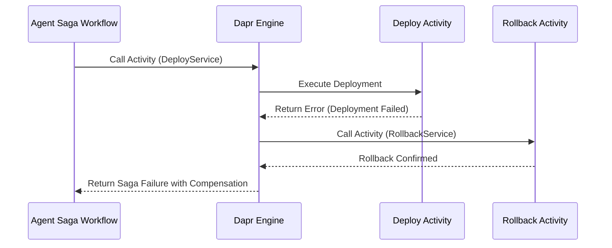

> **Answer-first:** Dapr Workflows orchestrate long-running Go agent tasks by decoupling client HTTP connections from background execution. By isolating LLM and tool calls inside idempotent activities and using composite idempotency keys, replay-based durable orchestration recovers execution state after pod crashes without repeating completed side effects.

As multi-agent architectures evolve past single-turn API wrappers, enterprise workloads are shifting toward long-running autonomous workflows. Building on the [Agentic System Architecture](/series/agentic-system-architecture/) series and recent analyses of [modular monoliths for AI agents](/radar/2026-07/) and [zero-trust AI swarms](/radar/2026-07/), platform teams now face the execution-durability problem: a task may combine multi-step reasoning, external tools, and human approvals over several minutes.

This radar focuses on the production boundary between an agent request and a durable business workflow. For a full Go implementation of compensation activities, see the [Dapr Workflow Saga tutorial](/posts/dapr-workflow-saga-orchestration-guide/). For a workflow-engine comparison and determinism constraints, see the [Temporal orchestrated Saga guide](/posts/temporal-saga-pattern-golang-distributed-transactions-guide/).

## 1. The Dangling Agent Execution Problem

**Answer-first:** Multi-minute agent tasks bound to synchronous HTTP/gRPC connections create dangling executions when clients disconnect or pods restart. Returning an immediate `202 Accepted` with a workflow ID detaches request ownership from background task duration.

A synchronous HTTP or gRPC request is a poor ownership model for a multi-minute task. A client can disconnect, an ingress timeout can expire, or a pod can be evicted while external tools are still running. The platform must distinguish a lost client connection from the lifecycle of the underlying business command.

Typical failure modes include:

- **Unpredictable latency:** browsing, retrieval, code generation, validation, and approval steps can take seconds or minutes rather than the milliseconds expected by a normal API request.
- **Duplicate side effects:** a caller retries after a timeout while the original tool call is still in flight, potentially creating two tickets, two cloud resources, or two payment attempts.
- **Lost in-memory state:** a pod restart discards a goroutine's local context unless progress and outputs have been persisted outside the process.

> [!IMPORTANT]
> A durable workflow does not make an agent safe by itself. Authorization, input validation, retry budgets, tool allowlists, and audit logging remain separate responsibilities.

## 2. What Dapr Workflows Actually Makes Durable

**Answer-first:** Dapr Workflows make orchestrations durable by persisting activity execution logs to state stores (Redis/PostgreSQL). Replaying history rebuilds decision state without re-invoking completed activities.

Dapr Workflows uses replay-based durable orchestration. The application hosts a workflow worker, while Dapr runtime services and a configured Dapr state-store component persist orchestration history and coordinate execution. A PostgreSQL or Redis state store is configured through Dapr; application code does not use GORM as the workflow persistence mechanism.

On recovery, the runtime replays orchestration history to rebuild the orchestrator's decision state. A completed activity returns its recorded result instead of being invoked again. An activity that had not completed can be retried, so external LLM calls and tools still require application-level idempotency and persisted result handling.

This is also why orchestrator code must remain deterministic. Put network I/O, model invocation, database writes, and non-deterministic calls inside activities. Keep the orchestrator focused on ordered decisions, waits, retries, and compensation.

Dapr Actors solve a different problem: single-key coordination for an entity or an agent's state. Use an Actor when one identity needs serialized state changes; use a Workflow when a process spans ordered steps, timers, retries, approvals, and compensations. They can be combined, but one is not the implementation detail of the other.

## 3. Idempotent Tool Dispatch and Explicit Compensation

**Answer-first:** Idempotent tool dispatch requires application-owned composite keys derived from `instanceID-commandID-activityName` to prevent duplicate API side effects during retry loops, accompanied by explicit reverse-order compensation activities.

Agentic tool calls are distributed side effects, not pure functions. An agent that provisions infrastructure, changes a CRM record, or initiates a payment must make the same business command safe under retries.

Derive an application-owned idempotency key from the workflow instance ID, business command ID, and activity name. Persist that key with the downstream effect, and return the prior result when the same command is delivered again. Do not assume a framework-provided `InstanceID + StepID` token automatically protects every dependency.

Compensation is similarly explicit business logic. If provisioning succeeds but deployment fails, invoke a de-provisioning activity in reverse order; if compensation fails, surface an operationally actionable incident rather than silently retrying forever.

The Go snippet below demonstrates how a Dapr Workflow orchestrates service deployment and executes explicit backward compensation if an activity fails.

```go
func ExecuteDeploymentSaga(ctx *workflow.WorkflowContext, input DeploymentInput) (*DeploymentResult, error) {
	var result DeploymentResult
	if err := ctx.CallActivity(DeployService, workflow.ActivityInput(input)).Await(&result); err != nil {
		var compensationResult DeprovisionResult
		compensationErr := ctx.CallActivity(
			DeprovisionDatabase,
			workflow.ActivityInput(input),
		).Await(&compensationResult)
		if compensationErr != nil {
			return nil, fmt.Errorf("deploy failed: %v; compensation failed: %w", err, compensationErr)
		}
		return nil, err
	}
	return &result, nil
}
```

The snippet illustrates the ownership boundary: the orchestrator decides *which* compensation is required, while each activity owns the idempotent API call and its durable business record.

## 4. A Go Service Boundary for Long-Running Agent Work

**Answer-first:** A clean Go service boundary isolates Dapr SDK activity adapters in `data`, exposes pure Go workflow functions in `biz`, and uses `api` handlers to return `202 Accepted` status with workflow tracking endpoints.

For a Go service, expose an API that accepts a validated command and returns a workflow identifier rather than holding an HTTP connection open. The client can then poll a status endpoint or consume server-sent events while the workflow progresses.

A clean separation looks like this:

| Layer | Responsibility |
|---|---|
| `api` | Authenticate the caller, validate the command, start the workflow, and return `202 Accepted` plus a workflow ID. |
| `biz` | Define the workflow decision rules, activity interfaces, retry policy, and compensation order. |
| `data` | Implement idempotent activity adapters for LLM providers, databases, and external tools. |
| Dapr runtime | Coordinate workflow execution and durable history through the configured components. |

For teams using Kratos and Wire, keep the Dapr client and activity adapters in the data/infrastructure boundary; inject business interfaces into the transport layer. This avoids coupling HTTP handlers to sidecar-specific details and keeps activity behavior testable.

## 5. Decision Guide: Workflow, Actor, or Dedicated Engine?

**Answer-first:** Use standard HTTP/gRPC for fast read-only queries, Dapr Virtual Actors for single-entity state coordination, and Dapr Workflows when multi-step processes require replay history, retries, and compensation.

| Requirement | Best starting point | Why |
|---|---|---|
| A chat response that finishes in seconds | HTTP/gRPC request | No durable process is needed. |
| A multi-step agent task with waits and retries | Dapr Workflow | The process needs persisted orchestration history. |
| State coordination for one agent, cart, or entity key | Dapr Actor | One identity needs serialized state mutation. |
| Complex cross-domain workflows with a dedicated platform team | Evaluate Temporal or another workflow engine | Operational and ecosystem requirements may justify a dedicated engine. |

Choose the smallest durable mechanism that fits the business failure mode. Workflow durability cannot replace a permission model, and an Actor cannot automatically compensate a multi-service process.

## References

**Answer-first:** Official documentation links, release notes, and technical references supporting this architecture guide.

- [Dapr Workflow overview](https://docs.dapr.io/developing-applications/building-blocks/workflow/workflow-overview/)
- [Dapr Workflow features and concepts](https://docs.dapr.io/developing-applications/building-blocks/workflow/workflow-features-concepts/)
- [Saga pattern](https://microservices.io/patterns/data/saga.html)
- [OWASP Top 10 for LLM Applications](https://genai.owasp.org/llm-top-10/)

## Architecture & Component Sequence Flow

The sequence diagram below details the interaction flow between the agent saga, the Dapr engine, and compensation activities during a deployment failure.


```mermaid
sequenceDiagram
    participant Agent as Agent Saga Workflow
    participant Sidecar as Dapr Engine
    participant Activity as Deploy Activity
    participant Compensate as Rollback Activity

    Agent->>Sidecar: Call Activity (DeployService)
    Sidecar->>Activity: Execute Deployment
    Activity-->>Sidecar: Return Error (Deployment Failed)
    Sidecar->>Compensate: Call Activity (RollbackService)
    Compensate-->>Sidecar: Rollback Confirmed
    Sidecar-->>Agent: Return Saga Failure with Compensation
```

### Technical Deep-Dive & Architecture Trade-offs

Decoupling long-running agentic tasks from HTTP connections into Dapr Workflows eliminates connection timeouts, but requires careful state management. Applications must ensure activity idempotency to prevent duplicate operations when Dapr replays workflow steps. Additionally, when activities interact with external third-party services, error handling strategies must distinguish transient network blips from permanent failure states to avoid triggering unnecessary compensating transactions.

### Related Tech Radar & Pillar Articles

- [Kubernetes In-Place Pod Resizing Guide](/posts/kubernetes-in-place-pod-resizing-guide/)
- [Go 1.26: Green Tea GC & Performance Guide](/posts/go-126-green-tea-gc-cgo-performance-guide/)
- [Go Microservices Architecture: Complete Production Guide](/posts/go-microservices/)

## Frequently Asked Questions (FAQ)

#### Q1: How does Dapr Workflow solve the "Dangling Agent Execution" problem in microservices?
When long-running multi-step agent tasks are bound to synchronous HTTP requests, client disconnects or gateway timeouts leave background processes orphaned. Dapr Workflows detach task execution from transport connections by returning an immediate `202 Accepted` response with a workflow ID, persisting execution history to a state store so background execution continues reliably.

#### Q2: Why must LLM calls and tool executions be placed inside activities rather than the main workflow function?
Dapr Workflows use replay-based orchestration, re-executing the main workflow function from the beginning to rebuild state after a restart. Placing non-deterministic LLM calls or side-effect-heavy tool invocations inside activities ensures that their output is recorded in the state log, allowing the orchestrator to return cached results during replay without re-calling external APIs.

#### Q3: How do application-owned idempotency keys prevent duplicate side effects during activity retries?
Framework-level workflow IDs do not automatically protect downstream third-party APIs from duplicate operations during network retries. Application code must construct composite idempotency keys combining the workflow instance ID, command ID, and activity name, passing this key to downstream services (such as payment gateways or cloud APIs) to ensure idempotent execution.

#### Q4: Does Dapr Workflow prevent duplicate tool execution automatically across retries?
Completed activity results are replayed from workflow history without re-invoking code, but an activity interrupted in flight will be retried by the workflow engine. Developers must implement application-owned idempotency keys within downstream services to ensure repeated activity executions produce identical side effects.

#### Q5: Should every AI system request be executed inside a Dapr Workflow?
Lightweight read-only interactions and fast chat responses should remain standard synchronous HTTP or gRPC requests to avoid state store overhead. Dapr Workflows should be reserved for complex multi-step tasks requiring long-running state durability, asynchronous human approvals, or multi-service compensating transactions.
