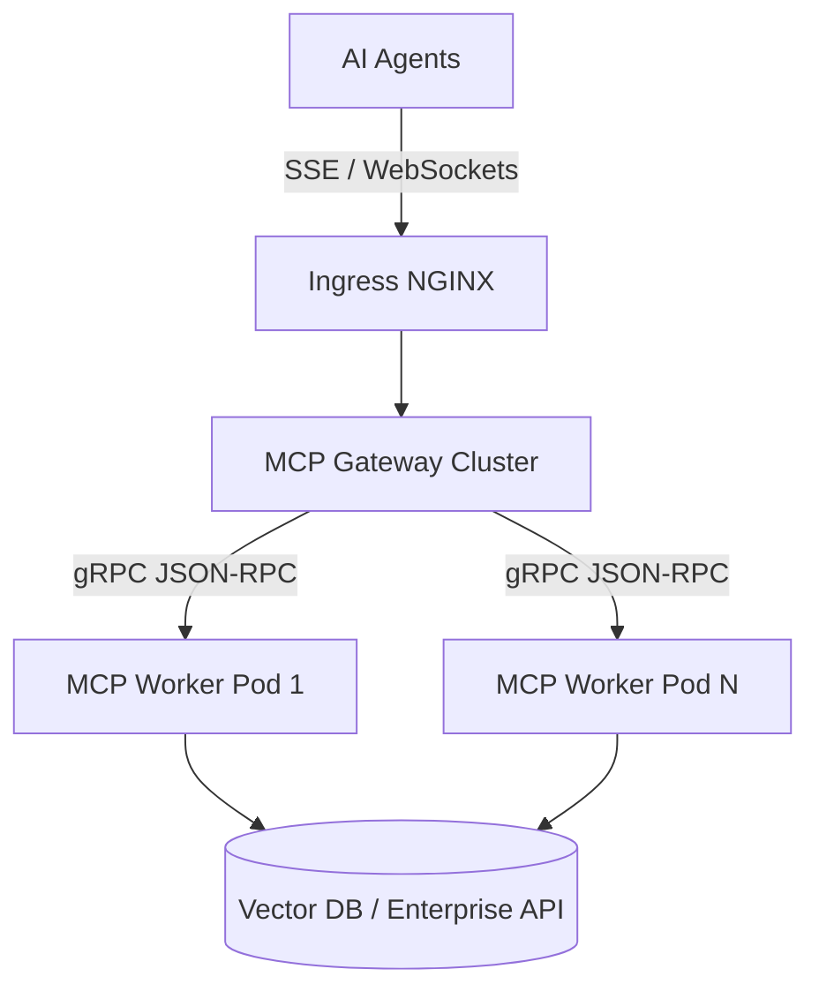

> **Answer-first:** Scaling MCP servers in Kubernetes requires decoupling the JSON-RPC state from persistent connections using websocket gateways, deploying stateless MCP worker replicas with HPA, and utilizing Redis for distributed context caching. This architecture prevents connection exhaustion when hundreds of AI agents query context simultaneously.

The [Model Context Protocol (MCP)](https://modelcontextprotocol.io/specification/latest) has become the de facto standard for exposing enterprise data to AI agents. Its [transport specification](https://modelcontextprotocol.io/specification/2025-06-18/basic/transports) defines stdio and Streamable HTTP (with optional SSE) as the connection models — which is exactly where the Kubernetes scaling friction below originates. However, running a single local MCP server is vastly different from serving thousands of concurrent LLM requests in a distributed microservices environment.

This radar covers production patterns for running high-throughput MCP server fleets on Kubernetes.

## 1. The Persistent Connection Bottleneck

**Answer-first:** Standard MCP implementations rely on persistent stdio or SSE connections, which create stateful bottlenecks in Kubernetes. Load balancers struggle to route long-lived SSE streams evenly, causing uneven pod CPU utilization and hindering autoscaling.

When thousands of AI agents connect to an MCP server cluster, keeping connections open indefinitely exhausts cluster ingress resources. Kubernetes Horizontal Pod Autoscaler (HPA) relies on CPU/Memory metrics, but long-lived idle SSE connections skew these metrics, preventing scale-down operations and wasting compute budget. 

To resolve this, platform teams must abstract the transport layer away from the MCP business logic using dedicated Gateway patterns.

## 2. Decoupled MCP Gateway Architecture

**Answer-first:** A dedicated WebSocket/SSE Gateway handles client connections while routing stateless JSON-RPC over HTTP/gRPC to backend MCP worker pods. This allows independent scaling of the connection layer and the actual context-retrieval compute.

The following architecture diagram illustrates how a Kubernetes ingress routes agent traffic through a stateful Gateway down to stateless MCP worker deployments.

By introducing a Gateway cluster, backend MCP workers remain entirely stateless. If an MCP worker crashes while fetching data, the Gateway can instantly retry the JSON-RPC payload against another healthy worker without breaking the client's SSE connection.

## 3. Distributed Context Caching

**Answer-first:** Identical agent queries for static enterprise context waste database I/O. Implementing semantic caching at the MCP worker layer using Redis drastically reduces retrieval latency and protects downstream APIs from rate limits.

Agentic systems frequently ask repetitive questions during chain-of-thought reasoning. Caching exact MCP tool call payloads in Redis guarantees sub-millisecond responses for repeated context requests. For dynamic data, implementing TTL-based expiration ensures agents do not operate on stale information.

## Frequently Asked Questions

### Q1: Why not just use Kubernetes Service session affinity for MCP?
While session affinity (sticky sessions) routes a client to the same pod, it exacerbates uneven load distribution. A single pod might get stuck serving heavy data-retrieval agents while other pods sit idle. A decoupled gateway with stateless workers ensures round-robin or least-connection routing at the compute level.

### Q2: How does a decoupled gateway handle MCP resource subscriptions?
The gateway maintains a mapping of agent subscriptions in a distributed cache (like Redis). When an MCP worker detects a resource change, it publishes an event to a Redis Pub/Sub channel. The gateway consumes this event and pushes the notification down the corresponding active SSE connection to the agent.

### Q3: What is the recommended Kubernetes HPA metric for MCP workers?
CPU utilization is often a lagging indicator for I/O-bound context retrieval tasks. It is recommended to configure custom metrics based on the number of active JSON-RPC requests in flight per pod (using Prometheus metrics scraped from the workers). This allows HPA to scale out proactively before latency spikes occur.


