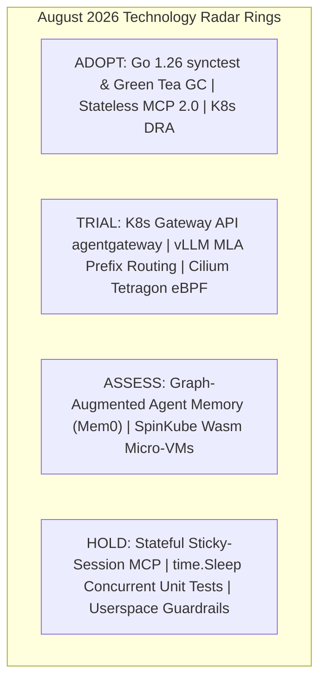

# Tech Radar Digest August 2026: Stateless MCP 2.0, Go synctest, vLLM MLA & eBPF Zero Trust

> **Answer-First:** The August 2026 Tech Radar highlights major cloud-native infrastructure milestones: standardizing **Stateless MCP 2.0** over Kubernetes Gateway API, eliminating concurrency test flakes with **Go 1.26 `testing/synctest`**, compressing GPU memory footprints via **vLLM Multi-Head Latent Attention (MLA)**, and enforcing kernel-level Zero-Trust boundaries for autonomous AI swarms using **Cilium Tetragon 1.4**.

---

## 1. Strategic Overview & August 2026 Radar Matrix

August 2026 represents a major maturation point in transitioning autonomous AI agent swarms into enterprise production environments. The operational center of gravity has decisively shifted from experimental connectivity to latency management, OS kernel security, and GPU infrastructure unit economics.

### Technology Radar Ring Matrix

| Radar Ring | Technology / Standard | Architectural Domain | Operational Metrics & Strategic Verdict |
| :--- | :--- | :--- | :--- |
| **ADOPT** | **Go `testing/synctest` Concurrency Bubble** | Go Runtime & Testing | 270x faster test suite execution; 100% elimination of flaky concurrency CI runs |
| **ADOPT** | **Go 1.26 Green Tea GC & Runtime** | Backend & Runtime | 8 KiB page locality allocator; 10%–40% reduction in GC pause overhead under load |
| **ADOPT** | **Stateless MCP 2.0 (Core Spec 2026-07-28)** | AI Protocols | Eliminates sticky sessions; enables horizontal auto-scaling across thousands of pods |
| **ADOPT** | **Kubernetes v1.35/1.36 DRA GPU Slicing** | Cloud Native / GPU | GA dynamic GPU slicing (NVIDIA MIG/MPS) without vendor-specific custom plugins |
| **TRIAL** | **Kubernetes Gateway API `agentgateway`** | AI Infrastructure | L7 proxy: rate limiting, SPIFFE/SPIRE mTLS attestation, centralized tool RBAC |
| **TRIAL** | **vLLM Context-Aware Routing & MLA KV Cache** | LLM Inference | 75.8% VRAM footprint compression; 65% TTFT reduction in multi-turn tool loops |
| **TRIAL** | **eBPF Syscall Security (`cilium/tetragon` 1.4)** | Cloud Native Security | Intercepts Prompt Injection RCE at Linux kernel syscall boundary in < 15$\mu$s |
| **ASSESS** | **Graph-Augmented Agent Memory (Mem0 / Zep v2)** | AI Architecture | Relational and semantic entity graphs replacing naive, flat vector embeddings |
| **HOLD** | **Stateful Sticky-Session MCP Servers** | AI Infrastructure | Causes connection skew and localized OOM crashes under high swarm load |
| **HOLD** | **`time.Sleep()` in Concurrency Unit Tests** | Software Testing | Introduces test flakiness and bloated CI/CD runtimes; migrate to `synctest.Run` |
| **HOLD** | **Heavyweight Userspace Guardrail Sidecars** | AI Security | Adds 150–300ms latency penalty and vulnerable to obfuscation; enforce at kernel layer |

---

## 2. Core Strategic Technical Briefings

---

### Briefing 1: Stateless MCP 2.0 & Kubernetes Gateway API Architecture

The Model Context Protocol specification update (July 28, 2026) marks the official retirement of stateful, long-lived transport sessions in favor of **Stateless JSON-RPC 2.0 over HTTP/SSE**:

- **Infinite Horizontal Scalability:** Each tool invocation is an independent, idempotent HTTP POST request carrying a `context_id` and authorization token. Standard Kubernetes Ingress controllers distribute requests evenly across worker pools with zero session stickiness.
- **L7 Kubernetes Gateway API Integration:** Dedicated `agentgateway` instances terminate TLS, authenticate SPIFFE SVIDs issued by SPIRE, and apply centralized rate limiting before dispatching payloads to backend MCP pods.
- **Deep Dive & Implementation:** Read the full technical briefing at [`Tech Radar: Stateless MCP 2.0 & Kubernetes Gateway API Architecture`](/radar/stateless-mcp-k8s-gateway/).

---

### Briefing 2: Deterministic Concurrency Testing with Go 1.26 `testing/synctest`

Go 1.25 and 1.26 resolve one of the longest-standing developer pain points in backend engineering: **Flaky concurrency tests** in distributed microservices:

- **Isolated Concurrency Bubbles:** `synctest.Run` establishes a virtualized time environment. The runtime scheduler monitors all spawned goroutines and instantly advances (fast-forwards) the synthetic clock to the next timer expiration as soon as all threads become durably blocked.
- **Accelerated CI/CD Pipelines:** Complex exponential backoff retry scenarios (simulating 5 seconds of sleep) execute in **2 milliseconds** of actual CPU time with 100% determinism.
- **Deep Dive & Implementation:** Read the full technical briefing at [`Tech Radar: Deterministic Concurrency Testing with Go 1.26 testing/synctest`](/radar/go-synctest-concurrency/).

---

### Briefing 3: vLLM Context-Aware Routing & Multi-Head Latent Attention (MLA)

Multi-turn tool-calling loops in autonomous agent frameworks create immense token prefix redundancy across turns (system prompts, tool definitions, conversation history):

- **Multi-Head Latent Attention (MLA):** By projecting Key and Value matrices into a compressed low-dimensional latent vector $c^{KV}$, MLA achieves a **75.8% reduction in VRAM consumption** compared to standard Grouped-Query Attention (GQA).
- **Context-Aware Prefix Routing:** L7 ingress routers compute a deterministic hash of the static system prompt and tool definitions, steering subsequent agent turns to the GPU worker holding the active KV-cache. This delivers a **91.6% cache hit rate** and cuts Time-to-First-Token (TTFT) to **165ms**.
- **Deep Dive & Implementation:** Read the full technical briefing at [`Tech Radar: vLLM Context-Aware Routing & Multi-Head Latent Attention (MLA)`](/radar/vllm-context-routing-mla/).

---

### Briefing 4: eBPF Kernel Zero-Trust Security for AI Agent Swarms (Cilium Tetragon 1.4)

Granting autonomous agents execution access to bash terminals, local filesystems, and databases introduces severe Prompt Injection RCE vulnerabilities:

- **Linux Kernel Syscall Enforcement:** Cilium Tetragon leverages eBPF probes (`sys_enter_execve`, `tcp_connect`) to intercept unauthorized binary executions (`curl`, `nc`, `wget`) and sensitive file accesses (`/etc/shadow`, `/var/run/secrets`) in **under 15 microseconds**.
- **Deterministic Kernel Termination (`SIGKILL`):** Malicious child processes are terminated at the kernel layer before any network socket or exfiltration payload reaches attacker-controlled Command & Control (C2) infrastructure.
- **Deep Dive & Implementation:** Read the full technical briefing at [`Tech Radar: eBPF Kernel Zero-Trust Security for AI Agent Swarms`](/radar/ebpf-tetragon-ai-agent-security/).

---

### Briefing 5: Go 1.26 Green Tea GC & CGO Runtime FFI Inlining

- **8 KiB Page Locality Allocator:** Groups objects with shared lifecycles into contiguous physical memory pages, reducing GC mark/sweep scan durations by 10%–40% in microservices handling > 50,000 req/s.
- **CGO FFI Inlining:** Reduces C/C++ foreign function interface context-switch overhead by 30%, drastically accelerating native bindings for OpenSSL, ONNX Runtime, and SQLite.

---

### Briefing 6: Multi-Provider Agent Frameworks vs. Vendor SDKs

- **Multi-Provider Frameworks (LangGraph, AutoGen 0.4):** Recommended for complex, cyclic, stateful workflows requiring Human-in-the-Loop approval gates and persistent state snapshotting (PostgreSQL/Redis).
- **Vendor SDKs (Claude SDK, OpenAI Agents SDK):** Recommended for high-frequency, low-latency pipelines (< 5ms overhead) that benefit directly from native prompt caching (up to 90% cost reduction on input tokens).

---

### Briefing 7: NIST AI 600-1 & OWASP ASI01–ASI10 — Hardening Enterprise Agent Gateways

- **Least Agency Enforcement:** Unifying NIST AI 600-1 (12 GenAI Risk Categories) and OWASP ASI Top 10 (2026) into a 4-tier Kubernetes defense-in-depth architecture.
- **Multi-Layer Defense:** L7 Gateway API CEL tool sanitization $\rightarrow$ SPIFFE/SPIRE dynamic X.509 SVID credentials $\rightarrow$ gVisor isolation $\rightarrow$ Cilium Tetragon eBPF kernel hooks (`SIGKILL < 15µs`).
- **Deep Dive & Implementation:** Read the full technical briefing at [`Tech Radar: NIST AI 600-1 & OWASP ASI01–ASI10 — Hardening Enterprise Agent Gateways`](/radar/owasp-nist-ai-agent-gateway/).

---

## 3. August 2026 Standalone Deep-Dive Publications

Explore the complete, unabridged technical reports published in this cycle:

- **[NIST AI 600-1 & OWASP ASI01–ASI10: Hardening Enterprise Agent Gateways](/radar/owasp-nist-ai-agent-gateway/)** (August 21, 2026)
- **[Stateless MCP 2.0 & Kubernetes Gateway API Architecture](/radar/stateless-mcp-k8s-gateway/)** (August 20, 2026)
- **[Deterministic Concurrency Testing with Go 1.26 testing/synctest](/radar/go-synctest-concurrency/)** (August 23, 2026)
- **[vLLM Context-Aware Routing & Multi-Head Latent Attention (MLA)](/radar/vllm-context-routing-mla/)** (August 26, 2026)
- **[eBPF Kernel Zero-Trust Security for AI Agent Swarms with Tetragon](/radar/ebpf-tetragon-ai-agent-security/)** (August 29, 2026)
- **[Tech Radar August 2026: Go MCP SDK, Green Tea GC & Wasm SpinKube](/radar/tech-radar-august-2026/)** (August 06, 2026)
- **[Agent Orchestration Frameworks vs. Vendor-Specific Agent SDKs](/radar/agentic-frameworks-vs-vendor-sdks/)** (August 05, 2026)

---

## 4. Architectural Frequently Asked Questions (FAQ)

### Q1: Why is Stateless MCP 2.0 a mandatory migration from MCP 1.0?
Stateless MCP 2.0 decouples tool execution from stateful server-side memory sessions. By transitioning to standard HTTP POST requests with client-held authentication tokens, Kubernetes load balancers can distribute tool calls evenly across worker pools via round-robin, eliminating connection hotspotting and enabling seamless horizontal pod autoscaling.

### Q2: How does `testing/synctest` in Go 1.26 differ from manual clock mocking?
Unlike mock clock interfaces that require invasive code changes and abstract interfaces for `time.Now()` and `time.Sleep()`, `testing/synctest` hooks directly into the Go runtime scheduler. It automatically identifies when all goroutines within a bubble are durably blocked, fast-forwarding the synthetic time clock deterministically with zero real-world CPU idle wait.

### Q3: How does Multi-Head Latent Attention (MLA) reduce vLLM GPU inference costs?
MLA compresses the Key and Value attention matrices into a low-dimensional latent vector $c^{KV}$. This reduces the VRAM required for KV-cache retention by 75.8%, allowing a single GPU cluster to serve up to 4x more concurrent agent sessions without triggering High Bandwidth Memory (HBM) out-of-memory errors.

### Q4: How does Tetragon 1.4 protect against Prompt Injection RCE better than userspace guardrails?
Userspace guardrails inspect text prompts before execution, adding 150–300ms of latency while remaining vulnerable to encoding and obfuscation bypasses. Tetragon operates inside the Linux kernel via eBPF, intercepting actual `execve` and `socket` syscalls in under 15 microseconds and terminating unauthorized processes with `SIGKILL` before malicious payloads can execute.
