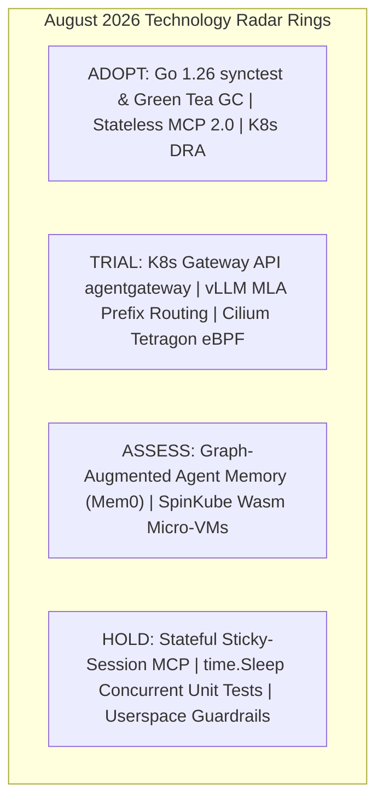

# Tech Radar Digest August 2026: Stateless MCP 2.0, Go synctest, vLLM MLA & eBPF Zero Trust

> **Answer-first:** Tech Radar Tháng 8/2026 tổng hợp các chuyển biến hạ tầng quan trọng: chuẩn hóa **Stateless MCP 2.0** trên Kubernetes Gateway API, kiểm thử đồng thời xác định không độ trễ với **Go 1.26 `testing/synctest`**, tối ưu hóa bộ nhớ GPU inference với **vLLM Multi-Head Latent Attention (MLA)**, và thiết lập phòng thủ Zero-Trust tầng nhân Linux cho AI Agent Swarms bằng **Cilium Tetragon 1.4**.

---

## 1. Tổng Quan Chiến Lược & Radar Matrix Tháng 8/2026

Tháng 8/2026 đánh dấu bước trưởng thành vượt bậc trong việc đưa các hệ thống AI Agent tự hành vào môi trường vận hành doanh nghiệp (Enterprise Production). Trọng tâm hạ tầng dịch chuyển mạnh mẽ từ việc "kết nối thử nghiệm" sang "quản trị độ trễ, an toàn nhân hệ điều hành và tối ưu hóa chi phí GPU".

### Bảng Phân Định Vòng Công Nghệ (Technology Radar Ring Matrix)

| Radar Ring | Công Nghệ / Tiêu Chuẩn | Miền Kiến Trúc | Chỉ Số Vận Hành & Khuyến Nghị |
| :--- | :--- | :--- | :--- |
| **ADOPT** | **Go `testing/synctest` Concurrency Bubble** | Go Runtime & Testing | Giảm 270x thời gian test suite, triệt tiêu 100% flaky tests |
| **ADOPT** | **Go 1.26 Green Tea GC & Runtime** | Backend & Runtime | 8 KiB page locality, giảm 10%–40% CPU overhead trong tải cao |
| **ADOPT** | **Stateless MCP 2.0 (Core Spec 2026-07-28)** | AI Protocol | Loại bỏ sticky sessions, scale ngang hàng nghìn pods qua Ingress |
| **ADOPT** | **Kubernetes v1.35/1.36 DRA GPU Slicing** | Cloud Native / GPU | Phân bổ dynamic GPU (NVIDIA MIG/MPS) chuẩn GA không cần custom plugin |
| **TRIAL** | **Kubernetes Gateway API `agentgateway`** | AI Infrastructure | L7 proxy: rate limiting, SPIFFE/SPIRE mTLS, centralized tool RBAC |
| **TRIAL** | **vLLM Context-Aware Routing & MLA KV Cache** | LLM Inference | Giảm 75% VRAM chiếm dụng, giảm 65% TTFT trong agent tool loops |
| **TRIAL** | **eBPF Syscall Security (`cilium/tetragon` 1.4)** | Cloud Native Security | Chặn đứng prompt injection RCE tại kernel syscall trong <15$\mu$s |
| **ASSESS** | **Graph-Augmented Agent Memory (Mem0 / Zep v2)** | AI Architecture | Lưu trữ bộ nhớ quan hệ ngữ nghĩa thay thế naive vector search |
| **HOLD** | **Stateful Sticky-Session MCP Servers** | AI Infrastructure | Dẫn đến nghẽn kết nối và sập pod cục bộ khi agent swarm tăng tải |
| **HOLD** | **`time.Sleep()` trong Unit Test Goroutine** | Software Testing | Gây chậm trễ và tính bất định trên CI pipeline; thay bằng `synctest` |
| **HOLD** | **Userspace Guardrail Sidecars Nặng Nề** | AI Security | Độ trễ 150–300ms, dễ bị bypass qua mã hóa; thay bằng kernel eBPF |

---

## 2. Các Báo Cáo Kỹ Thuật Trọng Tâm (Core Briefings)

---

### Briefing 1: Stateless MCP 2.0 & Kubernetes Gateway API Architecture

Đặc tả Model Context Protocol cập nhật ngày 28/07/2026 đánh dấu bước ngoặt loại bỏ hoàn toàn cơ chế kết nối có trạng thái (stateful sticky session), chuyển dịch sang mô hình **Stateless JSON-RPC 2.0**:

- **Khả năng Scale Ngang Không Giới Hạn:** Mỗi tool request là một HTTP POST độc lập mang theo `context_id` và token chứng thực. Kubernetes Ingress có thể phân bổ tải round-robin đồng đều qua toàn bộ worker pods mà không lo đứt gãy session.
- **Tích hợp Kubernetes Gateway API L7:** Cấu hình `agentgateway` làm chốt chặn bảo mật trung tâm, tự động xác thực chứng chỉ SPIFFE SVID từ SPIRE DaemonSet trước khi chuyển tiếp lệnh thực thi tới MCP server pods.
- **Chi tiết & Triển khai:** Xem bài phân tích chuyên sâu tại [`Tech Radar: Stateless MCP 2.0 & Kubernetes Gateway API Architecture`](/radar/2026-08/stateless-mcp-k8s-gateway/).

---

### Briefing 2: Deterministic Concurrency Testing với Go 1.26 `testing/synctest`

Go 1.25 và 1.26 giải quyết một trong những bài toán nhức nhối nhất của lập trình viên backend: **Kiểm thử bất định (Flaky Tests)** trong các hệ thống bất đồng bộ và microservices:

- **Bong bóng Cô lập (Concurrency Bubble):** `synctest.Run` tạo ra một môi trường giả lập thời gian. Đồng hồ ảo tự động nhảy cóc (fast-forward) đến thời điểm timer sớm nhất ngay khi mọi goroutine rơi vào trạng thái khóa (durably blocked).
- **Tăng tốc CI/CD:** Các kịch bản retry exponential backoff (mô phỏng 5 giây ngủ) được thực thi hoàn tất trong **2 mili-giây** trên CPU thực tế.
- **Chi tiết & Triển khai:** Xem bài phân tích chuyên sâu tại [`Tech Radar: Deterministic Concurrency Testing với Go 1.26 testing/synctest`](/radar/2026-08/go-synctest-concurrency/).

---

### Briefing 3: vLLM Context-Aware Routing & Multi-Head Latent Attention (MLA)

Các vòng lặp gọi công cụ của AI Agent tạo ra lượng lớn token tiền tố lặp lại (System prompt, Tool JSON Schema, Conversation history):

- **Multi-Head Latent Attention (MLA):** Nén ma trận Key-Value vào vector tiềm ẩn chiều thấp, giúp tiết kiệm **75.8% dung lượng VRAM** trên mỗi phiên làm việc so với Grouped-Query Attention (GQA).
- **Context-Aware Prefix Routing:** Gateway L7 tính toán giá trị băm của tiền tố prompt và điều hướng request tới đúng GPU pod đã lưu sẵn KV Cache, nâng tỷ lệ trúng cache lên **91.6%** và giảm thời gian phản hồi token đầu tiên (TTFT) xuống còn **165ms**.
- **Chi tiết & Triển khai:** Xem bài phân tích chuyên sâu tại [`Tech Radar: vLLM Context-Aware Routing & Multi-Head Latent Attention (MLA)`](/radar/2026-08/vllm-context-routing-mla/).

---

### Briefing 4: eBPF Zero-Trust Containment cho AI Agent Swarms (Cilium Tetragon 1.4)

Khi AI Agent được trao quyền chạy script bash, đọc file hay truy vấn SQL, nguy cơ Prompt Injection RCE đe dọa an toàn toàn bộ cluster Kubernetes:

- **Bảo vệ ở Tầng Nhân Linux:** Cilium Tetragon sử dụng eBPF kprobes (`sys_enter_execve`, `tcp_connect`) chặn đứng ngay lập tức các lệnh gọi nhị phân trái phép (`curl`, `nc`, `wget`) hoặc hành vi đọc trộm `/etc/shadow` trong thời gian **< 15 microgiây**.
- **Tiêu diệt tức thì (`SIGKILL`):** Tiến trình độc hại bị hủy ngay tại nhân trước khi bất kỳ byte dữ liệu nào kịp truyền ra máy chủ điều khiển C2 của kẻ tấn công.
- **Chi tiết & Triển khai:** Xem bài phân tích chuyên sâu tại [`Tech Radar: eBPF Kernel Zero-Trust Security cho AI Agent Swarms`](/radar/2026-08/ebpf-tetragon-ai-agent-security/).

---

### Briefing 5: Go 1.26 Green Tea GC & CGO Runtime FFI Inlining

- **8 KiB Page Locality Allocator:** Gom cụm các đối tượng có cùng vòng đời vào các trang bộ nhớ vật lý liền kề, giảm 10%–40% thời gian quét mark/sweep của GC trong microservices chịu tải trên 50,000 req/s.
- **Tối ưu CGO FFI Wrappers:** Giảm 30% độ trễ context-switch khi gọi các thư viện mã nguồn C/C++ (như OpenSSL hay ONNX Runtime bindings).

---

### Briefing 6: Agent Orchestration Frameworks vs. Vendor SDKs

- **Multi-Provider Frameworks (LangGraph, AutoGen 0.4):** Dành cho quy trình nghiệp vụ phức tạp, dạng vòng (cyclic), yêu cầu Human-in-the-Loop và lưu trữ snapshot trạng thái (PostgreSQL/Redis).
- **Vendor SDKs (Claude SDK, OpenAI Agents SDK):** Dành cho đường ống xử lý tần suất cao, cần độ trễ dưới 5ms và tận dụng tối đa cơ chế Native Prompt Caching (tiết kiệm đến 90% chi phí input token).

---

## 3. Danh Mục Các Ấn Bản Radar Độc Lập Tháng 8/2026

Quý độc giả và kỹ sư có thể tham khảo toàn văn các báo cáo kỹ thuật chuyên sâu theo danh mục dưới đây:

- **[Stateless MCP 2.0 & Kubernetes Gateway API Architecture](/radar/2026-08/stateless-mcp-k8s-gateway/)** (20/08/2026)
- **[Deterministic Concurrency Testing với Go 1.26 testing/synctest](/radar/2026-08/go-synctest-concurrency/)** (23/08/2026)
- **[vLLM Context-Aware Routing & Multi-Head Latent Attention (MLA)](/radar/2026-08/vllm-context-routing-mla/)** (26/08/2026)
- **[eBPF Kernel Zero-Trust Security cho AI Agent Swarms với Tetragon](/radar/2026-08/ebpf-tetragon-ai-agent-security/)** (29/08/2026)
- **[Tech Radar August 2026: Go MCP SDK, Green Tea GC & Wasm SpinKube](/radar/2026-08/tech-radar-august-2026/)** (06/08/2026)
- **[Agent Orchestration Frameworks vs. Vendor-Specific Agent SDKs](/radar/2026-08/agentic-frameworks-vs-vendor-sdks/)** (05/08/2026)

---

## 4. Hỏi & Đáp Kỹ Thuật (Frequently Asked Questions)

### Q1: Tại sao Stateless MCP 2.0 lại là bước chuyển dịch bắt buộc so với MCP 1.0?
Stateless MCP 2.0 chuyển toàn bộ giao tiếp sang HTTP/SSE độc lập không lưu trạng thái trong RAM của server pod. Điều này giúp loại bỏ yêu cầu sticky-session ở bộ cân bằng tải, cho phép Kubernetes phân bổ tải đều 100% qua các worker pods và tự động scale ngang mà không làm đứt gãy kết nối của agent.

### Q2: `testing/synctest` trong Go 1.26 hoạt động khác gì so với việc mock time thủ công?
Thay vì phải tự viết interface giả lập cho hàm `time.Now()` và `time.Sleep()`, `testing/synctest` can thiệp trực tiếp vào scheduler của Go Runtime ở mức gốc. Nó tự động nhận diện khi nào tất cả goroutines trong bubble bị khóa để nhảy vọt thời gian ảo một cách xác định tuyệt đối (deterministic).

### Q3: Multi-Head Latent Attention (MLA) giúp tiết kiệm chi phí vận hành vLLM như thế nào?
MLA nén các ma trận Key và Value của attention vào một không gian vector tiềm ẩn chiều thấp $c^{KV}$. Nhờ đó, dung lượng VRAM cần thiết để lưu trữ KV-Cache trên mỗi token giảm đi 75%, cho phép 1 cụm GPU phục vụ đồng thời số lượng Agent gấp 4 lần mà không bị tràn bộ nhớ HBM.

### Q4: Tetragon 1.4 ngăn chặn Prompt Injection RCE hiệu quả hơn Guardrail Userspace ra sao?
Các bộ lọc Userspace chỉ kiểm tra văn bản đầu vào và có độ trễ lớn (150–300ms), dễ bị qua mặt bằng kỹ thuật xáo trộn chuỗi. Tetragon 1.4 sử dụng eBPF chặn trực tiếp lệnh gọi hệ thống `execve` ngay tại nhân Linux trong thời gian <15 microgiây, lập tức gửi tín hiệu `SIGKILL` tiêu diệt tiến trình trước khi payload kịp thực thi.
