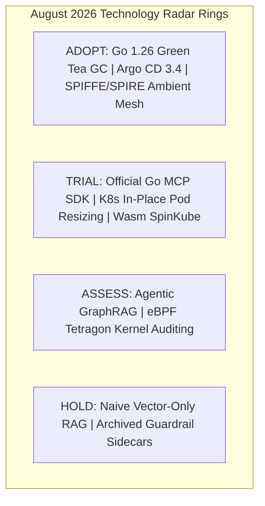

> **Answer-first:** The August 2026 Tech Radar Digest aggregates engineering briefings on the standardization of the Model Context Protocol (MCP) in Go, runtime memory allocator leaps with Go 1.26 Green Tea GC, WebAssembly Micro-VM isolation with SpinKube, and the architectural divide between Multi-Provider Agent Frameworks (LangGraph, AutoGen) and Vendor-Specific SDKs (Claude, OpenAI).

---

## Executive Overview — Tech Radar Digest — August 2026

August 2026 marks a pivotal maturation phase across enterprise AI systems engineering and cloud-native infrastructure:

1. **AI Protocol Standardization:** The Model Context Protocol (MCP) has graduated to enterprise-grade Go with the release of the official `modelcontextprotocol/go-sdk`, establishing standard JSON-RPC 2.0 stdio and SSE transports for tool invocation.
2. **Go 1.26 Memory Allocator Evolution:** The Green Tea GC introduces 8 KiB page locality scanning, reducing GC CPU overhead by 10% to 40% under 50k+ RPS microservice loads.
3. **Container-to-Wasm Migration:** SpinKube and WASI 0.3.0 enable sub-millisecond cold starts (<1ms) and 90% memory footprint reductions compared to traditional Python Docker containers.
4. **Agent Orchestration Dilemma:** Teams are navigating the trade-offs between cyclic multi-provider graph orchestrators (LangGraph) and zero-overhead vendor SDKs (Claude SDK with 90% prompt caching savings).

---

## Tech Radar Ring Matrix (August 2026)

| Ring | Technology / Standard | Category | Key Operational Metrics |
| :--- | :--- | :--- | :--- |
| **ADOPT** | **Go 1.26 Green Tea GC & Runtime** | Language & Runtime | 8 KiB page locality, -10% to 40% GC CPU, -30% CGO FFI latency |
| **ADOPT** | **Argo CD v3.4 / v3.3 GitOps Upgrades** | Cloud Native / CD | PreDelete hooks, OIDC background refresh, -30% controller CPU |
| **ADOPT** | **SPIFFE/SPIRE + Istio Ambient Mesh** | Security / Mesh | L4 ztunnel, PSAT node attestation, automated mTLS rotation |
| **TRIAL** | **Official Go MCP SDK (`modelcontextprotocol/go-sdk`)** | AI Protocol | Core Spec 2026-07-28, JSON-RPC 2.0 / SSE / Stdio transport |
| **TRIAL** | **K8s v1.35 In-Place Pod Resizing & DRA** | Cloud Native / K8s | CPU/RAM scaling without Pod restarts, Dynamic Resource Allocation |
| **TRIAL** | **Wasm Micro-VMs (`spinkube/spinkube`)** | Serverless / Runtime | WASI 0.3.0, <1ms cold start, -90% memory vs container |
| **ASSESS** | **Agentic GraphRAG (PropertyGraph / LazyGraphRAG)** | AI Architecture | +10% to 13% accuracy on multi-hop entity reasoning |
| **ASSESS** | **eBPF Kernel Security (`cilium/tetragon`)** | Security / eBPF | Real-time syscall filtering, kernel-level container boundary isolation |
| **HOLD** | **Naive Vector-Only RAG** | AI Architecture | Context window exhaustion, severe loss of multi-hop relational context |
| **HOLD** | **Archived Guardrail Sidecars (`protectai/llm-guard`)** | AI Security | EOL July 2026; 150ms+ latency penalty, migrate to native gateway proxies |

---

## Core Briefing 1: Agent Orchestration Frameworks vs. Vendor SDKs

Enterprise architectures deploying LLM agents must choose between two distinct operational paradigms:

1. **Multi-Provider Frameworks (LangGraph, AutoGen 0.4, CrewAI):**
   - **Best for:** Stateful, cyclic workflows requiring Human-in-the-Loop (HITL) checkpoints, deterministic state snapshotting (PostgreSQL/Redis), and vendor fallback.
   - **Trade-off:** Adds 1ms–5ms abstraction overhead per step.
2. **Vendor-Specific SDKs (Claude SDK, OpenAI Agents SDK, Google ADK):**
   - **Best for:** High-frequency, latency-critical pipelines requiring native ephemeral prompt caching (saving up to 90% in token costs) and direct model feature support (Claude Computer Use, Gemini 2M context).
   - **Trade-off:** High vendor lock-in; requires manual routing for multi-model failover.

---

## Core Briefing 2: Official Go MCP SDK & Microservice Tool Ingestion

With the formal release of `modelcontextprotocol/go-sdk`, backend engineering teams can now embed Model Context Protocol servers natively inside Go microservices without CGO or external Python wrappers:

- **Transport Versatility:** Supports both local `stdio` (for sub-millisecond local process pipes) and remote `SSE` (Server-Sent Events over HTTP/2) transports.
- **Strict Schema Enforcement:** Automatic reflection and validation of Go structs into JSON-RPC 2.0 tool definitions.
- **Zero-Trust Identity Binding:** Seamlessly integrates with SPIFFE SVID certificates issued via SPIRE DaemonSets.

---

## Core Briefing 3: Go 1.26 Green Tea GC & Zero-Allocation Engineering

The Go 1.26 release tackles large-heap garbage collection overhead in high-throughput microservices:

- **8 KiB Page Locality Allocator:** Groups objects with similar lifecycles into contiguous physical memory pages, slashing mark/sweep scanning time by up to 40%.
- **FFI Assembly Inlining:** Reduces CGO context-switch penalties by 30%, making native C/C++ crypto and ONNX runtime bindings dramatically more cost-effective.

---

## Individual Radar Entries in This Digest

Explore the full standalone technical briefings published in August 2026:

- **[Agent Orchestration Frameworks vs. Vendor-Specific Agent SDKs](/radar/2026-08/agentic-frameworks-vs-vendor-sdks/)** (August 05, 2026)
- **[Tech Radar August 2026: Go MCP SDK, Go 1.26 Green Tea GC & Wasm SpinKube](/radar/2026-08/tech-radar-august-2026/)** (August 06, 2026)
- **[CVRP, VRPTW, and ALNS Fleet Optimization Architecture in Golang](/posts/cvrp-vrptw-alns-fleet-optimization-golang-architecture/)** (August 15, 2026)

---

## Frequently Asked Questions (FAQ)

#### Q1: What makes the Official Go MCP SDK superior to Python-based MCP servers in production?
The Go MCP SDK compiles to static binaries with zero runtime dependencies, operates with a memory footprint under 20 MB, and handles thousands of concurrent JSON-RPC tool calls via lightweight goroutines without GIL (Global Interpreter Lock) contention.

#### Q2: When should engineering teams transition from Docker containers to SpinKube Wasm micro-VMs?
SpinKube is optimal for event-driven, short-lived tasks (such as AI tool execution, webhooks, and function-calling endpoints) where sub-millisecond cold start times (<1ms) and dense multi-tenant bin-packing are critical to reducing Kubernetes cluster compute costs.

#### Q3: How does Go 1.26 Green Tea GC benefit high-concurrency microservices?
Green Tea GC optimizes memory allocation by clustering objects into 8 KiB page locality blocks, which minimizes CPU cache line misses and cuts garbage collection mark-phase CPU utilization by 10% to 40% under sustained 50,000+ RPS workloads.
