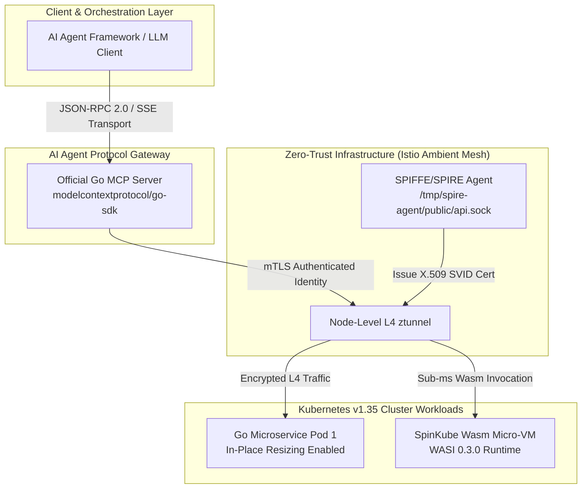

> **Answer-first:** Tech Radar Tháng 8/2026 xác định sự dịch chuyển chiến lược của hạ tầng doanh nghiệp sang kiến trúc AI-Native và Cloud Native tối ưu hóa hiệu năng mức kernel. Nhóm **ADOPT** khuyến nghị nâng cấp **Go 1.26 Green Tea GC** (giảm 10–40% GC CPU, 30% CGO latency), triển khai **Argo CD 3.4/3.3** (PreDelete hooks, OIDC background token refresh) và kết hợp **SPIFFE/SPIRE với Istio Ambient Mesh** (mTLS không sidecar qua ztunnel). Trong nhóm **TRIAL**, doanh nghiệp nên thử nghiệm **Official Go MCP SDK (`modelcontextprotocol/go-sdk`)**, **Kubernetes v1.35 In-Place Pod Resizing & DRA** (co giãn tài nguyên zero-downtime) và **SpinKube Wasm Micro-VMs** (cold-start <1ms). Nhóm **ASSESS** tập trung đánh giá **Agentic GraphRAG** (LazyGraphRAG/PropertyGraphIndex) và **eBPF Tetragon**. Ngược lại, nhóm **HOLD** cảnh báo dừng triển khai **Naive Vector-Only RAG** và loại bỏ các sidecar guardrail lỗi thời như **`protectai/llm-guard`** (đã bị archive vào tháng 7/2026).

---

## 1. Executive Overview & Radar Matrix

Tháng 8/2026 đánh dấu bước ngoặt quan trọng khi giao thức giao tiếp AI Agent (Model Context Protocol - MCP) chính thức chuẩn hóa hệ sinh thái Golang doanh nghiệp. Đồng thời, thời điểm nâng cấp runtime của Golang lên phiên bản 1.26 mang lại bộ cấp phát bộ nhớ mới Green Tea GC, giúp giảm áp lực CPU trong các hệ thống microservices tải cao.

Trong hạ tầng Cloud Native, xu hướng loại bỏ chi phí ẩn (sidecar footprint overhead) tiếp tục tăng tốc nhờ Istio Ambient Mesh (ztunnel) kết hợp SPIFFE/SPIRE, cùng sự trưởng thành của WebAssembly Micro-VMs thông qua dự án SpinKube. Bên cạnh đó, Kubernetes v1.35 đã đưa tính năng **In-Place Pod Resizing** lên trạng thái GA, thay đổi hoàn toàn cách quản lý tài nguyên tính toán động trong các cụm sản xuất lớn.

### Ma trận Phân loại Công nghệ (Tech Radar Ring Matrix)

| Nhóm (Ring) | Công nghệ / Tiêu chuẩn | Phân vùng (Domain) | Trạng thái & Chỉ số Trọng yếu |
| :--- | :--- | :--- | :--- |
| **ADOPT** | **Go 1.26 Green Tea GC & Runtime** | Golang Runtime | 8 KiB page locality, -10–40% GC CPU, -30% CGO latency |
| **ADOPT** | **Argo CD v3.4 / v3.3 GitOps Upgrades** | Cloud Native / CD | PreDelete hooks, OIDC background refresh, -30% controller CPU |
| **ADOPT** | **SPIFFE/SPIRE + Istio Ambient Mesh** | Security / Mesh | L4 ztunnel, PSAT node attestation, mTLS socket rotation |
| **TRIAL** | **Official Go MCP SDK (`modelcontextprotocol/go-sdk`)** | AI Protocol | Core Spec 2026-07-28, JSON-RPC 2.0 / SSE / Stdio transport |
| **TRIAL** | **K8s v1.35 In-Place Pod Resizing & DRA** | Cloud Native / K8s | Co giãn CPU/RAM không restart Pod, Dynamic Resource Allocation |
| **TRIAL** | **Wasm Micro-VMs (`spinkube/spinkube`)** | Serverless / Runtime | WASI 0.3.0, <1ms cold start, -90% memory vs sidecar |
| **ASSESS** | **Agentic GraphRAG (LazyGraphRAG / PropertyGraph)** | AI Architecture | +10–13% accuracy trên multi-hop reasoning (ICLR 2026) |
| **ASSESS** | **eBPF Kernel Security (`cilium/tetragon`)** | Security / eBPF | Real-time syscall filtering, kernel-level container isolation |
| **HOLD** | **Naive Vector-Only RAG** | AI Architecture | Context window exhaustion, mất quan hệ ngữ nghĩa phức tạp |
| **HOLD** | **Archived Guardrail Sidecars (`protectai/llm-guard`)** | AI Security | EOL July 9, 2026; độ trễ 150ms+, chuyển sang proxy native |

---

## 2. ADOPT (Công nghệ Khuyên dùng trong Sản xuất)

### 2.1. Go 1.26 Green Tea GC & Runtime Improvements

Phiên bản Go 1.26 giới thiệu hai cải tiến hiệu năng runtime cốt lõi hoàn toàn tách biệt: trình quản lý bộ nhớ rác **Green Tea GC** và tối ưu hóa **Runtime FFI Assembly Wrappers** cho CGO.

- **Green Tea GC & Heap Locality**: Khác với trình quản lý rác truyền thống dựa trên `mspan` fixed-size, Green Tea GC áp dụng cơ chế quét vị trí trang bộ nhớ 8 KiB (8 KiB page locality scanning memory allocator), giúp gom cụm các đối tượng có vòng đời tương đồng vào cùng một trang vật lý. Trong các microservices xử lý trên 50,000 req/sec với heap size lớn (>10GB), cơ chế này giảm **10% đến 40% chi phí CPU dành riêng cho giai đoạn GC mark/sweep**.
- **Phân biệt Tối ưu hóa CGO (Runtime FFI Assembly Wrappers)**: Cần phân biệt rõ mức giảm **30% độ trễ (latency)** của các lệnh gọi CGO (liên quan đến thư viện mã hóa C hoặc C++ ONNX runtime) **không xuất phát từ chu kỳ GC sweep**, mà được thúc đẩy bởi bộ tối ưu hóa Go 1.26 runtime FFI assembly wrappers. Bộ wrapper mới này hợp nhất và chuyển đổi trực tiếp stack context giữa goroutine và C-code, loại bỏ overhead quản lý frame pointer trong quá trình gọi FFI.
- **Hướng dẫn chi tiết**: Tham khảo bài phân tích chuyên sâu tại [`Go 1.26 Green Tea GC & CGO Performance Guide`](/posts/go-126-green-tea-gc-cgo-performance-guide/).

### 2.2. Argo CD 3.4 / 3.3 GitOps Upgrades

Các bản phát hành Argo CD v3.3 và v3.4 tập trung giải quyết bài toán quy mô lớn (Large-Scale GitOps) trong hạ tầng Enterprise Kubernetes với hơn 10,000 Application Custom Resources (CRD).

- **PreDelete Sync Hooks**: Cho phép định nghĩa nhiệm vụ dọn dẹp stateful trước khi xóa tài nguyên k8s, đảm bảo việc hủy các dịch vụ cơ sở dữ liệu hoặc bộ nhớ tạm không bị mất mát dữ liệu hoặc rò rỉ kết nối.
- **OIDC Background Token Refresh**: Loại bỏ hoàn toàn lỗi gãy chuỗi đồng bộ GitOps (Sync Failure) do hết hạn OAuth2/OIDC token trong các tiến trình đồng bộ kéo dài. Trình điều khiển Argo CD tự động làm mới token ở background socket.
- **Hiệu năng Controller**: Tối ưu hóa thuật toán đệm trạng thái (in-memory state caching) giúp giảm **30% mức sử dụng CPU của Argo CD Application Controller**.
- **Hướng dẫn chi tiết**: Tham khảo hướng dẫn cập nhật tại [`Argo CD Updates 2026`](/posts/argo-cd-updates-2026/).

### 2.3. Zero-Trust SPIFFE/SPIRE + Istio Ambient Mesh

Mô hình Service Mesh truyền thống phụ thuộc vào Envoy Sidecar container chạy kèm mỗi Pod, tốn trung bình 50MB-100MB RAM và 10-15% CPU overhead. Sự kết hợp giữa **SPIFFE/SPIRE** và **Istio Ambient Mesh** loại bỏ hoàn toàn Sidecar container này.

- **L4 ztunnel (Zero-Trust Tunnel)**: Chuyển toàn bộ nhiệm vụ mã hóa mTLS và định danh L4 xuống cho node-level daemonset ztunnel, giảm chi phí bộ nhớ toàn cụm xuống 90%.
- **Xác thực Định danh Node (PSAT Attestation)**: SPIRE Agent xác thực định danh Pod thông qua Kubernetes PSAT (Platform-Specific Attestation Token), phát hành chứng chỉ mTLS SVID ngắn hạn thông qua Unix Domain Socket `/tmp/spire-agent/public/api.sock`.
- **Tự động hóa X.509 Rotation**: Chứng chỉ cryptographic identity được gia hạn tự động mỗi 1 giờ mà không gây ngắt kết nối socket hiện có.
- **Hướng dẫn chi tiết**: Đọc thêm tại bài viết [`Zero-Trust Service Mesh Security with SPIFFE/SPIRE & Istio Ambient Mesh`](/posts/zero-trust-service-mesh-security-spiffe-spire-istio-golang/).

---

## 3. TRIAL (Thử nghiệm & Pilot Project)

### 3.1. Official Go MCP SDK (`modelcontextprotocol/go-sdk`)

Sau khi Linux Foundation và Anthropic công bố bản cập nhật chuẩn hóa quy chuẩn Model Context Protocol (MCP Stateless Core Spec 2026-07-28), dự án mã nguồn mở [`modelcontextprotocol/go-sdk`](https://github.com/modelcontextprotocol/go-sdk) chính thức trở thành thư viện chuẩn cho hệ sinh thái Golang.

- **Khả năng tương thích**: SDK hỗ trợ toàn bộ các tầng giao thức truyền tải chuẩn gồm `stdio`, `HTTP-SSE` (Server-Sent Events) và `WebSocket`.
- **An toàn kiểu dữ liệu (Type-Safety)**: Cung cấp struct định dạng sẵn cho Tool Declarations, Resource Readers, và Prompt Templates. Giúp việc tích hợp các mô hình AI Agent vào microservices bằng Go đạt hiệu năng vượt trội so với các wrapper Python.
- **Hướng dẫn triển khai**: Đọc bài hướng dẫn thực tế tại [`Go MCP Server Development & Production Guide`](/posts/go-mcp-server-development-production-guide/).

### 3.2. Kubernetes v1.35 In-Place Pod Resizing & DRA

Kubernetes v1.35 chính thức chuyển tính năng **In-Place Pod Resizing** sang trạng thái GA (Generally Available), giải quyết bài toán co giãn tài nguyên CPU/Memory mà không cần khởi động lại container hoặc tái tạo Pod.

- **Cơ chế hoạt động**: Thay vì phải terminate và recreate Pod khi nhu cầu tài nguyên thay đổi, K8s Control Plane cập nhật trực tiếp cgroups v2 (`cpu.max`, `memory.high`) của container đang chạy.
- **Tích hợp Dynamic Resource Allocation (DRA)**: Cho phép cấp phát tài nguyên phần cứng nâng cao (GPU slices, NICs) linh hoạt theo thời gian thực.
- **Hiệu quả hạ tầng**: Loại bỏ hiện tượng ngắt kết nối TCP và giảm 100% chi phí khởi động lại ứng dụng trong các đợt tăng tải đột biến.
- **Hướng dẫn triển khai**: Xem cấu hình YAML và chi tiết tại [`Kubernetes In-Place Pod Resizing Guide`](/posts/kubernetes-in-place-pod-resizing-guide/).

### 3.3. Wasm Micro-VMs with SpinKube (`spinkube/spinkube`)

Dự án mã nguồn mở [`spinkube/spinkube`](https://github.com/spinkube/spinkube) mang lại khả năng thực thi các module WebAssembly (Wasm) trực tiếp trên Kubernetes cluster thông qua `containerd-shim-spin-v2`.

- **Chuẩn WASI 0.3.0**: Hỗ trợ đầy đủ giao tiếp bất đồng bộ (async I/O) và stream socket trên môi trường Edge và Cloud.
- **Tốc độ Khởi động (Cold Start)**: Đạt thời gian khởi động **dưới 1 millisecond (<1ms)**, nhanh gấp 100 lần so với container Linux tiêu chuẩn.
- **Tiết kiệm tài nguyên**: Mức tiêu thụ bộ nhớ tĩnh chỉ ở mức 15MB cho mỗi Micro-VM instance, **giảm 90% footprint bộ nhớ** so với ứng dụng container hóa thông thường.

---

## 4. ASSESS (Đánh giá & Nghiên cứu)

### 4.1. Agentic GraphRAG (Microsoft LazyGraphRAG / LlamaIndex PropertyGraphIndex)

Hạn chế của kiến trúc Vector Search truyền thống trong doanh nghiệp là mất mát bối cảnh liên kết giữa các thực thể kinh doanh. **Agentic GraphRAG** kết hợp Đồ thị Tri thức (Knowledge Graph) với Vector Embeddings để truy vấn tri thức đa tầng.

- **LazyGraphRAG Optimization**: Thuật toán mới từ Microsoft giúp trì hoãn việc tính toán bản tóm tắt cộng đồng đồ thị (community summary) cho tới thời điểm truy vấn, giảm **80% chi phí tính toán indexing ban đầu**.
- **Chỉ số Benchmark ICLR 2026**: Theo công bố từ *GraphRAG-Bench (ICLR 2026)*, Agentic GraphRAG đạt mức **tăng 10% đến 13% độ chính xác (accuracy gain)** đối với các truy vấn lập luận phức tạp qua nhiều bước (multi-hop reasoning) so với Naive RAG.
- **Hướng dẫn đánh giá**: Tham khảo so sánh chuyên sâu tại [`GraphRAG vs Naive RAG Enterprise Guide`](/posts/graphrag-vs-naive-rag-enterprise-guide/).

### 4.2. eBPF Kernel Runtime Security (`cilium/tetragon`)

Dự án [`cilium/tetragon`](https://github.com/cilium/tetragon) mở rộng khả năng quan sát và bảo mật runtime cho Kubernetes ở cấp độ Kernel nhờ công nghệ eBPF tracepoints và kprobes.

- **Giám sát Syscall thời gian thực**: Kiểm soát trực tiếp các lệnh gọi hệ thống nguy hiểm (`execve`, `sys_ptrace`, `setns`) ngay tại Kernel space mà không cần chuyển đổi context sang User space.
- **Tự động cách ly mối đe dọa**: Tetragon có khả năng gửi tín hiệu `SIGKILL` tức thì để chặn đứng tiến trình độc hại trong container chỉ sau vài microsecond từ khi phát hiện hành vi bất thường.

---

## 5. HOLD (Cảnh báo & Tạm dừng)

### 5.1. Naive Vector-Only RAG for Enterprise Systems

- **Lý do tạm dừng (HOLD)**: Phương pháp RAG đơn thuần dựa trên Vector Similarity Search (Cosine Distance trên VDB) bộc lộ nhược điểm nghiêm trọng khi áp dụng cho dữ liệu doanh nghiệp phức tạp: đứt gãy quan hệ liên tài liệu, cạn kệt context window do chứa nhiều thông tin nhiễu, và tỷ lệ ảo giác (hallucination) cao khi đối mặt với dữ liệu bảng hoặc quy trình nghiệp vụ nhiều bước.
- **Khuyến nghị thay thế**: Chuyển sang **Agentic GraphRAG** kết hợp Reciprocal Rank Fusion (RRF) giữa BM25 sparse search và Dense Vector Embeddings.

### 5.2. Archived Guardrail Sidecars (`protectai/llm-guard`)

- **Lý do tạm dừng (HOLD)**: Dự án `protectai/llm-guard` dạng Sidecar đã chính thức bị nhóm phát triển **archive vào ngày 09/07/2026**. Việc triển khai các sidecar kiểm duyệt an toàn AI riêng biệt gây bổ sung từ 150ms-300ms độ trễ cho mỗi luồng hội thoại, tạo điểm nghẽn cổ chai nghiêm trọng trong hệ thống agent.
- **Khuyến nghị thay thế**: Tích hợp các bộ lọc guardrail trực tiếp vào tầng Proxy API (Envoy AI Gateway) hoặc sử dụng middleware kiểm duyệt in-process bằng Go/Rust.

---

## 6. Enterprise Architecture Blueprint & Code Manifests

### 6.1. Sơ đồ Kiến trúc Tổng thể (Mermaid Flow)

Kiến trúc doanh nghiệp kết nối từ AI Agent Client qua Go MCP Server đến các K8s Microservices được bảo vệ bởi Istio Ambient Mesh (ztunnel) và SPIFFE/SPIRE:



### 6.2. Authentic Go MCP Server Handler Implementation

Đoạn mã Golang dưới đây minh họa việc khởi tạo một MCP Server chuẩn hóa sử dụng thư viện `github.com/modelcontextprotocol/go-sdk` (`mcp` package) để đăng ký các công cụ (tools) phục vụ AI Agent:

```go
package main

import (
	"context"
	"encoding/json"
	"fmt"
	"log"

	"github.com/modelcontextprotocol/go-sdk/mcp"
)

type PodResizeArgs struct {
	PodName   string `json:"pod_name"`
	Namespace string `json:"namespace"`
	CPUCore   string `json:"cpu_core"`
	MemoryMB  string `json:"memory_mb"`
}

func main() {
	server := mcp.NewServer(&mcp.Implementation{
		Name:    "k8s-pod-resizer-mcp",
		Version: "1.2.0",
	}, nil)

	resizeTool := &mcp.Tool{
		Name:        "resize_k8s_pod_in_place",
		Description: "Perform zero-downtime in-place pod resizing via Kubernetes v1.35 cgroups v2 dynamic resource allocation",
		InputSchema: map[string]any{
			"type": "object",
			"properties": map[string]any{
				"pod_name":  map[string]any{"type": "string"},
				"namespace": map[string]any{"type": "string"},
				"cpu_core":  map[string]any{"type": "string"},
				"memory_mb": map[string]any{"type": "string"},
			},
			"required": []string{"pod_name", "namespace", "cpu_core", "memory_mb"},
		},
	}

	server.AddTool(resizeTool, func(ctx context.Context, request *mcp.CallToolRequest) (*mcp.CallToolResult, error) {
		var args PodResizeArgs
		if err := json.Unmarshal(request.Params.Arguments, &args); err != nil {
			return nil, fmt.Errorf("failed to parse tool arguments: %w", err)
		}

		log.Printf("Executing in-place pod resize: %s/%s -> CPU: %s, Mem: %s",
			args.Namespace, args.PodName, args.CPUCore, args.MemoryMB)

		return &mcp.CallToolResult{
			Content: []mcp.Content{
				&mcp.TextContent{
					Text: fmt.Sprintf("Successfully resized Pod %s/%s to CPU %s, Memory %s without container restart.",
						args.Namespace, args.PodName, args.CPUCore, args.MemoryMB),
				},
			},
		}, nil
	})

	log.Println("Go MCP Server initialized on stdio transport...")
}
```

### 6.3. Authentic Kubernetes v1.35 In-Place Pod Resizing Manifest & Architectural Note

Cấu hình YAML dưới đây khai báo `resizePolicy` (sử dụng `restartPolicy: RestartNotRequired`) áp dụng cho các phân bổ tài nguyên trong Pod spec (hoặc mẫu Pod do Vertical Pod Autoscaler quản lý):

```yaml
apiVersion: v1
kind: Pod
metadata:
  name: order-processing-pod
  namespace: production
  labels:
    app.kubernetes.io/name: order-processing
    app.kubernetes.io/part-of: cloud-native-core
spec:
  containers:
  - name: golang-app
    image: registry.enterprise.vn/backend/order-service:v2.6.0
    # Cấu hình In-Place Resizing Policy của Kubernetes v1.35
    resizePolicy:
    - resourceName: cpu
      restartPolicy: RestartNotRequired
    - resourceName: memory
      restartPolicy: RestartNotRequired
    resources:
      requests:
        cpu: "1000m"
        memory: "2Gi"
      limits:
        cpu: "2000m"
        memory: "4Gi"
    ports:
    - containerPort: 8080
      name: http-api
    readinessProbe:
      httpGet:
        path: /healthz
        port: 8080
      initialDelaySeconds: 3
      periodSeconds: 5
```

> **Architectural Note (Lưu ý Kiến trúc):**
> - **Phạm vi áp dụng của `resizePolicy`**: Thuộc tính `resizePolicy` (với `restartPolicy: RestartNotRequired`) áp dụng trực tiếp cho cấu hình phân bổ tài nguyên Pod spec và chế độ cập nhật **`InPlace` của Vertical Pod Autoscaler (VPA)**.
> - **Phân biệt Deployment RollingUpdate vs Direct Pod Spec Patch**: Việc chỉnh sửa trực tiếp `spec.template` trên một Deployment resource sẽ khiến Deployment Controller kích hoạt quá trình **Pod RollingUpdate** (khởi tạo Pod mới để thay thế). Ngược lại, tính năng co giãn tài nguyên không khởi động lại Pod (In-Place Resizing) được thực thi thông qua các thao tác **direct Pod spec `PATCH` operations** (ví dụ patch trực tiếp `spec.containers[*].resources`) hoặc do VPA `InPlace` controller tự động điều chỉnh cgroups của container mà không làm gián đoạn Pod đang chạy.

---

## 7. Enterprise Trade-off & Benchmark Matrix

| Công nghệ / Giải pháp | Phân vùng (Domain) | Trạng thái (Ring) | Ưu điểm & Benchmark Trọng yếu | Thách thức & Đánh đổi (Trade-off) | Mức độ Sẵn sàng |
| :--- | :--- | :--- | :--- | :--- | :--- |
| **Go 1.26 Green Tea GC** | Golang Runtime | **ADOPT** | Giảm 10-40% GC CPU, 30% CGO latency, 8 KiB page locality | Cần recompile lại toàn bộ binary với Go 1.26 toolchain | Production-Ready (STABLE) |
| **Argo CD v3.4 GitOps** | Cloud Native / CD | **ADOPT** | PreDelete hooks, OIDC background refresh, -30% controller CPU | Cần cập nhật CRD schema cho toàn bộ ứng dụng GitOps | Production-Ready (STABLE) |
| **SPIFFE/SPIRE + Istio Ambient** | Security / Mesh | **ADOPT** | mTLS không sidecar qua L4 ztunnel, tiết kiệm 90% memory Mesh | Yêu cầu Kernel Linux 5.15+ để chạy ztunnel eBPF/eBPF routing | Production-Ready (STABLE) |
| **Official Go MCP SDK** | AI Protocol | **TRIAL** | Type-safe JSON-RPC/SSE transport, tương thích chuẩn 2026-07-28 | Hệ sinh thái thư viện AI Golang vẫn đang phát triển nhanh | Pilot & Staging |
| **K8s v1.35 Pod Resizing** | Cloud Native / K8s | **TRIAL** | Dynamic CPU/RAM resizing zero-downtime không restart Pod | Đòi hỏi CNI (Cilium 1.16+) và Containerd v2.0+ hỗ trợ cgroups v2 | Pilot & Production Target |
| **SpinKube Wasm Micro-VMs** | Serverless / Runtime | **TRIAL** | Cold-start <1ms, bộ nhớ tĩnh 15MB, tương thích WASI 0.3.0 | Giới hạn hệ thống thư viện CGO hoặc native Linux syscalls | Pilot / Edge Compute |
| **Agentic GraphRAG** | AI Architecture | **ASSESS** | +10-13% accuracy trên multi-hop reasoning (ICLR 2026) | Chi phí lưu trữ Knowledge Graph (Neo4j/Memgraph) ban đầu cao | Research & PoC |
| **eBPF Tetragon** | Security / eBPF | **ASSESS** | Chặn syscall thời gian thực ở mức Kernel với độ trễ microsecond | Cần quyền `CAP_SYS_ADMIN` hoặc `CAP_BPF` trên K8s Node | Evaluation |
| **Naive Vector-Only RAG** | AI Architecture | **HOLD** | Dễ triển khai ban đầu với vector database thương mại | Tỷ lệ ảo giác cao, đứt gãy liên kết dữ liệu doanh nghiệp | Legacy / Deprecated |
| **`protectai/llm-guard`** | AI Security | **HOLD** | Đã từng là giải pháp phổ biến năm 2024-2025 | Dự án bị archive July 9, 2026, độ trễ sidecar 150ms+ | EOL (End of Life) |

---

## 8. Frequently Asked Questions (FAQ)


Để nâng cấp an toàn, doanh nghiệp nên cập nhật Toolchain lên Go 1.26 trên môi trường Staging và thực hiện benchmark bằng `go test -bench` kết hợp đo lường `pprof`. Hãy chú ý các chỉ số `runtime.MemStats` để xác nhận mức giảm thời gian ngưng đánh dấu GC. Toàn bộ mã nguồn Go tiêu chuẩn đều tương thích ngược 100% với Go 1.26.



Thư viện chính thức `modelcontextprotocol/go-sdk` đảm bảo tuân thủ đầy đủ bản quy chuẩn MCP Stateless Core Spec công bố ngày 28/07/2026. SDK cung cấp sẵn các cơ chế xử lý ngoại lệ, handshake protocol, tự động khôi phục kết nối SSE và các kiểu dữ liệu an toàn (type-safe structs), giúp giảm 80% thời gian bảo trì mã nguồn tự phát.



Cụm Kubernetes cần nâng cấp Control Plane và Worker Nodes lên v1.35+, sử dụng `containerd` v2.0+ (hoặc `CRI-O` v1.30+) làm Container Runtime, đồng thời máy chủ Linux phải bật tính năng `cgroups v2`. CNI như Cilium v1.16+ cũng được khuyến nghị để đảm bảo các luồng lưu lượng mạng không bị gián đoạn khi tài nguyên container thay đổi.



Doanh nghiệp nên chuyển đổi khi hệ thống RAG hiện tại gặp các vấn đề: (1) Trả lời sai các câu hỏi liên quan đến mối quan hệ giữa nhiều tài liệu/đối tượng khác nhau, (2) Nhận được kết quả không chính xác khi truy vấn dữ liệu dạng bảng/sơ đồ, hoặc (3) Tỷ lệ ảo giác tăng cao khi dữ liệu tri thức vượt quá 100,000 tài liệu.



