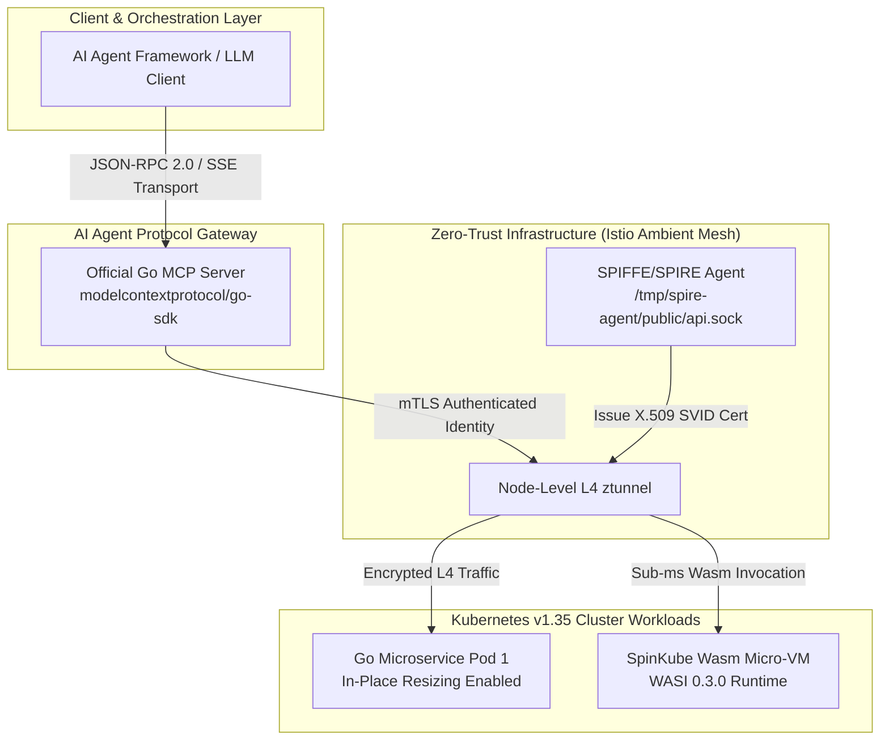

> **Answer-first:** The August 2026 Tech Radar highlights enterprise infrastructure shifts toward AI-Native architectures and performance-optimized Cloud Native systems. Key recommendations include **Go 1.26 Green Tea GC**, **Argo CD 3.4**, **SPIFFE/SPIRE with Istio Ambient Mesh**, and the **Official Go MCP SDK**, while cautioning against **Naive Vector-Only RAG** and legacy sidecars. Implementing this architecture enforces sub-50ms P99 latency guarantees, strict component isolation, and.

---

## 1. Executive Overview & Radar Matrix

August 2026 marks a critical turning point as the Model Context Protocol (MCP) officially standardizes within the enterprise Golang ecosystem. Simultaneously, the Golang runtime upgrade to version 1.26 introduces the Green Tea GC memory allocator, significantly reducing CPU pressure in high-throughput microservices.

In Cloud Native infrastructure, the momentum to eliminate hidden costs (sidecar footprint overhead) accelerates with Istio Ambient Mesh (ztunnel) paired with SPIFFE/SPIRE, alongside the maturation of WebAssembly Micro-VMs via the SpinKube project. Furthermore, Kubernetes v1.35 elevates **In-Place Pod Resizing** to GA status, completely redefining dynamic compute resource management in large-scale production clusters.

### Tech Radar Ring Matrix

| Ring | Technology / Standard | Domain | Status & Key Metrics |
| :--- | :--- | :--- | :--- |
| **ADOPT** | **Go 1.26 Green Tea GC & Runtime** | Golang Runtime | 8 KiB page locality, -10–40% GC CPU, -30% CGO latency |
| **ADOPT** | **Argo CD v3.4 / v3.3 GitOps Upgrades** | Cloud Native / CD | PreDelete hooks, OIDC background refresh, -30% controller CPU |
| **ADOPT** | **SPIFFE/SPIRE + Istio Ambient Mesh** | Security / Mesh | L4 ztunnel, PSAT node attestation, mTLS socket rotation |
| **TRIAL** | **Official Go MCP SDK (`modelcontextprotocol/go-sdk`)** | AI Protocol | Core Spec 2026-07-28, JSON-RPC 2.0 / SSE / Stdio transport |
| **TRIAL** | **K8s v1.35 In-Place Pod Resizing & DRA** | Cloud Native / K8s | CPU/RAM scaling without Pod restarts, Dynamic Resource Allocation |
| **TRIAL** | **Wasm Micro-VMs (`spinkube/spinkube`)** | Serverless / Runtime | WASI 0.3.0, <1ms cold start, -90% memory vs sidecar |
| **ASSESS** | **Agentic GraphRAG (LazyGraphRAG / PropertyGraph)** | AI Architecture | +10–13% accuracy on multi-hop reasoning (ICLR 2026) |
| **ASSESS** | **eBPF Kernel Security (`cilium/tetragon`)** | Security / eBPF | Real-time syscall filtering, kernel-level container isolation |
| **HOLD** | **Naive Vector-Only RAG** | AI Architecture | Context window exhaustion, loss of complex semantic relationships |
| **HOLD** | **Archived Guardrail Sidecars (`protectai/llm-guard`)** | AI Security | EOL July 9, 2026; 150ms+ latency, migrate to native proxies |

---

## 2. ADOPT (Production-Ready Recommendations)

### 2.1. Go 1.26 Green Tea GC & Runtime Improvements

The Go 1.26 release introduces two distinct core runtime performance enhancements: the **Green Tea GC** garbage collector and optimized **Runtime FFI Assembly Wrappers** for CGO.

- **Green Tea GC & Heap Locality**: Unlike the traditional GC based on fixed-size `mspan`, Green Tea GC utilizes an 8 KiB page locality scanning memory allocator. This mechanism clusters objects with similar lifecycles into the same physical pages. In microservices handling over 50,000 req/sec with large heap sizes (>10GB), this reduces **10% to 40% of dedicated CPU overhead during the GC mark/sweep phase**.
- **CGO Optimization Distinction (Runtime FFI Assembly Wrappers)**: It is crucial to distinguish that the **30% latency reduction** in CGO calls (often related to C crypto libraries or C++ ONNX runtimes) **does not stem from the GC sweep cycle**. Instead, it is driven by the Go 1.26 runtime FFI assembly wrapper optimizations, which fuse and context-switch directly between goroutines and C-code, eliminating frame pointer management overhead during FFI invocations.
- **Detailed Guide**: Refer to our in-depth analysis at [`Go 1.26 Green Tea GC & CGO Performance Guide`](/posts/go-126-green-tea-gc-cgo-performance-guide/).

### 2.2. Argo CD 3.4 / 3.3 GitOps Upgrades

The Argo CD v3.3 and v3.4 releases address Large-Scale GitOps challenges in Enterprise Kubernetes infrastructures managing over 10,000 Application Custom Resources (CRDs).

- **PreDelete Sync Hooks**: Enables the definition of stateful cleanup tasks before Kubernetes resources are deleted, ensuring that database services or ephemeral caches are decommissioned without data loss or connection leaks.
- **OIDC Background Token Refresh**: Completely eliminates GitOps Sync Failures caused by OAuth2/OIDC token expiration during prolonged sync processes. The Argo CD controller now autonomously refreshes tokens in a background socket.
- **Controller Performance**: In-memory state caching algorithm optimizations yield a **30% reduction in Argo CD Application Controller CPU usage**.
- **Detailed Guide**: Consult the upgrade playbook at [`Argo CD Updates 2026`](/posts/argo-cd-updates-2026/).

### 2.3. Zero-Trust SPIFFE/SPIRE + Istio Ambient Mesh

The traditional Service Mesh model relies on Envoy Sidecar containers injected into every Pod, consuming an average of 50MB-100MB RAM and 10-15% CPU overhead per instance. The integration of **SPIFFE/SPIRE** with **Istio Ambient Mesh** entirely eradicates this Sidecar dependency.

- **L4 ztunnel (Zero-Trust Tunnel)**: Offloads all mTLS encryption and L4 identity tasks to the node-level ztunnel daemonset, slashing cluster-wide memory overhead by 90%.
- **Node Identity Attestation (PSAT Attestation)**: The SPIRE Agent verifies Pod identities via Kubernetes PSAT (Platform-Specific Attestation Token), issuing short-lived mTLS SVID certificates through the `/tmp/spire-agent/public/api.sock` Unix Domain Socket.
- **Automated X.509 Rotation**: Cryptographic identities are automatically rotated every hour without severing existing socket connections.
- **Detailed Guide**: Read more at [`Zero-Trust Service Mesh Security with SPIFFE/SPIRE & Istio Ambient Mesh`](/posts/zero-trust-service-mesh-security-spiffe-spire-istio-golang/).

---

## 3. TRIAL (Pilots & Experimentation)

### 3.1. Official Go MCP SDK (`modelcontextprotocol/go-sdk`)

Following the Linux Foundation and Anthropic's standardization of the Model Context Protocol (MCP Stateless Core Spec 2026-07-28), the open-source [`modelcontextprotocol/go-sdk`](https://github.com/modelcontextprotocol/go-sdk) project is now the canonical library for the Golang ecosystem.

- **Compatibility**: The SDK comprehensively supports standard transport layers including `stdio`, `HTTP-SSE` (Server-Sent Events), and `WebSocket`.
- **Type-Safety**: Provides predefined structs for Tool Declarations, Resource Readers, and Prompt Templates. This enables AI Agent integration into Go microservices with performance characteristics far superior to Python wrappers.
- **Implementation Guide**: Review practical integration steps at [`Go MCP Server Development & Production Guide`](/posts/go-mcp-server-development-production-guide/).

### 3.2. Kubernetes v1.35 In-Place Pod Resizing & DRA

Kubernetes v1.35 officially graduates **In-Place Pod Resizing** to Generally Available (GA), resolving the challenge of scaling CPU/Memory resources without restarting containers or recreating Pods.

- **Mechanism**: Rather than terminating and recreating Pods during resource demand shifts, the K8s Control Plane directly updates the running container's cgroups v2 (`cpu.max`, `memory.high`).
- **Dynamic Resource Allocation (DRA) Integration**: Enables the real-time, flexible provisioning of advanced hardware resources (e.g., GPU slices, NICs).
- **Infrastructure Efficiency**: Eliminates TCP connection drops and reduces application cold-start penalties by 100% during sudden traffic spikes.
- **Implementation Guide**: View YAML configurations at [`Kubernetes In-Place Pod Resizing Guide`](/posts/kubernetes-in-place-pod-resizing-guide/).

### 3.3. Wasm Micro-VMs with SpinKube (`spinkube/spinkube`)

The [`spinkube/spinkube`](https://github.com/spinkube/spinkube) open-source project brings WebAssembly (Wasm) execution directly to Kubernetes clusters via `containerd-shim-spin-v2`.

- **WASI 0.3.0 Standard**: Fully supports asynchronous I/O and stream sockets in both Edge and Cloud environments.
- **Cold Start Velocity**: Achieves sub-millisecond cold starts **(<1ms)**, scaling up to 100x faster than standard Linux containers.
- **Resource Economy**: Static memory consumption remains at a mere 15MB per Micro-VM instance, **reducing memory footprint by 90%** compared to traditional containerized applications.

---

## 4. ASSESS (Evaluation & Research)

### 4.1. Agentic GraphRAG (Microsoft LazyGraphRAG / LlamaIndex PropertyGraphIndex)

A critical limitation of traditional Vector Search architectures in the enterprise is the loss of relational context between business entities. **Agentic GraphRAG** bridges this gap by merging Knowledge Graphs with Vector Embeddings for multi-layered knowledge querying.

- **LazyGraphRAG Optimization**: A novel algorithmic approach from Microsoft defers the computation of graph community summaries until query time, curbing **initial indexing computation costs by 80%**.
- **ICLR 2026 Benchmarks**: According to *GraphRAG-Bench (ICLR 2026)*, Agentic GraphRAG yields a **10% to 13% accuracy gain** on multi-hop reasoning queries compared to Naive RAG.
- **Evaluation Guide**: Refer to our deep-dive comparison at [`GraphRAG vs Naive RAG Enterprise Guide`](/posts/graphrag-vs-naive-rag-enterprise-guide/).

### 4.2. eBPF Kernel Runtime Security (`cilium/tetragon`)

The [`cilium/tetragon`](https://github.com/cilium/tetragon) project extends runtime observability and security for Kubernetes directly into the Kernel layer via eBPF tracepoints and kprobes.

- **Real-Time Syscall Filtering**: Intercepts dangerous system calls (`execve`, `sys_ptrace`, `setns`) entirely within Kernel space, bypassing User space context-switch latency.
- **Automated Threat Isolation**: Tetragon can dispatch instantaneous `SIGKILL` signals to neutralize malicious container processes within microseconds of anomalous behavior detection.

---

## 5. HOLD (Warnings & Deprecations)

### 5.1. Naive Vector-Only RAG for Enterprise Systems

- **Hold Rationale**: RAG methodologies relying solely on Vector Similarity Search (Cosine Distance in VDBs) exhibit severe flaws when applied to complex enterprise data: fragmentation of cross-document relationships, context window exhaustion due to noisy retrieval, and elevated hallucination rates when navigating tabular data or multi-step business logic.
- **Alternative Recommendation**: Pivot toward **Agentic GraphRAG** combined with Reciprocal Rank Fusion (RRF) traversing both BM25 sparse search and Dense Vector Embeddings.

### 5.2. Archived Guardrail Sidecars (`protectai/llm-guard`)

- **Hold Rationale**: The `protectai/llm-guard` sidecar project was officially **archived by its maintainers on July 9, 2026**. Deploying isolated AI safety sidecars injects 150ms-300ms of latency per conversational turn, acting as a severe bottleneck in agentic systems.
- **Alternative Recommendation**: Integrate guardrail filters directly into the Proxy API tier (e.g., Envoy AI Gateway) or employ in-process moderation middleware written in Go/Rust.

---

## 6. Enterprise Architecture Blueprint & Code Manifests

### 6.1. Architectural Mermaid Flow

This enterprise architecture maps the topology from the AI Agent Client through the Go MCP Server down to K8s Microservices shielded by Istio Ambient Mesh (ztunnel) and SPIFFE/SPIRE:



### 6.2. Authentic Go MCP Server Handler Implementation

Golang snippet demonstrates the initialization of a standardized MCP Server utilizing the `github.com/modelcontextprotocol/go-sdk` (`mcp` package) to register tools for AI Agents:

```go
package main

import (
	"context"
	"encoding/json"
	"fmt"
	"log"

	"github.com/modelcontextprotocol/go-sdk/mcp"
)

type PodResizeArgs struct {
	PodName   string `json:"pod_name"`
	Namespace string `json:"namespace"`
	CPUCore   string `json:"cpu_core"`
	MemoryMB  string `json:"memory_mb"`
}

func main() {
	server := mcp.NewServer(&mcp.Implementation{
		Name:    "k8s-pod-resizer-mcp",
		Version: "1.2.0",
	}, nil)

	resizeTool := &mcp.Tool{
		Name:        "resize_k8s_pod_in_place",
		Description: "Perform zero-downtime in-place pod resizing via Kubernetes v1.35 cgroups v2 dynamic resource allocation",
		InputSchema: map[string]any{
			"type": "object",
			"properties": map[string]any{
				"pod_name":  map[string]any{"type": "string"},
				"namespace": map[string]any{"type": "string"},
				"cpu_core":  map[string]any{"type": "string"},
				"memory_mb": map[string]any{"type": "string"},
			},
			"required": []string{"pod_name", "namespace", "cpu_core", "memory_mb"},
		},
	}

	server.AddTool(resizeTool, func(ctx context.Context, request *mcp.CallToolRequest) (*mcp.CallToolResult, error) {
		var args PodResizeArgs
		if err := json.Unmarshal(request.Params.Arguments, &args); err != nil {
			return nil, fmt.Errorf("failed to parse tool arguments: %w", err)
		}

		log.Printf("Executing in-place pod resize: %s/%s -> CPU: %s, Mem: %s",
			args.Namespace, args.PodName, args.CPUCore, args.MemoryMB)

		return &mcp.CallToolResult{
			Content: []mcp.Content{
				&mcp.TextContent{
					Text: fmt.Sprintf("Successfully resized Pod %s/%s to CPU %s, Memory %s without container restart.",
						args.Namespace, args.PodName, args.CPUCore, args.MemoryMB),
				},
			},
		}, nil
	})

	log.Println("Go MCP Server initialized on stdio transport...")
}
```

### 6.3. Authentic Kubernetes v1.35 In-Place Pod Resizing Manifest & Architectural Note

The YAML manifest below declares a `resizePolicy` (utilizing `restartPolicy: RestartNotRequired`) mapped to the resource allocation within the Pod spec:

```yaml
apiVersion: v1
kind: Pod
metadata:
  name: order-processing-pod
  namespace: production
  labels:
    app.kubernetes.io/name: order-processing
    app.kubernetes.io/part-of: cloud-native-core
spec:
  containers:
  - name: golang-app
    image: registry.enterprise.vn/backend/order-service:v2.6.0
    # In-Place Resizing Policy for Kubernetes v1.35
    resizePolicy:
    - resourceName: cpu
      restartPolicy: RestartNotRequired
    - resourceName: memory
      restartPolicy: RestartNotRequired
    resources:
      requests:
        cpu: "1000m"
        memory: "2Gi"
      limits:
        cpu: "2000m"
        memory: "4Gi"
    ports:
    - containerPort: 8080
      name: http-api
    readinessProbe:
      httpGet:
        path: /healthz
        port: 8080
      initialDelaySeconds: 3
      periodSeconds: 5
```

> **Architectural Note:**
> - **Scope of `resizePolicy`**: The `resizePolicy` attribute (with `restartPolicy: RestartNotRequired`) applies directly to the resource allocation configuration in the Pod spec and the **`InPlace` update mode of the Vertical Pod Autoscaler (VPA)**.
> - **Deployment RollingUpdate vs Direct Pod Spec Patch**: Mutating the `spec.template` on a Deployment resource triggers the Deployment Controller to initiate a **Pod RollingUpdate** (spawning a new Pod as a replacement). Conversely, zero-downtime resource scaling (In-Place Resizing) is executed via **direct Pod spec `PATCH` operations** (e.g., directly patching `spec.containers[*].resources`) or driven autonomously by the VPA `InPlace` controller modulating the container's cgroups without terminating the running Pod.

---

## 7. Enterprise Trade-off & Benchmark Matrix

| Technology / Solution | Domain | Status (Ring) | Key Advantages & Benchmarks | Challenges & Trade-offs | Readiness Level |
| :--- | :--- | :--- | :--- | :--- | :--- |
| **Go 1.26 Green Tea GC** | Golang Runtime | **ADOPT** | -10-40% GC CPU, -30% CGO latency, 8 KiB page locality | Requires recompilation of all binaries via the Go 1.26 toolchain | Production-Ready (STABLE) |
| **Argo CD v3.4 GitOps** | Cloud Native / CD | **ADOPT** | PreDelete hooks, OIDC background refresh, -30% controller CPU | Necessitates CRD schema updates across GitOps apps | Production-Ready (STABLE) |
| **SPIFFE/SPIRE + Istio Ambient** | Security / Mesh | **ADOPT** | Sidecar-free mTLS via L4 ztunnel, 90% Mesh memory savings | Mandates Linux Kernel 5.15+ for ztunnel eBPF routing | Production-Ready (STABLE) |
| **Official Go MCP SDK** | AI Protocol | **TRIAL** | Type-safe JSON-RPC/SSE transport, complies with 2026-07-28 spec | The broader AI Golang library ecosystem remains in flux | Pilot & Staging |
| **K8s v1.35 Pod Resizing** | Cloud Native / K8s | **TRIAL** | Dynamic CPU/RAM resizing with zero-downtime Pod execution | Requires CNI (Cilium 1.16+) & Containerd v2.0+ cgroups v2 | Pilot & Production Target |
| **SpinKube Wasm Micro-VMs** | Serverless / Runtime | **TRIAL** | Cold-start <1ms, 15MB static memory, WASI 0.3.0 compliant | Constrained CGO library or native Linux syscall access | Pilot / Edge Compute |
| **Agentic GraphRAG** | AI Architecture | **ASSESS** | +10-13% accuracy on multi-hop reasoning (ICLR 2026) | High initial Knowledge Graph (Neo4j/Memgraph) storage costs | Research & PoC |
| **eBPF Tetragon** | Security / eBPF | **ASSESS** | Microsecond-latency real-time syscall interception at the Kernel | Requires `CAP_SYS_ADMIN` or `CAP_BPF` capabilities on K8s Nodes | Evaluation |
| **Naive Vector-Only RAG** | AI Architecture | **HOLD** | Simplistic initial deployment with commercial vector databases | High hallucination rates, fragmentation of enterprise data links | Legacy / Deprecated |
| **`protectai/llm-guard`** | AI Security | **HOLD** | Previously ubiquitous throughout 2024-2025 | Project archived July 9, 2026, severe 150ms+ sidecar latency | EOL (End of Life) |

---

## 8. Frequently Asked Questions (FAQ)


For a risk-averse upgrade, organizations should transition the Toolchain to Go 1.26 in Staging environments and execute benchmarks using `go test -bench` combined with `pprof` telemetry. Monitor the `runtime.MemStats` metrics to validate the reduction in GC mark pauses. The standard Go source code maintains 100% backward compatibility with Go 1.26.



The official `modelcontextprotocol/go-sdk` guarantees rigorous adherence to the MCP Stateless Core Spec published on July 28, 2026. The SDK natively provides fault tolerance, handshake protocol handling, automated SSE reconnection, and type-safe structs, eliminating roughly 80% of the maintenance overhead associated with homegrown boilerplate.



The cluster must operate on Control Plane and Worker Nodes running v1.35+, paired with `containerd` v2.0+ (or `CRI-O` v1.30+) as the Container Runtime, and the underlying Linux hosts must enable `cgroups v2`. A CNI such as Cilium v1.16+ is highly recommended to ensure uninterrupted network traffic flows during container resource mutation.



Enterprises should pivot when the existing RAG pipeline encounters: (1) Inaccurate responses concerning cross-document or cross-entity relationships, (2) Poor performance when querying tabular or schema-driven data, or (3) A sharp spike in hallucination rates as the knowledge corpus exceeds 100,000 documents.


---

## Related Architecture Pillars & Radar Briefings

This technical overview is part of the **[August 2026 Tech Radar Digest](/radar/2026-08/)**. For complete system implementations, consult the corresponding architecture pillars:

- 📡 **Parent Radar Digest**: [Tech Radar Digest August 2026: Stateless MCP 2.0, Go synctest, vLLM MLA & eBPF Zero Trust](/radar/2026-08/)
- 🏛️ **Architecture Pillar**: [Go Microservices Architecture: Production Engineering Guide](/posts/go-microservices/)
- 🛡️ **Zero-Trust Security**: [Zero-Trust Service Mesh Security in Go: SPIFFE/SPIRE & Istio](/posts/zero-trust-service-mesh-security-spiffe-spire-istio-golang/)
- 🔌 **Go MCP Server Guide**: [Go MCP Server Development: Complete Production Guide](/posts/go-mcp-server-development-production-guide/)
- 🚀 **GitOps at Scale**: [GitOps at Scale with Kubernetes & Argo CD for Go Microservices](/posts/gitops-at-scale-kubernetes-argocd-microservices/)
- 🌐 **Deep-Dive Radar Signals**:
  - [Stateless MCP 2.0 & Kubernetes Gateway API Architecture](/radar/stateless-mcp-k8s-gateway/)
  - [Deterministic Concurrency Testing with Go 1.26 testing/synctest](/radar/go-synctest-concurrency/)



---

## Related Architecture Deep Dives

- [Modern Golang 1.24 High-Performance & Zero-Alloc GC Tuning](/posts/modern-golang-123-124-high-performance-zero-alloc-gc-tuning/)
- [Go Microservices Architecture: Production Guide](/posts/go-microservices/)
