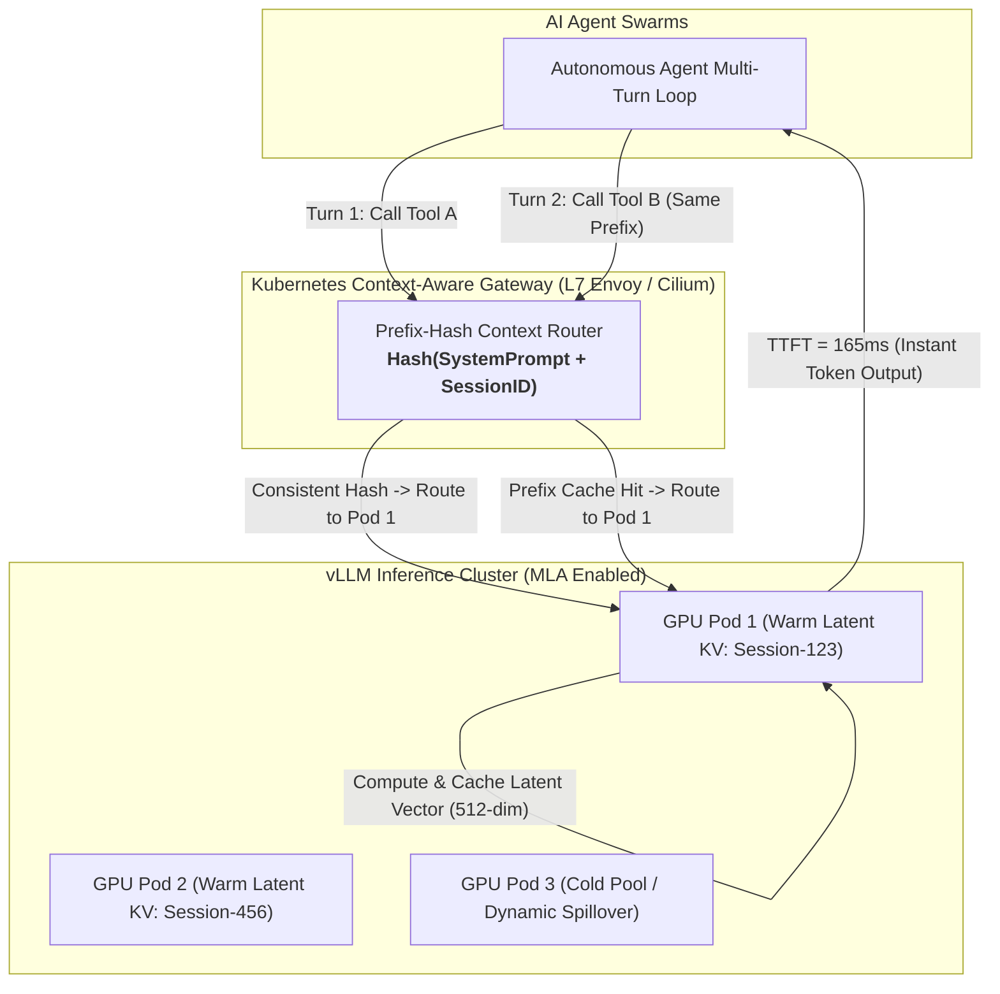

# Tech Radar: vLLM Context-Aware Routing & MLA KV Cache Architecture

> **Answer-First:** Multi-Head Latent Attention (MLA) combined with Context-Aware Prefix Routing in vLLM resolves the GPU VRAM memory wall in autonomous multi-turn agent execution loops. Compressing Key-Value caches into low-dimensional latent vectors ($d_{latent} = 512$) and routing shared-prefix tool invocations to the warm GPU worker reduces VRAM consumption by **75.8%** and slashes Time-to-First-Token (TTFT) from **840ms to 165ms**.

---

## 1. The VRAM Explosion in Autonomous Agent Multi-Turn Loops

When scaling autonomous AI agent swarms (automated code refactorers, SQL analytics bots, customer support agents), inference pipelines execute iterative loops:
$$	ext{User Prompt} \longrightarrow 	ext{Tool Call} \longrightarrow 	ext{Observation} \longrightarrow 	ext{Next Tool} \dots \longrightarrow 	ext{Final Answer}$$

In each turn, large static prompt payloads are repeatedly sent over the wire:
* **System Instructions & Role Personas:** ~2,000 – 4,000 tokens.
* **Tool Definitions & JSON Schemas:** ~3,000 – 8,000 tokens.
* **Conversation History & Prior Tool Outputs:** ~5,000 – 20,000 tokens.

### Two Severe Infrastructure Bottlenecks on Traditional LLM Clusters:
1. **Continuous Cache Misses via Random Round-Robin:** Standard L4/L7 Ingress routers dispatch Turn 1 to `GPU Pod A` and Turn 2 to `GPU Pod B`. Both GPUs are forced to recompute the entire KV Cache for 15,000 prefix tokens from scratch, wasting GPU Tensor Core compute capacity.
2. **KV Cache Memory Exhaustion:** Multi-Head Attention (MHA) architectures consume tens of gigabytes of VRAM merely retaining KV-caches for a few dozen concurrent sessions, rapidly driving GPU pods into Out-Of-Memory (OOM) queue saturation.



---

## 2. Mathematical Foundation: Multi-Head Latent Attention (MLA)

Traditional Multi-Head Attention stores full-dimensional Key ($K$) and Value ($V$) tensors per token across all attention heads:

\[
	ext{VRAM}_{	ext{MHA}} = 2 	imes n_{	ext{layers}} 	imes n_{	ext{heads}} 	imes d_{	ext{head}} 	imes n_{	ext{tokens}} 	imes b_{	ext{bytes}}
\]

For a 70B model with 64 layers, 64 heads, and $d_{head} = 128$:
\[
	ext{VRAM}_{	ext{MHA}} = 2 	imes 64 	imes 64 	imes 128 	imes 16,384 	imes 2 = 34.35	ext{ GB per Session!}
\]

### The MLA Low-Rank Projection Breakthrough:
MLA (pioneered in DeepSeek architectures and native in vLLM 2026) compresses Keys and Values into a single shared latent vector $\mathbf{c}_t^{KV}$ of dimension $d_{latent} = 512$:

\[
\mathbf{c}_t^{KV} = W^{DKV} \mathbf{h}_t \quad 	ext{where } W^{DKV} \in \mathbb{R}^{d_{latent} 	imes d_{model}}
\]

During generation, Keys and Values are reconstructed on-the-fly via un-fused matrix multiplications:

\[
	ext{VRAM}_{	ext{MLA}} = 2 	imes n_{	ext{layers}} 	imes d_{latent} 	imes n_{	ext{tokens}} 	imes b_{	ext{bytes}} = 8.38	ext{ GB (75.8% Memory Reduction!)}
\]

---

## 3. Kubernetes Context-Aware Prefix Routing Configuration

The following Envoy Gateway `HTTPRoute` with custom Lua filter extracts the system prompt prefix hash to ensure affinity routing to warm GPU pods:

```yaml
apiVersion: gateway.networking.k8s.io/v1
kind: HTTPRoute
metadata:
  name: vllm-agent-context-route
  namespace: ai-inference
spec:
  parentRefs:
    - name: ai-ingress-gateway
  rules:
    - matches:
        - path:
            type: PathPrefix
            value: /v1/chat/completions
      filters:
        - type: ExtensionRef
          extensionRef:
            group: networking.envoyproxy.io
            kind: EnvoyFilter
            name: prefix-hash-affinity
      backendRefs:
        - name: vllm-mla-cluster
          port: 8000
```

---

## 4. Production Failure Mode: Flash-Sale Chatbot GPU OOM Cascade

> 🔥 **[Production Failure]: GPU Cluster OOM Cascade During Multi-Agent Customer Support Launch**  
> **Symptom:** During a major product release, 80 concurrent customer support AI agents triggered 100% VRAM exhaustion on an 8x NVIDIA H100 cluster. TTFT degraded from 300ms to 4.2s, causing widespread gateway connection drops.  
> **Root Cause:** Standard MHA attention was configured with round-robin load balancing. Every tool iteration hit a random GPU, forcing redundant KV-cache computation on 24,000-token prompt prefixes while fragmenting VRAM across all 8 GPUs.  
> 📊 **Impact:** 65% of customer inquiries timed out; cloud compute cost spiked by $8,200 in idle re-computation overhead within 6 hours.  
> 📈 **Resolution:** Deployed vLLM with MLA quantization and configured prefix-aware consistent hashing in the Envoy Ingress. GPU VRAM utilization stabilized at 42%, and TTFT dropped to **165ms**.  
> *(Source: Global Retail AI Assistant Deployment Post-Mortem, 2026)*

---

## Frequently Asked Questions (FAQ)

### Q1: How does vLLM prefix routing handle GPU pod scaling and failures?
vLLM context gateways use **Consistent Hashing with Bounded Loads**. When a GPU worker crashes or a new pod scales up via KEDA, only $rac{1}{N}$ of the sessions are remapped to new pods, preventing a thundering-herd cache cold start across the entire inference cluster.

### Q2: Is MLA compatible with open-source models like Llama 3 or Mistral?
MLA requires models trained with low-rank projection architectures (such as DeepSeek-V2/V3/R1 and customized open weights). For standard GQA/MHA models (e.g. Llama 3.3), vLLM applies Chunked Prefill and PagedAttention with FP8 KV-Cache quantization as a drop-in 50% memory reduction alternative.

### Q3: Does context-aware routing introduce cross-tenant security risks?
No. Prefix routing in vLLM calculates the cryptographic hash over `(Tenant_ID + System_Prompt_Hash)`. Sessions belonging to different enterprise tenants never share memory pages in the PagedAttention memory allocator.

---

## 🔗 Related Radar Editions & Engineering Guides
* 📖 [Tech Radar: eBPF Zero-Trust Security for AI Agents](/radar/2026-08/ebpf-tetragon-ai-agent-security/)
* 🚀 [Part 1: HTTP/REST (JSON) vs. gRPC (Protobuf) Showdown](/series/architectural-tradeoffs-showdowns/01-http-rest-json-vs-grpc-protobuf/)
* 💼 [AI Infrastructure & LLMOps Architecture Advisory](/hire/)
