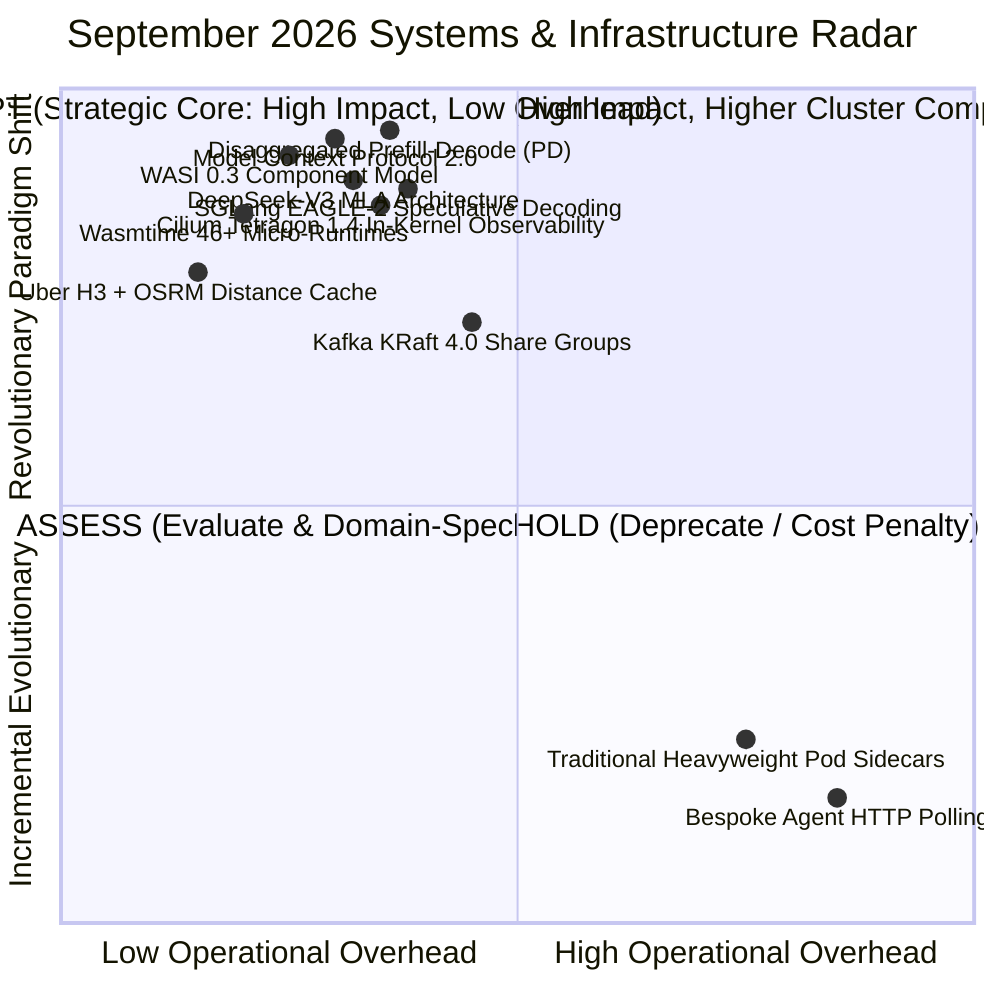

# Tech Radar Digest September 2026: WASI 0.3, MCP 2.0 & Next-Gen Systems

> **Answer-First:** The September 2026 Tech Radar highlights major architectural milestones across systems engineering and AI infrastructure: the official ratification of **Model Context Protocol 2.0 (MCP 2.0)** introducing distributed event-driven agent meshes, **WASI 0.3** native asynchronous primitives (`stream<T>`, `future<T>`), sub-millisecond instantiation with **Wasmtime 46+**, and 75% KV cache compression via **DeepSeek-V3 Multi-Head Latent Attention (MLA)**.

---

## 🧭 September 2026 Radar Matrix & Adoption Radar

The strategic adoption matrix for September 2026 distributed systems, cloud-native infrastructure, and AI engineering is mapped below:

### Technology Radar Ring Matrix (September 2026)

| Radar Ring | Technology / Standard | Architectural Domain | Operational Metrics & Strategic Verdict |
| :--- | :--- | :--- | :--- |
| **ADOPT** | **Disaggregated Prefill-Decode (PD)** | AI Serving Infrastructure | Decouples compute from memory bandwidth; cuts P99 TTFT by 11x via zero-copy RoCEv2 KV streaming |
| **ADOPT** | **Model Context Protocol 2.0 (MCP 2.0)** | AI Protocols & Mesh | Full-duplex SSE streaming, dynamic schema discovery (-72% tokens), sub-12ms P99 latency in Go 1.26 |
| **ADOPT** | **WASI 0.3 WebAssembly Component Model** | Cloud Native & Runtimes | Native async streams (`stream<T>`, `future<T>`), sub-1ms cold starts (<0.8ms), nanosecond IPC |
| **ADOPT** | **Wasmtime 46+ Micro-Runtimes** | Edge Compute & Sandboxes | Cranelift AOT compilation, 1.2MB–4.5MB RAM per instance, 500x faster startup than containers |
| **ADOPT** | **DeepSeek-V3 Multi-Head Latent Attention** | LLM Inference & GPU | 75% KV cache memory compression via low-rank projection, decoupled RoPE preservation |
| **ADOPT** | **SGLang EAGLE-2 Speculative Decoding** | AI Serving Infrastructure | 3.5x inference acceleration via multi-layer feature drafter & dynamic tree attention |
| **TRIAL** | **Cilium Tetragon 1.4 In-Kernel Tracing** | Cloud Native Security | In-kernel eBPF `sys_execve` termination in 12 µs, zero-trust sandbox enforcement |
| **ASSESS** | **Uber H3 + OSRM Shared-Memory Cache** | Geospatial & High Concurrency | Spatial hex binning with sub-millisecond distance matrix queries for multi-agent routing |
| **HOLD** | **Traditional Heavyweight Pod Sidecars** | Service Mesh Architecture | Incurs 15ms–35ms IPC latency overhead and 150MB+ footprint per pod; replace with in-kernel eBPF |
| **HOLD** | **Bespoke Agent HTTP Polling Wrappers** | AI Tool Orchestration | Introduces head-of-line blocking, connection leaks, and prompt token bloat; migrate to MCP 2.0 |

---

## 🗺️ Featured September 2026 Editions

- **[Disaggregated Prefill-Decode Architecture: Decoupling Compute & Memory Bandwidth via RoCEv2 KV-Transfer](/radar/2026-09/disaggregated-prefill-decode/)**  
  *In-depth architectural analysis of Disaggregated Prefill-Decode (PD) Serving: Decoupling compute-dense prefill from memory-bandwidth-bound decode, zero-copy kernel-bypass RoCEv2 KV streaming, 11x P99 TTFT reduction, and 64x NVIDIA H100 benchmarks.*

- **[SGLang EAGLE-2: Speculative Decoding & Tree-Attention Latency Acceleration](/radar/2026-09/sglang-eagle-2-speculative-decoding/)**  
  *In-depth architectural analysis of SGLang EAGLE-2: Multi-layer feature extrapolation, dynamic tree-attention verification, 3.5x token generation speedup on NVIDIA H100, and zero-degradation serving.*

- **[Model Context Protocol 2.0 (MCP 2.0): Distributed Multi-Agent Mesh & Zero-Trust Tool Sandboxing](/radar/2026-09/mcp-20-agentic-mesh-distributed-systems/)**  
  *Architectural analysis of MCP 2.0 ratification: Bidirectional SSE streaming, dynamic capability discovery reducing prompt tokens by 72%, SPIFFE/OAuth 2.1 mTLS, WASI 0.3 sandboxes, and Go 1.26 production benchmarks.*

- **[WASI 0.3 & Component Model: Polyglot Cloud-Native Wasm in 2026](/radar/2026-09/wasi-03-component-model-wasmtime/)**  
  *Deep dive into WASI 0.3 ratification, native async streams, nanosecond IPC, WIT contracts, and Wasmtime 46+ production benchmarks.*

- **[DeepSeek-V3 Multi-Head Latent Attention (MLA) Architecture & KV Cache Compression](/radar/2026-09/deepseek-v3-multi-head-latent-attention/)**  
  *In-depth architectural analysis of DeepSeek-V3 MLA: low-rank KV projection, 75% memory footprint reduction, decoupled RoPE, and high-throughput inference serving.*
