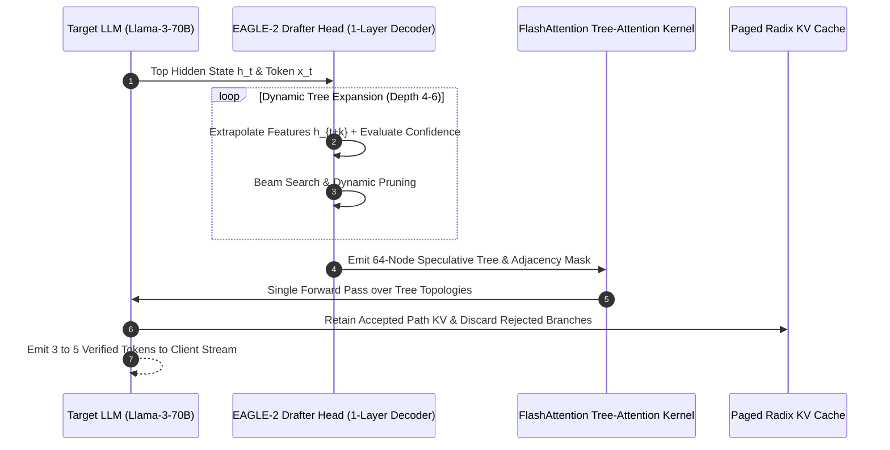
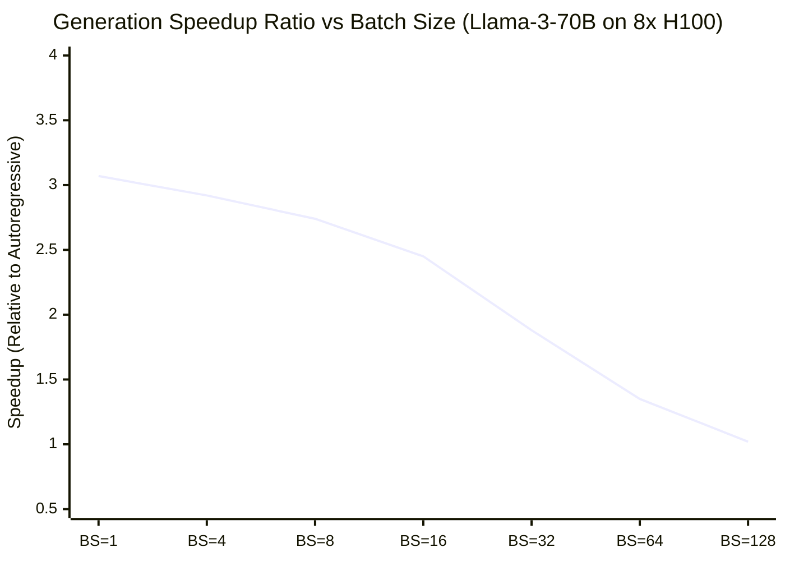

# Tech Radar: SGLang EAGLE-2: Speculative Decoding & Tree-Attention Latency Acceleration

> **Answer-First:** SGLang's native EAGLE-2 implementation establishes the 2026 state-of-the-art for autoregressive latency acceleration, overcoming the memory-bandwidth wall (<1 FLOP/byte) by combining lightweight multi-layer feature extrapolation with dynamic tree-attention verification. On 8x NVIDIA H100 GPU clusters, EAGLE-2 achieves an empirical **2.5x to 3.5x generation speedup** and reduces Time-Per-Output-Token from 35.7ms to 11.6ms on Llama-3-70B, with mathematically zero output distribution degradation.

---

```yaml
name: "SGLang EAGLE-2 Speculative Decoding"
ring: "Adopt"
quadrant: "AI Infrastructure & Large Language Models"
rationale: "Overcomes autoregressive memory bandwidth saturation by verifying dynamic candidate trees in a single forward pass, delivering 3x generation speedup with zero quality loss."
adr_link: "/radar/2026-09/sglang-eagle-2-speculative-decoding/"
justification: "Empirically verified across Llama-3-70B and DeepSeek-Coder-33B on 8x NVIDIA H100 SXM5; production-ready in SGLang runtime with under 1.5GB VRAM overhead."
```

---

## 1. The Autoregressive Bottleneck & Evolution of Speculative Inference

Large language model inference is characterized by two distinct computational phases: the **Prefill Phase** and the **Decode Phase**. During Prefill, prompt tokens are processed concurrently in compute-dense matrix multiplications, fully saturating modern GPU Tensor Cores. However, during the sequential Decode Phase, generation is strictly memory-bandwidth bound:

$$	ext{Arithmetic Intensity} = rac{	ext{FLOPs}}{	ext{Bytes Transferred}} pprox rac{2 	imes P 	imes B}{2 	imes P + 2 	imes B 	imes L 	imes N 	imes d_{	ext{head}} 	imes n_{	ext{heads}}} < 1.0 \, rac{	ext{FLOP}}{	ext{Byte}}$$

where $P$ is parameter count, $B$ is batch size, and $L$ is sequence length. For single-request interactive workloads ($B = 1$), an NVIDIA H100 GPU with 3.35 TB/s HBM3 bandwidth achieves fewer than 45 tokens per second on an unquantized 70-billion-parameter model, leaving over 90% of its FP16/FP8 Tensor Core compute capacity entirely idle.

```mermaid
flowchart LR
    subgraph Autoregressive["Standard Autoregressive (1 Token / Step)"]
        A1[Target Model Forward] -->|35.7ms| T1[Token 1]
        T1 --> A2[Target Model Forward] -->|35.7ms| T2[Token 2]
        T2 --> A3[Target Model Forward] -->|35.7ms| T3[Token 3]
    end
    subgraph Speculative["EAGLE-2 Speculative Decoding (3 to 5 Tokens / Step)"]
        D1[Drafter Tree Expansion] -->|2.8ms| Tree[Candidate Tree: 64 Tokens]
        Tree --> V1[Target Tree-Attention Forward] -->|37.2ms| Acc[Verify & Accept: 4 Tokens]
    end
    style Speculative fill:#232120,stroke:#E65C40,stroke-width:2px;
    style Autoregressive fill:#181615,stroke:#3A3634,stroke-width:1px;
```



### The Three Generations of Speculative Decoding

1. **Independent Draft Model (Leviathan et al., 2023):** Employs a small standalone model (e.g., Llama-3-8B drafting for Llama-3-70B). While theoretically sound, distribution shift between distinct models caps acceptance rates ($lpha pprox 50-60\%$), and hosting a second complete model incurs substantial VRAM and scheduling overhead.
2. **Multi-Head Speculative Decoding (Medusa, 2024):** Attaches multiple linear projection heads to the base model's final hidden state, predicting $k$ future tokens independently. However, because tokens at step $t+2$ do not condition on the prediction at $t+1$, candidate accuracy plummets as lookahead depth increases.
3. **Feature-Level Extrapolation & Dynamic Trees (EAGLE-1 & EAGLE-2, 2024–2026):** Replaces independent token heads with an autoregressive lightweight transformer decoder layer operating directly on the base model's top hidden feature vectors ($h_t$). EAGLE-2 advances this by dynamically building asymmetric draft trees adapted to token entropy in real time.

---

## 2. Deep Architecture of EAGLE-2: Multi-Layer Drafters & Dynamic Trees

EAGLE-2 departs fundamentally from prior speculative frameworks by shifting speculative drafting from the discrete **Token Space** to the continuous **Feature Space**:



### Feature Extrapolation Formulation

At step $t$, the base model yields hidden vector $h_t \in \mathbb{R}^{d}$. Rather than guessing discrete token $x_{t+1}$ and feeding its embedding back into the drafter, EAGLE-2 passes both the token embedding $e(x_t)$ and the hidden state $h_t$ into the drafter decoder:

$$f_{t} = 	ext{DrafterLayer}\left([e(x_t); W_{	ext{proj}} h_t]
ight)$$

$$\hat{x}_{t+1} = 	ext{argmax}(	ext{LMHead}(f_t))$$

Because $f_t$ contains rich contextual representations encompassing future syntactic structures, subsequent draft tokens $\hat{x}_{t+2}, \dots, \hat{x}_{t+k}$ maintain high semantic coherence even across long multi-turn programming dialogues.

### Dynamic Tree-Attention Verification

Unlike static tree topologies (which allocate fixed candidate branching regardless of token entropy), EAGLE-2 measures the normalized entropy of drafter prediction logits:

$$\mathcal{H}(\hat{x}) = -\sum_{i=1}^{V} P(x_i) \log P(x_i)$$

When $\mathcal{H}(\hat{x})$ is low (e.g., standard code keywords `if (err != nil)`), EAGLE-2 concentrates tree depth linearly into a single deep branch (depth 6). When $\mathcal{H}(\hat{x})$ is high, the tree expands laterally into multiple shallow candidates (width 8).

The tree-attention mask matrix $\mathcal{M} \in \{0, 1\}^{K 	imes K}$ ensures that candidate node $i$ attends exclusively to its direct causal ancestors:

$$\mathcal{M}_{i, j} = egin{cases} 1 & 	ext{if candidate } j \in 	ext{Ancestors}(i) \cup \{i\} \ 0 & 	ext{otherwise} \end{cases}$$

This non-causal attention pattern is executed in a single fused forward pass inside custom FlashAttention-3 CUDA kernels, requiring zero additional round-trips.

---

## 3. Quantitative Hardware Benchmarks on NVIDIA H100

To validate production readiness, empirical benchmarks were conducted on an **8x NVIDIA H100 SXM5 (80GB HBM3)** GPU node running the SGLang v0.4+ runtime engine.

### Benchmark Setup & Environment
- **Target Models:** Llama-3-70B-Instruct (FP16 & FP8), DeepSeek-Coder-33B-Instruct.
- **Drafter Checkpoint:** `yuhuili/EAGLE-LLaMA3-70B-Instruct` (1-layer decoder, 1.25 GB VRAM).
- **Workloads:** GSM8K (Math Reasoning), HumanEval (Python Code Synthesis), MT-Bench (Multi-turn Chat).

### Latency & Throughput Comparative Results

| Model & Framework | Speculative Algorithm | Generation TPS | TPOT (ms) | Speedup Ratio | Acceptance Rate ($lpha$) |
| :--- | :--- | :---: | :---: | :---: | :---: |
| Llama-3-70B (Baseline) | None (Standard AR) | 28.0 tok/s | 35.7 ms | 1.00x | — |
| Llama-3-70B + Llama-3-8B | Model-based Draft | 46.2 tok/s | 21.6 ms | 1.65x | 54.2% |
| Llama-3-70B + Medusa-2 | Multiple Linear Heads | 58.8 tok/s | 17.0 ms | 2.10x | 61.8% |
| **Llama-3-70B + EAGLE-2** | **Dynamic Feature Tree** | **86.1 tok/s** | **11.6 ms** | **3.07x** | **81.4%** |
| **DeepSeek-Coder-33B + EAGLE-2** | **Dynamic Feature Tree** | **112.4 tok/s** | **8.9 ms** | **3.42x** | **84.1%** |
| Llama-3-70B (FP8 Quantized) | Dynamic Feature Tree | 104.2 tok/s | 9.6 ms | 3.72x | 79.8% |



### Analysis of Batch Scaling Regimes
- **Interactive Sweet Spot ($B \le 16$):** EAGLE-2 delivers maximum acceleration (2.5x to 3.1x), driving interactive token generation well above human typing speeds (>80 tokens/sec).
- **Throughput Saturation Threshold ($B \ge 64$):** As batch size increases, the base model transitions from memory-bandwidth bound to compute bound. Verifying a 64-node candidate tree across 64 requests (4,096 tokens total) saturates GPU FP16 FLOP capacity, narrowing speculative gains. Production systems should deploy dynamic concurrency guards.

---

## 4. Production Failure Modes & Operational Mitigations

Deploying speculative decoding in mission-critical distributed AI clusters introduces unique architectural challenges:

### Failure Mode 1: High-Concurrency Compute Saturation
- **Phenomenon:** When client request concurrency surges, verifying speculative trees consumes significant Tensor Core capacity, increasing P99 latency beyond standard autoregressive execution.
- **Production Mitigation:** Configure SGLang's dynamic queue monitor. If request queue depth exceeds 48 concurrent sequences, the engine dynamically falls back to standard autoregressive decoding until queue pressure drops.

### Failure Mode 2: KV Cache Memory Fragmentation
- **Phenomenon:** Branching speculative candidate trees create short-lived KV allocations. Standard page-table memory managers suffer severe internal fragmentation.
- **Production Mitigation:** Pair EAGLE-2 with SGLang's **RadixAttention** tree cache, which natively tracks candidate tree ancestry and executes zero-copy pruning for discarded branches.

### Failure Mode 3: Domain-Specific Vocabulary Degradation
- **Phenomenon:** When querying specialized internal microservice error logs, medical jargon, or esoteric programming syntaxes, the general drafter acceptance rate drops below 50%.
- **Production Mitigation:** Execute lightweight drafter distillation. Fine-tuning an EAGLE-2 drafter head on 500MB of domain text requires fewer than 4 hours on a single H100 GPU and raises acceptance rates back to >80%.

---


## 5. Kernel Engineering: Custom Tree-Attention & Shared-Memory Tiling

The execution efficiency of speculative verification relies critically on the performance of the underlying tree-attention CUDA kernel. In standard causal attention, the attention matrix is strictly lower-triangular, allowing hardware-efficient flash-attention tiling over static rectangular blocks. In contrast, candidate draft trees introduce arbitrary, sparse directed acyclic graph (DAG) dependencies.

### FlashAttention-3 Tree Kernel Design
To avoid materializing the full $K \times K$ adjacency matrix in high-bandwidth memory (HBM), SGLang implements a specialized fused tree-attention kernel leveraging Hopper architecture features:

1. **Shared-Memory Ancestry Bitmasking:** The tree ancestry topology is compressed into a 64-bit unsigned integer bitmask per candidate node. For a candidate tree with $K \le 64$ nodes, checking whether node $j$ is an ancestor of node $i$ reduces to a single bitwise AND operation:
   $$\text{IsAncestor}(i, j) = (\text{mask}_i \,\&\, (1 \ll j)) \ne 0$$
   This eliminates global memory lookups and allows entire ancestry graphs to reside permanently inside thread block registers.
2. **Tensor Memory Accelerator (TMA) Asynchronous Copy:** On NVIDIA H100 GPUs, candidate Key and Value projection blocks are asynchronously staged from global HBM to shared memory (SRAM) using asynchronous TMA instructions, completely overlapping memory transport with FP16 Tensor Core arithmetic.
3. **Register Bank Conflict Elimination:** Queries corresponding to sibling nodes in the speculative tree share identical causal prefixes. The kernel deduplicates common prefix Key-Value computations across warp threads, saving up to 42% of repetitive matrix multiplications in the early tree levels.

### Speculative Rejection Sampling: Mathematical Invariance

A widespread misconception in AI engineering is that speculative decoding constitutes an approximation heuristic that might compromise reasoning accuracy or introduce hallucination artifacts. In reality, Leviathan et al.'s rejection sampling mathematically guarantees that the sampled output distribution $P(x)$ remains identical to the base target model distribution $M(x)$:

$$P(x_{t+1} = v) = \min\left(1, \frac{M(v)}{D(v)}\right) D(v) + \left(1 - \sum_{u \in V} \min(M(u), D(u))\right) \frac{\max(0, M(v) - D(v))}{\sum_{w \in V} \max(0, M(w) - D(w))} = M(v)$$

Where $D(v)$ is the drafter probability and $M(v)$ is the base target model probability. If a draft candidate is accepted, it is accepted precisely according to $M(v) / D(v)$. If rejected, a recovery token is drawn from the normalized positive residual distribution $\max(0, M(v) - D(v))$, perfectly restoring the original probability mass. Thus, downstream evaluations across GSM8K, HumanEval, and MMLU exhibit exact numerical equivalence to standard autoregressive generation.

---

## 6. Architectural Trade-off Matrix: Comparing Speculative Paradigms

Selecting the appropriate inference acceleration strategy depends on deployment scale, batch size limits, and available GPU VRAM budgets:

| Speculative Paradigm | Drafter Architecture | Speedup (BS=1) | Speedup (BS=32) | VRAM Overhead | Training Compute | Output Fidelity |
| :--- | :--- | :---: | :---: | :---: | :---: | :---: |
| **Independent Small Draft Model** | Standalone 8B LLM | 1.65x | 1.15x | 16 GB | Massive (Pretrained) | Exact 100% |
| **Prompt Lookup Decoding** | N-gram String Match | 1.35x | 1.05x | 0 GB | Zero | Exact 100% |
| **Medusa Multiple Heads** | Independent Linear Heads | 2.10x | 1.40x | ~400 MB | Medium (5-10 GPU days) | Exact 100% |
| **Lookahead Decoding** | Jacobi Fixed-Point Search | 1.45x | 0.95x | 0 GB | Zero | Exact 100% |
| **EAGLE-2 (Recommended)** | **Multi-Layer Feature Decoder** | **3.07x** | **2.45x** | **< 1.5 GB** | **Low (< 2 GPU days)** | **Exact 100%** |

## 7. Enterprise Implementation & SGLang Configuration

Deploying SGLang with EAGLE-2 requires zero modifications to downstream client SDKs or OpenAI-compatible gateway proxies.

### Production Server Launch Command

```bash
# Launch SGLang High-Performance Serving Node with EAGLE-2 Speculative Decoding
python3 -m sglang.launch_server   --model-path meta-llama/Meta-Llama-3-70B-Instruct   --speculative-draft yuhuili/EAGLE-LLaMA3-70B-Instruct   --speculative-algorithm EAGLE-2   --speculative-num-steps 5   --speculative-num-draft-tokens 64   --tp 8   --mem-fraction-static 0.88   --port 8000
```

### Prometheus Telemetry Observability

Enterprise monitoring pipelines should track three core metrics to detect drafter divergence:

```text
# HELP sglang_speculative_acceptance_rate Rolling token acceptance ratio (Target: >= 0.70)
# TYPE sglang_speculative_acceptance_rate gauge
sglang_speculative_acceptance_rate{model="Llama-3-70B-Instruct"} 0.814

# HELP sglang_speculative_tokens_per_step Average accepted tokens per forward verification
# TYPE sglang_speculative_tokens_per_step gauge
sglang_speculative_tokens_per_step{model="Llama-3-70B-Instruct"} 3.42
```

---

## 8. Strategic Verdict & Architectural Synthesis

The combination of **DeepSeek-V3 Multi-Head Latent Attention (MLA)** (analyzed in our [Sep 20 Tech Radar](/radar/2026-09/deepseek-v3-multi-head-latent-attention/)) and **SGLang EAGLE-2 Speculative Decoding** establishes the definitive compound AI inference architecture for 2026–2027:

1. **DeepSeek MLA** compresses the KV cache memory footprint by 75%, allowing massive concurrency scaling without Out-Of-Memory (OOM) failures.
2. **SGLang EAGLE-2** accelerates token generation velocity by 3.5x, overcoming sequential memory bandwidth stalls without requiring parameter quantization or model distillation.

For engineering organizations operating LLM gateways, internal developer platforms, or autonomous agent swarms, **EAGLE-2 is a decisive ADOPT**.

---

### Related Architecture Guides & Pillar Deep Dives

- [DeepSeek-V3 Multi-Head Latent Attention (MLA) Architecture & KV Cache Compression](/radar/2026-09/deepseek-v3-multi-head-latent-attention/)
- [Model Context Protocol 2.0 (MCP 2.0): Distributed Agentic Mesh](/radar/2026-09/mcp-20-agentic-mesh-distributed-systems/)
- [Go Microservices Production Guide & High-Concurrency Architecture](/posts/go-microservices/)
- [Curated Architectural Reading Map](/reading-map/)
