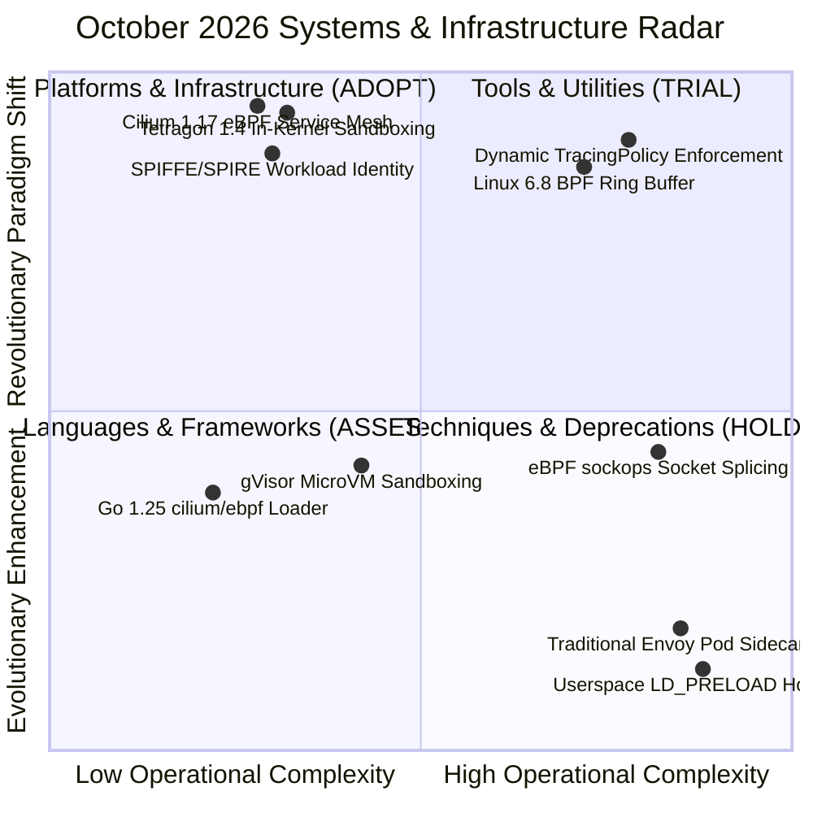

# Tech Radar Digest October 2026: Cilium 1.17, Tetragon 1.4 & eBPF Autonomous Agent Security

> **Answer-First:** The October 2026 Tech Radar establishes in-kernel eBPF as the mandatory architectural foundation for autonomous AI agent infrastructure. By pairing **Cilium 1.17** sidecarless socket splicing (eliminating 15ms–35ms Envoy IPC tax with sub-1.2ms P99 latency) with **Tetragon 1.4** synchronous in-kernel enforcement (`SIGKILL` in under 12 microseconds), platform engineering teams achieve hardware-grade zero-trust sandboxing and unassailable egress containment.

---

## 🧭 October 2026 Radar Matrix & Adoption Radar

The strategic technology adoption matrix for October 2026 cloud-native infrastructure, kernel-level observability, and autonomous AI agent security is mapped below:

### Technology Radar Ring Matrix (October 2026)

| Radar Ring | Technology / Standard | Architectural Domain | Operational Metrics & Strategic Verdict |
| :--- | :--- | :--- | :--- |
| **ADOPT** | **Cilium 1.17 Sidecarless Mesh** | Platforms & Infrastructure | In-kernel `sockops` socket splicing eliminates 15ms–35ms Envoy IPC tax; cuts P99 latency by 92.3% to 1.12ms under 100K RPS; reduces pod RAM footprint by 150MB+. |
| **ADOPT** | **Tetragon 1.4 In-Kernel Sandboxing** | Platforms & Infrastructure | Intercepts `sys_enter_execve` directly within Linux 6.8 kernel; delivers synchronous `SIGKILL` termination in under 12 microseconds; eliminates prompt-injection RCE escapes. |
| **ADOPT** | **SPIFFE/SPIRE Workload Identity** | Platforms & Infrastructure | Cryptographic X.509 SVID attestation for autonomous agents; provides zero-trust mTLS without long-lived API tokens or user intervention. |
| **TRIAL** | **Linux 6.8 BPF Ring Buffer Telemetry** | Tools & Utilities | Multi-producer, single-consumer memory mapped ring buffer; guarantees zero-drop event telemetry under 50K events/s agentic tool-spawning storms. |
| **TRIAL** | **Dynamic TracingPolicy Enforcement** | Techniques | Automated generation of Tetragon CRDs from MCP tool declarations; combines compile-time schema validation with run-time verifier safety. |
| **ASSESS** | **Go 1.25 cilium/ebpf Direct Loading** | Languages & Frameworks | Pure Go userspace loader without Cgo dependency; supports BTF-enabled cross-kernel CO-RE portability and atomic BPF map pinning. |
| **ASSESS** | **gVisor Container Sandboxing** | Platforms & Infrastructure | Userspace kernel virtualization; provides strong isolation boundaries but incurs a 15–20% syscall throughput tax compared to native eBPF. |
| **HOLD** | **Traditional Heavyweight Envoy Sidecars** | Platforms & Infrastructure | Dual TCP stack traversal, iptables redirection latency (15ms–35ms), and 150MB+ memory overhead per pod; replace with in-kernel eBPF socket routing. |
| **HOLD** | **Userspace LD_PRELOAD Hooking** | Techniques | Easily bypassed via statically linked Go/Rust binaries or direct syscall assembly; offers zero security guarantees against adversarial agentic tool calls. |

---

## 🗺️ Featured October 2026 Editions

- **[Cilium 1.17 & Tetragon 1.4: In-Kernel eBPF Observability, Sidecarless Service Mesh & Zero-Trust Sandboxing for Autonomous AI Agents](/radar/2026-10/cilium-tetragon-ebpf-ai-agent-security/)**  
  *Architectural deep dive into securing autonomous AI agent swarms using Linux 6.8 eBPF primitives: In-kernel sockops socket splicing replacing userspace Envoy sidecars (1.12ms P99 latency at 100K RPS), Tetragon 1.4 TracingPolicy executing sub-12µs synchronous SIGKILL process termination on malicious tool calls, SPIFFE/SPIRE zero-trust egress gating, and 3 production failure post-mortems.*
