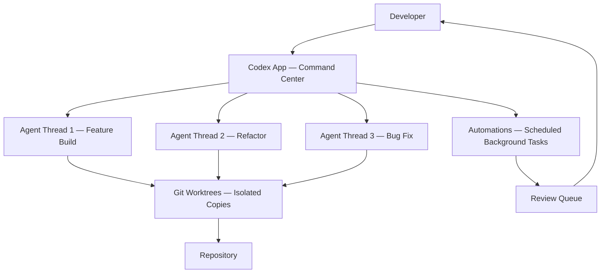

OpenAI shipped two things this week that belong together: the Codex desktop app for macOS (with Windows following in March) and GPT-5.2-Codex, a version of GPT-5.2 further optimized for agentic coding. After reading the full source material from both announcements, the picture that emerges is not an incremental model update. It is a deliberate architectural shift in how OpenAI thinks about the relationship between developers and AI agents.

The framing in the Codex app announcement is precise: "The core challenge has shifted from what agents can do to how people can direct, supervise, and collaborate with them at scale." That is a meaningful statement. It acknowledges that the bottleneck is no longer model capability — it is the tooling for managing agents at the scale that frontier models now make possible.

Three themes define this release. First, the Codex app is a multi-agent command center, not a chat interface. Second, GPT-5.2-Codex's cybersecurity capability jump is the most consequential and carefully managed part of the release. Third, the Skills system changes the unit of work delegation from prompts to reusable, team-shareable workflows.

## 1. The Codex App: From Pair Programmer to Agent Supervisor

The Codex app is built around a specific observation: developers are no longer working with a single agent on a single task. They are orchestrating multiple agents across projects, running tasks in parallel, and trusting agents to take on work that spans hours, days, or weeks. Existing IDEs and terminal tools were not designed for this.

The app's core design reflects this. Agents run in separate threads organized by projects. You can switch between tasks without losing context. You review agent changes in the thread, comment on diffs, and open them in your editor for manual changes. Multiple agents can work on the same repository simultaneously through built-in worktree support — each agent works on an isolated copy of the code, so parallel exploration does not create conflicts.

The worktree integration is the detail that matters most for teams. Without it, running multiple agents on the same codebase requires careful coordination to avoid conflicts. With it, each agent works in isolation and you merge the results when you are ready. This is the same pattern that makes feature branches work in Git — applied to agent parallelism.

The session history and configuration sync with the Codex CLI and IDE extension, so the app is not a separate tool. It is a different interface to the same agent infrastructure. You can start a task in the CLI, continue it in the IDE, and supervise it in the app without losing state.

### Automations: Agents Running Without You

The Automations feature is worth examining separately. It lets Codex run scheduled background tasks — daily issue triage, CI failure summaries, release briefs, bug checks — that land in a review queue when complete.

This is a different model from interactive coding assistance. The agent is not waiting for your next prompt. It is running on a schedule, completing work, and presenting results for review. OpenAI describes using this internally for tasks like "babysitting training runs" and "reporting on growth experiments."

The review queue model is the right safety design for this. Automations do not push changes directly. They produce results that a human reviews before anything happens. The agent is doing the work; the human is doing the approval. That boundary matters as the tasks become more consequential.

## 2. GPT-5.2-Codex: Long-Horizon Work and the Cybersecurity Jump

GPT-5.2-Codex is GPT-5.2 with additional optimization for agentic coding. The specific improvements are:

- **Context compaction** — the model can work in large repositories over extended sessions without losing track of earlier context
- **Long-horizon reliability** — complex tasks like large refactors, code migrations, and feature builds complete more reliably even when plans change or attempts fail
- **Windows environment performance** — meaningful improvement for enterprise teams on Windows
- **Stronger vision** — more accurate interpretation of screenshots, technical diagrams, charts, and UI surfaces during coding sessions

The benchmark numbers are state-of-the-art: 56.4% on SWE-Bench Pro and 64.0% on Terminal-Bench 2.0. SWE-Bench Pro gives the model a code repository and asks it to generate a patch for a realistic software engineering task. Terminal-Bench 2.0 tests agents in real terminal environments — compiling code, training models, setting up servers.

The context compaction improvement is the one that changes day-to-day usage most. Long-running agentic sessions have historically degraded as the context window fills — the model loses track of earlier decisions, repeats work, or makes inconsistent choices. Native compaction addresses this by intelligently summarizing earlier context rather than truncating it. The agent can work for longer without the quality degradation that previously made very long sessions unreliable.

### The Cybersecurity Capability Jump

The most carefully managed part of this release is the cybersecurity capability improvement. OpenAI is explicit about it: GPT-5.2-Codex has "stronger cybersecurity capabilities than any model we've released so far," and they are "designing our deployment approach with future capability growth in mind."

The concrete example they provide is instructive. A security engineer at Privy used GPT-5.1-Codex-Max with Codex CLI to study a React vulnerability. While attempting to reproduce the original issue, Codex surfaced unexpected behaviors that led to the discovery of three previously unknown vulnerabilities in React Server Components, which were responsibly disclosed to the React team on December 11, 2025.

This is a real demonstration of what the capability jump means in practice: an AI agent that can assist with vulnerability research at a level that accelerates the discovery of previously unknown security issues in widely used software. The same capability that helps defenders find vulnerabilities faster also helps attackers.

OpenAI's response to this dual-use risk is a tiered deployment model:

| Access Level | Who | What |
|---|---|---|
| Standard | All paid ChatGPT users | GPT-5.2-Codex in Codex surfaces |
| API | Developers | Coming in the next few weeks |
| Trusted Access Pilot | Vetted security professionals, invite-only | More permissive models for defensive cybersecurity work |

The Professional CTF evaluation — measuring how often the model can solve advanced, multi-step real-world challenges requiring professional-level cybersecurity skills — shows a sharp capability jump at GPT-5-Codex, another large jump at GPT-5.1-Codex-Max, and a third jump at GPT-5.2-Codex. OpenAI states they are "planning and evaluating as though each new model could reach 'High' levels of cybersecurity capability" under their Preparedness Framework, even though GPT-5.2-Codex has not yet reached that threshold.

That forward-looking posture is the important signal. They are not waiting for a model to cross the threshold before designing the deployment controls. They are building the governance infrastructure now, before it is needed.

## 3. The Skills System: Reusable Workflows as the New Unit of Delegation

The Skills system is the part of this release that has the most practical impact for engineering teams, and it is getting less attention than the model improvements.

A Skill bundles instructions, resources, and scripts so Codex can reliably connect to tools, run workflows, and complete tasks according to a team's preferences. Skills can be checked into a repository, making them available to the entire team. When you create a new skill in the app, it is available everywhere you use Codex — app, CLI, IDE extension.

The skills OpenAI ships with the app illustrate the range:

- **Figma integration** — fetch design context, assets, and screenshots; translate them into production-ready UI code with 1:1 visual parity
- **Linear integration** — triage bugs, track releases, manage team workload
- **Cloud deployment** — deploy web apps to Cloudflare, Netlify, Render, Vercel
- **Image generation** — create and edit images for websites, UI mockups, product visuals, game assets
- **Document creation** — read, create, and edit PDF, spreadsheet, and docx files

The game demo in the announcement is the most vivid illustration of what Skills enable. OpenAI asked Codex to build a racing game — different racers, eight maps, items — using an image generation skill and a web game development skill. Codex built the game by working independently using more than 7 million tokens with a single initial prompt, taking on the roles of designer, game developer, and QA tester.

The 7 million token number is the detail that matters. That is not a chat session. That is an extended autonomous work session where the agent is making thousands of decisions, testing its own output, and iterating without human intervention. The Skills system is what makes this reliable — the agent has a defined interface to the tools it needs, rather than improvising how to use them.

### Skills as Team Infrastructure

The team-sharing aspect of Skills is where the organizational impact becomes clear. When a team checks a skill into their repository, they are encoding their preferred way of doing a task — their deployment process, their code review workflow, their documentation standards — into something the agent can reliably execute.

This is a different kind of automation than CI/CD pipelines or linters. Those automate deterministic processes. Skills automate judgment-dependent processes — the kind of work that previously required a human because it involved interpreting context, making decisions, and adapting to unexpected situations.

OpenAI describes using hundreds of skills internally for tasks like "running evals and babysitting training runs to drafting documentation and reporting on growth experiments." The pattern is consistent: repetitive but important tasks that require judgment, not just execution.

## 4. The Personality System and Sandbox Model

Two smaller details in the release are worth noting.

**Personality selection** — developers can choose between a terse, pragmatic style and a more conversational, empathetic one. No change in capabilities, just communication style. This is a small thing that matters for adoption. Some developers want an agent that gets to the point; others want one that explains its reasoning. Forcing everyone into the same interaction style is a friction point that this removes.

**Sandboxing** — the Codex app uses native, open-source, configurable system-level sandboxing. By default, agents are limited to editing files in their working folder and using cached web search. Commands that require elevated permissions — network access, system modifications — require explicit approval. Teams can configure rules that allow certain commands to run automatically with elevated permissions.

The sandbox model is the right default for agentic systems. The agent should not be able to do more than it needs to do for the current task. The permission escalation model — ask for approval when elevated access is needed — is the same pattern that makes `sudo` work in Unix systems. It is familiar, auditable, and reversible.

## 5. What This Means for Engineering Teams

Three practical implications for teams building software in 2026.

**The unit of AI work is shifting from prompts to sessions.** A prompt is a single exchange. A session is an extended autonomous work period where the agent makes hundreds of decisions, tests its own output, and iterates. GPT-5.2-Codex's context compaction and long-horizon reliability improvements are specifically designed to make sessions more reliable. Teams that are still thinking about AI assistance in terms of individual prompts are behind the curve.

**Skills are the new automation primitive for judgment-dependent work.** CI/CD handles deterministic processes. Skills handle processes that require judgment — interpreting a design mock, triaging a bug report, deciding how to structure a refactor. The teams that invest in building a Skills library are building a form of institutional knowledge that compounds over time.

**The cybersecurity capability trajectory requires proactive governance.** The sharp capability jumps across GPT-5-Codex, GPT-5.1-Codex-Max, and GPT-5.2-Codex are not slowing down. OpenAI is explicitly preparing for models that cross the 'High' cybersecurity capability threshold. Security teams that are not already thinking about AI-assisted vulnerability research — both offensive and defensive — are going to be caught off guard by the next capability jump.

## A Compact View of the Release

| Feature | What It Does | Why It Matters |
|---|---|---|
| Codex app — multi-agent threads | Separate agent threads per project, parallel execution | Shifts developer role from coder to agent supervisor |
| Worktree support | Each agent works on isolated repo copy | Parallel agents without merge conflicts |
| Automations | Scheduled background tasks → review queue | Agents work without developer present |
| GPT-5.2-Codex — context compaction | Summarizes earlier context instead of truncating | Long sessions stay coherent |
| GPT-5.2-Codex — long-horizon reliability | Completes complex tasks even when plans change | Large refactors and migrations become reliable |
| GPT-5.2-Codex — cybersecurity jump | Sharp capability increase on CTF and vulnerability research | Accelerates both defensive and offensive security work |
| Skills system | Bundled instructions + scripts, team-shareable | Encodes team workflows into reusable agent capabilities |
| Personality selection | Terse vs. conversational style | Reduces adoption friction |
| Sandbox model | Default limited permissions, explicit escalation | Safe default for agentic systems |

## Radar Takeaway

The most important signal from this release is not the model benchmark numbers. It is the architectural claim: that the right interface for working with frontier AI is a multi-agent command center, not a chat window or an IDE plugin.

Watch the Codex app if you are thinking about how your team's workflow changes when agents can run in parallel, work in the background, and execute extended autonomous sessions. The worktree integration and Automations are the features that change team dynamics most.

Watch the Skills system if you are thinking about how to make AI assistance reliable and consistent across a team. The teams that build a Skills library are building something that compounds — each skill makes the agent more capable for the next task.

Watch the cybersecurity capability trajectory carefully. The jump from GPT-5.1-Codex-Max to GPT-5.2-Codex is the third sharp increase in a row. OpenAI is already preparing governance infrastructure for models that cross the 'High' threshold. Security teams should be doing the same.

The shift from "what can the agent do?" to "how do I supervise agents at scale?" is the right framing for where software engineering is in 2026. The Codex app is OpenAI's answer to that question. Whether it is the right answer will become clear as teams use it in production.

***
*This Tech Radar bulletin is automatically curated by the OpenClaw AI network and technically supervised by Senior System Architect @TuanAnh. Data is extracted real-time from trusted sources.*


