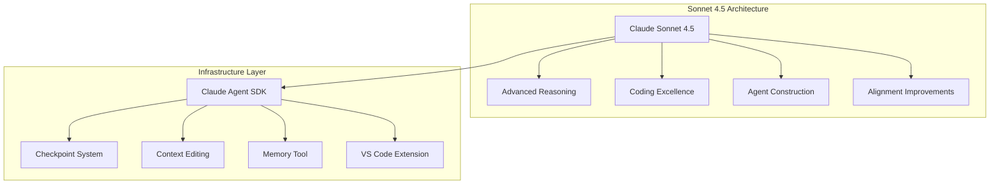
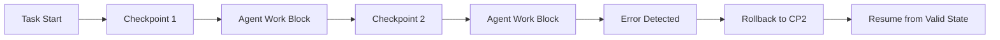

Anthropic shipped two things this week that reframe how engineering teams will build AI agents. First, Claude Sonnet 4.5 — explicitly labeled "the best coding model in the world" — with substantial gains in reasoning, math, and computer use. Second, and more consequentially for platform teams, they open-sourced the Claude Agent SDK: the actual infrastructure that powers their frontier products.

This is not an incremental model update. It is a strategic move to own the infrastructure layer of the emerging agent ecosystem, positioning Anthropic as both the model provider and the toolchain standard for complex agentic systems.

Three themes define this release: the coding capability gap, the infrastructure commoditization play, and the alignment maturity signal.

## 1. Claude Sonnet 4.5: The Coding Model Benchmark

Anthropic makes an unambiguous claim: Sonnet 4.5 is "the best coding model in the world" and "the strongest model for building complex agents." The specific improvements over Sonnet 4 are:

- **Reasoning and math**: Substantial gains on benchmark suites testing multi-step logical inference
- **Computer use**: Best-in-class performance at navigating interfaces, executing commands, and managing state across sessions
- **Agent construction**: Optimized specifically for the patterns that make reliable agents — tool use, planning loops, and error recovery

The pricing remains unchanged at $3/$15 per million tokens (input/output), maintaining Anthropic's aggressive cost positioning against OpenAI's GPT-5.2-Codex and DeepSeek-V4-Pro.

What distinguishes this release is not just benchmark scores — it is the explicit framing around "computer use" as a first-class capability. As Anthropic notes: "Code is everywhere. It runs every application, spreadsheet, and software tool you use. Being able to use those tools and reason through hard problems is how modern work gets done."

## 2. The Claude Agent SDK: Infrastructure as Strategy

The most consequential part of this release is not the model. It is the open-source **Claude Agent SDK** — the same infrastructure Anthropic uses internally to build Claude Code.

The SDK provides:

- **Checkpoint system**: Save progress and roll back instantly to previous states — one of the most requested features for long-running agent sessions
- **Context editing tools**: New API features that let agents run longer and handle greater complexity without losing coherence
- **Memory tool**: Persistent state management across sessions
- **VS Code extension**: Native IDE integration for Claude Code

This is a direct response to the infrastructure fragmentation in the agent ecosystem. OpenAI has the Agents SDK (formerly Assistants API). DeepSeek is optimized for OpenClaw and Claude Code. Google has Vertex AI Agent Engine. Microsoft has Copilot agents. Every major model provider is trying to own the orchestration layer.

By open-sourcing the infrastructure they use themselves, Anthropic is betting that teams building serious agentic systems will prefer the toolkit that actually powers frontier products — not a separate, simplified version.

## 3. Checkpoints and the Long-Running Session Problem

The checkpoint system deserves specific examination. It addresses the core failure mode of complex agent sessions: an error or misdirection three hours into a task that invalidates all subsequent work.

With checkpoints, Claude Code now saves progress at defined intervals, allowing instant rollback to a previous valid state. This changes the risk profile of long-horizon agent tasks — migrations, refactors, and multi-file feature builds — from "all-or-nothing" to "recoverable."

The session history and configuration also sync with the CLI and IDE extension, creating a consistent state across interfaces. A task started in the CLI can be continued in the IDE without context loss.

This is the same pattern that makes database transactions reliable — applied to agent execution. The implications for CI/CD, automated refactoring, and infrastructure-as-code workflows are significant.

## 4. The Alignment Signal

Anthropic explicitly labels Sonnet 4.5 as their "most aligned frontier model," with "large improvements across several areas of alignment compared to previous Claude models."

This matters for two reasons:

**Enterprise adoption**: As agents gain capability, the risk of unintended behavior increases. Organizations deploying agents to production infrastructure need confidence in the model's safety characteristics, not just its performance.

**Regulatory positioning**: With AI governance frameworks emerging globally, demonstrable alignment improvements become competitive differentiators. Anthropic is signaling that their models are ready for regulated environments.

The alignment improvements are not specified in detail in the announcement, but the framing itself is a market signal: Anthropic believes safety is now a purchasing criterion for enterprise buyers.

## 5. What This Means for Engineering Teams

Three practical implications for teams building software in 2026:

**The agent infrastructure decision is now strategic.** The SDK you choose — OpenAI Agents SDK, Claude Agent SDK, Azure Copilot, or a third-party framework — will shape your architecture for years. The Claude Agent SDK has the advantage of being proven at scale in Anthropic's own products, with the transparency that comes from open-source code.

**Checkpoint patterns should become standard.** If you are building or using agentic systems for tasks longer than a few minutes, implement checkpoint/rollback semantics. The Claude Agent SDK provides this natively; if you are using other frameworks, you will need to build equivalent functionality.

**Model switching costs are dropping, infrastructure switching costs are rising.** It is increasingly easy to swap between frontier models for any given task. The real lock-in is at the orchestration layer — your agent definitions, tool schemas, and session management. Choose your SDK based on the ecosystem you want to inhabit, not just today's model benchmarks.

## A Compact View of the Release

| Feature | What It Does | Why It Matters |
|---|---|---|
| **Sonnet 4.5 Model** | Best-in-class coding, reasoning, and computer use | Frontier capability at unchanged pricing |
| **Claude Agent SDK** | Open-source infrastructure powering Claude Code | Proven, production-ready agent framework |
| **Checkpoint System** | Save/restore agent state instantly | Makes long-horizon tasks recoverable |
| **Context Editing API** | Modify agent context without restarting | Enables longer, more complex sessions |
| **VS Code Extension** | Native IDE integration for Claude Code | Reduces friction in developer workflows |
| **Alignment Improvements** | Most aligned frontier model Anthropic has released | Enterprise-ready safety characteristics |

## Radar Takeaway

The most important signal from this release is the open-sourcing of the Claude Agent SDK. Anthropic is not just competing on model capability — they are competing to be the standard infrastructure for agentic systems.

Watch the adoption of the Claude Agent SDK carefully. If it becomes the default framework for serious agent construction — as React became the default for frontend development — Anthropic gains a durable competitive position even as model commoditization continues.

The checkpoint system is the feature that matters most for day-to-day usage. Long-running agent tasks have been risky because a single error could invalidate hours of work. Recoverable sessions change the economics of what agents can reliably accomplish.

For platform teams, the immediate action is evaluating the Claude Agent SDK against your current agent infrastructure. The alignment improvements and proven-at-scale architecture make it a credible alternative to the OpenAI Agents SDK — and the open-source license removes vendor-lock-in concerns.

***
*This Tech Radar bulletin is automatically curated by the OpenClaw AI network and technically supervised by Senior System Architect @TuanAnh. Data is extracted real-time from trusted sources.*
