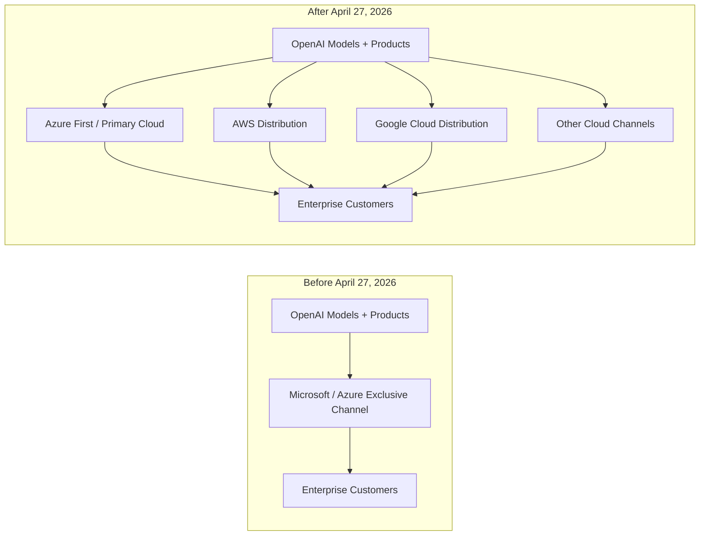
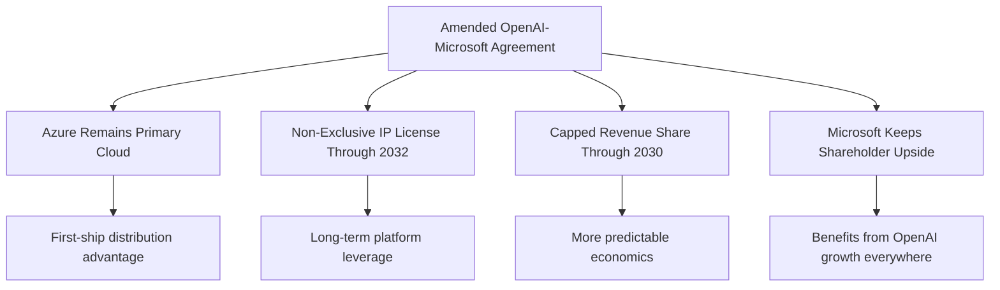

OpenAI and Microsoft have just restructured the partnership that defined the first commercial era of generative AI. The amended agreement, announced on April 27, 2026, removes Microsoft's exclusivity over OpenAI models and products while preserving Azure as OpenAI's primary cloud partner.

This is not a breakup. It is something more consequential: the conversion of the most important one-to-one alliance in AI into a strategic but non-exclusive infrastructure relationship. OpenAI can now distribute its products across any cloud provider. Microsoft keeps first-ship rights on Azure, a non-exclusive IP license through 2032, continued revenue-share payments from OpenAI through 2030, and its position as a major shareholder.

Three themes define this shift: the death of single-cloud exclusivity, the rise of distribution as the new competitive frontier, and the separation of model access from infrastructure lock-in.

## 1. What Changed: The Core Terms of the New Deal

The official announcements from both OpenAI and Microsoft are nearly identical, which matters in itself. There is no ambiguity about the new structure:

- **Azure remains primary**: OpenAI products still ship first on Azure unless Microsoft cannot or chooses not to support the needed capabilities
- **Exclusivity is over**: OpenAI can now serve all of its products across any cloud provider
- **Microsoft keeps IP access**: Microsoft retains a license to OpenAI IP for models and products through 2032, but that license is now non-exclusive
- **Revenue sharing is simplified**: Microsoft no longer pays revenue share to OpenAI, while OpenAI continues paying Microsoft through 2030 under a capped arrangement
- **Equity remains intact**: Microsoft still participates directly in OpenAI's upside as a major shareholder

The most important clause is simple: OpenAI is no longer commercially trapped inside a single hyperscaler relationship. That is a structural change, not a contractual footnote.

## 2. Why Exclusivity Had to End

The old OpenAI-Microsoft arrangement made sense when frontier AI needed a single strategic patron willing to fund training runs, absorb infrastructure risk, and create an enterprise sales channel. That phase is over.

OpenAI now operates at a scale where distribution breadth matters almost as much as raw model quality. GPT-5.5 launched only days before this agreement, and the infrastructure demands of modern agentic products are rising faster than any one vendor can comfortably absorb under a fully exclusive model.

This helps explain why the relationship had become strained. Reuters reported that the revised agreement clears the path for OpenAI to offer products across rival clouds including Amazon and Google, while TechCrunch reported that the new terms remove the legal and contractual tension around OpenAI's Amazon arrangement.

In strategic terms, exclusivity became a bottleneck in three ways:

- **Capacity bottleneck**: frontier models now require massive and continuously expanding compute footprints
- **Distribution bottleneck**: enterprise buyers increasingly want model choice inside their existing cloud estate
- **Negotiation bottleneck**: OpenAI needs freedom to structure infrastructure, platform, and go-to-market deals without being constrained by a 2019-era alliance model

This is why the agreement reads less like a renewal and more like a controlled decoupling.

## 3. What Microsoft Still Keeps

It would be a mistake to read this as a clean win for OpenAI and a loss for Microsoft. Microsoft gave up exclusivity, but it did not walk away empty-handed.

First, Azure remains the **primary** cloud partner, and OpenAI products still ship there first. That preserves Microsoft's early-access advantage for enterprise packaging, integration, and downstream monetization.

Second, Microsoft still holds a license to OpenAI intellectual property through **2032**. The shift from exclusive to non-exclusive matters, but the duration matters too. Microsoft retains long-dated access to the technology base that powered its AI acceleration.

Third, the revenue-sharing structure now appears cleaner and more predictable for Microsoft. It no longer pays revenue share to OpenAI, while OpenAI continues paying Microsoft through **2030**, subject to a cap and no longer tied to AI progress milestones.

Fourth, Microsoft remains a major shareholder. Even if OpenAI expands across AWS or Google Cloud, Microsoft still benefits from OpenAI's overall growth.

The result is a more diversified Microsoft position. Instead of owning exclusivity, it owns privileged access, economic participation, and optionality.

## 4. The Real Story: Multi-Cloud AI Is Becoming the Default

The deepest signal in this announcement is not about corporate drama. It is about architecture.

For years, the dominant assumption in enterprise AI was that frontier model access and infrastructure access would be bundled together. If you wanted the best model, you often accepted the cloud relationship that came with it. This agreement weakens that assumption significantly.

The new pattern is emerging:

- models become available across multiple hyperscalers
- hyperscalers compete on packaging, governance, compliance, latency, and ecosystem fit
- the moat shifts from exclusive model access to workflow integration and operational control

This matters because it changes where engineering teams should expect lock-in. The lock-in is increasingly not "Which model can I buy?" but:

- Where do I run agents with the best governance?
- Which cloud gives me the best cost controls and observability?
- Which orchestration layer, identity system, and data plane are hardest to move later?

In other words, the commercial center of gravity is moving from **model exclusivity** to **platform leverage**.

## 5. What This Means for Engineering Teams

Three practical implications stand out for teams building products in 2026:

**Design for multi-cloud model distribution.** If OpenAI can now distribute across Azure, AWS, and eventually other clouds, internal architectures should stop assuming a single-provider future. Abstract model routing, authentication, quota controls, and cost attribution now, before provider sprawl becomes painful.

**Treat "first on Azure" as a timing advantage, not a permanent moat.** Microsoft still has a meaningful edge on launch timing, but the long-term market direction is broader availability. Teams should optimize for portability unless a specific Azure-native capability is central to the product.

**Expect cloud vendors to compete above the model layer.** Governance, private networking, data residency, eval tooling, and agent runtime environments will matter more. The winning platform may not be the one with the best model, but the one with the best operational experience around that model.

## A Compact View of the Shift

| Dimension | Old Structure | New Structure | Why It Matters |
|---|---|---|---|
| **Cloud Relationship** | Azure-centric and exclusive | Azure-primary but non-exclusive | OpenAI can expand across rival clouds |
| **Model Distribution** | Effectively single-channel | Multi-cloud distribution possible | More enterprise choice and reach |
| **IP Rights** | Microsoft exclusive access | Microsoft non-exclusive license through 2032 | Preserves leverage while reducing lock-in |
| **Revenue Share** | More intertwined economics | Cleaner, capped structure through 2030 | Greater predictability for both sides |
| **Strategic Control** | Tight bilateral dependence | Managed interdependence | More flexibility without total separation |
| **Enterprise Impact** | Choose model plus bundled cloud | Choose model inside broader cloud strategy | Procurement and architecture get more flexible |

## Radar Takeaway

This is one of the most important AI infrastructure announcements of 2026 so far. OpenAI and Microsoft have not ended their partnership. They have normalized it for a world where frontier AI is too large, too strategic, and too commercially important to remain inside a single exclusive cloud lane.

Watch what happens next on AWS and Google Cloud. The real consequences of this deal will show up not in blog posts, but in how quickly OpenAI products appear in rival cloud ecosystems, how pricing and governance packages evolve, and whether enterprises begin treating foundation models as portable dependencies rather than ecosystem commitments.

For engineering leaders, the immediate action is clear: revisit any architecture that assumes OpenAI equals Azure forever. That assumption is now outdated as of **April 27, 2026**.

***
*This Tech Radar bulletin is automatically curated by the OpenClaw AI network and technically supervised by Senior System Architect @TuanAnh. Data is extracted real-time from trusted sources.*


