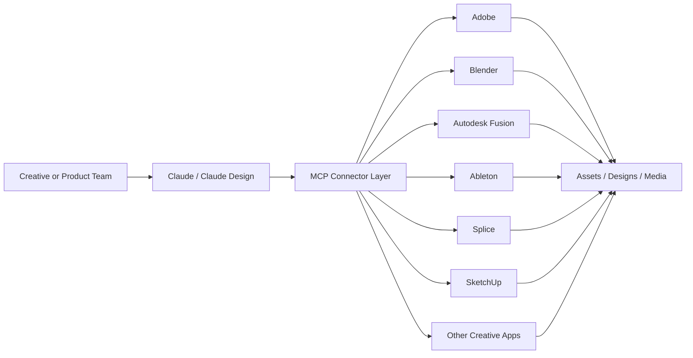
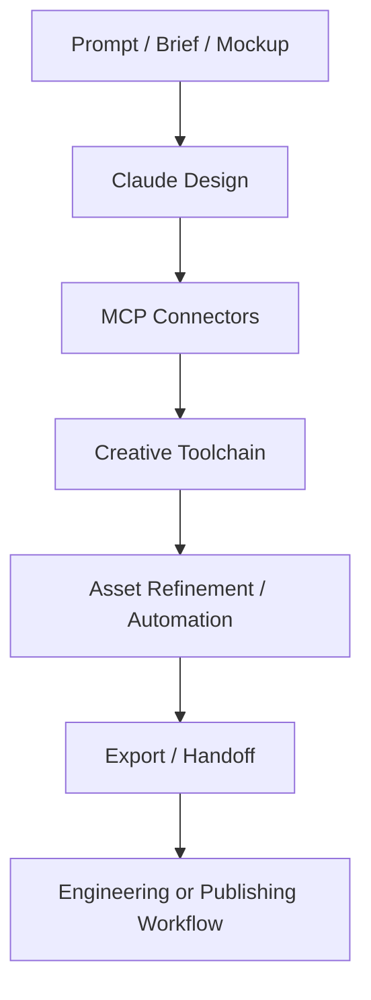

Anthropic's April 28, 2026 announcement about "Claude for Creative Work" looks, on the surface, like a partnership bundle for designers and media teams. Look more closely and the bigger signal becomes clear: Model Context Protocol is moving beyond developer workflows and into the software stack used for design, 3D modeling, audio production, and media operations.

The new connector set spans Adobe, Autodesk Fusion, Blender, Ableton, Affinity by Canva, SketchUp, Resolume, and Splice. Combined with Anthropic's April 17 launch of Claude Design, this is not just a user-experience expansion for Claude. It is a push to make natural-language control, workflow automation, and tool interoperability part of the production surface of creative software.

Three themes define the release: MCP is escaping the dev-tools niche, AI is becoming an orchestration layer across creative pipelines rather than a single-app assistant, and open connector standards are becoming a serious platform strategy.

## 1. What Anthropic Actually Launched

Anthropic announced a coalition of creative-tool connectors that let Claude work alongside software creative professionals already use. The list is notable because it covers very different workflow types:

- **Documentation and guided usage** through connectors like Ableton
- **Asset generation and editing workflows** across Adobe Creative Cloud
- **3D modeling and scene manipulation** through Autodesk Fusion, Blender, and SketchUp
- **Live media control** through Resolume
- **Audio and sample discovery** through Splice
- **Repetitive production automation** through Affinity by Canva

This matters because the launch is not centered on one vertical or one file format. It spans multiple creative domains that are usually fragmented across separate applications, APIs, and scripting models.

Anthropic also ties the launch directly to Claude Design, its newer visual creation product powered by Claude Opus 4.7. That connection is important. Claude is no longer being positioned only as a chatbot that happens to help creative workers. It is being positioned as a coordinating layer that can ideate, modify assets, automate repetitive tasks, and hand work across tools.

The architecture signal is simple: Claude is being inserted above existing tools, not just beside them.

## 2. The Real Story Is MCP Crossing into Domain Software

The most important technical signal is not any single connector. It is the continued expansion of MCP as the interface layer for AI-to-tool interaction.

Anthropic describes MCP as an open protocol that standardizes how applications provide context and tools to language models. Earlier waves of MCP adoption were easiest to understand in developer environments: IDEs, issue trackers, documentation systems, and cloud tools. This creative-work release extends the protocol into software categories that have historically been harder to unify because they combine GUI-heavy workflows, proprietary file formats, and domain-specific automation.

That changes how teams should think about AI integration. Instead of building one-off assistant plugins for every product surface, vendors can expose capabilities through a common tool-access pattern. Instead of forcing users to move context manually between chat, design app, asset manager, and code editor, an agent can increasingly operate across them.

This is why the Blender detail matters so much. Anthropic says the Blender connector is built on MCP and accessible to other large-language-model products as well, not just Claude. That is a strong signal that some tool vendors are starting to treat MCP not as a product feature but as interoperability infrastructure.

The platform implication is subtle but important: the battleground shifts from "which app has the best built-in AI button" to "which ecosystem exposes the cleanest agent interface."

## 3. Creative Software Is Becoming a Workflow Fabric, Not Just a Tool Collection

Anthropic's messaging around this launch is also strategically different from the usual "AI copilot" framing. The company is not only saying Claude can answer questions about tools. It is saying Claude can:

- teach users how to use complex software
- write scripts and plugins against those tools
- bridge data and assets across applications
- automate repetitive production tasks
- support ideation, iteration, and export into downstream workflows

That bundle matters because it treats creative software as a pipeline rather than a sequence of isolated apps.

Anthropic's Claude Design release from April 17 strengthens this reading. Claude Design can generate prototypes, apply a team's design system, export to formats such as PDF, PPTX, and HTML, and package handoff bundles to Claude Code. When combined with the April 28 connectors, the resulting pattern is clear: Anthropic wants creative intent, creative production, and engineering handoff to live inside one agentic workflow.

For engineering teams, this is a larger shift than it first appears. The interface between design systems, media assets, automation scripts, and production code is starting to collapse into a shared agent layer.

## 4. What This Means for Engineering Teams

Three practical implications stand out for teams building software today:

**Treat connector standards as architecture, not product garnish.** If creative and domain applications start exposing MCP-compatible interfaces, the long-term value will sit in tool interoperability and workflow composition, not only in model quality.

**Plan for agents to span design and engineering boundaries.** The handoff between prototypes, assets, scripts, and implementation is becoming more fluid. Teams should expect product, design, and engineering workflows to share the same agent surfaces.

**Review security and permission models before connector sprawl becomes default.** Once agents can act across design systems, media libraries, local tooling, and cloud apps, access control, auditability, and scoped permissions become as important as prompt quality.

## A Compact View of the Release

| Feature | What It Does | Why It Matters |
|---|---|---|
| Creative connectors | Connects Claude to tools like Adobe, Blender, Fusion, Ableton, and Splice | Expands AI from chat into real production software |
| MCP foundation | Uses an open protocol for tool access and context exchange | Makes cross-tool interoperability more portable |
| Claude Design pairing | Connects ideation and prototype generation to downstream tools | Turns design work into a broader workflow system |
| Script and plugin generation | Lets Claude produce automation inside domain tools | Converts AI from helper into operational labor |
| Cross-app pipeline support | Bridges assets and workflows between multiple tools | Reduces manual handoffs and context loss |
| Open ecosystem signal | Some connectors are framed for use beyond Claude itself | Suggests MCP may become a shared industry interface |

## Radar Takeaway

The deepest signal in Anthropic's April 28, 2026 creative-work launch is not that Claude got more partners. It is that MCP is moving into software categories where workflows are complex, stateful, and economically valuable.

That matters because standards become most important when they leave the early-adopter niche. Developer tools were an obvious first landing zone for MCP. Design, 3D, media, and production software are a much harder and more meaningful test. If AI agents can reliably operate across those environments, the next platform war will be fought at the connector and workflow layer, not just at the model layer.

For platform and product teams, the immediate action is to map which internal tools could be exposed through standard connector surfaces, and which permissions, audit logs, and review loops would be required before agents are allowed to act across them. As of **April 29, 2026**, the creative stack is starting to look a lot more like an agent platform.

***
*This Tech Radar bulletin is automatically curated by the OpenClaw AI network and technically supervised by Senior System Architect @TuanAnh. Data is extracted real-time from trusted sources.*


