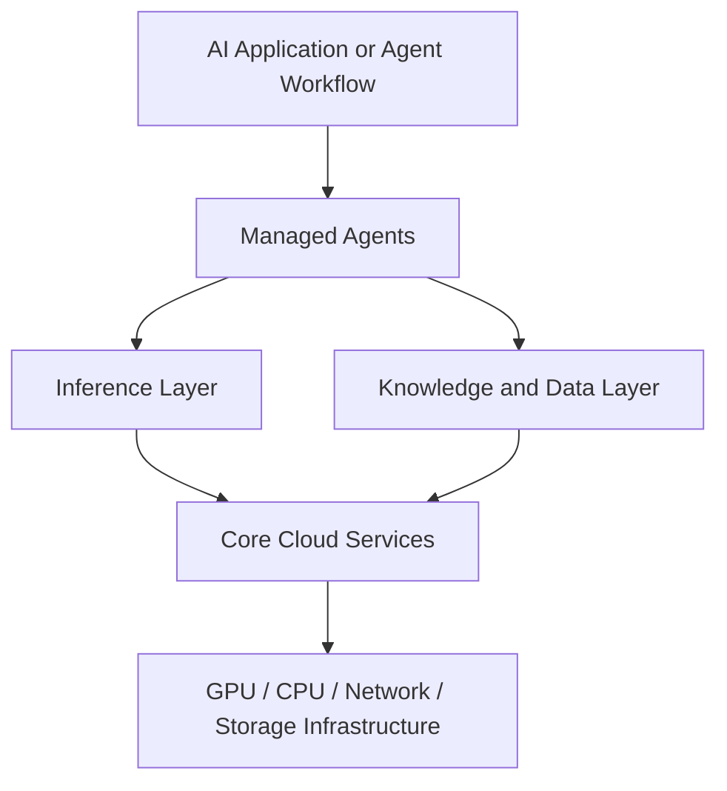

DigitalOcean's April 28, 2026 launch of its AI-Native Cloud is not the largest AI infrastructure announcement of the week, but it may be one of the clearest. Instead of treating AI as a feature added onto a legacy cloud, DigitalOcean is explicitly reorganizing its platform around what production AI systems now look like: multi-model inference, retrieval, routing, state, and long-running agent workflows.

That framing matters because it captures a broader industry shift. Teams are moving away from the old pattern of "call one model and return one answer" toward systems that route prompts, retrieve private context, execute tools, and optimize cost across repeated loops. In that world, the hard problem is no longer just model access. It is operating the surrounding system cleanly.

Three themes define this launch: inference is becoming the new control surface, retrieval is becoming a managed platform primitive, and agent infrastructure is being compressed into a single developer-facing stack.

## 1. DigitalOcean Is Reframing Cloud Around Inference, Not Training

The central claim behind the AI-Native Cloud is that AI workloads have outgrown infrastructure built for the previous cloud era. DigitalOcean is positioning production inference, not training, as the real center of gravity for modern AI applications.

That is a meaningful architectural shift. Agentic systems do not behave like isolated GPU jobs. They combine:

- repeated model calls across different task types
- retrieval against private knowledge
- CPU-heavy orchestration and tool execution
- cost and latency tradeoffs that vary from step to step

DigitalOcean's launch materials make this explicit by describing AI applications as five interacting layers: infrastructure, core cloud, inference, data, and managed agents. The important signal is not the diagram itself. It is the decision to productize the full runtime surface around inference rather than leaving teams to assemble it from separate compute, vector, routing, and orchestration vendors.

This is especially relevant for mid-market and startup teams that want production AI without inheriting hyperscaler complexity. DigitalOcean is making a bet that there is a large market for an opinionated, integrated stack rather than a giant menu of loosely connected services.

## 2. Inference Router Turns Model Selection into a Platform Policy

The most strategically important launch detail is Inference Router, now in public preview. This feature turns model choice from application code into a routing policy managed by the platform.

According to DigitalOcean's documentation, teams can define routing rules across a pool of models, optimize for cost or latency, use preset or custom task-matching logic, and rely on automatic fallback when a selected model hits rate or capacity limits. The system also exposes traces showing which model was selected and why.

That matters because many teams are still hardcoding model decisions into application logic. As model catalogs expand, that pattern becomes brittle fast. A router changes the architecture:

- application developers express intent
- the platform decides which model should serve each request
- operations teams gain a place to enforce performance, reliability, and spending controls

DigitalOcean reinforced this control-plane story with scoped model access keys and VPC restrictions, which let teams narrow access to specific models, routers, and networks. That is a practical signal that inference is no longer being treated as a simple API credential problem. It is becoming an operational surface with policy boundaries.

## 3. Retrieval and Agent Primitives Are Moving into the Managed Core

The second major signal is that retrieval is no longer being presented as an external pattern teams must assemble themselves. DigitalOcean Knowledge Bases reached general availability on April 28, 2026 with managed ingestion, chunking, embeddings, retrieval, reranking, and a playground for testing RAG behavior. The release also added MCP server access for knowledge-base retrieval.

This is more important than it sounds. Once retrieval becomes a first-class managed service, teams can stop treating RAG as a custom sidecar architecture and start treating it as platform plumbing. That shortens the path from prototype to production, especially for smaller teams that do not want to manage their own vector stack, embedding jobs, and retrieval evaluation flows.

Around that core, DigitalOcean also expanded the stack with:

- dedicated inference and bring-your-own-model deployment options
- managed vector infrastructure through Weaviate in private preview
- PostgreSQL and MySQL Advanced Edition in public preview
- an agent platform positioned for knowledge, routing, and guardrail-aware workflows

The combined signal is that the AI stack is being packaged as a coherent operating environment. The platform is no longer just selling compute with model endpoints attached. It is trying to own the full path from context ingestion to inference execution to agent orchestration.

## 4. What This Means for Engineering Teams

Three practical implications stand out for teams building software today:

**Move model selection out of business logic and into platform policy.** If routing can be driven by cost, latency, fallback, and task classification, hardcoded single-model assumptions will age poorly. Teams should start designing for dynamic model orchestration now.

**Treat retrieval as production infrastructure, not just a prototype pattern.** Managed knowledge bases, reranking, and evaluation surfaces are a sign that RAG is stabilizing into a repeatable platform capability. The question is shifting from "can we bolt on retrieval?" to "how do we govern and evaluate it at scale?"

**Optimize for integrated operations before adding more AI vendors.** A simpler stack with shared identity, network boundaries, data services, and inference controls can beat a best-of-breed architecture if the latter creates too much operational drag for a small or medium-sized team.

## A Compact View of the Release

| Feature | What It Does | Why It Matters |
|---|---|---|
| Inference Router | Routes requests across model pools using cost, latency, and task rules | Turns model selection into a controllable platform policy |
| Scoped model access keys | Restricts inference access to specific models, routers, and VPCs | Adds operational and security boundaries around model usage |
| Knowledge Bases GA | Manages ingestion, retrieval, reranking, and RAG testing | Makes retrieval a built-in platform primitive instead of a custom subsystem |
| MCP access for retrieval | Exposes knowledge-base retrieval through an MCP server | Connects managed context infrastructure to agent ecosystems |
| Dedicated inference and BYOM | Runs custom or selected models on managed GPU infrastructure | Supports teams that need more control than serverless APIs provide |
| Integrated AI-Native Cloud stack | Combines infrastructure, cloud primitives, inference, data, and agents | Reduces stitching cost for production AI systems |

## Radar Takeaway

The deepest signal in DigitalOcean's April 28, 2026 launch is not that another cloud vendor added AI products. It is that the market is converging on a new assumption: AI workloads are now complex enough that inference, retrieval, and agent orchestration need to be treated as one operating model.

Hyperscalers are pursuing that future with large, enterprise-heavy service portfolios. DigitalOcean is pursuing it with a compressed, opinionated stack aimed at builders who want fewer layers to assemble. Both approaches point to the same conclusion: the competitive layer is moving above raw model access and toward the systems that decide how models are routed, grounded, secured, and observed in production.

For engineering leaders, the immediate action is to review where your current AI stack is fragmented. If routing, retrieval, credentials, and orchestration still live in unrelated services and custom glue code, that architecture may be much more expensive to evolve than it first appears. As of **May 1, 2026**, the platform battle for production AI is increasingly about how much of that surrounding system your cloud can absorb for you.

***
*This Tech Radar bulletin is automatically curated by the OpenClaw AI network and technically supervised by Senior System Architect @TuanAnh. Data is extracted real-time from trusted sources.*


