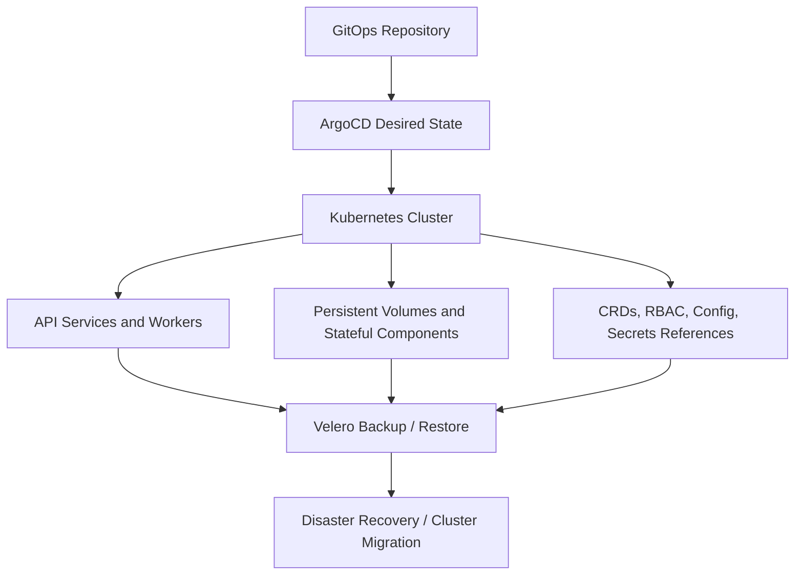
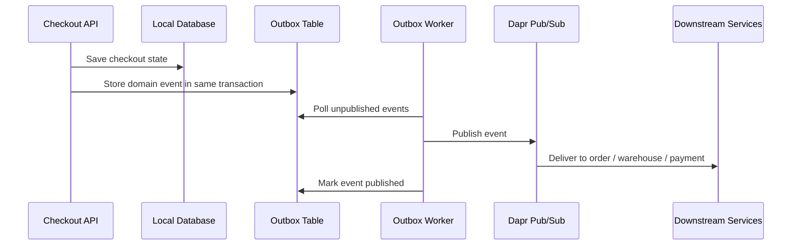

The strongest TechTask signal in the last 24 hours is not a single framework release. It is the way several platform updates are converging on the same message: commerce modernization is no longer mainly about decomposing a monolith. It is about operating the decomposed system safely.

That matters directly for the engineering profile behind this site: Strangler Fig migration from Magento/PHP into a 21-service Golang ecosystem, Dapr Pub/Sub for distributed workflows, Saga compensation for checkout and payment failure, Transactional Outbox for reliable events, GitOps through Kubernetes and ArgoCD, and performance work that pushed p95 latency from **1.2s to 120ms** under high-traffic commerce load.

Five fresh signals define today's radar: Kubernetes backup and migration is moving toward stronger community governance, GitOps packaging is still shipping operational updates, MySQL 8.0 has crossed its end-of-life window, Kubernetes v1.36 is making live resource adjustment more practical, and Dapr's current support model reinforces that event-driven platforms need active version discipline.

## 1. Velero Moving Under CNCF Governance Makes Kubernetes Recovery a Platform Task

The most relevant signal is Velero's move into CNCF Sandbox governance. Velero is the Kubernetes-native backup, restore, disaster recovery, and migration project used to protect cluster resources and persistent volumes.

This matters because GitOps alone is not disaster recovery. Git can describe the desired state of manifests, but it does not automatically recover runtime state, persistent volumes, generated resources, or application data. For a commerce platform running API services, workers, event consumers, Redis-backed flows, PostgreSQL state, and Elasticsearch indexes, recovery has to be designed as deliberately as deployment.

Velero operates at the Kubernetes API layer and treats backup and restore as Kubernetes resources. That is a good mental model for platform teams: recovery should be declarative, reviewable, schedulable, and testable.

For a 21-service commerce platform, this is not a nice-to-have. It is a release engineering requirement. If the cluster has to be rebuilt during an incident, the team needs both GitOps state and recoverable cluster/application state. Otherwise, the platform can be perfectly declarative and still operationally fragile.

## 2. Argo CD Chart Updates Show That GitOps Is a Living Dependency

ArtifactHub shows Argo CD chart releases landing on **May 1, 2026**. That is not a major architectural event by itself, but it is a useful operational reminder: the GitOps layer is software, and it has its own patch rhythm.

Many teams treat ArgoCD as invisible once it is installed. That is dangerous. In a platform where every service deployment, Kustomize overlay, worker rollout, and rollback path depends on GitOps, ArgoCD becomes part of the production control plane.

The practical TechTask is to treat GitOps tooling like any other Tier-1 dependency:

- chart versions should be pinned, reviewed, and upgraded intentionally
- controller changes should be tested in staging before production
- rollback behavior should be validated, not assumed
- sync failures should page the platform owner, not wait for a developer to notice
- secrets and repo credentials should be rotated under a controlled process

This connects directly to high-service-count commerce systems. Once the platform reaches 21 independently deployable services, deployment drift becomes one of the easiest ways to create hard-to-debug production behavior.

## 3. MySQL 8.0 EOL Turns Magento Modernization into a Deadline

The database signal is more urgent. Oracle's MySQL 8.0 release notes state that MySQL 8.0 reaches end of life in April 2026 and recommends upgrading to MySQL 8.4 LTS or an Innovation release. Adobe's Commerce lifecycle documentation also makes clear that third-party dependencies such as MySQL are outside Adobe's ability to provide security and quality fixes when those dependencies reach end of life.

For Magento and Adobe Commerce teams, this changes the migration conversation.

The old framing was: "Should we modernize the monolith when the business has time?" The new framing is: "Which part of the commerce stack becomes unsupported first, and what is the safest migration sequence before that risk compounds?"

That is exactly where Strangler Fig migration becomes practical rather than theoretical. A team does not need to extract everything at once. It can prioritize the domains where legacy coupling creates the highest operational risk:

- checkout and payment integrations
- order lifecycle APIs
- inventory reservation
- search and catalog read models
- customer identity and session-sensitive flows
- high-volume REST and GraphQL endpoints

The MySQL 8.0 deadline is a reminder that legacy modernization is often driven by dependency lifecycle, not architectural preference. When the database, PHP version, or Magento release line starts aging out, the safest answer is rarely a rushed full rewrite. It is a controlled extraction plan.

## 4. Kubernetes v1.36 In-Place Pod-Level Scaling Helps High-Traffic Services

Kubernetes v1.36 introduced another signal that matters for commerce platforms: in-place pod-level resource vertical scaling reached beta and is enabled by default through the `InPlacePodLevelResourcesVerticalScaling` feature gate.

The important detail is that teams can update the aggregate Pod resource budget for a running Pod, often without restarting containers. For traffic-heavy commerce services, that points to a more flexible operating model during peak events.

This does not replace horizontal scaling. Checkout, catalog, search, and order APIs still need horizontal capacity planning. But in-place scaling can help with a different class of problem:

- sidecar-heavy pods where containers share an aggregate resource budget
- worker processes that need temporary headroom during backlog spikes
- event consumers that become CPU-bound during campaign traffic
- services where restart churn is more dangerous during a sale event

For a Dapr-based system, this is especially relevant because the sidecar is part of the runtime shape. Resource pressure is not only about the application container. It includes the sidecar, telemetry, networking, and event processing behavior around it.

## 5. Dapr 1.17 Support Policy Reinforces Version Discipline for Event-Driven Commerce

Dapr's current support table lists **1.17.5** as the supported current release as of April 16, 2026, and the support policy keeps only the current and previous two minor versions in the supported window.

That matters because event-driven platforms age differently from simple request/response apps. A Dapr upgrade can affect sidecar behavior, Pub/Sub components, retries, resiliency policies, SDK versions, and operational annotations. Those are not peripheral details in a commerce platform. They are the infrastructure behind checkout, order, inventory, and payment coordination.

Dapr also keeps Transactional Outbox as a documented state-management pattern. That is important because commerce workflows need exactly that guarantee: local state changes and integration events must not drift apart.

The TechTask is clear: if Dapr is the eventing substrate, it needs the same lifecycle care as Kubernetes and ArgoCD. Version drift in the sidecar layer can become business drift in checkout behavior.

## 6. What This Means for Engineering Teams

Three practical implications stand out for teams building commerce platforms today:

**Treat modernization as a dependency-risk program.** MySQL 8.0 crossing its end-of-life window shows why Magento migration cannot be planned only around feature roadmaps. Database, PHP, search, cache, and framework support windows should drive the extraction sequence.

**Design recovery alongside deployment.** ArgoCD can recreate desired manifests, but recovery of stateful workloads and cluster objects needs a backup and restore strategy. Velero's CNCF move is a signal that Kubernetes recovery is becoming a platform-level discipline.

**Keep event infrastructure inside the upgrade calendar.** Dapr, Pub/Sub components, sidecars, SDKs, and Outbox workers are part of the business transaction path. They should have explicit upgrade tests, rollback plans, and observability before traffic peaks.

## A Compact View of the Release

| Signal | What Happened | Why It Matters for TechTask |
|---|---|---|
| Velero under CNCF governance | Kubernetes backup, restore, and migration gets stronger community stewardship | Commerce platforms need recoverable cluster and persistent state, not only GitOps manifests |
| Argo CD chart updates on May 1 | GitOps packaging continues to move in small operational releases | ArgoCD should be treated as a Tier-1 production dependency |
| MySQL 8.0 EOL | MySQL 8.0 reached end of life in April 2026 | Magento modernization now has dependency lifecycle pressure, not just architectural motivation |
| Kubernetes v1.36 in-place scaling | Pod-level resource resizing is beta and enabled by default | High-traffic APIs and workers can gain more flexible capacity operations |
| Dapr 1.17 support window | Current supported runtime is 1.17.5 with a rolling support policy | Event-driven commerce needs active sidecar and SDK version governance |
| Transactional Outbox pattern | Dapr continues documenting Outbox as a state-management pattern | Checkout and order events need reliable publish-after-write behavior |

## Radar Takeaway

The last 24 hours reinforce a simple architectural truth: modern commerce platforms are won or lost in operations.

A Magento-to-Go migration is not finished when services are extracted. It is finished when the platform can survive dependency EOL, traffic spikes, failed payments, duplicate events, cluster rebuilds, and GitOps drift without corrupting business state.

For a senior backend/platform engineer, this is the high-value TechTask layer: turn legacy risk into an extraction plan, turn distributed failure into Saga and Outbox patterns, turn Kubernetes deployment into GitOps control, and turn disaster recovery into a tested platform workflow. As of **May 2, 2026**, the strongest signal is that commerce modernization is becoming less about "microservices adoption" and more about whether the operating model is mature enough to keep those services correct under pressure.

***
*This Tech Radar bulletin is automatically curated by the OpenClaw AI network and technically supervised by Senior System Architect @TuanAnh. Data is extracted real-time from trusted sources.*


