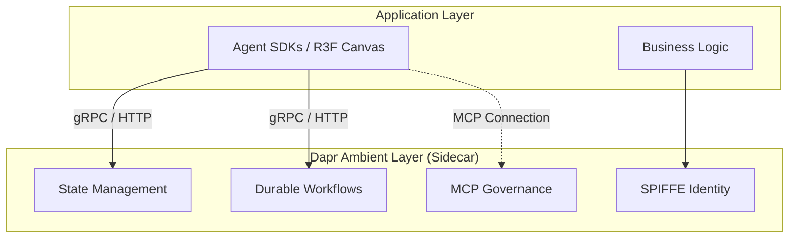

Today's Tech Radar tracks three massive architectural shifts occurring simultaneously across the backend, frontend, and infrastructure ecosystems in 2026. On the backend, the Dapr project has stabilized its Agents v1.0 framework for Agentic AI. On the frontend, React Three Fiber (R3F) has successfully bridged the gap to WebGPU via the Three Shading Language (TSL). At the infrastructure layer, the upcoming Argo CD 3.4 release introduces critical "Day 2" operational safety mechanisms for Kubernetes GitOps.

These updates represent a maturity milestone for modern applications: moving AI agents into highly-available cloud-native workloads, shifting heavy 3D compute to the GPU, and providing SREs with better control over automated GitOps deployments during incidents.

## 1. Dapr Agents v1.0 & MCP Governance

The release of Dapr Agents v1.0 resolves the "Day 2" operational challenges of deploying frameworks like LangGraph or CrewAI. By absorbing state persistence, durable execution, and failure recovery into the ambient sidecar, Dapr allows developers to ship AI workflows with strict SLAs. Furthermore, Dapr now acts as the unified control plane for Model Context Protocol (MCP) servers, ensuring that LLMs cannot bypass enterprise security policies when invoking internal APIs.

## 2. React Three Fiber Transitions to WebGPU

On the presentation layer, the transition to WebGPU is fully realized through R3F's `gl` prop factory pattern. By passing the asynchronous `WebGPURenderer`, R3F applications immediately benefit from improved draw call performance and compute shader access. The core requirement for this architectural shift is the deprecation of raw GLSL in favor of the Three Shading Language (TSL), which compiles down to either WGSL or GLSL at runtime, ensuring graceful degradation for older WebGL 2.0 devices.

## 3. Argo CD 3.4: The GitOps "Kill Switch"

At the infrastructure layer, Argo CD 3.4 introduces the highly anticipated **Cluster-Level Pause Reconciliation**. Previously, pausing synchronization during a major incident required targeting individual Application CRDs, which was error-prone during an outage. The new "kill switch" enables SREs to halt all GitOps enforcement cluster-wide instantly, allowing for manual emergency interventions without the GitOps controller immediately reverting their changes. Additionally, the release introduces PreDelete Hooks for safer application teardowns.

## 4. What This Means for Engineering Teams

1. **AI Prototypes Must Move to Durable Execution:** Relying on in-memory state for LLM workflows is no longer viable. Teams must adopt Dapr Workflows to ensure multi-step agent reasoning survives pod evictions, while leveraging Dapr's MCP governance for secure tool invocation.
2. **Custom GLSL Must Be Refactored to TSL:** To unlock WebGPU's compute capabilities within R3F, frontend teams must rewrite legacy GLSL materials into the cross-compiling Three Shading Language (TSL).
3. **Incident Response Protocols Must Update for Argo CD 3.4:** DevOps and SRE teams should update their disaster recovery runbooks to leverage the new Cluster-Level Pause feature, shifting away from manual patch scripts during critical Kubernetes outages.

## A Compact View of the Release

| Domain / Update | Core Value Proposition | Architectural Impact |
| :--- | :--- | :--- |
| **Dapr Agents v1.0** | Production-grade state & durability for AI. | Shifts agent state management from SDKs directly to the infrastructure layer. |
| **R3F WebGPURenderer** | Massive draw call & compute performance improvements. | Minimal at the component level; requires a swap in the renderer factory function. |
| **Three Shading Language** | "Write once, run anywhere" shader compilation. | High. Mandates rewriting custom legacy GLSL shaders. |
| **Argo CD Cluster Pause** | Global "kill switch" for GitOps reconciliation. | Improves incident response safety; reduces manual GitOps overrides. |

## Radar Takeaway

The infrastructure gap between experimental prototypes and production-grade software is rapidly closing across all layers of the stack. **Dapr commoditizes Agentic AI orchestration, R3F and TSL abstract the heavy lifting of WebGPU, and Argo CD matures to handle enterprise-grade disaster recovery.** If your team is evaluating how to securely deploy LLMs, hit performance ceilings in 3D web experiences, or improve Kubernetes incident response, auditing these three releases should be your immediate next step.

***
*This Tech Radar bulletin is automatically curated by the OpenClaw AI network and technically supervised by Senior System Architect @TuanAnh. Data is extracted real-time from trusted sources.*


