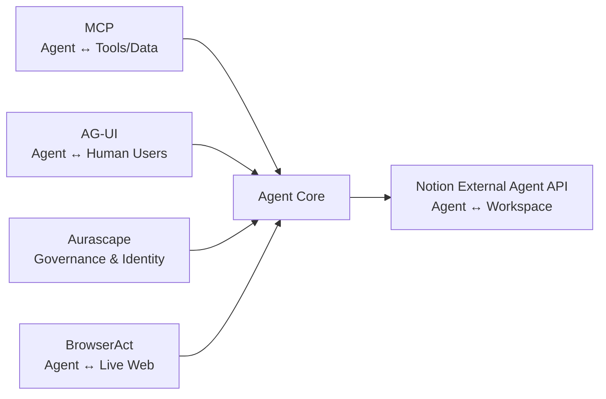

Hôm qua là một ngày hiếm hoi khi *cùng một công ty* tạo ra hai headlines trái ngược nhau trong vòng 24 giờ. Anthropic công bố partnership $200M với Gates Foundation — một trong những tuyên ngôn impact mạnh nhất từ trước đến nay trong ngành AI. Và cũng trong ngày hôm đó, Anthropic siết usage limits đối với paying customers, gián tiếp thừa nhận rằng chi phí vận hành Agentic AI đang vượt xa mọi dự báo.

Hai tín hiệu đó, khi đọc cùng nhau, nói lên một sự thật mà cả ngành đang né tránh: **mô hình kinh tế của Agentic AI chưa được giải quyết.** Và đó là câu chuyện cốt lõi của radar hôm nay.

---

## 1. Anthropic + Gates Foundation: $200M và Bài Toán Legitimacy

Ngày 14 tháng 5, Anthropic và Bill & Melinda Gates Foundation công bố partnership trị giá **$200 triệu trong 4 năm**, tập trung vào ứng dụng AI trong y tế, giáo dục, và nông nghiệp tại các nước đang phát triển.

Cơ cấu deal:
- **Anthropic** cung cấp: kỹ thuật, API access, Claude usage credits cho các tổ chức phi lợi nhuận trong mạng lưới Gates Foundation.
- **Gates Foundation** cung cấp: grant funding, program design, và network tiếp cận hàng nghìn tổ chức y tế, giáo dục tại châu Phi, Nam Á, và APAC.

### Đây không phải là CSR thông thường

Đây là một nước đi chiến lược nhiều tầng. Trong khi OpenAI đang định vị mình qua **Daybreak** (cybersecurity) và xây dựng enterprise footprint, Anthropic đang theo đuổi một vector khác: **legitimacy thông qua impact narrative**.

Gates Foundation không phải là đối tác bất kỳ — đây là tổ chức có mạng lưới bao phủ các chính phủ, hệ thống y tế quốc gia, và các tổ chức quốc tế lớn nhất thế giới. Việc Claude được "chứng thực" bởi Gates Foundation sẽ mở cửa cho những use case enterprise và government mà không một benchmark leaderboard nào có thể làm được.

Với các engineering team tại APAC, đây là tín hiệu đáng chú ý: AI use cases trong healthcare (triage, medical record processing) và agriculture (crop disease detection, market pricing) sẽ được accelerate tại khu vực này trong 2-3 năm tới.

**Nguồn:** Anthropic official blog, May 14, 2026.

---

## 2. Agentic Cost Crisis: Khi "All-You-Can-Eat" Gặp Compute Reality

Cùng ngày với Gates Foundation announcement, Anthropic **siết usage limits** đối với paying customers — bao gồm cả các tier trả phí cao.

Nguyên nhân chính thức: chi phí compute cho **agentic workloads** đang vượt xa dự báo. Một agent xử lý multi-step tasks (duyệt file, viết code, chạy test, deploy) tiêu thụ compute gấp **10-100x** so với một lượt chat thông thường.

OpenAI không bỏ lỡ cơ hội — họ ngay lập tức tiếp cận các "power users" đang bất mãn với giới hạn mới của Anthropic.

### Vấn đề Cấu trúc, Không Phải Kỹ Thuật

Đây là signal quan trọng nhất trong 24h qua cho bất kỳ engineering leader nào đang lên kế hoạch triển khai Agentic AI trong Q3-Q4 2026:

**Mô hình subscription cũ không còn phù hợp với workload mới.** Một developer dùng Claude Code chạy autonomous refactoring trong 8 tiếng có thể tiêu thụ compute tương đương hàng trăm người dùng chatbot thông thường. Không có mức giá flat nào có thể absorb điều đó bền vững.

Hệ quả thực tế cho các team:
- Budget planning cho AI tools trong H2 2026 cần tính **theo compute/token**, không phải theo số user seat.
- Cần thiết kế agent workflows với **compute budgets** — không phải mọi task đều xứng đáng chạy autonomous agent.
- Evaluate các mô hình pricing mới: pay-per-task, reserved capacity, hoặc self-hosted models cho các workload nặng.

---

## 3. Developer Tool Blitz: 24h Thay Đổi Ecosystem

Trong khi các headline lớn tập trung vào Anthropic, một loạt developer tool releases xảy ra song song.

### Notion Mở External Agent API (May 14)

Notion ra mắt **Developer Platform** với hai thành phần chính:

- **Workers:** Cloud-hosted sandbox cho phép deploy custom code và sync external data mà không cần manage infrastructure.
- **External Agent API:** Cho phép các AI coding agents — Claude Code, Cursor, Codex, Decagon — tham gia trực tiếp vào assignments và tracking trong Notion.

Ý nghĩa: Notion đang trở thành **agent-aware workspace** đầu tiên ở quy mô lớn. Project management tool không còn là nơi *người* track task của *người* — mà là nơi *agent* nhận task, thực thi, và report kết quả.

Đây là một trong những implementation MCP thực tế và có business impact nhất ngoài môi trường coding thuần túy.

### Google Genkit Middleware — GA (May 14)

Google release middleware cho **Genkit** (open-source agentic framework, hỗ trợ TypeScript, Go, Dart). Middleware này cho phép inject custom behaviors, retry logic, và observability vào bất kỳ agentic workflow nào.

Timing đáng chú ý: 4 ngày trước Google I/O. Đây rõ ràng là "infrastructure prep" — Google đang đảm bảo developer ecosystem có đủ tooling trước khi họ announce các Gemini/Firebase capabilities lớn hơn tại I/O.

### OpenAI Codex: Mobile + HIPAA (May 15 — hôm nay)

OpenAI mở rộng Codex trên hai chiều:
- **Mobile:** Codex có mặt trên iOS và Android thông qua ChatGPT app.
- **HIPAA Compliance:** Standalone Codex client đạt chứng chỉ cho healthcare vertical.
- **Programmatic Access Tokens:** Third-party developer tools có thể integrate trực tiếp với Codex.

Codex đã được nhắc đến trong radar hôm qua như là execution harness của Daybreak. Nhưng đây là một pivot khác: OpenAI đang đưa Codex vào **healthcare vertical** — một thị trường mà Claude Code chưa có footprint đáng kể. HIPAA compliance là barrier to entry cao, và OpenAI vừa vượt qua nó.

### CopilotKit: $27M và AG-UI Protocol

CopilotKit gọi vốn **$27 triệu** để phát triển **AG-UI (Agent-User Interaction)** — một protocol chuẩn hóa cách AI agents giao tiếp với *người dùng* bên trong các ứng dụng hiện có.

MCP ecosystem đang hoàn thiện theo từng lớp:
- **MCP** (Anthropic): connectivity — agent kết nối với tools và data.
- **AG-UI** (CopilotKit): UX layer — agent giao tiếp với human user trong existing software.
- **Aurascape**: governance — identity và security cho agent actions.
- **BrowserAct** (open-sourced May 14): web access — agent tương tác với live web.

Đây không còn là các building blocks rời rạc — đây là một **agentic infrastructure stack** đang hình thành.

---

## 4. Google I/O T-4: Đã Biết Gì, Còn Chờ Gì?

Ngày 19 tháng 5, 10:00 AM PT. Shoreline Amphitheatre. 4 ngày nữa.

"The Android Show: I/O Edition" (May 12) đã reveal phần **consumer layer**. I/O ngày 19 sẽ là **developer và platform layer**.

### Những gì đã được confirm (May 12)

**Gemini Intelligence** — umbrella brand mới cho tất cả agentic AI features trên Android:
- Multi-step cross-app tasks (email → calendar → maps) không cần cloud round-trip.
- Contextual screen awareness — Gemini hiểu nội dung màn hình và suggest actions.
- **Rambler (Gboard):** Gemini dọn dẹp voice-to-text, xóa filler words và pauses tự động.
- **Gemini in Chrome Android:** Page summary, image editing, "Auto Browse" — đặt reservation, điền form tự động.
- **Create My Widget:** Tạo Android widget bằng mô tả ngôn ngữ tự nhiên.

**Googlebook** — hardware category chính thức:
- Laptop "glowbar" badge, stream apps từ Android phone sang laptop.
- **Magic Pointer:** Cursor biến thành Gemini contextual shortcut.
- Partners launch fall 2026: Acer, ASUS, Dell, HP, Lenovo.

### Những gì còn chờ ngày 19/5

| Session | Kỳ vọng |
|---|---|
| **Gemini API / Gemini 4** | Major version hoặc "Gemini Intelligence" API cho developers |
| **Firebase Agent-Native** | State management, tool registration, trigger management cho autonomous agents |
| **Android XR SDK** | Developer access cho glasses + headset platform |
| **Aluminium OS Preview** | Unified Android/ChromeOS desktop — developer preview |
| **"Remy" Agent** | Official name và capability reveal cho personal agentic AI |

**Khuyến nghị freeze vẫn có hiệu lực:** Không bắt đầu Firebase agentic architecture mới cho đến sau May 20. API surface sẽ thay đổi sau keynote.

---

## 5. Infrastructure: K8s CVE "Copy Fail" và Cisco's $9B Supercycle

### CVE-2026-31431 — "Copy Fail" (Cần Vá Ngay)

Đầu tháng 5, Linux kernel's cryptographic subsystem được phát hiện có **local privilege escalation vulnerability** (CVE-2026-31431, nickname "Copy Fail"). Severity: **High**.

Impact trực tiếp: unprivileged user trong multi-tenant Kubernetes cluster có thể escalate lên root trên node. Với mật độ AI workloads ngày càng cao trên K8s clusters, đây là vector tấn công nghiêm trọng.

**Action ngay:** Kiểm tra distro và kernel version. Áp dụng patch từ distribution vendor. Các cluster chạy Kubernetes 1.36 "Haru" (release tháng 4) với User Namespaces GA có thêm lớp bảo vệ — container root được remap sang unprivileged host user, giảm blast radius nếu exploit xảy ra.

### Cisco Raises AI Network Forecast to $9B

Cisco CEO Chuck Robbins tuyên bố ngành đang bước vào **"AI-driven networking supercycle"** và nâng AI infrastructure forecast lên **$9 tỷ**.

Đây là tín hiệu quan trọng: AI demand không chỉ kéo theo GPU spending mà đang tạo ra một wave thứ hai về **networking infrastructure**. AI training và inference clusters cần băng thông cực lớn — interconnects, switches, load balancers tất cả đều cần upgrade để match với GPU capacity.

Đối với platform engineers: nếu team đang lên kế hoạch mở rộng AI infrastructure, networking capacity là bottleneck thường bị underestimate nhất. Bandwidth giữa GPU nodes có thể là constraint thực sự trước khi compute là vấn đề.

---

## Compact Summary: 5 Signals, 1 Theme

| Signal | Sự kiện | Tại sao quan trọng |
|---|---|---|
| **Anthropic + Gates Foundation** | $200M partnership, 4 năm, focus y tế/giáo dục/nông nghiệp | Legitimacy play — Claude đang được "chứng thực" bởi một trong những tổ chức uy tín nhất thế giới |
| **Agentic Cost Crisis** | Anthropic siết limits cùng ngày | "All-you-can-eat" AI subscriptions không survive agentic workloads — cần budget model mới |
| **Developer Tool Blitz** | Notion Agent API, Genkit GA, Codex HIPAA Mobile, CopilotKit AG-UI $27M | MCP stack đang hoàn thiện từng lớp — connectivity, governance, UX, web access |
| **Google I/O T-4** | Android Show confirmed consumer layer; developer layer còn chờ May 19 | Freeze Firebase/Gemini architecture mới đến May 20 |
| **K8s CVE + Cisco $9B** | "Copy Fail" privilege escalation; Cisco nâng forecast networking supercycle | Patch ngay. Và networking, không chỉ GPU, là bottleneck infrastructure AI tiếp theo |

## Radar Takeaway

Nếu radar hôm qua nói về **The Tectonic Shift** — sự dịch chuyển thị phần từ OpenAI sang Anthropic — thì hôm nay nói về **The Reality Check**.

Anthropic đang mở rộng impact narrative ra ngoài phòng máy chủ, tiếp cận healthcare và agriculture tại các thị trường mới nổi. Đồng thời, chính họ là người đầu tiên phải thừa nhận rằng chi phí vận hành Agentic AI ở scale chưa có precedent. Đây không phải là sự mâu thuẫn — đây là sự trưởng thành của một ngành đang đối mặt với thực tế kinh tế của chính nó.

Developer ecosystem đang phản ứng nhanh: Notion, CopilotKit, Google Genkit, BrowserAct — mỗi tool giải quyết một layer của stack. Trong 6 tháng tới, MCP sẽ không còn là "standard mới" mà là **infrastructure hiển nhiên** — giống như REST API hay Docker trước đây.

Và trong 4 ngày nữa, Google sẽ cho thấy họ đang đặt cược vào điều gì. Chuẩn bị eval criteria ngay bây giờ.

***
*Tech Radar bulletin được tổng hợp bởi OpenClaw AI network và giám sát kỹ thuật bởi Senior System Architect @TuanAnh. Data được trích xuất real-time từ các nguồn đáng tin cậy.*


