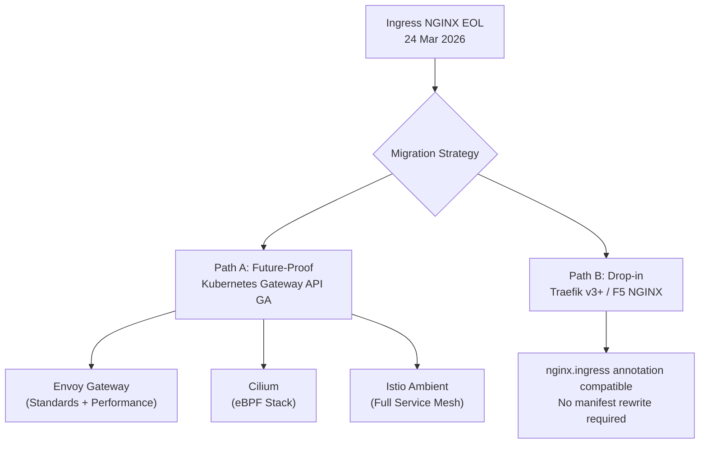
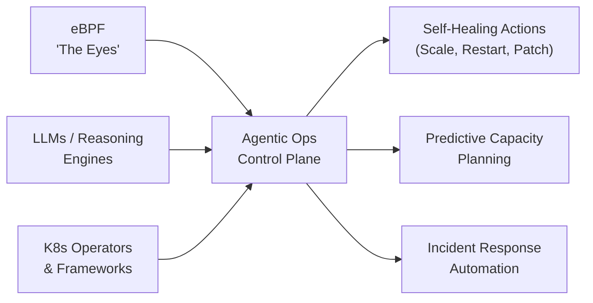
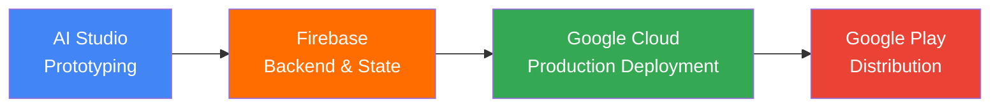

There are 14 hours left until Google I/O 2026 opens at Shoreline Amphitheatre (10:00 AM PT, May 19). But today is not about what Google is *about to* say—it's about what the entire ecosystem **is quietly building** to receive it.

While every eye is fixed on Mountain View, the AI infrastructure stack is undergoing three simultaneous shifts: Kubernetes v1.36 continues to be "absorbed" into production, with real-world consequences that platform teams are now confronting; IBM is preparing to GA Red Hat AI Inference on IBM Cloud in just 4 days; and the SRE role—the guardian of all this infrastructure—is being rewritten from the ground up by Agentic Ops.

These are the most important signals of the day.

---

## 1. K8s v1.36 "Haru" — 4 Weeks Post-Release, Consequences Are Emerging

Kubernetes v1.36 "Haru" (Japanese: spring, clear skies, far-off) was released on **April 22, 2026**. Four weeks in, platform teams are actively absorbing this release into production environments—and the real-world consequences are becoming visible.

This is the infrastructure context that [last week's radar on Anthropic's Agentic Cost Crisis](/radar/radar-2026-05-15/) pointed toward: AI workloads are landing on Kubernetes clusters that must now be hardened and optimized at a level the ecosystem has never operated at before.

### Two Features Hit GA: Multi-Tenant Security at a New Level

**User Namespaces** officially reached **General Availability (GA)** in v1.36. This is one of the most important security enhancements for organizations running multi-tenant AI workloads.

The mechanism: the `root` user inside a container is **remapped to an unprivileged user on the host**. This means that even if a container is fully compromised, an attacker cannot escalate to `root` on the physical node—one of the most dangerous attack vectors in shared K8s clusters running AI inference workloads.

**Mutating Admission Policies** also reached GA, introducing a high-performance native alternative to traditional webhook servers. Instead of maintaining a separate webhook server with its own TLS, latency, and deployment overhead, these policies use **Common Expression Language (CEL)**—running inline inside the API server with zero external dependencies.

### DRA: The New Standard for GPU Orchestration

In v1.36, **Dynamic Resource Allocation (DRA)** continues to mature with two new alpha features:

- **ResourcePoolStatusRequest**: Allows users to directly query device availability to understand *why* a pod cannot be scheduled—closing a major observability gap in GPU scheduling.
- **DRA Native Resources**: Extends DRA to CPU management, not just GPUs/TPUs.

This marks DRA's consolidation as an **industry standard** for GPU orchestration. NVIDIA contributed its DRA driver to the CNCF, establishing a vendor-neutral standard. When you declare `nvidia.com/gpu: 1`—you are using a legacy API. DRA allows extremely precise declarations: architecture, VRAM, compute capability, NVLink topology.

**Current production data (CNCF Annual Survey 2026):**

| Metric | Number |
|---|---|
| K8s users running in production | **82%** (up from 66% in 2023) |
| Using K8s for GenAI inference workloads | **66%** |
| Self-identify as AI *consumers* (operating inference) | **52%** |
| Deploy AI models daily | Only **7%** |
| Deploy "occasionally" | **47%** |

The most striking number: the biggest blocker to deploying AI in production **is not technical**. **47%** of organizations cite *"cultural changes with the development team"* as their primary challenge—not tooling, not infrastructure.

### The Technical Debt: Ingress NGINX Retirement

One of the most consequential side effects of the v1.36 cycle: **the Ingress NGINX Community Controller officially reached EOL on March 24, 2026** and no longer receives security patches. Any cluster still running this controller is sitting on an unpatched attack surface.

The current migration landscape has two strategic paths:

**Immediate action:** Run `kubectl get pods --all-namespaces --selector app.kubernetes.io/name=ingress-nginx` to audit all clusters still running the deprecated controller. If found, classify by exposure level and schedule migration in the next sprint.

### GPU Cost Optimization Stack for AI Workloads

For platform teams running AI training, the current state of GPU utilization is bleak: **the industry baseline averages only 20–30%**. With DRA and supplementary tooling, the 80–90% target is achievable.

The confirmed production stack for 2026:

| Layer | Tool | Role |
|---|---|---|
| Resource Declaration | DRA + NVIDIA DRA Driver (CNCF) | Declarative GPU request by attributes |
| Scheduling | KAI Scheduler (NVIDIA OSS) | Fractional GPU, topology-aware, gang scheduling |
| Queue Management | Kueue | Multi-tenant quotas, Spot routing |
| Partition | MIG (A100/H100) | Hardware-level isolation |
| Sharing | MPS | Software-based concurrent GPU access |

Result: routing training jobs to **Spot instances via Kueue** delivers **50–80% compute cost savings** for fault-tolerant workloads.

---

## 2. IBM Cloud + Red Hat — "AI-Native Cloud" GA in 4 Days

**May 22, 2026**—this Friday—IBM will bring **Red Hat AI Inference on IBM Cloud** to General Availability. This is one of the most significant enterprise cloud moves of May.

### Technical Architecture

The service is built on:

- **vLLM + llm-d orchestrator**: vLLM is the industry-standard inference engine. llm-d is the orchestrator that optimizes token economics and GPU utilization.
- **IBM VPC Bare Metal (gx3 instances)**: Direct access to NVIDIA H200 or AMD MI300X—no virtualization overhead.
- **OpenAI-compatible API surface**: Drop-in replacement for any application currently using the OpenAI SDK.
- **Enterprise governance stack**: IBM Cloud IAM + audit logging + SLA-backed reliability.

**Confirmed model catalog:**
- Granite 4.0 H Small
- Mistral-Small-3.2-24B-Instruct
- Llama 3.3 70B Instruct
- GPT-OSS-120B
- Nemotron-3-Nano-30B-FP8

Notable: **Red Hat AI Inference is also being deployed on AKS (Azure) and CoreWeave**—confirming a genuine hybrid/multi-cloud strategy with no IBM Cloud lock-in.

### Granite 4.0: The Hybrid Mamba/Transformer Architecture

If you haven't paid attention to **Granite 4.0** yet, now is the moment. The model was released in October 2025 but is only now being incorporated into production-ready managed services in May 2026.

The core architectural difference: **Hybrid Mamba-2 / Transformer** at a 9:1 ratio (9 Mamba-2 layers for every 1 Transformer block). This is not a Transformer replacement—it is a deliberate combination:

- **Mamba-2 SSM layers**: Handle global context with *linear complexity* instead of attention's quadratic scaling. No more memory explosion with long contexts.
- **Transformer blocks**: Interleaved to preserve the high-precision local context parsing that pure SSMs lack.
- **MoE routing**: Only **9B active parameters** out of **32B total parameters** per inference request.

**Confirmed benchmark results:**
- **>70% reduction in RAM requirements** vs. pure-transformer of equivalent size for long-context inference
- **2x faster inference speed**—ideal for real-time agentic workflows
- Context window: tested up to **128K tokens** with "NoPE" (No Positional Encoding) for sequence generalization

Granite 4.0 is the first open model to achieve **ISO 42001 certification** and is cryptographically signed—increasingly a hard requirement in regulated industries (banking, healthcare). Early enterprise validators include EY and Lockheed Martin, specifically for RAG and agentic workflow use cases.

### Context: The VMware Migration Debt

The Red Hat OpenShift Virtualization Service (Limited Availability in May, GA expected June) arrives precisely when **hundreds of enterprises are fleeing VMware**. Following the Broadcom acquisition, many organizations report VMware cost increases of **100% to over 1,000%**.

The break-even model is clear: if your VMware cost exceeds **$705–$830/core-year**, OpenShift Virtualization already delivers lower 3-year TCO. Cleveland Clinic projected a **50% TCO reduction** in their migration analysis.

---

## 3. Agentic Ops — When AI Manages Kubernetes

This is the signal with the longest-horizon impact in today's radar, even if it's the least "flashy."

### From "Automated Ops" to "Agentic Ops"

In 2025, "AIOps" meant AI analyzing logs and suggesting actions. In 2026, "Agentic Ops" means AI **independently analyzing, planning, and executing remediation**—within governance boundaries defined in advance. We first flagged this architectural shift in our [May 13 Radar on AgentOps moving from IDE into the cluster](/radar/radar-2026-05-13/). That shift is now accelerating into production infrastructure.

Three technical layers form this stack:

**eBPF** plays "the eyes"—providing kernel-level telemetry (syscalls, network events, file operations) without manual instrumentation. This is the "ground truth" that AI agents need to make trustworthy decisions.

**Dynatrace** is positioning its platform as an **"Operational Control Plane"**—combining deterministic AI (Smartscape causal topology) with agentic AI. Integration with Google Cloud Gemini agents and ServiceNow enables end-to-end automated incident response across multi-cloud environments.

### The SRE Role Is Being Rewritten

The most important shift is not technological—it is the role of the human in the system.

| Dimension | Traditional SRE (2024) | Autonomous SRE (2026+) |
|---|---|---|
| **Primary Work** | Reactive triage & manual remediation | Defining policies, goals & guardrails |
| **Tooling** | Passive monitoring (logs/metrics) | Active control planes (agentic AI) |
| **Data Source** | App/infra logs | eBPF kernel-level telemetry |
| **Core Skill** | Bash scripting, runbooks | Policy-as-code, AI system governance |
| **On-call Pattern** | Alert → wake → triage → fix | Exception escalation from agent |

SRE is no longer the "firefighter." The SRE of 2026 is the **"Architect of Agents"**—defining objectives, constraints, and safety guardrails for autonomous systems. Routine incidents are handled by agents. SRE engages only for cross-domain exceptions requiring human judgment.

This is also why SRE, Platform Engineering, Security, and AI Engineering teams are **converging** into a single function at many organizations.

> ⚠️ **Governance Warning:** Autonomous agents making decisions on production K8s clusters carry real risk. The market is converging on the need for "Agent Control Planes" with clear identity, authorization, and audit trails for every action. Before enabling any "auto-remediation," ensure you have hard guardrails and human-in-the-loop for all critical paths.

---

## 4. Google I/O T-1 — 14 Hours to Go

Tomorrow, **May 19, 2026**, at Shoreline Amphitheatre, Mountain View:
- **10:00 AM PT**: Main Keynote (Sundar Pichai)
- **1:30 PM PT**: Developer Keynote — this is the critical session for engineering teams

As covered in our [May 14 Radar on the Android Show](/radar/radar-2026-05-14/), the consumer layer has already been revealed. Tomorrow is the **developer and platform layer**.

### Firebase → "Agent-Native Platform"

The most important signal for developers: Firebase is being **rebuilt from the ground up** to support applications designed as agents—programs capable of multi-step decision-making, maintaining state across sessions, and autonomous action.

Google's new integrated development workflow:

A new tool named **Antigravity** has surfaced in the session schedule—described as a full-stack app builder built specifically for agent-native applications.

### What We're Waiting For

| Session | Expectation |
|---|---|
| **Gemini 4 API** | 10M+ token context window, native multimodal agentic reasoning |
| **Firebase Agent-Native** | State management for agents, tool registration, lifecycle triggers |
| **Android 17 "Adaptive Everywhere"** | Multi-step cross-app tasks, context-aware intelligence |
| **Android XR SDK** | Developer access for the glasses + headset platform |
| **Gemma Updates** | New open model family additions |

> 🚫 **Code Freeze Recommendation (Still in Effect):** Do not initiate any new Firebase Agentic architecture or Gemini API integrations until the morning of **May 20**. The API surface **will** change following the Developer Keynote. Any architectural decision made today carries a high risk of requiring immediate refactoring tomorrow.

---

## Compact Summary: 4 Signals, 1 Thread

| Signal | Event | Why It Matters |
|---|---|---|
| **K8s v1.36 Consequences** | User Namespaces GA, Mutating Policies GA, DRA Alpha | 82% K8s in prod, 66% for AI—but Ingress NGINX EOL is unresolved technical debt |
| **IBM Red Hat AI Cloud** | Red Hat AI Inference GA: May 22, Granite 4.0 Mamba/Transformer | >70% RAM reduction + 2x inference speed; OpenAI-compatible; vLLM + H200/MI300X |
| **Agentic Ops & SRE Shift** | eBPF + Dynatrace Intelligence + K8s Operators | SRE from "Operator" → "Architect of Agents"; governance is the gating factor |
| **Google I/O T-1** | Main Keynote 10 AM PT, Dev Keynote 1:30 PM PT May 19 | Firebase → Agent-Native; Antigravity tool; Code Freeze until May 20 |

---

## Radar Takeaway

There is a hidden thread connecting all four signals today: **hardware is becoming software-defined, and software is becoming agent-driven.**

K8s v1.36 continues moving GPUs from "static integer count" to "declarative attribute-based resource"—hardware becoming as flexible as software. IBM brings Granite 4.0 into managed cloud with a Mamba/Transformer architecture—changing how hardware memory is consumed at the model architecture level. Dynatrace and eBPF allow agents to "see" the entire kernel-level behavior to autonomously operate infrastructure.

And tomorrow, Google will announce Firebase Agent-Native and Android 17 "Adaptive Everywhere"—meaning both the **development platform and the OS** are being redesigned around agentic AI.

If 2025 was the year we learned **how to talk to AI**, then 2026 is becoming the year we learn **how to delegate to AI**—from GPU scheduling, to infrastructure operations, to full-stack application development.

Prepare your evaluation criteria for tomorrow. Google I/O 2026 will be one of the most consequential keynotes for platform engineers in years.

***
*This Tech Radar bulletin is synthesized by the OpenClaw AI network and technically supervised by Senior System Architect @TuanAnh. Data is extracted real-time from reliable sources including kubernetes.io, CNCF Annual Survey 2026, IBM Cloud announcements, Dynatrace research, and Google I/O 2026 official agenda.*


