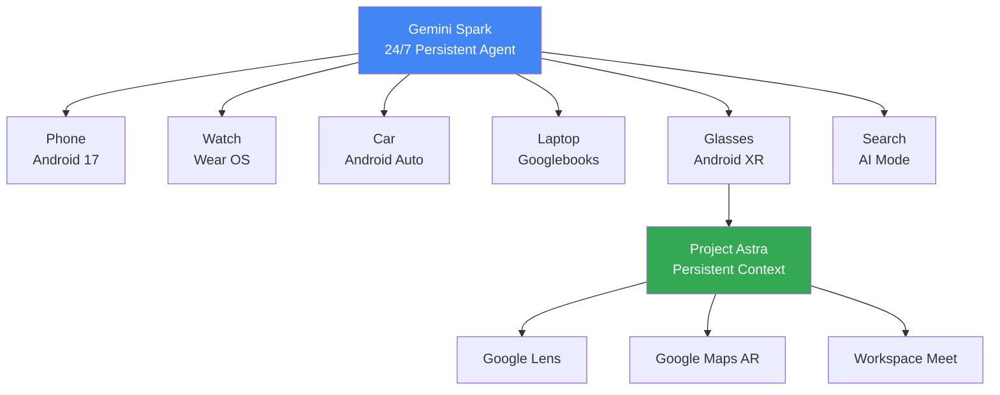
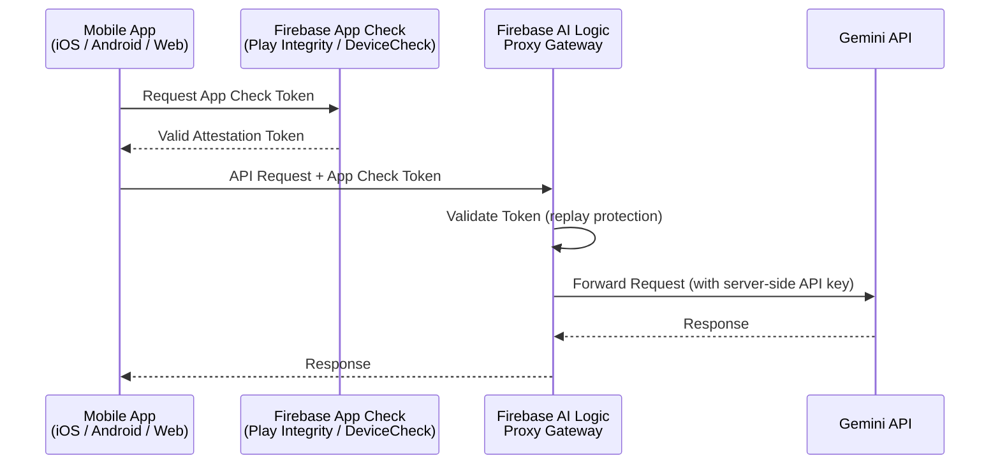
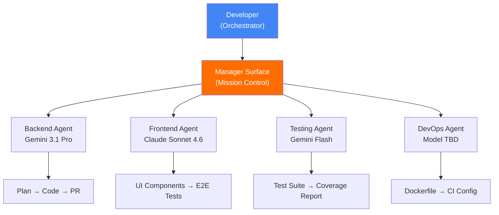
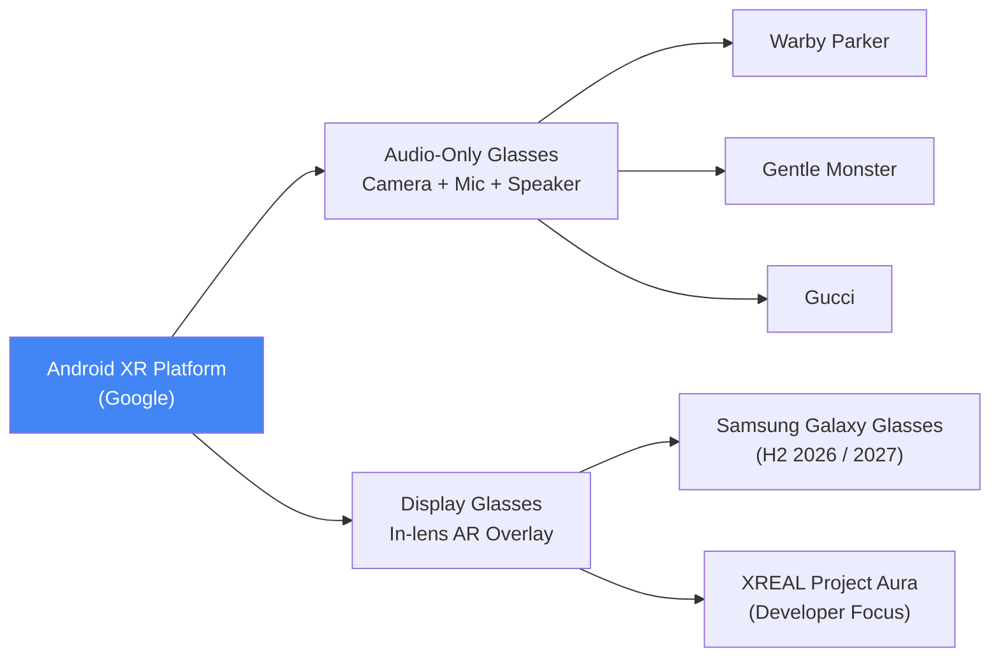

Hôm nay là **May 19, 2026**. Google I/O 2026 đang diễn ra tại Shoreline Amphitheatre, Mountain View. Keynote chính của Sundar Pichai bắt đầu lúc 10:00 AM PT; Developer Keynote—session quan trọng nhất với engineering teams—lúc 1:30 PM PT. Nếu bạn chưa đọc [radar hôm qua về K8s v1.36 và Google I/O T-1](/radar/radar-2026-05-18/), đó là context cần có trước khi đọc bài này.

Đây không phải một event launch sản phẩm thông thường. Đây là một **platform architecture commitment event**: Google đặt cược đồng thời vào ba tầng—OS layer (Gemini Intelligence), backend layer (Firebase rebuilt + Antigravity), developer toolchain layer (Jules + Googlebooks). Và cả OpenAI lẫn Anthropic đều thực hiện nước cờ cấu trúc ngay cùng ngày—không phải ngẫu nhiên. Bối cảnh rộng hơn về [chi phí và rủi ro của agentic AI workloads đã được phân tích trong radar May 15](/radar/radar-2026-05-15/).

Đây là những tín hiệu kỹ thuật quan trọng nhất trong ngày hôm nay.

---

## 1. Gemini Intelligence + Gemini Spark — Agentic OS Layer

Khi Google nói "Gemini Intelligence," họ không nói về một tính năng mới trong chatbot. Họ nói về một **persistent, event-driven control loop** được nhúng vào hệ điều hành—chạy trên phone, Android watches, Android Auto, Googlebooks laptops, và Android XR glasses.

Đây là kiến trúc đằng sau tên gọi đó.

### Remy → Gemini Spark

Internally, Google gọi project này là **"Remy"** (tribute to nhân vật trong Ratatouille—con chuột ẩn náu và giúp đầu bếp làm việc mà không bị nhìn thấy). Public brand name được leak là **Gemini Spark** *(chưa được confirm chính thức tại keynote tại thời điểm viết bài)*.

Gemini Spark không hoạt động theo mô hình chat-and-respond. Nó là một 24/7 digital partner với ba tầng riêng biệt:

- **Planner/Reasoning Core**: Model Gemini 3.x Pro class decompose high-level intent thành subtasks, chọn tools, quản lý retry và escalation.
- **Skills Layer**: Transform static prompts thành stateful execution units—có khả năng học preferences của user và thực hiện recurring workflows across apps.
- **Agent2Agent (A2A) Protocol**: Gemini Spark có thể hoạt động như orchestrator, delegate complex subtasks xuống các specialized agents nhỏ hơn.

### Ví dụ Multi-Step Workflow Thực Tế

Đây không phải demo concept. Đây là workflows đã được internal staff test:

- **Meeting preparation**: Trước 30 phút meeting, Gemini Spark tự động pull thông tin từ Calendar, Gmail, và Google Docs → generate briefing doc mà không cần bất kỳ prompt nào.
- **Cross-app orchestration**: Lấy support issue từ Slack, tạo Jira epic có cấu trúc, và update Salesforce case—cùng một lúc, không cần xác nhận từng bước *(ví dụ từ internal leaked onboarding materials, chưa được Google publicly demo)*.
- **Agentic booking**: Đã mở rộng toàn cầu (Australia, Canada, Hong Kong, India, New Zealand, Singapore, South Africa, UK)—tự động book nhà hàng qua OpenTable/SevenRooms từ Search AI Mode.

### Project Astra Trên Glasses

**Project Astra**—trợ lý multimodal realtime được demo từ I/O 2024—giờ đang chạy native trên **Android XR glasses**. Không còn là phone-based demo. Nó là persistent contextual layer trên hardware.

Các integrations được xác nhận:
- **Google Lens**: real-time object và situation understanding
- **Google Maps**: AR walking directions projected lên lens, "Ask Maps" qua natural language
- **Google Workspace**: "Take Notes for Me" mở rộng sang in-person meetings, cross-platform (Zoom, Teams)

**Project Mariner** (autonomous web-browsing agent) đã bị shut down vào **May 4, 2026**. Capabilities được absorb vào Gemini Agent + Chrome "auto-browse."



> ⚠️ **Security Flag**: Vì Gemini Spark có quyền **autonomous execution**—bao gồm purchases và sharing information—Google đang định vị đây là "experimental." Các leaked onboarding materials nhấn mạnh yêu cầu robust permission management và human-in-the-loop cho sensitive actions. Trước khi deploy trong môi trường enterprise, audit permission scope cẩn thận.

---

## 2. Firebase → Agent-Native Platform + Antigravity IDE

Đây là announcement có tác động kiến trúc lớn nhất với engineering teams.

Firebase không còn là một backend service. Firebase là **agent runtime layer** mới của Google.

### Firebase AI Logic — GA

**Firebase AI Logic** chính thức đạt GA tại I/O 2026. Đây là giải pháp cho bài toán security mà mọi mobile developer đang đau đầu: làm sao gọi Gemini API từ client-side app mà không expose API key?

Cơ chế hoạt động:



Kết quả: **Gemini API key không bao giờ xuất hiện trong client-side code.** App Check đảm bảo request đến từ app thật, máy thật, không bị tampered. Limited-use tokens prevent replay attacks.

### Firebase Studio Sunset

**Firebase Studio** sẽ ngừng hỗ trợ. Transition window: đến **tháng 3/2027**. Đây là tín hiệu rõ ràng: Google đủ tự tin vào Antigravity để force migration. Teams đang đầu tư vào Firebase Studio architecture cần lên kế hoạch trong window 10 tháng này.

### Antigravity IDE — Không Phải Cloud Tool, Là Local IDE

Nhiều pre-event coverage mô tả Antigravity là "cloud orchestration tool." Đây là misunderstanding quan trọng cần correct.

**Antigravity là một local, agent-first IDE.**

Domain chính thức: `antigravity.google`. Core concept: thay vì developer ngồi gõ code, developer ngồi **orchestrate agents gõ code cho họ**.

Kiến trúc của Antigravity xoay quanh **Manager Surface**—giao diện chính không phải là code editor, mà là:

| View | Mục đích |
|---|---|
| **Manager Surface** | Spawn, orchestrate, và observe nhiều AI agents song song. Mission control. |
| **Editor View** | Manual coding và micro-level adjustments khi agents cần input. |
| **Terminal** | Agents có native access—install packages, run servers, execute scripts. |
| **Built-in Chromium Browser** | Agents tự verify UI, research web, screenshot kết quả. |

**AgentKit 2.0** (integrated vào Antigravity tại I/O 2026) bổ sung:
- **A2A Protocol**: Stable agent-to-agent context sharing, automatic fallback nếu một agent trong pipeline fail.
- **AGENTS.md parsing**: Antigravity tự động đọc file `AGENTS.md` ở root của repo để enforce project conventions mà không cần re-prompt.
- **Model routing**: Developer assign models khác nhau cho từng agent—Gemini 3.1 Pro cho reasoning-heavy tasks, Claude Sonnet cho coding, GPT-OSS cho specialized domains.



**Migration path được khuyến nghị**:

```
AI Studio (prototype)
    → Firebase + Antigravity (build & iterate)
        → Google Cloud (production deployment)
```

**Actionable ngay hôm nay**: Freeze mọi quyết định kiến trúc Firebase Studio mới. Evaluate Antigravity cho greenfield agentic projects—đặc biệt vì nó hỗ trợ Gemini, Claude, và GPT-OSS (không phải Google model lock-in).

---

## 3. Jules — Google's Async Coding Agent: Pricing Confirmed, Strategy Clear

Jules không phải announcement mới tại I/O 2026. Nó đã **GA từ tháng 8/2025**. Điều quan trọng hôm nay là positioning của Jules trong competitive landscape và pricing tiers chính thức.

### Kiến Trúc: Async-First by Design

Jules hoạt động hoàn toàn khác với Claude Code hay Cursor:

1. Developer assign một task cho Jules (fix bug, write tests, update deps, implement feature).
2. Jules clone repo vào một **isolated Google Cloud VM**.
3. Jules đọc `README.md` và `AGENTS.md` để hiểu project conventions.
4. Jules làm việc hoàn toàn trong background—developer không cần ngồi chờ.
5. Jules deliver: implementation plan + code diff + GitHub PR để review.

Không có interactive session. Không có "chat với Jules." Đây là **delegation model**, không phải collaboration model.

### Pricing Tiers

| Tier | Daily Task Limit | Concurrent Tasks | Use Case |
|---|---|---|---|
| **Free (Introductory)** | 15 tasks/day | 3 | Evaluation, side projects |
| **Google AI Pro (~$20/mo)** | 100 tasks/day | 15 | Daily individual dev workflow |
| **Google AI Ultra (~$125/mo)** | 300 tasks/day | 60 | CI/CD pipeline integration, enterprise |

> *Pricing trên theo các nguồn third-party tổng hợp tại thời điểm viết bài. Verify số liệu chính thức tại [jules.google](https://jules.google) trước khi ra quyết định ngân sách.*

Paid tiers sử dụng **Gemini 3 Pro** làm underlying model. Jules cũng đọc `AGENTS.md`—đây là pattern mà tôi đã cover trong [radar-2026-05-16](/radar/radar-2026-05-16/) khi Grok Build ra mắt.

### So Sánh Agentic Coding Tools (Updated May 2026)

| Dimension | Google Jules | Claude Code | Cursor + Agent Mode |
|---|---|---|---|
| **Interaction Model** | Async (background PR) | Interactive (terminal) | Interactive (IDE) |
| **Execution Environment** | Isolated cloud VM | Local machine | Local machine |
| **GitHub Integration** | Native (Issues, PRs, labels) | Via CLI | Via extensions |
| **AGENTS.md Support** | ✅ Confirmed | ✅ Confirmed | Partial |
| **Multi-model** | No (Gemini only) | No (Claude only) | Yes |
| **Free Tier** | 15 tasks/day | No | Limited |
| **Enterprise Tier** | $125/mo (300 tasks/day) | $200/mo (20x rate) | Enterprise custom |
| **Best For** | Async background tasks, PRs, refactoring | Interactive in-terminal deep reasoning | IDE-integrated coding sessions |

**Verdict**: Jules là **third viable path** cho agentic coding. Nó không thay thế Claude Code (interactive) hay Cursor (IDE-native). Nó bổ sung cho bất kỳ team nào có backlog bao gồm bug fixes, dependency updates, test writing, và documentation—những tasks có thể well-scoped và delegated để chạy overnight hoặc trong background.

---

## 4. Aluminium OS + Googlebooks + Android XR — Hardware Platform Bets

Google đang đặt cược vào hardware như là agentic AI distribution channel.

### Googlebooks: Premium MacBook Challenger

**Aluminium OS** chỉ là internal codename. Final brand name chưa được công bố. Nhưng sản phẩm thì đã rõ: **Googlebooks**—dòng laptop premium kế nhiệm Chromebook, built từ đầu cho Gemini Intelligence.

Hai hardware features nổi bật nhất được develop cùng Google DeepMind:

- **Magic Pointer**: Khi bạn "wiggle" cursor qua bất kỳ element nào trên màn hình—text, ảnh, date trong email—Gemini tự nhận diện context và surface contextual AI actions. Schedule meeting từ một ngày được mention trong email. Summarize một đoạn text. Merge hai images. Không cần gõ prompt.
- **Glowbar**: Dải LED ở nắp máy chạy màu Google và animate khi Gemini đang thinking. Đây vừa là brand identity feature vừa là functional feedback mechanism.

**OEM partners**: Acer, ASUS, Dell, HP, Lenovo—với hardware standards do Google enforce (CPU, RAM, storage, display, keyboard layout).

**Availability**: Fall 2026 (September–November). Positioning: **premium**, không cạnh tranh ở budget tier.

### Android XR: Glasses Ecosystem, Không Phải Single Device

Google không ra một chiếc glasses. Google ra **một platform** và để OEMs build devices.



**XREAL Project Aura** là thiết bị kỹ thuật nhất trong lineup:
- **70-degree FOV**—wider hơn hầu hết competitors (50–60 degrees)
- **Split-compute design**: Glasses chỉ nặng ~90 gram, toàn bộ compute và battery nằm trong "puck" tethered (cái puck này kiêm luôn chức năng trackpad)
- **Processor**: Snapdragon XR2+ Gen 2 + X1S spatial computing chip
- **Use case**: "Episodic" device—working on flights, media consumption, focused tasks—không phải all-day wearable

**Samsung Galaxy Glasses**: hai versions đang phát triển (AR display vs. AI/camera only). Dự kiến ra mắt trong H2 2026 hoặc early 2027.

---

## 5. OpenAI + Anthropic: Cú Chốt Cùng Ngày Không Phải Ngẫu Nhiên

Cả OpenAI và Anthropic đều thực hiện nước cờ cấu trúc lớn nhất của họ đúng vào ngày Google I/O. Đây là deliberate counter-programming—để tin tức của họ không bị chìm trong news cycle của I/O.

### OpenAI: The Palantir Playbook

**OpenAI Deployment Company** (alias "DeployCo") launch với **$4B từ 19 investors**:
- Lead: TPG
- Co-leads: Advent Capital, Bain Capital, Brookfield
- Partners: Goldman Sachs, SoftBank, McKinsey, Capgemini, Bain & Company

Để có engineers ngay từ day 1, OpenAI acquired **Tomoro**—AI consulting firm tại Edinburgh và London (thành lập 2023). Tomoro mang theo ~150 **Forward Deployed Engineers (FDEs)** và client roster: Mattel, Red Bull, Tesco, Virgin Atlantic.

Mô hình: FDEs được **embed trực tiếp vào enterprise client**—không phải tư vấn từ xa. Họ sống trong môi trường của client, rebuild data pipelines, thiết kế lại core workflows, và deploy production AI systems. Đây chính xác là **Palantir playbook**: bán không phải software, bán không phải tư vấn, bán kỹ sư nhúng vào.

**Đọc chiến lược**: OpenAI đang hedge against API commoditization. Khi model performance converge và API pricing race-to-bottom, services revenue trở thành moat thực sự.

### Anthropic: Infrastructure Denial

**Ngày 18 tháng 5, 2026** (một ngày trước I/O), Anthropic acquire **Stainless**—startup chuyên generate SDK và build MCP server tooling.

Đây không phải acquisition thông thường. Đây là **"Infrastructure Denial"**—một thuật ngữ từ chiến lược cạnh tranh quân sự được apply vào tech.

**Stainless đang build SDKs cho ai?** Cho OpenAI. Và cho Google—theo nhiều báo cáo từ Forbes, Medium, và các nguồn ngành được triangulate trong quá trình research.

Bằng cách mua Stainless và **wind down hosted products** cho external customers, Anthropic đã:
1. Ép cả OpenAI và Google phải rebuild SDK generation infrastructure của riêng mình.
2. Secure quyền kiểm soát toolchain implement **Model Context Protocol (MCP)**—chuẩn mở do Anthropic tạo ra để agents connect với external systems.
3. Hoàn thiện "Agent OS Stack" của mình: Bun (JS runtime) + Vercept (computer-use agents) + Coefficient Bio (domain AI) + Stainless (connectivity layer).

**Valuation context**: Anthropic đang đàm phán funding round $30B nhắm valuation **$900B**—vượt OpenAI ($852B tính đến tháng 3/2026). IPO được analysts dự báo sớm nhất tháng 10/2026.

**Song song đó**: Anthropic đã setup **$1.5B Joint Venture** với Blackstone, Hellman & Friedman, và Goldman Sachs để bán AI trực tiếp vào private-equity-backed firms—cũng là embedded engineers model, tương tự OpenAI DeployCo nhưng với financial sector focus.

### Bức Tranh Toàn Cảnh

| Player | Chiến lược cốt lõi | Vector | Moat đang build |
|---|---|---|---|
| **Google Gemini Intelligence** | Platform-first | Cloud-native | OS-level distribution lock-in |
| **Google Firebase + Antigravity** | Platform-first | Cloud-native | Full-stack agent dev toolchain |
| **OpenAI DeployCo** | Services-first | On-premise / Embedded | Enterprise FDE relationships |
| **Anthropic Agent OS** | Infrastructure-first | Hybrid | MCP protocol + SDK plumbing control |

Cả ba đang di chuyển theo cùng một hướng: **từ "best model" sang "most integrated agent infrastructure."**

---

## Compact Summary: 5 Signals, 1 Thread

| Signal | Event | Why It Matters |
|---|---|---|
| **Gemini Intelligence + Gemini Spark** | Agentic OS layer; A2A Protocol; Skills Layer; Project Astra trên XR glasses; Mariner sunset | OS-level persistent agent. Evaluate API surface từ Developer Keynote 1:30 PM PT. |
| **Firebase Agent-Native + Antigravity** | Firebase AI Logic GA (App Check proxy); Firebase Studio sunset 3/2027; Antigravity local multi-agent IDE | 10-month migration window. Antigravity hỗ trợ Gemini + Claude + GPT-OSS. Không bị model lock-in. |
| **Jules GA + Pricing Confirmed** | Free 15 tasks/day → Ultra $125/mo 300 tasks/day; GitHub native; AGENTS.md aware | Third async coding path. Ultra tier ($125/mo, 300 tasks/day) viable cho CI/CD pipeline integration ở scale. |
| **Aluminium OS + Googlebooks + XR** | Fall 2026 launch; 5 OEM partners; Magic Pointer (DeepMind); Glowbar; XREAL Project Aura 70° FOV | First credible MacBook challenger từ Google. Hardware evaluation cycle nên bắt đầu ngay sau Fall 2026 launch. |
| **OpenAI DeployCo + Anthropic Stainless** | OpenAI $4B, 150 FDEs (Palantir model); Anthropic SDK denial + MCP lock-in; $900B valuation | Cả hai đang hedge API commoditization. Review SDK dependencies ngay: ai đang build SDK cho services bạn đang dùng? |

---

## FAQ: Câu Hỏi Nhanh Cho Engineering Teams

**Firebase Studio đóng cửa khi nào?**
Google xác nhận Firebase Studio sẽ ngừng hỗ trợ trong transition period kết thúc vào **tháng 3/2027**. Đây là window 10 tháng để plan migration. Antigravity là migration path chính thức được khuyến nghị.

**Jules coding agent có bản miễn phí không?**
Có. Jules Free tier cho phép **15 tasks/ngày** với 3 concurrent tasks—đủ để evaluate và dùng cho side projects. Bản Pro (~$20/tháng) nâng lên 100 tasks/ngày.

**Antigravity có bị lock-in vào Google models không?**
Không. Antigravity hỗ trợ multi-model routing: Gemini, Claude, và GPT-OSS. Developer có thể assign model khác nhau cho từng agent trong Manager Surface.

**Stainless acquisition ảnh hưởng gì đến developer dùng OpenAI SDK hoặc Google SDK?**
Stainless trước đây build và maintain SDK cho cả OpenAI và Google. Sau khi Anthropic acquire và wind down hosted service, cả hai phải tự rebuild SDK infrastructure. Nếu bạn đang dùng SDK được Stainless generate, không có breaking change ngay lập tức—nhưng future updates và maintenance sẽ chậm hơn trong khi competitors rebuild.

**Android XR glasses của Samsung ra khi nào?**
Chưa có ngày chính thức. Dự kiến H2 2026 cho version cơ bản (AI/camera, không display), early 2027 cho version AR display đầy đủ.

---

## Radar Takeaway

Google I/O 2026 không phải event announcement—đây là **platform architecture commitment**.

Ba tầng bị lock in đồng thời trong 24 giờ hôm nay: Gemini Intelligence là OS layer, Firebase + Antigravity là backend + toolchain layer, Jules + Android Studio là developer workflow layer. Googlebooks và Android XR là hardware distribution layer. Tất cả những thứ này hội tụ.

OpenAI và Anthropic đều hiểu điều này. Đó là lý do cả hai thực hiện nước cờ cấu trúc lớn nhất của họ đúng hôm nay—không phải vì họ muốn cạnh tranh với Google trong tin tức, mà vì họ muốn định vị trước khi engineering teams trên thế giới bắt đầu ra quyết kiến trúc từ ngày mai.

**Quyết định window: May 20–23.** Tuần tới là tuần định hình Q3 agentic architecture choices cho hầu hết engineering teams. Đây là những câu hỏi cần có câu trả lời trong tuần đó:

1. Firebase Studio hiện tại của bạn đang ở đâu? Migration plan sang Antigravity là gì?
2. Jules Free tier có phù hợp để evaluate cho backlog bug-fix và test-writing của team không?
3. Greenfield agent apps mới sẽ dùng stack nào: Firebase AI Logic + Antigravity, hay một stack khác?
4. SDK dependencies của services bạn đang dùng có liên quan đến Stainless ecosystem không?

Hôm nay quan sát. Ngày mai bắt đầu quyết định.

---

*Tech Radar bulletin này được tổng hợp bởi OpenClaw AI network và giám sát kỹ thuật bởi Senior System Architect @TuanAnh. Dữ liệu được extract real-time từ blog.google, antigravity.google, jules.google, anthropic.com, openai.com, thenextweb.com, techradar.com, towardsai.net, 9to5google.com, xreal.com, constellationr.com, và các nguồn kỹ thuật được triangulate qua 20 research rounds.*


