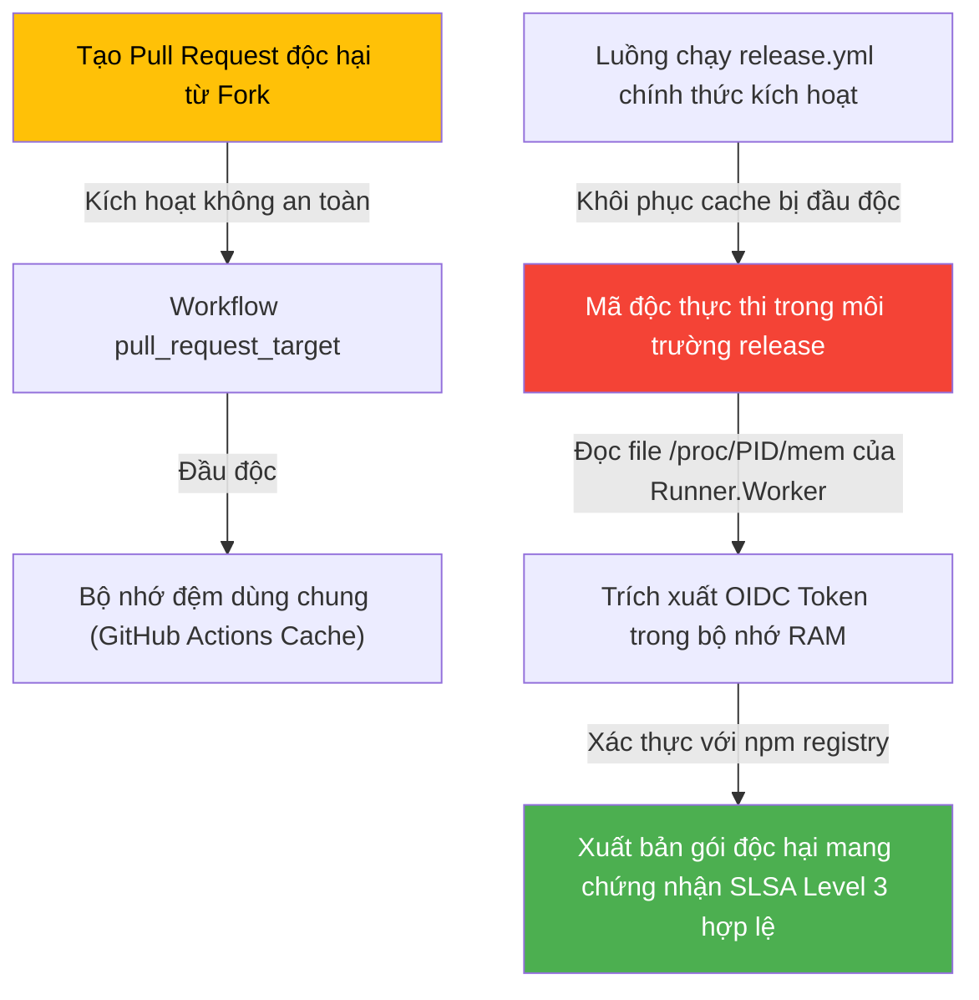

Hôm nay là **May 21, 2026**. Chỉ 48 giờ sau các session bùng nổ của Google I/O Day 1, ngành công nghiệp phần mềm lại tiếp tục đón nhận những tín hiệu kiến trúc mang tính định hình cho nửa cuối năm 2026. Nếu bạn chưa đọc [radar ngày 19/05 về Gemini Intelligence và sự dịch chuyển sang Agent-Native của Firebase](/radar/radar-2026-05-19/) hay [radar ngày 18/05 về Kubernetes v1.36 và chuẩn bị cho Google I/O](/radar/radar-2026-05-18/), đó là bối cảnh nền tảng cần thiết. 

Hôm nay, chúng ta chứng kiến sự hoàn thiện của hệ sinh thái **Antigravity 2.0** với các thông số cài đặt cụ thể, sự ra mắt của dòng mô hình giá rẻ **Gemini 3.5 Flash** giải quyết trực tiếp [khủng hoảng chi phí tác vụ dài hạn (Long-horizon workloads) đã được phân tích trong radar ngày 15/05](/radar/radar-2026-05-15/), và một đợt sóng thần an ninh mạng càn quét chuỗi cung ứng DevOps được dẫn dắt bởi nhóm tin tặc **TeamPCP (UNC6780)**.

Dưới đây là các phân tích kỹ thuật chi tiết của ngày hôm nay.

---

## 1. Hệ Sinh Thái Antigravity 2.0: Cận Cảnh CLI và SDK Cục Bộ

Google đã chính thức ấn định thời hạn khai tử cho **Gemini CLI** cũ. Mọi lệnh gọi API qua công cụ này sẽ bị ngắt kết nối vào ngày **18 tháng 6, 2026**. Điều này đặt ra yêu cầu cấp bách cho các kỹ sư Platform và DevOps trong việc di trú toàn bộ kịch bản tự động hóa CI/CD sang công cụ CLI mới.

### Tên Gọi và Lệnh Cài Đặt
Binary chính thức của công cụ CLI mới được đặt tên là **`agy`** (không phải `antigravity`).

*   **Trên Linux & macOS:**
    ```bash
    curl -fsSL https://antigravity.google/cli/install.sh | bash
    ```
    *Mã nguồn sẽ được cài đặt vào thư mục `~/.local/bin`. Hãy chắc chắn đường dẫn này đã được thêm vào biến môi trường `$PATH` của hệ thống.*
*   **Trên Windows (PowerShell):**
    ```powershell
    irm https://antigravity.google/cli/install.ps1 | iex
    ```
*   **Trên Windows (CMD):**
    ```cmd
    curl -fsSL https://antigravity.google/cli/install.cmd -o install.cmd && install.cmd && del install.cmd
    ```

### Di Trú và Tập Lệnh Tương Tác
Để nhập toàn bộ cấu hình, khóa xác thực và các móc nối tự động (hooks) từ Gemini CLI cũ sang `agy`, chạy lệnh:
```bash
agy plugin import gemini
```

Khi chạy `agy` hoặc `agy .` tại thư mục dự án, công cụ sẽ mở ra một môi trường tương tác dòng lệnh (CLI-interactive). Các lệnh gạch chéo `/` cốt lõi bao gồm:
*   `/config` hoặc `/settings`: Cấu hình định tuyến mô hình, editor mặc định và quyền hạn của tác nhân.
*   `/fork`: Phân nhánh ngữ cảnh hội thoại hiện tại sang một không gian làm việc sạch.
*   `/mcp`: Quản lý các kết nối máy chủ Model Context Protocol (MCP) cục bộ và từ xa.
*   `/resume`: Liệt kê và tiếp tục các phiên làm việc lịch sử qua Conversation ID.
*   `/rewind` hoặc `/undo`: Hoàn tác các bước thực thi trước đó của tác nhân.

### Kiến Trúc Cấu Hình (Precedence Rules)
Tác nhân tự động trong hệ sinh thái Antigravity đọc cấu hình MCP theo thứ tự ưu tiên từ cao xuống thấp như sau:
1.  **Cấu hình cấp dự án:** `.agents/mcp_config.json` (ghi đè mọi thiết lập khác).
2.  **Cấu hình IDE Desktop toàn cục:** `~/.gemini/config/mcp_config.json`
3.  **Cấu hình CLI toàn cục:** `~/.gemini/antigravity-cli/mcp_config.json`

### Tích Hợp Python SDK
Google cũng đã phát hành thư viện Python mã nguồn mở `google-antigravity` (giấy phép Apache 2.0) giúp lập trình viên nhúng trực tiếp tác nhân tự động vào mã nguồn ứng dụng.

*   **Cài đặt:** `pip install google-antigravity`
*   **Mẫu triển khai cơ bản:**
    ```python
    import asyncio
    from google.antigravity import Agent, LocalAgentConfig

    async def main():
        # Cấu hình môi trường thực thi cục bộ an toàn
        config = LocalAgentConfig()
        
        # Quản lý vòng đời tác nhân, công cụ file và trình duyệt tích hợp
        async with Agent(config) as agent:
            response = await agent.chat("Kiểm tra toàn bộ cấu hình bảo mật trong thư mục .agents/")
            print(await response.text())

    if __name__ == "__main__":
        asyncio.run(main())
    ```

---

## 2. Gemini 3.5 Flash: Tối Ưu Chi Phí Cho Vòng Lặp Agentic

Sự xuất hiện của **Gemini 3.5 Flash** (phát hành ngày 19/05) giải quyết trực tiếp bài toán "khủng hoảng chi phí tác vụ dài hạn" (Agentic Cost Crisis). Khi các tác nhân tự động thực hiện hàng trăm vòng lặp suy nghĩ và gọi công cụ trong background, việc sử dụng các mô hình Pro lớn gây ra chi phí token khổng lồ và độ trễ cao.

```
Mô hình truyền thống:
[Task] ──> [Gemini 3.0 Pro] ──(Gọi công cụ nhiều vòng lặp)──> Chi phí: Rất cao ($15.00+/triệu token)

Mô hình tối ưu hóa Agentic:
[Task] ──> [Gemini 3.5 Flash] ──(Tốc độ phản hồi cực nhanh)──> Chi phí: Rất thấp ($1.50/triệu token)
              │
              └─> Cần suy luận sâu ──> Kích hoạt [Dynamic Thinking: High] (Tự điều chỉnh Compute)
```

### Thông Số Kỹ Thuật Chính
*   **Context Window (Đầu vào):** 1,048,576 tokens.
*   **Max Output Limit (Đầu ra):** 65,536 tokens (phù hợp cho việc sinh mã nguồn lớn hoặc tài liệu hóa dự án phức tạp).
*   **Knowledge Cut-off:** Tháng 1, 2026.
*   **API Model ID:** `gemini-3.5-flash`.

### Cấu Trúc Giá Cả (API Pricing)
*   **Token đầu vào:** $1.50 / 1 triệu tokens.
*   **Token đầu ra:** $9.00 / 1 triệu tokens.
*   **Token từ bộ nhớ đệm (Cached Inputs):** Chỉ $0.15 / 1 triệu tokens (tiết kiệm đến 90% chi phí cho các tác nhân liên tục tái sử dụng ngữ cảnh codebase lớn).

### Khả Năng Tư Duy Động (Dynamic Thinking)
Để tối ưu hóa hiệu năng, Gemini 3.5 Flash cho phép lập trình viên điều chỉnh mức độ tính toán suy luận (compute-on-demand) thông qua tham số `thinkingLevel` trong API payload:
*   `Minimal`: Bỏ qua suy nghĩ trung gian, phản hồi trực tiếp với độ trễ thấp nhất.
*   `Medium` (Mặc định): Cân bằng giữa suy luận và tốc độ.
*   `High`: Kích hoạt chuỗi tự phản biện và sửa sai (self-correction) chuyên sâu cho các tác vụ lập trình phức tạp.

### Kiểm Thử Thực Tế (Benchmarks)
*   **Terminal-Bench 2.1 (Tương tác dòng lệnh):** 76.2%
*   **MCP Atlas (Khả năng gọi và kết hợp công cụ):** 83.6%
*   **CharXiv Reasoning (Tư duy toán/hình học đa phương thức):** 84.2%
*   **GDPval-AA Elo:** 1656

---

## 3. Android Studio "Vibe Coding": Môi Trường Giả Lập Đám Mây Tích Hợp

Trong khuôn khổ Day 2 Developer Keynotes, Google đã trình diễn khả năng "Vibe Coding" cho nền tảng di động Android. Lập trình viên chỉ cần mô tả ý tưởng bằng ngôn ngữ tự nhiên, AI sẽ tự xây dựng cấu trúc ứng dụng native (Kotlin và Jetpack Compose) và khởi chạy ngay lập tức.

### Kiến Trúc Giả Lập Đám Mây (Cloud Emulator)
Thay vì biên dịch cục bộ vốn yêu cầu bộ nhớ RAM lớn và cài đặt Android SDK phức tạp, ứng dụng được biên dịch trực tiếp trên đám mây và truyền luồng hiển thị (streaming) về trình duyệt của nhà phát triển thông qua giao thức **WebRTC** thời gian thực từ một Thiết bị ảo Android (AVD) chuyên dụng.

### Bản Chất An Toàn (Sandboxing Security)
Để chạy toàn bộ hệ điều hành Android OS một cách biệt lập, Google sử dụng **ảo hóa cấp phần cứng (Hardware-level Virtualization - KVM/MicroVMs)** cho mỗi phiên làm việc của người dùng. Mô hình ảo hóa này cung cấp ranh giới bảo mật cứng hơn nhiều so với các giải pháp chia sẻ kernel (như gVisor), đảm bảo mã nguồn do AI tạo ra nếu chứa lỗ hổng hoặc mã độc cũng không thể tấn công máy chủ vật lý bên dưới.

### Kết Nối Thiết Bị Thật và Giới Hạn
*   **Cầu nối phần cứng:** Lập trình viên có thể sử dụng tính năng **WebUSB ADB** để đẩy trực tiếp tệp APK đã biên dịch từ trình duyệt xuống thiết bị Android vật lý đang cắm cáp vào máy tính cá nhân.
*   **Giới hạn giả lập:** Trình giả lập đám mây hiện tại **không hỗ trợ** các tương tác phần cứng thực tế như camera trực tiếp, cảm biến NFC, kết nối Bluetooth vật lý, hoặc định vị GPS thực tế (chỉ hỗ trợ giả lập tọa độ). Đối với các tác vụ này, lập trình viên bắt buộc phải xuất dự án ra định dạng `.zip` hoặc đẩy lên GitHub để mở trong môi trường Android Studio cục bộ.

---

## 4. Đại Nạn Chuỗi Cung Ứng GitHub và Hồ Sơ Độc Tố TeamPCP (UNC6780)

Một đợt tấn công chuỗi cung ứng quy mô lớn đã diễn ra vào giữa tháng 5 năm 2026, dẫn đến việc rò rỉ **3,800 kho mã nguồn nội bộ (internal repositories)** của GitHub. Phân tích hậu độc (post-mortem) từ các công ty an ninh mạng hàng đầu chỉ ra rằng thủ phạm là nhóm tin tặc tài chính chuyên nghiệp **TeamPCP (UNC6780)**.

### Vectơ Tấn Công: Tiện Ích Nx Console Bị Nhiễm Độc
Cuộc tấn công bắt nguồn từ việc tin tặc chiếm đoạt Personal Access Token (PAT) của một nhà phát triển có quyền xuất bản trên VS Code Marketplace để đẩy phiên bản độc hại **Nx Console v18.95.0** lên cửa hàng tiện ích vào ngày 18/05/2026. Phiên bản này chỉ tồn tại 11 phút trước khi bị gỡ bỏ, nhưng đã kịp lây nhiễm cho hàng ngàn máy trạm.

Mã độc cài đặt một tiến trình Python chạy ẩn (`cat.py`) tại thư mục ẩn của người dùng và duy trì khởi động (persistence) qua cơ chế LaunchAgent của macOS:
*   **Đường dẫn tệp chạy ẩn:** `~/.local/share/kitty/cat.py`
*   **Đường dẫn LaunchAgent:** `~/Library/LaunchAgents/com.user.kitty-monitor.plist` (kích hoạt thực thi mỗi giờ).

### Cơ Chế Điều Khiển C2 Qua GitHub Commit Search
Để vượt qua các hệ thống tường lửa doanh nghiệp (thường whitelist tên miền `github.com`), tệp `cat.py` thực hiện truy vấn C2 bằng cách gọi trực tiếp đến GitHub Commit Search API:
```bash
api.github.com/search/commits?q=firedalazer
```
Nó quét các thông điệp commit công khai chứa từ khóa **`firedalazer`**, giải mã nội dung Base64 chứa địa chỉ tải payload, xác thực chữ ký số bằng khóa công khai **RSA 4096-bit** được nhúng sẵn trong mã nguồn (nhằm tránh việc các chuyên gia bảo mật giả mạo lệnh điều khiển), rồi tải xuống thực thi mã độc.

---

## 5. Phân Tích Chuyên Sâu Tradecraft Của TeamPCP

Nhóm **TeamPCP** đã trình diễn một cấp độ tự động hóa đáng sợ khi kết hợp mã độc trích xuất thông tin đăng nhập **SANDCLOCK** với sâu tự lan truyền **CanisterWorm**.

### 1. Sử Dụng commit mồ côi (Orphaned GitHub Commits)
Để lưu trữ payload độc hại mà không bị phát hiện bởi các công cụ quét mã nguồn tĩnh trên các nhánh (branches), tin tặc sử dụng kỹ thuật "commit mồ côi":
```
[Tạo Fork của Repo thật] ──> [Đẩy Commit độc hại (Không thuộc nhánh nào)] ──> [Xóa Fork]
                                                                              │
  Mã độc tải Payload trực tiếp từ Repo gốc qua SHA hash: <────────────────────┘
  https://github.com/original-owner/original-repo/commit/<sha-hash>
```
Mặc dù fork đã bị xóa, GitHub vẫn lưu trữ đối tượng commit này trong hệ thống lưu trữ phân tán của họ, cho phép mã độc tải tệp độc hại trực tiếp từ URL của kho mã nguồn chính thức đáng tin cậy.

### 2. Tự Động Hóa Lan Truyền Worm Trong npm
Khi thực thi thông qua các móc nối cài đặt (`postinstall`), mã độc tự động lục soát các tệp cấu hình cục bộ như `.npmrc` để tìm khóa xuất bản (publishing tokens). Nếu phát hiện token hợp lệ, nó sẽ:
1.  Truy vấn toàn bộ danh sách gói thư viện (packages) mà tài khoản đó có quyền quản lý.
2.  Tự động tải các gói này về, nhúng mã độc tự lan truyền vào mã nguồn của chúng.
3.  Tự tăng số phiên bản (version bump) và xuất bản lại lên npm registry dưới danh nghĩa chính chủ.

### 3. Đầu Độc Bộ Nhớ Đệm và Trích Xuất Token OIDC Trực Tiếp Từ Bộ Nhớ
Để xuất bản các phiên bản độc hại có đầy đủ **chứng nhận nguồn gốc SLSA Build Level 3** (vốn yêu cầu mã nguồn phải được biên dịch trên hệ thống máy chạy chính thức của GitHub Actions), TeamPCP đã thực hiện chuỗi tấn công sau:



Bằng cách đọc trực tiếp bộ nhớ RAM của tiến trình quản lý máy chạy (`Runner.Worker`), mã độc đã lấy cắp được OIDC token ngắn hạn được cấp để ký số cho bản phát hành, lừa gạt hoàn toàn hệ thống kiểm tra an ninh Sigstore.

### 4. Ca Tấn Công Lồng Nhau (Nested Supply Chain): Checkmarx KICS đến Bitwarden CLI
Vào ngày 22/04/2026, gói thư viện chính thức `@bitwarden/cli@2026.4.0` đã bị nhiễm độc trên npm trong vòng 93 phút. Chuỗi lây nhiễm bắc cầu này diễn ra như sau:
1.  **Đầu độc Checkmarx:** TeamPCP chiếm quyền và đẩy hình ảnh Docker chứa mã độc của công cụ quét bảo mật hạ tầng **Checkmarx KICS** lên Docker Hub.
2.  **Lây nhiễm Bitwarden:** Trong luồng phát hành (CI/CD) của Bitwarden, hệ thống đã kéo hình ảnh Docker KICS độc hại này về để quét kiểm tra an ninh mã nguồn.
3.  **Trộm khóa xuất bản:** Mã độc chạy bên trong Docker KICS đã trích xuất thành công npm publishing token của Bitwarden từ bộ nhớ máy chạy.
4.  **Phát hành mã độc:** Tin tặc dùng token trộm được để đẩy phiên bản độc hại `@bitwarden/cli@2026.4.0` lên npm. Bitwarden sau đó đã phát hiện, thu hồi khóa và phát hành phiên bản sạch `2026.4.1`.

---

## 6. Socket Gọi Vốn 60 Triệu USD: Phòng Thủ Chuỗi Cung Ứng Kỷ Nguyên AI

Sự phát triển vũ bão của các tác nhân lập trình tự động (như Jules, Claude Code) dẫn đến việc các AI tự động thêm mới hàng loạt thư viện nguồn mở bên thứ ba mà lập trình viên không hề kiểm soát thủ công. Điều này tạo điều kiện cho vòng gọi vốn Series C trị giá **60 triệu USD** của **Socket.dev** (định giá **1 tỷ USD**, dẫn đầu bởi **Thrive Capital**).

### Bảo Vệ Trình Quản Lý Kỹ Năng AI (skills.sh)
Trong năm 2026, các AI Agent sử dụng registry **`skills.sh`** để cài đặt các gói kỹ năng bổ sung:
```bash
npx skills add <owner/repo>
```
Các kỹ năng này được định nghĩa trong tệp `SKILL.md` chứa cấu hình YAML và các lệnh thực thi hệ thống. Socket cảnh báo rằng **khoảng 13%** số lượng kỹ năng do cộng đồng đăng tải trên hệ thống này chứa mã độc hoặc kịch bản lệnh nguy hiểm có quyền thực thi tùy ý trên máy trạm của lập trình viên.

### Công Nghệ Phân Tích Khả Năng Tiếp Cận (Reachability Analysis Tiers)
Để giảm thiểu báo động giả (false positives) từ các lỗ hổng bảo mật tĩnh, Socket chia quy trình phân tích thành 3 tầng:

| Tầng Phân Tích | Mô Tả Kỹ Thuật |
|---|---|
| **Tier 3: Dependency Reachability** | Kiểm tra xem thư viện chứa lỗ hổng có nằm trong cây phụ thuộc của dự án hay không. |
| **Tier 2: Precomputed Reachability** | Phân tích đồ thị cuộc gọi (call graph) tĩnh để xem ứng dụng có thực sự gọi đến hàm chứa lỗi trong thư viện liên kết hay không. |
| **Tier 1: Full Application Reachability** | Dựng toàn bộ luồng truyền dẫn dữ liệu từ đầu vào của người dùng (input boundaries) xuyên suốt mã nguồn dự án để chứng minh lỗ hổng đó có thể bị kích hoạt thực tế từ bên ngoài hay không. |

---

## FAQ: Câu Hỏi Nhanh Cho Lập Trình Viên

**Tôi cần làm gì để bảo vệ luồng GitHub Actions của mình khỏi đợt tấn công của TeamPCP?**
Tuyệt đối không sử dụng các thẻ phiên bản động (ví dụ: `uses: aquasecurity/trivy-action@v0.18.0`) vì tin tặc có thể force-push mã độc đè lên thẻ đó. Thay vào đó, hãy ghim cứng mã hash SHA của commit (ví dụ: `uses: aquasecurity/trivy-action@a1b2c3d4...`).

**Gói thư viện `@bitwarden/cli` bị ảnh hưởng cụ thể ở phiên bản nào?**
Chỉ phiên bản `2026.4.0` phát hành vào ngày 22 tháng 4 năm 2026 trong khung thời gian 93 phút là chứa mã độc. Phiên bản `2026.4.1` đã được phát hành ngay sau đó để thay thế hoàn toàn và an toàn để sử dụng.

**Làm sao để phát hiện mã độc SANDCLOCK trên máy macOS cá nhân?**
Hãy kiểm tra sự tồn tại của tệp chạy ẩn tại đường dẫn `~/.local/share/kitty/cat.py` và tệp LaunchAgent khởi chạy tại `~/Library/LaunchAgents/com.user.kitty-monitor.plist`. Nếu phát hiện, lập trình viên cần cách ly máy trạm ngay lập tức và tiến hành xoay vòng (rotate) toàn bộ các API keys và mật khẩu.

**Mã độc Python `.pth` hoạt động như thế nào?**
Khi bạn đặt một tệp cấu hình đường dẫn có đuôi `.pth` vào thư mục `site-packages` của Python, trình biên dịch Python sẽ tự động phân tích và chạy toàn bộ dòng lệnh bắt đầu bằng từ khóa `import` ngay khi khởi chạy lệnh `python`, tạo ra cơ chế khởi động ẩn vô cùng khó phát hiện.

---

## Đánh Giá Từ Tech Radar

Sự hội tụ của hệ sinh thái **Antigravity 2.0 cục bộ**, các dòng mô hình chi phí thấp như **Gemini 3.5 Flash** và các vụ tấn công chuỗi cung ứng tự động hóa của **TeamPCP** cho thấy một xu hướng rõ ràng: 

*Phát triển phần mềm bằng AI không còn là việc gõ code nhanh hơn, mà là cuộc chiến kiểm soát luồng thực thi tự động (Agentic Control Loops) và bảo mật hạ tầng CI/CD trước những tác nhân tự động có khả năng tự lan truyền.*

Kế hoạch hành động khuyến nghị cho tuần này:
1.  Rà soát toàn bộ script tự động hóa dùng Gemini CLI cũ để chuẩn bị chuyển dịch sang `agy` trước ngày 18/06/2026.
2.  Cấu hình chuyển đổi các tác vụ xử lý trung gian sang `gemini-3.5-flash` để giảm tải chi phí vận hành.
3.  Triển khai quét mã tĩnh để kiểm tra sự tồn tại của các tệp LaunchAgents độc hại hoặc `.pth` bất thường trong thư mục phát triển cục bộ.

---

*Bản tin Tech Radar này được tổng hợp tự động bởi mạng lưới tác nhân nghiên cứu thông tin của hệ thống và được giám sát kỹ thuật bởi Kiến trúc sư trưởng @TuanAnh. Dữ liệu được trích xuất thời gian thực từ các nguồn tin cậy: blog.google, socket.dev, stepsecurity.io, github.blog, và hồ sơ phân tích mối đe dọa chuỗi cung ứng của Microsoft & CrowdStrike.*


