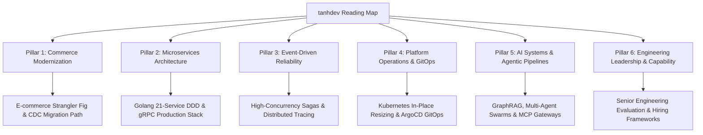

> **Answer-First:** The tanhdev Reading Map provides a structured technical index across 57 production essays organized into 6 specialized engineering pillars: Commerce Modernization, 21-Service Go Microservices, Event-Driven Reliability, Platform Operations, AI Systems & Agentic Pipelines, and Senior Engineering Capability.

## Reading Map – tanhdev.com

If you're new here, this page is the fastest way to understand what I build and how I think. It groups 57 long-form essays into focused **content pillars** with explicit **Information Gain** — what this site offers that top SERP results and current LLM-generated content cannot replicate.

### Platform Knowledge Architecture & Learning Tracks

## Recommended Architectural Learning Paths

To get maximum value from the content corpus, follow these specialized learning tracks based on your current engineering role and platform goals:

### Track A: The Enterprise Monolith-to-Microservices Modernization Path
For Systems Architects and Lead Engineers tackling legacy debt in Magento, PHP, or monolithic Java systems:
1. **Assessment Phase:** Start with [Why Migrate Magento to Microservices](/posts/why-migrate-magento-to-microservices/) to analyze total cost of ownership (TCO) and evaluate organizational readiness.
2. **Migration Execution:** Follow [Moving from Magento to Microservices](/posts/moving-from-magento-to-microservices/) for zero-downtime Strangler Fig patterns and CDC data extraction.
3. **Domain Bounding:** Study [Deconstructing the Ecosystem: Service Details by Domain](/posts/deconstructing-ecommerce-service-details-domain/) to define clean PostgreSQL domain schemas.
4. **API Gateway & Routing:** Deploy gRPC REST gateways as detailed in [Blueprint of a 21-Service E-commerce Edge](/posts/blueprint-ecommerce-microservices-architecture-diagram/).
5. **Database Decoupling:** Eliminate EAV table bottlenecks using JSONB document projections and CDC event streaming to maintain real-time sync with legacy backends.

### Track B: High-Concurrency Backend Systems & Reliability Engineering
For Senior Backend Engineers optimizing Go services under heavy peak traffic:
1. **Core Microservices:** Master [Go Microservices Production Guide](/posts/go-microservices/) and [Golang gRPC Microservices](/posts/golang-grpc-microservices-production-guide/).
2. **Distributed Transactions:** Implement Saga orchestrations with [Dapr Workflow Go Tutorial](/posts/dapr-workflow-saga-orchestration-guide/) and [Temporal Saga Pattern in Go](/posts/temporal-saga-pattern-golang-distributed-transactions-guide/).
3. **Observability & Debugging:** Configure remote profiling via [Go pprof in Kubernetes](/posts/go-pprof-kubernetes-remote-profiling/) and eliminate leaks using [Goroutine Leak Detection](/posts/goroutine-leak-detection-production-golang/).
4. **Traffic Protection:** Implement peak shaving using [Shopee Flash Sale Architecture](/posts/shopee-flash-sale-architecture/) and [Surge Pricing Algorithm](/posts/surge-pricing-optimization-architecture/).
5. **Garbage Collection Tuning:** Optimize Go runtime behavior using GOGC adjustments and memory limit flags to prevent OOM kills during high-throughput flash sale events.

### Track C: AI-Native Systems & Autonomous Swarm Architecture
For AI Systems Engineers building production RAG pipelines, agentic workflows, and MCP servers:
1. **Pipeline Foundations:** Study [Autonomous Hybrid-AI Pipeline](/posts/architecting-an-autonomous-hybrid-ai-content-pipeline/) to transition from cron jobs to state machines.
2. **Retrieval Architecture:** Compare vector strategies in [GraphRAG vs Naive RAG](/posts/graphrag-vs-naive-rag-enterprise-guide/).
3. **Agent Swarm Deployment:** Build multi-provider fallbacks using [Production Agentic AI Swarm: OpenClaw & LiteLLM](/posts/deploying-autonomous-ai-swarm-openclaw-litellm/).
4. **Vector Search Tuning:** Implement Go vector search with [Architecting Agentic E-commerce Search with Golang](/posts/agentic-ecommerce-search-golang-vector-databases/).
5. **Context Engineering:** Secure multi-agent communication protocols (MCP) with OAuth 2.1 tokens, structured schema validation, and sandboxed Docker container boundaries.
6. **Production Evaluation & Guardrails:** Build continuous AI evals into CI/CD pipelines to monitor model drift, hallucination rates, and prompt injection vulnerabilities before deploying agentic swarms to production environments.

---

## Start Here (Recommended Reading Order)

The articles listed below represent the recommended sequential reading path for software engineers, systems architects, and technical leaders joining the platform. This path introduces core architectural concepts, strangler-fig migration playbooks, service domain boundaries, and GitOps deployment strategies step-by-step:

1. [Moving from Magento to Microservices](/posts/moving-from-magento-to-microservices/) – zero-downtime Strangler Fig + CDC migration playbook.
2. [Deconstructing the Ecosystem: Service Details by Domain](/posts/deconstructing-ecommerce-service-details-domain/) – bounded contexts that actually survived production.
3. [Blueprint of a 21-Service E-commerce Edge](/posts/blueprint-ecommerce-microservices-architecture-diagram/) – high-level architecture + traffic/event flow.
4. [Architecting a 21-Service E-commerce Ecosystem with Golang & DDD](/posts/architecting-21-service-ecommerce-golang-ddd/) – real Kratos + Clean Architecture implementation.
5. [GitOps at Scale: Orchestrating 21 Microservices](/posts/gitops-at-scale-kubernetes-argocd-microservices/) – how we actually ship safely at this scale.

---

## Pillar 1 – Commerce Modernization (Magento → Composable)

**Information Gain**: Concrete zero-downtime migration patterns, exact EAV bypass SQL, cost/real-world timelines from Vietnam-based migrations that most “migrate from monolith” articles skip.

- [Moving from Magento to Microservices](/posts/moving-from-magento-to-microservices/)
- [Why Migrate Magento to Microservices (and When You Shouldn’t)](/posts/why-migrate-magento-to-microservices/)
- [Ecommerce Architecture 2026: Overcoming Tech Debt in Composable Commerce Migration](/posts/ecommerce-architecture-composable-migration/)
- [Exporting Magento 2 Data with Clean SQL](/posts/exporting-magento-2-data-flat-sql-nodejs/)
- [Is Magento Worth It in 2026? The 2.4.9 Reality](/posts/magento-still-worth-investing-2026/)
- [Magento AI Integration: Modernize Without Rebuilding](/posts/magento-ai-integration-strategy-architecture/)
- [Deconstructing the Ecosystem: Service Details by Domain](/posts/deconstructing-ecommerce-service-details-domain/)
- [Composable Banking Architecture: From Monolith to Modular Core](/posts/composable-banking-architecture/)
- [Laravel in the AI Era: 10 Predictions for 2028](/posts/the-future-of-laravel-development-in-ai-era/)

---

## Pillar 2 – Microservices Architecture (Production 21-service Blueprint)

**Information Gain**: Real boundary decisions, exact failure modes we hit, and the DDD + Kratos patterns that kept the platform stable under high concurrency.

- [Blueprint of a 21-Service E-commerce Edge](/posts/blueprint-ecommerce-microservices-architecture-diagram/)
- [Architecting a 21-Service E-commerce Ecosystem with Golang & DDD](/posts/architecting-21-service-ecommerce-golang-ddd/)
- [Go Microservices Production Guide](/posts/go-microservices/)
- [Golang gRPC Microservices: Protobuf, TLS & Middleware](/posts/golang-grpc-microservices-production-guide/)
- [Banking Microservices Architecture: Go, Saga & Event Sourcing](/posts/banking-microservices-architecture/)
- [Microfinance Core Banking System: Architecture & Engineering Guide](/posts/deconstructing-microfinance-core-banking-architecture/)
- [Alipay Double 11: 544,000 TPS Architecture Explained](/posts/alipay-double-11-architecture-tps/)
- [PayPay Architecture: Scaling Payments to 70M Users](/posts/paypay-architecture-scaling/)
- [Real-Time Ride-Hailing Architecture: Uber & Grab Stack](/posts/real-time-ride-hailing-architecture/)

---

## Pillar 3 – Event-driven Reliability, Observability & Performance

**Information Gain**: Battle-tested saga, idempotency, and distributed tracing patterns that survived real Double-11-scale traffic, not theoretical diagrams.

- [Mastering Event-Driven Architecture with Dapr Pub/Sub](/posts/mastering-event-driven-architecture-dapr/)
- [Dapr Workflow Go Tutorial: Orchestrated Saga Pattern](/posts/dapr-workflow-saga-orchestration-guide/)
- [Go Microservices Distributed Tracing (2026)](/posts/go-microservices-distributed-tracing-architecture/)
- [Goroutine Leak Detection and Fix in Production Go Services](/posts/goroutine-leak-detection-production-golang/)
- [Goroutine Pool Patterns in Go: errgroup & Backpressure](/posts/golang-goroutine-pool-errgroup-worker/)
- [Go pprof in Kubernetes: Remote Profiling & Flame Graphs](/posts/go-pprof-kubernetes-remote-profiling/)
- [Go pprof in Kubernetes: CPU & Memory Profiling](/posts/golang-pprof-profiling-memory-cpu-tutorial/)
- [Go 1.26: Green Tea GC, Faster CGO & Goroutine Leak Detection](/posts/go-126-green-tea-gc-cgo-performance-guide/)
- [Real-Time Inventory Synchronization: Kafka, CDC & Redis for E-commerce](/posts/real-time-inventory-ecommerce-architecture/)
- [Shopee Flash Sale Architecture: Rate Limiting & Redis](/posts/shopee-flash-sale-architecture/)
- [Surge Pricing Algorithm & Spatial Indexing Architecture](/posts/surge-pricing-optimization-architecture/)
- [Order Fulfillment Algorithm: Warehouse to Last-Mile](/posts/order-fulfillment-algorithm-warehouse-last-mile/)

---

## Pillar 4 – Platform Operations (GitOps, Kubernetes, Edge)

**Information Gain**: Concrete ArgoCD + Kubernetes patterns at 21-service scale, EKS vs ECS real cost/control trade-offs, Cloudflare Workers zero-devops patterns.

- [GitOps at Scale: Kubernetes & ArgoCD for Microservices](/posts/gitops-at-scale-kubernetes-argocd-microservices/)
- [What's New in Argo CD 3.4 & 3.3: Cluster Pause & Upgrades](/posts/argo-cd-updates-2026/)
- [AWS EKS vs ECS: Architecture, Cost & Real-World Use Cases (2026)](/posts/aws-eks-vs-ecs-comparison/)
- [Kubernetes In-Place Pod Resizing: Scale CPU & Memory Without Restart](/posts/kubernetes-in-place-pod-resizing-guide/)
- [Zero DevOps E-commerce with Cloudflare Workers & Turborepo](/posts/cloudflare-zero-devops-ecommerce/)
- [Cloudflare D1 + Durable Objects: Build a Real-Time Cart](/posts/cloudflare-d1-durable-objects-realtime-cart/)
- [Serverless E-Commerce: Cloudflare Workers & D1 Architecture](/posts/serverless-ecommerce-cloudflare-d1/)
- [Astro on Cloudflare: Full-Stack Edge Architecture](/posts/deploying-astro-on-cloudflare-full-stack-edge-architecture/)
- [MySQL Scalability: Read Replicas, Sharding & TiDB](/posts/mysql-scalability-guide/)
- [Vitess vs GORM Sharding: MySQL Write Scaling in Go](/posts/mysql-horizontal-scaling/)
- [Replace MySQL Sharding with TiDB: Distributed SQL Migration Guide](/posts/mysql-scaling-sharding-tidb-architecture/)
- [GraphHopper Distance Matrix: Self-Host & Replace Google Maps API](/posts/graphhopper-distance-matrix-production-guide/)
- [Self-Hosting GraphHopper on Kubernetes with OSM Data](/posts/graphhopper-kubernetes-self-hosting-osm/)
- [OSRM vs GraphHopper: Routing Engine Selection](/posts/osrm-vs-graphhopper-architecture-comparison/)

---

## Pillar 5 – AI Systems & Agentic Pipelines (2026 Focus)

**Information Gain**: Architecture trade-offs, measurement frameworks, and implementation patterns for prompt engineering, fine-tuning, agentic systems, and hybrid AI pipelines.

- [Autonomous Hybrid-AI Pipeline: Cron to State-Machine](/posts/architecting-an-autonomous-hybrid-ai-content-pipeline/)
- [Production Agentic AI Swarm: OpenClaw & LiteLLM](/posts/deploying-autonomous-ai-swarm-openclaw-litellm/)
- [Generative UI with MCP: Architecting AI-Native Frontends](/posts/generative-ui-with-mcp-ai-native-frontend/)
- [Generative UI Architecture Series](/series/generative-ui-architecture/)
- [GraphRAG vs Naive RAG: Enterprise Architecture Guide](/posts/graphrag-vs-naive-rag-enterprise-guide/)
- [Architecting Agentic E-commerce Search with Golang](/posts/agentic-ecommerce-search-golang-vector-databases/)
- [OAuth 2.1 & Prompt Versioning for Production AI Agents](/posts/production-ai-apis-oauth-versioning-meta-predictions/)
- [Prompt Engineering vs Fine-Tuning: When to Use Each (GPT-5 Era Decision Guide)](/posts/slm-fine-tune-vs-prompt-engineering/)
- [AI-Native Frontend in 2028: 10 Architecture Predictions](/posts/ai-native-frontend-architecture-predictions-2028/)
- [What is Vibe Coding? Why AI Code Review is the Future](/posts/vibe-coding-and-ai-code-review-future/)
- [LeaseInVietnam: AI-Powered Expat Rental & B2B Lead Engine](/posts/leaseinvietnam-ai-powered-expat-rental-intelligence-system/)

---

## Pillar 6 – Hiring & Capability (Vietnam Context)

**Information Gain**: What “senior Magento/architecture” talent in Vietnam actually looks like in 2026, concrete vetting signals beyond theme work.

- [Magento Development in Vietnam: 2026 Guide — Cost, Hiring & Upgrade](/posts/magento-vietnam/)
- [Magento Development in Vietnam: Cost, Hiring & Upgrade](/posts/magento-vietnam/)
- [Magento Agency & Development in Vietnam: Scoping Guide](/posts/magento-development-in-vietnam/)

---

## Tech Radar & Signals Log

For fast-moving signals, framework releases, runtime benchmarks, and daily technology radar briefings (Golang 1.26, Kubernetes 1.36, DeepSeek-V4, Claude Sonnet 4.5, Mistral Small 4, Dapr v1.18), explore our dedicated [Tech Radar Archive](/radar/) and [April 2026 Tech Radar Summary](/radar/2026-04/).

- [Temporal Saga Pattern in Go](/posts/temporal-saga-pattern-golang-distributed-transactions-guide/)
- [SPIFFE/SPIRE Zero Trust Mesh](/posts/zero-trust-service-mesh-security-spiffe-spire-istio-golang/)
- [Alipay Double 11 Series Index](/series/alipay-double-11/)

---

**Distribution Note**: Every pillar post should have a repurposing plan before publishing (LinkedIn thread, newsletter deep-dive, YouTube script, or Twitter/X technical thread).

**Next Review**: 2026-10-01

---

## Browse by Category

Explore deep-dive technical essays categorized by specialized engineering domains:
- [Tech Radar](/categories/tech-radar/)
- [AI](/categories/ai/)
- [Architecture](/categories/architecture/)
- [Engineering](/categories/engineering/)
- [Fintech](/categories/fintech/)
- [Microservices](/categories/microservices/)
- [Payments](/categories/payments/)
- [Backend](/categories/backend/)
- [Kubernetes](/categories/kubernetes/)
- [Observability](/categories/observability/)
- [Cloudflare](/categories/cloudflare/)
- [Golang](/categories/golang/)
- [DevOps](/categories/devops/)
- [E-Commerce](/categories/e-commerce/)
- [Database](/categories/database/)

---
## Related Architecture & Pillar Guides
For related systemic design patterns, pillar blueprints, and curated reading paths, explore:
- [Engineering Leadership & Technical Advisory Services](/hire/)
