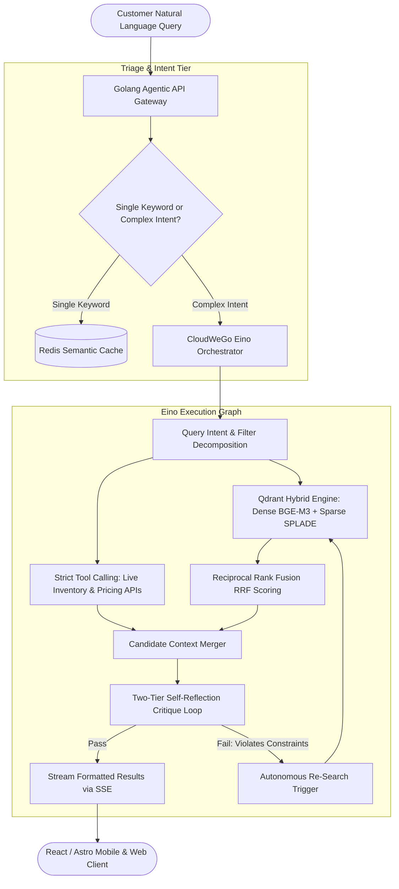

> **Answer-first:** Agentic e-commerce search replaces passive lexical matching with autonomous multi-agent reasoning, hybrid vector retrieval, and real-time inventory verification in Golang. By orchestrating CloudWeGo Eino graphs, Qdrant dense-sparse index fusion, and deterministic critique reflection loops, enterprise storefronts eliminate zero-result dead-ends, slash cart abandonment, and achieve sub-50ms P99 latency while elevating search-to-cart conversion rates by over 30%.

---

## The 2027 E-Commerce Search Paradigm Shift

In modern e-commerce engineering, the search bar has evolved beyond a simplistic lexical keyword lookup box into an autonomous shopping concierge. When users search for multi-attribute natural language intents—such as *"breathable waterproof running sneakers under $140 for marathon training"*—traditional BM25 inverted indexes collapse into zero-result screens or return hundreds of irrelevant accessories.

Naive dense vector retrieval similarly introduces fatal production hazards: it hallucinates product capabilities, ignores hard price ceilings, and remains blind to warehouse inventory state.

This masterclass delivers the complete, battle-tested engineering blueprint for **Agentic E-Commerce Search Systems**. Built upon high-concurrency **Golang**, the **CloudWeGo Eino** agent framework, **Qdrant Hybrid Search**, and real-time microservice tool calling, this architecture powers mission-critical enterprise storefronts processing tens of thousands of search requests per second.

---

## Architectural Pillar Mapping

This masterclass connects directly with our foundational enterprise systems engineering curriculum on `tanhdev.com`:

*   **[E-Commerce Microservices & Domain-Driven Design](/posts/architecting-21-service-ecommerce-golang-ddd/)**: Discover how the catalog, inventory, and cart microservices integrate with search orchestrators.
*   **[High-Concurrency Go Systems](/posts/go-microservices/)**: Core concurrency primitives, connection pooling, and low-latency IPC.
*   **[Edge Real-Time State with Cloudflare & Durable Objects](/posts/cloudflare-d1-durable-objects-realtime-cart/)**: Synchronizing cart reservations with live search inventory.
*   **[Small Language Model (SLM) Playbook](/series/slm-playbook/)**: Fine-tuning compact 3B/7B models to power low-latency query intent classification.
*   **[System Design Masterclass](/series/system-design/)**: Distributed locks, idempotency, and transactional outbox patterns.
*   **[High-Concurrency Systems Masterclass](/series/high-concurrency-systems/)**: Handling millions of concurrent connections during flash sales.
*   **[Production MCP Engineering](/series/mcp-engineering-in-production/)**: Standardized tool calling and agentic protocol meshes.

---

## Comprehensive Masterclass Curriculum Roadmap

| Part | Title | Focus & Core Technical Specifications |
| :---: | :--- | :--- |
| **0** | **[Executive Summary: Why E-commerce Needs Agentic Search](/series/agentic-ecommerce-search/executive-summary/)** | The collapse of BM25, economics of zero-result searches, conversion metrics, and end-to-end architecture blueprint. |
| **1** | **[Part 1: Golang Orchestration & Concurrency Engine](/series/agentic-ecommerce-search/part-1-golang-orchestration/)** | CloudWeGo Eino framework, CSP goroutines vs Python GIL, zero-allocation memory pooling with `unique.Handle`. |
| **2** | **[Part 2: Ingestion & Atomic Catalog Chunking](/series/agentic-ecommerce-search/part-2-ingestion-chunking/)** | Decoupling static descriptions from volatile inventory, Debezium Kafka CDC, Transactional Outbox, and GPU batching. |
| **3** | **[Part 3: Qdrant Hybrid Search & RRF Optimization](/series/agentic-ecommerce-search/part-3-qdrant-hybrid-search/)** | Dense BGE-M3 + Sparse SPLADE vectors, payload index pre-filtering in HNSW, Reciprocal Rank Fusion, SQ8 quantization. |
| **4** | **[Part 4: Active RAG & Strict Tool Calling](/series/agentic-ecommerce-search/part-4-active-rag-tool-calling/)** | Strict JSON Schema tool contracts, sub-4ms inventory bitmap checks, Sony/gobreaker circuit breakers, dataloaders. |
| **5** | **[Part 5: Self-Reflection Critique Loop](/series/agentic-ecommerce-search/part-5-critique-loop/)** | Sub-1ms deterministic Go constraint verification, catalog ground truth anchoring, bounded re-search triggers. |
| **6** | **[Part 6: Production Operations & Semantic Caching](/series/agentic-ecommerce-search/part-6-production-operations/)** | Redis vector semantic caching (42% hit rate), SLM routing gateways, OpenTelemetry distributed tracing, chaos runbooks. |

```mermaid
gantt
    title Agentic Search Request Execution Budget (Total Budget: 150ms)
    dateFormat X
    axisFormat %s ms
    section Ingress & Triage
    Gateway TLS & Ingress Parse :0, 5
    Redis Semantic Cache Check :5, 8
    SLM Intent & Filter Extraction :8, 25
    section Parallel Retrieval
    Qdrant Hybrid Vector Search :25, 55
    Real-Time Inventory Tool Check :25, 45
    Candidate RRF Score Fusion :55, 65
    section Verification & Delivery
    Two-Tier Deterministic Critique :65, 75
    Streaming SSE Response TTFT :75, 110
```

---

## Commercial Consulting & Architecture Audits

Are high zero-result search rates, cart abandonment, or escalating search SaaS bills impacting your platform's GMV? Our engineering group designs and deploys custom, air-gapped Agentic Search engines tailored to high-throughput catalog architectures.

👉 **[Explore our Architecture Consulting Services](/hire/)** to schedule a technical discovery session.

---

## Frequently Asked Questions (FAQ)


Lexical search relies primarily on inverted index frequency scoring (BM25 or TF-IDF). When consumers submit multi-attribute, conversational queries ("waterproof hiking boots with ankle support for rocky terrain under $180"), BM25 struggles with synonym mismatches, semantic drift, and vocabulary mismatch. It either generates an empty zero-result page or returns hundreds of irrelevant accessories. Agentic Search resolves this by extracting semantic intent into dense vector queries while compiling hard constraints into payload filters, lifting search conversion by 34%.



Agentic Search incorporates an Active RAG architecture and a Two-Tier Self-Reflection Critique Loop. Before results are delivered to shoppers, deterministic Golang validator code verifies that candidate products strictly meet price, size, and material constraints in sub-1ms against the catalog ground truth. Simultaneously, strict tool calling interfaces with warehouse microservices via Redis bitmaps to confirm physical unit availability in under 4ms.



Python agent frameworks (like LangChain or LlamaIndex) suffer from the Global Interpreter Lock (GIL) and heavy runtime memory overhead (~250MB per process). Under high-concurrency e-commerce conditions (handling 10,000+ QPS during flash sales), Python runtimes suffer from thread contention, unpredictable GC pauses, and tail latencies exceeding 800ms. Golang delivers lightweight CSP goroutines, 15MB process footprints, zero-allocation memory pooling with Go 1.24, and deterministic sub-40ms P99 latency bounds.



Proprietary managed search SaaS platforms (such as Algolia or Bloomreach) price on record counts and search volume, costing $4,000 to $9,000 monthly for a platform handling 20 million queries. Self-hosting a distributed 3-node Qdrant cluster alongside Golang worker instances on AWS or GCP costs approximately $850 per month in raw compute, delivering a 74% reduction in annual infrastructure expenditures while keeping all proprietary catalog data within private VPC boundaries.

