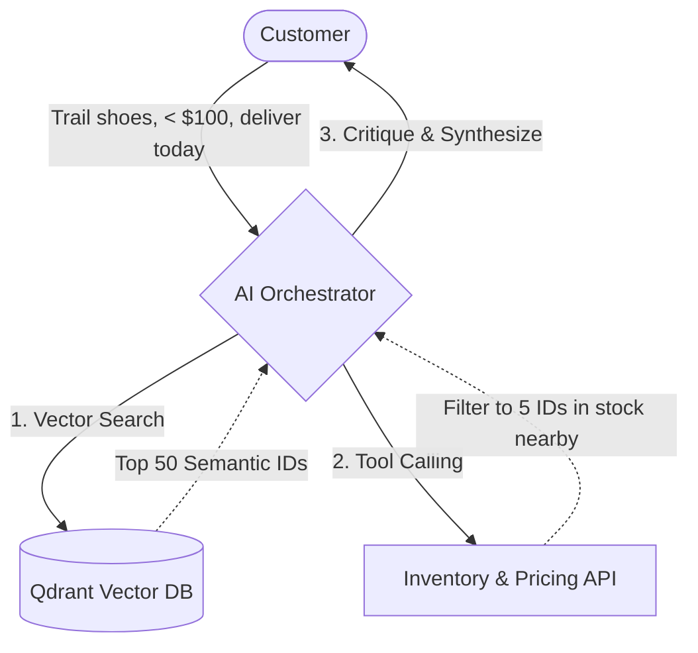

---

title: "Why E-commerce Needs Agentic Search?"
date: "2026-05-22T22:05:00+07:00"
lastmod: "2026-05-22T22:05:00+07:00"
draft: false
author: "Lê Tuấn Anh"
weight: 1
slug: "executive-summary"
keywords: ["Agentic Search vs Semantic Search"]
tags: ["Architecture", "AI Agents", "E-commerce", "Golang", "Search"]
description: "Why Agentic Search is the mandatory architectural evolution replacing Lexical and Semantic Search for modern e-commerce systems."
categories: ["Engineering", "Strategy"]
ShowToc: true
TocOpen: true
cover:
  image: "images/posts/agentic-ecommerce-search-cover.png"
  alt: "Agentic E-commerce Search Engine Architecture series: vector databases, ranking, and Go"
  relative: false
canonicalURL: "https://tanhdev.com/series/agentic-ecommerce-search/executive-summary/"
mermaid: true
---

The search engine is the heart of every e-commerce platform. If customers cannot find a product, they will not buy it.

Over the past decade, when referring to Search, we defaulted to **Elasticsearch** (with the BM25 algorithm). However, as user search behavior evolves—from typing abrupt keywords (*"men's running shoes"*) to long queries full of complex intent (*"find me waterproof trail running shoes, size 42, under $100, that can be delivered today"*), traditional search engines begin to reveal their fatal flaws.

This problem has driven the e-commerce industry through three phases of architectural evolution, and currently, we are standing at the most significant turning point: **Agentic Search**.

## 1. The Fall of Lexical Search (Keyword Matching)

Lexical Search operates on the "keyword matches keyword" principle.

This leads to terrible customer experiences when the system fails to understand synonyms, typos, or implicit concepts. If you type "winter coat", a traditional Elasticsearch system might completely miss highly relevant "fleece jackets" simply because the product name lacks the exact phrase "winter".

## 2. The Limitations of Semantic Search

To solve the above problem, the industry shifted to **Semantic Search** (Vector Search). Products are encoded into multi-dimensional Vectors (Embeddings) and stored in a Vector Database (such as Qdrant, Milvus).

Semantic Search excels at solving the "context" problem. It understands that "winter coat" and "fleece jacket" are close to each other in the vector space.

**But Semantic Search is still a Passive System.** It receives a Vector string, calculates geometric distance, and returns a static list (1-step workflow). It is completely powerless against **real-time Business Logic**.

A Vector Database cannot answer the question: *"Is this product currently in stock at the District 1 warehouse?"*. You should never (and cannot) store continuously mutating data such as Inventory or Dynamic Pricing (flash sales) inside a Vector Database.

## 3. The Agentic Search Solution

**Agentic Search** solves this problem by placing an Orchestration Layer ("The Brain") in front of the databases. Instead of passively letting the system query the DB directly, we delegate autonomy to an AI Agent.



Agentic Search breaks down a complex query into a multi-step reasoning flow:

1.  **Intent Parsing:** Upon receiving the query *"waterproof trail running shoes, under $100, deliver today"*, the Agent doesn't search immediately. It parses the query into:
    *   *Semantics:* Trail running shoes, waterproof $\rightarrow$ Requires Vector Search.
    *   *Hard filter:* Price < $100.
    *   *Real-time logic:* Deliver today $\rightarrow$ Requires calling the Inventory Service API to check the nearest warehouse.
2.  **Active RAG & Tool Calling:** The Agent utilizes Tool Calling (Function Calling). It commands the Golang backend to execute:
    *   `VectorSearch(query: "waterproof trail running shoes", max_price: 100)` $\rightarrow$ Returns 50 Product IDs.
    *   `CheckLiveInventory(ids, location: "ho-chi-minh")` $\rightarrow$ Filters down to 5 actually available IDs.
3.  **Critique & Synthesize:** The Agent self-evaluates the results, ultimately synthesizing a natural, absolutely accurate response accompanied by the product list.

---

## 4. Mathematical Comparison of Search Paradigms

To understand the core performance limits of these paradigms, we analyze their mathematical formulas.

### 4.1. Lexical Search (BM25)
BM25 ranks documents based on the appearance of query terms, applying logarithmic term-frequency saturation:

$$\text{Score}(D, Q) = \sum_{i=1}^{n} \text{IDF}(q_i) \times \frac{f(q_i, D) \times (k_1 + 1)}{f(q_i, D) + k_1 \times \left(1 - b + b \times \frac{|D|}{\text{avgdl}}\right)}$$

Where:
*   $f(q_i, D)$ is the term frequency of term $q_i$ in document $D$.
*   $|D|$ and $\text{avgdl}$ are the document length and average document length across the collection.
*   $k_1$ and $b$ are tuning parameters.
*   **Limitation:** If the user query is "fleece jacket" and the product document only contains "winter coat", the term frequency $f(q_i, D) = 0$, rendering the score 0 despite semantic relevance.

### 4.2. Semantic Search (Cosine Similarity)
Semantic search maps text tokens to high-dimensional dense vectors $\mathbf{u}$ and $\mathbf{v}$ and computes their alignment:

$$\text{Similarity}(\mathbf{u}, \mathbf{v}) = \cos(\theta) = \frac{\mathbf{u} \cdot \mathbf{v}}{\|\mathbf{u}\| \|\mathbf{v}\|} = \frac{\sum_{i=1}^{d} u_i v_i}{\sqrt{\sum_{i=1}^{d} u_i^2} \sqrt{\sum_{i=1}^{d} v_i^2}}$$

*   **Limitation:** It is a static, offline calculation. If a product goes out of stock or changes price, the vector coordinates do not change. Regenerating embeddings in real-time for million-item catalogs is computationally impossible.

---

## 5. Why Golang + Qdrant?

The majority of AI tutorials today are written in Python (LangChain, LlamaIndex). However, when deployed to a real-world e-commerce environment handling tens of thousands of Requests Per Second (RPS), Python's Global Interpreter Lock (GIL) bottleneck becomes a disastrous limitation for Concurrency.

In an Agentic Search model, the system must call databases, vector indices, and external API gateways concurrently. **Golang's Goroutines** solve this problem perfectly, reducing execution latencies to an absolute minimum. Combined with **Qdrant** — a Vector Database written in Rust that is exceptionally powerful at handling "Filtered Vector Search" — we achieve a flawless stack for Production.

---

## 6. Go Implementation: Concurrent Agentic Search Orchestrator

Below is the core concurrent orchestrator written in Go. It accepts structured search criteria, performs vector matching and real-time inventory queries concurrently using goroutines, and filters the result set:

```go
package main

import (
	"context"
	"encoding/json"
	"errors"
	"fmt"
	"sync"
	"time"
)

type Product struct {
	ID        string    `json:"id"`
	Name      string    `json:"name"`
	Price     float64   `json:"price"`
	InStock   bool      `json:"in_stock"`
	Warehouse string    `json:"warehouse"`
	Distance  float64   `json:"distance"` // in miles
}

type SearchQuery struct {
	Text         string  `json:"text"`
	MaxPrice     float64 `json:"max_price"`
	MaxDistance  float64 `json:"max_distance"`
	MustBeInStock bool    `json:"must_be_in_stock"`
}

type SearchOrchestrator struct {
	vectorClient    VectorDBClient
	inventoryClient InventoryClient
}

type VectorDBClient interface {
	SearchVectors(ctx context.Context, text string, limit int) ([]string, error)
}

type InventoryClient interface {
	FetchInventory(ctx context.Context, productIDs []string) (map[string]Product, error)
}

func NewSearchOrchestrator(vc VectorDBClient, ic InventoryClient) *SearchOrchestrator {
	return &SearchOrchestrator{
		vectorClient:    vc,
		inventoryClient: ic,
	}
}

func (so *SearchOrchestrator) ExecAgenticSearch(ctx context.Context, query SearchQuery) ([]Product, error) {
	ctx, cancel := context.WithTimeout(ctx, 400*time.Millisecond)
	defer cancel()

	// Step 1: Fetch candidate IDs from Vector DB
	candidateIDs, err := so.vectorClient.SearchVectors(ctx, query.Text, 50)
	if err != nil {
		return nil, fmt.Errorf("vector search failed: %w", err)
	}

	if len(candidateIDs) == 0 {
		return []Product{}, nil
	}

	// Step 2: Fetch live pricing and inventory concurrently
	var inventoryMap map[string]Product
	var invErr error
	var wg sync.WaitGroup

	wg.Add(1)
	go func() {
		defer wg.Done()
		inventoryMap, invErr = so.inventoryClient.FetchInventory(ctx, candidateIDs)
	}()

	wg.Wait()

	if invErr != nil {
		return nil, fmt.Errorf("inventory fetch failed: %w", err)
	}

	// Step 3: Run filtering rules deterministically
	var filteredResults []Product
	for _, id := range candidateIDs {
		product, exists := inventoryMap[id]
		if !exists {
			continue
		}

		if query.MustBeInStock && !product.InStock {
			continue
		}

		if query.MaxPrice > 0 && product.Price > query.MaxPrice {
			continue
		}

		if query.MaxDistance > 0 && product.Distance > query.MaxDistance {
			continue
		}

		filteredResults = append(filteredResults, product)
	}

	return filteredResults, nil
}
```

---

## 7. Intent Classification & Cost Mitigation Strategies

While Agentic Search delivers unparalleled user experience, routing every single user query to an LLM parser (e.g., Claude 3.5 Sonnet) is an anti-pattern. If a user simply types "nike shoes" or "iphone 15", using an LLM to parse this intent is a waste of both financial resources and latency budget.

To prevent this, the Golang orchestrator implements a **Deterministic Intent Classifier** as a first-line gate:
- **Lexical Pattern Matching:** If the query is short (less than 3 words) and matches simple regex patterns for categories or brands, it bypasses LLM parsing and goes directly to standard Elasticsearch/Qdrant keyword queries.
- **Cache Hits:** Common queries are cached using Redis. If a query hits the cache, the search results are returned within 2ms.
- **LLM Fallback:** Only complex, natural language queries (e.g., "find me waterproof trail running shoes, size 42, under $100") are sent to the LLM router for semantic decomposition and API mapping.

This classification strategy reduces LLM API calls by up to **80%**, saving significant cloud operating costs while keeping average search latency under **150ms** for the majority of the traffic.

---

## 8. What This Series Covers

The following series will dissect exactly how you can build this heavy-duty architectural system from scratch.

1. **Golang Orchestration:** Building the core concurrent gRPC orchestrator that manages context, parses query intent, and manages execution bounds.
2. **Qdrant Integration:** Structuring schemas, indexing product descriptions, and building metadata payloads.
3. **Fuzzy Search & Spellcheck:** Resolving Vietnamese typing irregularities and semantic typos.
4. **Performance Tuning:** Benchmarking goroutines and caching mechanisms to scale the gateway to 10,000+ RPS.

For system architecture advisory or customized backend training, contact [Lê Tuấn Anh](/hire/).

---

[Next Part →](/series/agentic-ecommerce-search/part-1-golang-orchestration/)
