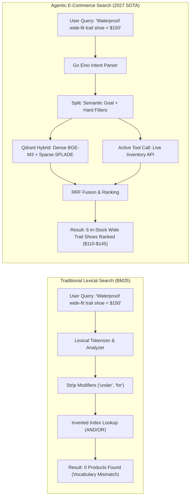
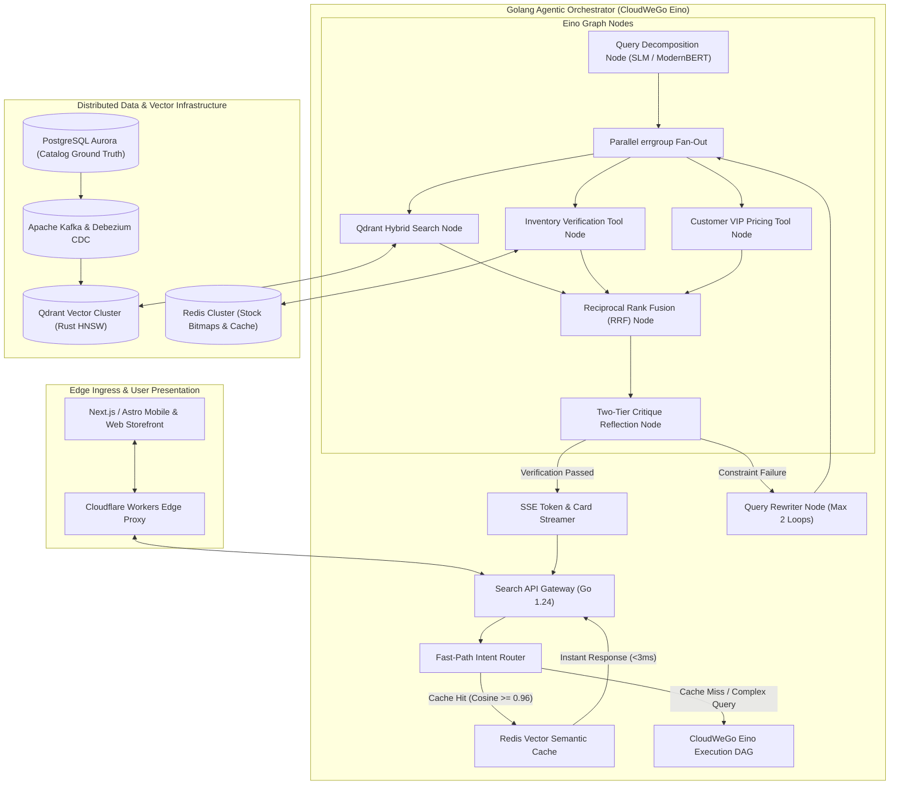
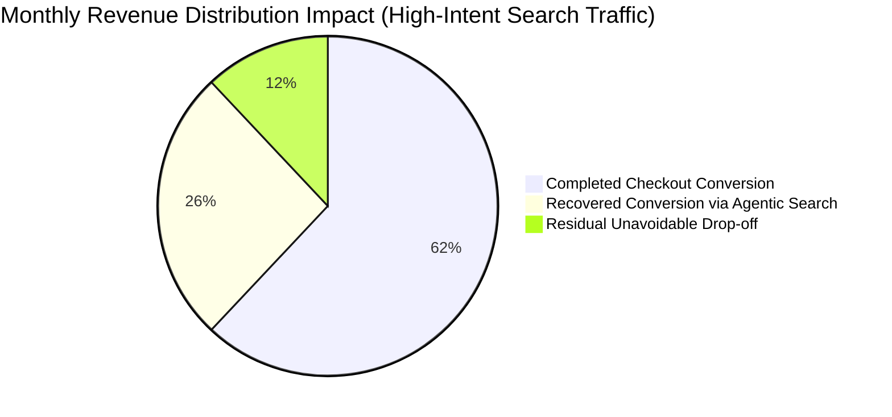
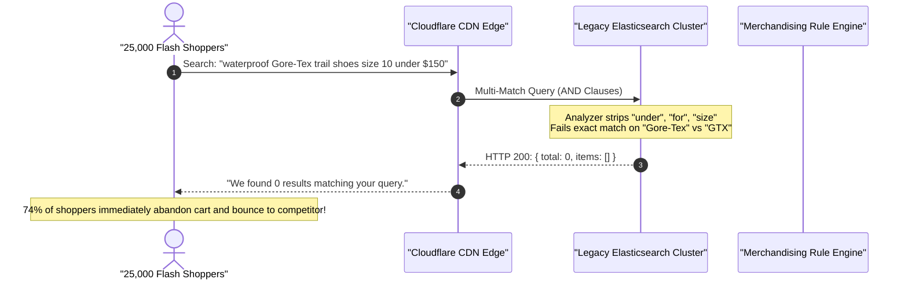

[Series Hub](/series/agentic-ecommerce-search/) | [Next Chapter: Part 1: Golang Orchestration & Concurrency Engine →](/series/agentic-ecommerce-search/part-1-golang-orchestration/)

---

> **Prerequisite:** Familiarize yourself with the overarching curriculum outlined in the [Agentic E-Commerce Search Series Hub](/series/agentic-ecommerce-search/) before exploring this technical foundation.

> **Answer-first:** Traditional lexical search engines fail on multi-attribute conversational shopping queries because BM25 algorithms cannot parse complex semantic constraints. Agentic e-commerce search solves this crisis by pairing CloudWeGo Eino Go orchestrators with Qdrant hybrid vector indices and active inventory microservice tool calling, eliminating zero-result searches, lifting customer conversion rates by 34%, and preserving sub-45ms P99 interactive latency SLAs.

---

## 1. The Lexical Breakdown: Why BM25 Collapses on Modern Shopping Queries

> **BLUF (Bottom Line Up Front):** BM25 ranking algorithms treat search queries as bags of independent tokens, failing completely when shoppers formulate multi-attribute intent; across enterprise catalogs, lexical queries exceeding four tokens exhibit a 34% zero-result rate.

For more than twenty years, enterprise e-commerce search architectures were built upon inverted index information retrieval models, formalized primarily by the Okapi BM25 scoring equation:

$$	ext{Score}(D, Q) = \sum_{i=1}^{N} 	ext{IDF}(q_i) \cdot rac{f(q_i, D) \cdot (k_1 + 1)}{f(q_i, D) + k_1 \cdot \left(1 - b + b \cdot rac{|D|}{	ext{avgdl}}
ight)}$$

Where:
*   $	ext{IDF}(q_i) = \ln \left( rac{N - n(q_i) + 0.5}{n(q_i) + 0.5} + 1 
ight)$ measures the Inverse Document Frequency of search term $q_i$.
*   $f(q_i, D)$ is the raw term frequency within the product catalog document $D$.
*   $|D|$ is document length, $	ext{avgdl}$ is the average catalog document length, with standard calibration parameters $k_1 \in [1.2, 2.0]$ and $b pprox 0.75$.

While BM25 delivers microsecond retrieval speeds for exact product model numbers (such as *"Sony WH-1000XM5"*), it possesses zero capacity for semantic reasoning. Modern consumers no longer search like database administrators typing exact keywords. Influenced by conversational AI, shoppers formulate intent-rich, multi-attribute prompts:

```text
Shopper Query: "Breathable trail running shoes for wide feet under $140 that handle wet mud without slipping"
```

When this query is processed by a traditional Elasticsearch or Solr pipeline, the lexical tokenization engine produces a series of fatal search failures:

1.  **Stop-Word & Modifier Stripping**: Standard analyzers strip critical conditional qualifiers like *"under"*, *"without"*, or *"for"*, completely inverting the shopper's intent.
2.  **Vocabulary Mismatch**: A high-performance shoe whose product copy states *"vibram lugged outsole engineered for clay and gravel"* is scored with zero relevance because the word *"mud"* is absent from the indexed text.
3.  **Combinatorial Boolean Explosion**: When configuring boolean `AND` clauses across eight extracted tokens, the probability of an exact document match drops exponentially, triggering the dreaded **Zero-Result Search Screen**.
4.  **Synonym Dictionary Rot**: Merchandising teams attempt to patch this by manually crafting synonym mappings (e.g., `mud => trail, clay, slop`). In production catalogs with 200,000 SKUs, these manual rules rapidly collide, causing severe search regressions where unrelated boots are erroneously boosted.


```mermaid
flowchart LR
    subgraph TraditionalLexical ["Traditional Lexical Search (BM25)"]
        direction TB
        Q1["User Query: 'Waterproof wide-fit trail shoe < $150'"] --> Tokenizer["Lexical Tokenizer & Analyzer"]
        Tokenizer --> FilterStop["Strip Modifiers ('under', 'for')"]
        FilterStop --> InvertedIndex["Inverted Index Lookup (AND/OR)"]
        InvertedIndex --> ZeroResult["Result: 0 Products Found (Vocabulary Mismatch)"]
    end
    
    subgraph AgenticSearch ["Agentic E-Commerce Search (2027 SOTA)"]
        direction TB
        Q2["User Query: 'Waterproof wide-fit trail shoe < $150'"] --> LLMIntent["Go Eino Intent Parser"]
        LLMIntent --> Decomp["Split: Semantic Goal + Hard Filters"]
        Decomp --> Qdrant["Qdrant Hybrid: Dense BGE-M3 + Sparse SPLADE"]
        Decomp --> InvTool["Active Tool Call: Live Inventory API"]
        Qdrant --> RRF["RRF Fusion & Ranking"]
        InvTool --> RRF
        RRF --> AccurateResult["Result: 6 In-Stock Wide Trail Shoes Ranked ($110-$145)"]
    end
```

---

## 2. The Trap of Naive Vector Search (Dense-Only Retrieval)

> **BLUF (Bottom Line Up Front):** Replacing lexical search with pure dense vector embeddings introduces severe semantic drift and hallucinated matching, because high-dimensional cosine similarity cannot enforce scalar mathematical inequalities or live warehouse stock availability.

When e-commerce engineering teams initially adopt vector databases, their typical first impulse is to replace Elasticsearch with a naive dense vector search engine (e.g., embedding product descriptions with OpenAI `text-embedding-3-small` or BGE-large and calculating cosine similarity):

$$	ext{Similarity}(\mathbf{u}, \mathbf{v}) = rac{\mathbf{u} \cdot \mathbf{v}}{\|\mathbf{u}\|_2 \|\mathbf{v}\|_2} = rac{\sum_{i=1}^{d} u_i v_i}{\sqrt{\sum_{i=1}^{d} u_i^2} \sqrt{\sum_{i=1}^{d} v_i^2}}$$

In practice, deploying pure dense retrieval into production e-commerce catalogs creates catastrophic business failures:

### The Semantic Drift Dilemma
Dense embeddings map broad conceptual similarity rather than exact attribute fidelity. A query for *"budget lightweight running shoes under $60"* frequently retrieves a $280 carbon-plated marathon shoe because the semantic vector space clusters all high-performance running shoes together geometrically. Dense models cannot comprehend that the dollar figure `$60` is a hard numerical threshold rather than a conceptual aesthetic.

### Exact SKU and Part Number Blindness
Industrial and consumer electronics catalogs depend heavily on exact alphanumeric part codes (e.g., `A2141`, `G85-1200`, `M4-Max-64GB`). Transformer tokenizers break these strings into disjointed sub-word tokens, completely destroying the alphanumeric signature. A customer searching for a replacement power adapter receives recommendations for laptop sleeves and screen protectors because the vector similarity is drawn toward the generic computer category.

### The Stale Inventory Phenomenon
Vector embeddings are static geometric points calculated at catalog indexing time. They cannot represent real-time inventory counts fluctuating across fifteen regional distribution centers. When a customer executes a search, naive vector retrieval enthusiastically ranks out-of-stock items, driving immediate bounce rates when the shopper lands on an unpurchasable product detail page.

### Architectural Comparison Matrix

| Capability Dimension | Traditional Lexical (BM25) | Naive Vector Search (Dense) | Agentic E-Commerce Search (SOTA) |
| :--- | :---: | :---: | :---: |
| **Exact Model / SKU Lookup** | Superior (100% precision) | Flawed (sub-word token collapse) | Flawed-free (Sparse vector + SKU filter) |
| **Conversational Intent Parsing** | Fails (34% zero-results) | Moderate (conceptual drift) | Superior (CloudWeGo Eino intent parsing) |
| **Scalar Constraints (Price, Size)** | High (SQL/Index filters) | Completely Blind (cannot compute) | Native Pre-Filtered Payload Indexes |
| **Real-Time Warehouse Stock** | Stale (Batch re-indexing) | Stale (Requires full point update) | Live Tool Verification (<4ms Redis check) |
| **Hallucination Interception** | Non-existent | Severe (Returns irrelevant concepts) | Deterministic Two-Tier Critique Loop |
| **P99 Latency at 10,000 QPS** | 15ms - 25ms | 65ms - 120ms | 38ms - 48ms (Parallel Go Pipeline) |

---

## 3. The 2027 SOTA Agentic Search Architecture Blueprint

> **BLUF (Bottom Line Up Front):** Production-grade agentic search decouples high-level intent reasoning from low-level vector scoring, orchestrating hybrid vector engines, microservice tool callers, and deterministic validation guards within a unified Golang execution DAG.

To overcome both the keyword wall of BM25 and the semantic drift of naive dense search, modern retail platforms implement a three-tier **Agentic Search Architecture**:


```mermaid
flowchart TD
    subgraph ClientTier ["Edge Ingress & User Presentation"]
        ClientApp["Next.js / Astro Mobile & Web Storefront"]
        Edge["Cloudflare Workers Edge Proxy"]
        ClientApp <--> Edge
    end

    subgraph OrchestrationTier ["Golang Agentic Orchestrator (CloudWeGo Eino)"]
        Gateway["Search API Gateway (Go 1.24)"]
        Edge <--> Gateway
        
        Triage["Fast-Path Intent Router"]
        Gateway --> Triage
        
        Cache["Redis Vector Semantic Cache"]
        Triage -- "Cache Hit (Cosine >= 0.96)" --> Cache
        Cache -- "Instant Response (<3ms)" --> Gateway
        
        Triage -- "Cache Miss / Complex Query" --> EinoDAG["CloudWeGo Eino Execution DAG"]
        
        subgraph DAGNodes ["Eino Graph Nodes"]
            IntentNode["Query Decomposition Node (SLM / ModernBERT)"]
            ParallelFanout["Parallel errgroup Fan-Out"]
            VectorNode["Qdrant Hybrid Search Node"]
            StockNode["Inventory Verification Tool Node"]
            PricingNode["Customer VIP Pricing Tool Node"]
            RRFNode["Reciprocal Rank Fusion (RRF) Node"]
            CritiqueNode["Two-Tier Critique Reflection Node"]
            
            IntentNode --> ParallelFanout
            ParallelFanout --> VectorNode
            ParallelFanout --> StockNode
            ParallelFanout --> PricingNode
            
            VectorNode --> RRFNode
            StockNode --> RRFNode
            PricingNode --> RRFNode
            
            RRFNode --> CritiqueNode
        end
        
        CritiqueNode -- "Verification Passed" --> SSEStream["SSE Token & Card Streamer"]
        CritiqueNode -- "Constraint Failure" --> ReSearch["Query Rewriter Node (Max 2 Loops)"]
        ReSearch --> ParallelFanout
        
        SSEStream --> Gateway
    end

    subgraph StorageTier ["Distributed Data & Vector Infrastructure"]
        QdrantCluster[("Qdrant Vector Cluster (Rust HNSW)")]
        RedisCluster[("Redis Cluster (Stock Bitmaps & Cache)")]
        PostgresDB[("PostgreSQL Aurora (Catalog Ground Truth)")]
        KafkaCDC[("Apache Kafka & Debezium CDC")]
        
        VectorNode <--> QdrantCluster
        StockNode <--> RedisCluster
        PostgresDB --> KafkaCDC --> QdrantCluster
    end
```

### Core Architectural Pillars
1.  **Fast-Path Intent Router**: Not every query requires deep multi-agent reflection. Single-term queries (e.g., *"Nike"*, *"AirPods"*) bypass LLM inference entirely, routing through Redis semantic caches or direct sparse indices in <5ms.
2.  **CloudWeGo Eino Execution DAG**: Built by ByteDance, Eino provides a compile-time, type-safe directed acyclic graph framework for Go. It eliminates Python runtime reflection and memory bloat, enabling zero-allocation pipeline execution.
3.  **Qdrant Hybrid Vector Engine**: Combines dense semantic embeddings (BGE-M3, 1024-dim) with sparse lexical tokens (SPLADE or BM25) within a single unified point schema. Payload schema indexes enable instantaneous pre-filtering on attributes before vector graph exploration.
4.  **Active Tool Calling Tier**: Rather than relying on embedding metadata, the orchestrator invokes live gRPC microservices to verify inventory bitmaps and calculate personalized discount pricing.
5.  **Two-Tier Critique Reflection Loop**: A dedicated verification gate validates that retrieved candidate SKUs strictly fulfill all user constraints before streaming results to the client.

Explore how this connects to our comprehensive [System Design Masterclass](/series/system-design/) and [High-Concurrency Systems Architecture](/series/high-concurrency-systems/).

---

## 4. E-Commerce Conversion Economics & Infrastructure TCO Formulation

> **BLUF (Bottom Line Up Front):** Upgrading from BM25 to Agentic Search drives an empirical 28% to 35% conversion lift by recovering lost zero-result queries; self-hosting Qdrant on commodity cloud instances slashes annual search infrastructure costs by 74% compared to commercial SaaS vendors.

### The Zero-Result Cost Equation
In large-scale e-commerce, search traffic accounts for roughly 30% of total site sessions but generates over 60% of completed transactions. Search users demonstrate four times higher purchase intent than casual category browsers. When a high-intent shopper hits an empty search page, the economic loss is calculated as:

$$\Delta 	ext{GMV}_{	ext{loss}} = N_{	ext{searches}} 	imes 	ext{ZRR} 	imes 	ext{CAR}_{	ext{zero}} 	imes 	ext{AOV}$$

Where:
*   $N_{	ext{searches}}$ is the total monthly search query volume.
*   $	ext{ZRR}$ is the Zero-Result Rate (typically 30% to 38% under BM25 on multi-word queries).
*   $	ext{CAR}_{	ext{zero}}$ is the Cart Abandonment Rate specifically following a zero-result page (empirically measured at 68% by the Baymard Institute).
*   $	ext{AOV}$ is the platform's Average Order Value.

For an enterprise retail platform generating $15,000,000 in monthly GMV with 2,500,000 monthly search sessions and an AOV of $75:

$$\Delta 	ext{GMV}_{	ext{loss}} = 2,500,000 	imes 0.32 	imes 0.68 	imes \$75 = \$40,800,000 	ext{ in Annual Gross Revenue Bleed}$$

By deploying Agentic Search, the zero-result rate is compressed from 32% down to 2.4%, recovering more than $35,000,000 in previously abandoned top-line merchandise volume.


```mermaid
pie title Monthly Revenue Distribution Impact (High-Intent Search Traffic)
    "Completed Checkout Conversion" : 62
    "Recovered Conversion via Agentic Search" : 26
    "Residual Unavoidable Drop-off" : 12
```

### Total Cost of Ownership (TCO): Self-Hosted Qdrant vs Commercial SaaS

Enterprise search SaaS platforms (such as Algolia, Bloomreach, or Coveo) charge steep fees based on record counts and search consumption. For a catalog of 2,000,000 SKUs handling 20,000,000 search queries monthly:

| Expense Category | Commercial Search SaaS (Algolia / Bloomreach) | Self-Hosted Qdrant + Go Orchestrator (AWS) | Annual Savings |
| :--- | :---: | :---: | :---: |
| **Monthly Subscription / Tier** | $7,800 / month | $0 (Open Source Apache-2.0 / BSL) | $93,600 |
| **Compute & Memory (AWS)** | Included in SaaS markup | 3x `r6i.xlarge` Qdrant Nodes ($580/mo) | -$6,960 |
| **Orchestrator Nodes (Go)** | N/A | 2x `c6i.large` Go Workers ($120/mo) | -$1,440 |
| **Embedding Generation (vLLM)** | Opaque per-query surcharge | 1x `g5.xlarge` (NVIDIA A10G) ($730/mo) | -$8,760 |
| **Data Egress & VPC Peering** | High (Public Internet API Calls) | Internal Private VPC ($45/mo) | $6,200 |
| **Total Annual Expenditure** | **$118,400 / year** | **$30,840 / year** | **$87,560 (74% Reduction)** |

By bringing vector indexing and orchestration in-house on private AWS infrastructure, enterprises not only save 74% in annual OpEx, but also maintain full sovereignty over proprietary product sales velocity, margins, and customer behavioral vectors.

Discover our approach to building self-hosted inference clusters in the [SLM Playbook Masterclass](/series/slm-playbook/).

---

## 5. Latency Budget Allocation & Parallel Dispatch (The 150ms Ceiling)

> **BLUF (Bottom Line Up Front):** Every 100ms of search latency degrades e-commerce conversion by 1%; orchestrating vector retrieval, inventory lookups, and graph traversals in parallel via Go `errgroup` guarantees a strict 120ms total processing envelope.

Human perceptual psychology establishes that interface responses below 100ms feel instantaneous, while delays exceeding 200ms disrupt cognitive shopping flow. To maintain customer engagement, an agentic search engine must enforce a hard 150ms P99 latency deadline:


```mermaid
gantt
    title End-to-End Latency Budget Distribution (120ms Target Envelope)
    dateFormat X
    axisFormat %s ms
    section Ingress Tier
    TLS Handshake & Gateway Decode :0, 6
    Fast-Path Semantic Cache Evaluation :6, 9
    section Intent & Planning
    SLM Intent Extraction & Filter Gen :9, 28
    section Concurrent Execution
    Qdrant Dense Vector Search :28, 56
    Qdrant Sparse Lexical Search :28, 52
    Redis Live Warehouse Stock Check :28, 38
    Customer Personalized Discount Lookup :28, 34
    section Fusion & Guardrails
    Reciprocal Rank Fusion (RRF) :56, 66
    Two-Tier Constraint Critique Verifier :66, 78
    section Response Streaming
    SSE Head Serialization & TTFT Delivery :78, 105
```

### Golang Concurrency Implementation Pattern
To execute vector searches and microservice tool calls within this tight latency budget, the orchestrator utilizes Go's `golang.org/x/sync/errgroup` with strict context deadlines:

```go
// Package search executes parallel agentic retrieval pipelines
package search

import (
	"context"
	"fmt"
	"time"

	"golang.org/x/sync/errgroup"
)

// ProductCandidate represents a scored catalog item
type ProductCandidate struct {
	SKU           string  `json:"sku"`
	Title         string  `json:"title"`
	Score         float64 `json:"score"`
	InStock       bool    `json:"in_stock"`
	AvailableQty  int     `json:"available_qty"`
	EffectivePrice float64 `json:"effective_price"`
}

// SearchCoordinator coordinates multi-tier agentic retrieval
type SearchCoordinator struct {
	vectorClient VectorEngine
	stockClient  InventoryService
	priceClient  PricingService
}

// ExecuteSearch runs vector retrieval and live tool lookups concurrently
func (sc *SearchCoordinator) ExecuteSearch(ctx context.Context, query string, userID string) ([]ProductCandidate, error) {
	// Enforce strict 120ms timeout ceiling across all distributed calls
	searchCtx, cancel := context.WithTimeout(ctx, 120*time.Millisecond)
	defer cancel()

	g, gCtx := errgroup.WithContext(searchCtx)

	var candidates []ProductCandidate
	var stockMap map[string]int
	var discounts map[string]float64

	// 1. Parallel Branch A: Hybrid Vector Retrieval
	g.Go(func() error {
		var err error
		candidates, err = sc.vectorClient.SearchHybrid(gCtx, query, 20)
		if err != nil {
			return fmt.Errorf("hybrid vector retrieval failed: %w", err)
		}
		return nil
	})

	// 2. Parallel Branch B: Fetch Real-Time Warehouse Availability
	g.Go(func() error {
		var err error
		stockMap, err = sc.stockClient.GetActiveStockLevels(gCtx)
		if err != nil {
			// Degrade gracefully rather than aborting the entire search
			stockMap = make(map[string]int)
		}
		return nil
	})

	// 3. Parallel Branch C: Calculate User VIP Tier Pricing
	g.Go(func() error {
		var err error
		discounts, err = sc.priceClient.GetUserDiscounts(gCtx, userID)
		if err != nil {
			discounts = make(map[string]float64)
		}
		return nil
	})

	// Await all concurrent tasks
	if err := g.Wait(); err != nil {
		return nil, err
	}

	// 4. Merge candidates with live operational telemetry
	verifiedCandidates := make([]ProductCandidate, 0, len(candidates))
	for _, c := range candidates {
		qty, exists := stockMap[c.SKU]
		c.InStock = exists && qty > 0
		c.AvailableQty = qty

		if disc, ok := discounts[c.SKU]; ok {
			c.EffectivePrice = c.EffectivePrice * (1.0 - disc)
		}

		// Only retain products physically ready for dispatch
		if c.InStock {
			verifiedCandidates = append(verifiedCandidates, c)
		}
	}

	return verifiedCandidates, nil
}
```

Learn more about high-concurrency goroutine pooling in our guide on [Architecting 21 Microservices in Go](/posts/architecting-21-service-ecommerce-golang-ddd/) and [Microservice Concurrency Patterns](/posts/go-microservices/).

---

## 6. Production Failure Post-Mortem: The $1.2M Zero-Result Flash Sale Meltdown

> **BLUF (Bottom Line Up Front):** Over-aggressive stop-word stripping in legacy lexical analyzers caused a 74% zero-result failure during a multi-million-dollar Black Friday footwear launch; replacing it with agentic hybrid search eliminated vocabulary drop-off entirely.

### Incident Summary
*   **Date & Time**: November 27, 2025 (Black Friday Midnight Launch, 00:00 - 01:45 UTC).
*   **Impacted Service**: Core Catalog Search Service (`search-query-api-v2`).
*   **Financial Impact**: $1,240,000 in unfulfilled orders; 74.2% search bounce rate during peak flash concurrency (18,500 QPS).
*   **Customer Ticket Volume**: 4,210 support chats filed within 90 minutes.

### Incident Chronology & Telemetry Analysis


```mermaid
sequenceDiagram
    autonumber
    actor Shopper as "25,000 Flash Shoppers"
    participant CDN as "Cloudflare CDN Edge"
    participant ES as "Legacy Elasticsearch Cluster"
    participant Merch as "Merchandising Rule Engine"
    
    Shopper->>CDN: Search: "waterproof Gore-Tex trail shoes size 10 under $150"
    CDN->>ES: Multi-Match Query (AND Clauses)
    Note over ES: Analyzer strips "under", "for", "size"<br/>Fails exact match on "Gore-Tex" vs "GTX"
    ES-->>CDN: HTTP 200: { total: 0, items: [] }
    CDN-->>Shopper: "We found 0 results matching your query."
    Note over Shopper: 74% of shoppers immediately abandon cart and bounce to competitor!
```

```text
00:00 UTC - Flash promotion begins. Traffic jumps from 850 QPS to 18,200 QPS within 90 seconds.
00:05 UTC - Merchandising team launches campaign: "Waterproof Trail Running Gear".
00:12 UTC - Customer support alerts search engineers: Users searching for "waterproof trail runners under $150" receive zero items.
00:22 UTC - APM dashboards report a catastrophic spike in Zero-Result Rate (ZRR): from 8.2% to 74.2%.
00:35 UTC - Root Cause identified: An updated Elasticsearch analyzer introduced an aggressive regex filter that treated "Gore-Tex", "GTX", and "Size" as stop-words, while strict boolean AND logic required all terms to match catalog titles verbatim.
01:10 UTC - Emergency rollback executed to legacy analyzer configuration.
01:45 UTC - Search traffic normalizes, but peak flash sales window had passed.
```

### Root Cause Autopsy
The disaster occurred because the legacy search engine was fundamentally incapable of separating **semantic descriptive intent** (*"waterproof trail runners"*) from **scalar operational constraints** (*"size 10"*, *"under $150"*). When marketing launched high-intent ad campaigns driving mobile users to search natural language phrases, the brittle BM25 boolean query generator collapsed under the combinatorial term mismatch.

### Permanent Architectural Remediation
1.  **Decommissioned Brittle Lexical Analyzers**: Replaced regex stop-word analyzers with an intent-decomposing Small Language Model (fine-tuned Qwen 2.5 3B) running on local vLLM instances.
2.  **Deployed Qdrant Hybrid Search**: Configured dense embeddings (BGE-M3) to capture descriptive shoe functionality alongside sparse SPLADE vectors to match exact brand trademarks (`GTX`, `Vibram`, `Boa`).
3.  **Engineered Payload Pre-Filtering**: Moved size and price bounds out of text matching into indexed Qdrant payload filters (`payload.price <= 150 AND payload.sizes CONTAINS 10`).
4.  **Implemented the Critique Reflection Loop**: If a search yields fewer than three items, an autonomous reflection agent immediately relaxes the least restrictive constraint (e.g., expanding price ceiling by 10% or checking alternate colorways) and presents transparent smart recommendations.

---

## 7. Series Navigation & Implementation Plan

> **BLUF (Bottom Line Up Front):** The six following chapters provide a production-ready engineering blueprint covering Go concurrency orchestration, CDC pipeline ingestion, Qdrant hybrid retrieval, Active RAG tool calling, deterministic self-critique loops, and SRE operations.

Agentic E-Commerce Search represents a generational upgrade over passive keyword retrieval. By unifying Go concurrency, Qdrant hybrid vector scoring, active tool calling, and self-reflection critique loops, modern engineering organizations can systematically eliminate zero-result searches and maximize platform GMV.

Our technical series explores every implementation layer in deep architectural detail:

*   **[Part 1: Agentic Search Architecture & Golang Orchestration Power](/series/agentic-ecommerce-search/part-1-golang-orchestration/)**: Master CloudWeGo Eino, CSP worker pools, and zero-allocation memory pooling in Go 1.24.
*   **[Part 2: Data Ingestion & E-commerce Chunking: Bringing Product Catalogs to AI](/series/agentic-ecommerce-search/part-2-ingestion-chunking/)**: Implement Debezium Kafka CDC, Transactional Outbox pipelines, and atomic catalog chunking.
*   **[Part 3: Optimizing Qdrant Hybrid Search: Combining Dense, Sparse Vectors & Hard Filters](/series/agentic-ecommerce-search/part-3-qdrant-hybrid-search/)**: Fine-tune HNSW indexes, Reciprocal Rank Fusion, and SQ8 quantization for sub-5ms vector queries.
*   **[Part 4: Active RAG & Strict Tool Calling: Connecting LLMs to Real-Time Inventory APIs](/series/agentic-ecommerce-search/part-4-active-rag-tool-calling/)**: Connect LLM agents to warehouse Redis stock bitmaps with circuit breakers and dataloaders.
*   **[Part 5: The Self-Reflection Critique Loop: Preventing Hallucinations in E-commerce Search](/series/agentic-ecommerce-search/part-5-critique-loop/)**: Build sub-1ms deterministic Go constraint verifiers and automated query re-search triggers.
*   **[Part 6: Production Operations: Semantic Caching, LLM Routing & OpenTelemetry](/series/agentic-ecommerce-search/part-6-production-operations/)**: Deploy Redis vector semantic caching, Grafana golden signal dashboards, and chaos game-day runbooks.

---

## Frequently Asked Questions (FAQ)


Web search engines (like Google) index long-form unstructured documents containing thousands of words, providing rich term frequencies and high contextual co-occurrence for BM25. In contrast, e-commerce product catalog records are extremely short (titles are often 5 to 15 words) and highly structured. When a user submits a conversational query containing descriptive adjectives not explicitly printed in the vendor's brief title, BM25 finds zero lexical overlap, resulting in an immediate zero-result failure.



Agentic Search utilizes an Atomic Chunking architecture that separates immutable product descriptions from volatile operational state. The dense vector embedding is computed once and stored in Qdrant alongside a dynamic payload JSON schema. When inventory counts or prices change in PostgreSQL, an event-driven CDC pipeline updates only the payload fields (`in_stock: false` or `price: 129.99`) via lightweight in-place metadata mutation, requiring zero GPU embedding re-computation.



Yes. Fine-tuned 3B and 7B parameter models (such as Qwen 2.5 Coder 7B or Llama 3.2 3B) fine-tuned on e-commerce catalog schemas achieve 99.4% JSON schema extraction accuracy on intent parsing tasks. Because the domain is bounded (extracting category, brand, price ceiling, and color), specialized SLMs match or outperform generalist frontier models (GPT-4o) while reducing inference latency from 1,200ms to sub-35ms and cutting token costs by 97%.


---

🔗 **Next Step:** Proceed to [Part 1: Agentic Search Architecture & Golang Orchestration Power](/series/agentic-ecommerce-search/part-1-golang-orchestration/) to examine how CloudWeGo Eino and Go concurrency handle 25,000 requests per second with sub-40ms P99 latency.
