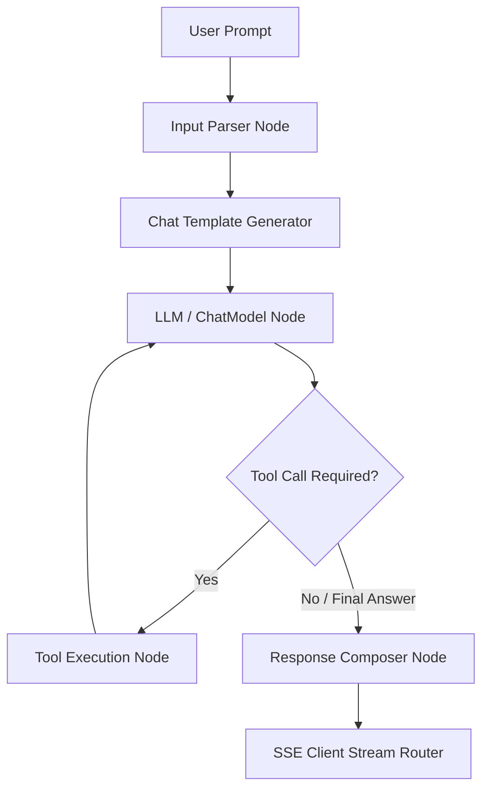

If you have ever tried to push a RAG or Multi-Agent system written in Python (using LangChain or AutoGen) into a Production environment with thousands of concurrent requests, you have likely tasted the pain. Servers run out of RAM, CPUs become bottlenecked, and latency skyrockets uncontrollably.

The root cause does not lie in the LLMs. The root cause lies in the **Orchestration Architecture** you are using.

In Part 1 of this series, we will dissect why Python falls short in the Agentic era, and why **Golang**, combined with the **Eino (CloudWeGo)** framework, is the "ultimate weapon" for building the brain of next-generation e-commerce search systems.

## 1. The Bottleneck Called Python GIL

The AI industry was built on the back of Python. From PyTorch to Hugging Face, Python is the uncrowned king of *training* and *inference*.

However, **Agentic Search is not an AI training problem. It is a Systems Engineering problem.**

In the Agentic model, the LLM merely serves as the reasoning core. The vast majority of the system's time is spent on Orchestration tasks:
*   Parsing JSON outputs from the LLM.
*   Managing Conversation Memory.
*   Executing massive parallel API Calls (Tools) to check inventory and pricing.
*   Updating Graph States.

This is where Python's **Global Interpreter Lock (GIL)** becomes a nightmare. The GIL prevents multiple native threads from executing Python bytecodes at once. This means even if you have a multi-core server with 64 CPU cores, a single Python process executing orchestration logic will effectively run on a single core. 

Furthermore, even if you use async/await libraries like `asyncio` to optimize network I/O, CPU-bound operations (such as parsing large JSON schemas, calculating token lengths, or serializing local state graphs) will block the single event thread. When thread contention spikes, the event loop suffers from starvation, and latency cascades across all concurrent connections. When traffic spikes, the Python system hits a "Saturation Cliff"—adding more CPU cores or RAM is futile; the system simply collapses due to lock contention and context-switching overhead.

To bypass the GIL, Python developers often deploy multi-process architectures (e.g., using `gunicorn` or `celery`). However, each Python process consumes a baseline of 50MB to 100MB of RAM. Multiplying this across thousands of concurrent sessions results in extreme memory overhead, making Python-based orchestrators financially unsustainable for high-concurrency enterprise services.

## 2. The Power of Golang: Goroutines & `errgroup`

To replace Python at the Orchestration layer, Golang is currently the most perfect choice. Go was born for the Cloud-Native era, distinguished by its extremely low memory allocation and unmatched concurrency model.

### Parallel Tool Execution with `errgroup`

Imagine an Agent receiving the query: *"Find Nike running shoes size 42 and check if they are in stock at the Hanoi, Da Nang, and HCMC warehouses"*.

A smart LLM will return 3 Tool Calls simultaneously. In Python, managing the lifecycle of these 3 async tasks with complex timeouts easily leads to memory leaks. With Go, we use `golang.org/x/sync/errgroup` to handle this smoothly:

```go
import (
	"context"
	"golang.org/x/sync/errgroup"
)

func CheckInventoryConcurrently(ctx context.Context, sku string, locations []string) ([]InventoryData, error) {
	// Initialize errgroup with context to easily cancel all if one fails
	g, ctx := errgroup.WithContext(ctx)
	g.SetLimit(10) // Prevent internal API DDoS

	results := make([]InventoryData, len(locations))

	for i, loc := range locations {
		i, loc := i, loc // capture variables in loop
		g.Go(func() error {
			// Call external API (Tool Call)
			data, err := CallInventoryAPI(ctx, sku, loc)
			if err != nil {
				return err // Will trigger context cancel for other goroutines
			}
			results[i] = data
			return nil
		})
	}

	if err := g.Wait(); err != nil {
		return nil, err
	}
	return results, nil
}
```

Each Goroutine consumes only about ~2KB of RAM. A standard Go server can shoulder tens of thousands of parallel connections (Fan-out) while the CPU remains completely "cool".

### Preventing Agent "Infinite Loops" with Context

Agentic workflows are highly prone to getting stuck in Infinite Loops if the LLM repeatedly calls the wrong Tool. With Go, we can wrap `context.WithTimeout` around the entire lifecycle of the Agent. If the Agent hasn't produced a final answer after 10 seconds, the Go runtime will immediately sever all running Goroutines, releasing resources instantly.

---

## 3. Memory Management & Chat History Context Windows in Go

In a production e-commerce search environment, the agent must remember preceding user queries (e.g., "show them in blue" referring to the previously requested shoes). However, appending chat history indefinitely leads to **Context Window Bloat** and increased latency.

To resolve this, we implement a concurrent, in-memory **Sliding Window Chat Memory** manager in Go. It enforces a strict FIFO queue limit to keep token counts small, protecting memory bounds:

```go
package main

import (
	"sync"
	"time"
)

type ChatMessage struct {
	Role      string    `json:"role"`
	Content   string    `json:"content"`
	Timestamp time.Time `json:"timestamp"`
}

type WindowMemory struct {
	mu          sync.RWMutex
	messages    []ChatMessage
	maxCapacity int
}

func NewWindowMemory(maxCapacity int) *WindowMemory {
	return &WindowMemory{
		messages:    make([]ChatMessage, 0, maxCapacity),
		maxCapacity: maxCapacity,
	}
}

// AddMessage inserts a message, discarding the oldest if capacity is exceeded
func (m *WindowMemory) AddMessage(role, content string) {
	m.mu.Lock()
	defer m.mu.Unlock()

	msg := ChatMessage{
		Role:      role,
		Content:   content,
		Timestamp: time.Now(),
	}

	if len(m.messages) >= m.maxCapacity {
		// Slice out the oldest message (FIFO sliding window)
		m.messages = m.messages[1:]
	}
	m.messages = append(m.messages, msg)
}

// GetMessages returns a safe, snapshot copy of current chat history
func (m *WindowMemory) GetMessages() []ChatMessage {
	m.mu.RLock()
	defer m.mu.RUnlock()

	copied := make([]ChatMessage, len(m.messages))
	copy(copied, m.messages)
	return copied
}
```

---

## 4. Introducing Eino (CloudWeGo)

If LangChain/LangGraph is the standard for Python, then in the current Golang world, **Eino** (developed by ByteDance/CloudWeGo) is the most powerful Production-ready framework.

Why do we choose Eino over LangChainGo?
1. **Absolute Type Safety:** Eino heavily utilizes Go Generics (`[T any]`). Instead of passing data back and forth using `interface{}` which easily causes runtime panics, Eino enforces strict type checking at the compile stage.
2. **Streaming-First:** Streaming token generation from the LLM is automatic in Eino. Nodes automatically concatenate or transform the stream to send it straight down to the client via Server-Sent Events (SSE).
3. **Graph Orchestration:** Eino treats every Agent Workflow as a Directed Graph, enabling complex routing cycles.

### Eino Directed Graph Execution Model

To visualize how Eino schedules execution, review the following directed graph representing the query flow:



### Initializing a Tool in Eino

For the Agent to communicate with the E-commerce system, you need to define "Tools". Eino uses the `BaseTool` and `InvokableTool` interfaces. By using Struct Tags (`jsonschema`), the system automatically generates the JSON Schema to feed to the LLM:

```go
import (
	"context"
	"fmt"
	"github.com/cloudwego/eino/components/tool"
	"github.com/cloudwego/eino/schema"
	"github.com/cloudwego/eino/utils"
)

// 1. Define Input using Struct Tags
type InventoryArgs struct {
	SKU      string `json:"sku" jsonschema:"description=Product Code"`
	Location string `json:"location" jsonschema:"description=Warehouse Code (e.g., HAN, SGN)"`
}

// 2. Wrap logic into an Eino Tool
var CheckInventoryTool, _ = utils.InferTool(
	"check_inventory",
	"Check the real-time inventory of a product at a specific warehouse",
	func(ctx context.Context, args *InventoryArgs) (string, error) {
        // Execute database lookup
		stock := getStockFromPostgres(args.SKU, args.Location)
		return fmt.Sprintf("Current stock: %d", stock), nil
	},
)

func getStockFromPostgres(sku, location string) int {
	// Simulated DB return
	return 42
}
```

---

## 5. Eino Static Compilation and Runtime Safety

In typical Python agent frameworks, a broken graph transition or type mismatch between nodes is only discovered during runtime execution (often when a user's prompt triggers that specific branch). This makes testing all graph paths extremely difficult.

Eino resolves this by introducing **Compile-time Graph Validation**. When you build the Eino graph:
- **Type Compatibility Checks:** The compiler verifies that the output type of Node A matches the input type of Node B.
- **Cycle Detection:** Eino automatically scans the directed graph for unauthorized cycles and dead ends during initialization.
- **Fail-Fast Bootstrapping:** If the graph configuration is invalid, the application fails to start, immediately alerting the engineer to structural routing flaws before any user request is received.

---

## Summary of Part 1

By shifting the Orchestration layer to Golang and utilizing Eino, we have thoroughly eliminated the Python GIL bottleneck, while gaining a Type-Safe system capable of handling tens of thousands of Agents running in parallel.

However, this agile "Brain" requires an excellent "Memory". If the product data fed into the Agent is a pile of unstructured garbage, the LLM will still answer incorrectly (Hallucination).

In **[Part 2: Data Ingestion & Atomic Chunking](/series/agentic-ecommerce-search/part-2-ingestion-chunking/)**, we will design a Kafka Pipeline to synchronize Catalog data, and most importantly: Discover exactly why you **must never chunk the SKU of a product** when injecting it into a Vector Database.

---

[← Previous Part](/series/agentic-ecommerce-search/executive-summary/) | [Next Part →](/series/agentic-ecommerce-search/part-2-ingestion-chunking/)
