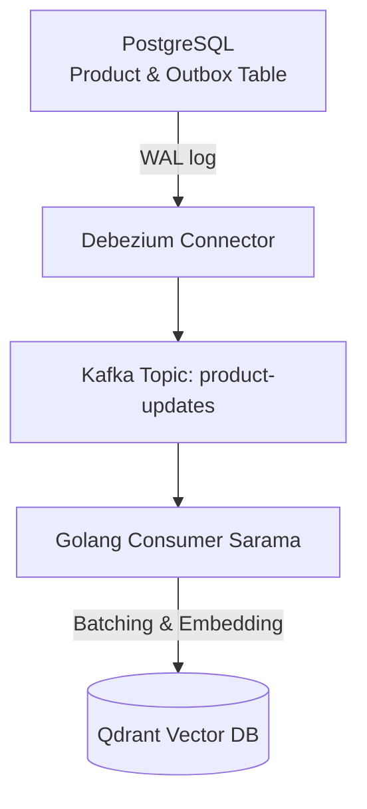

---

title: "Data Ingestion & Atomic Chunking Product Data"
date: "2026-05-22T22:25:00+07:00"
lastmod: "2026-05-22T22:25:00+07:00"
draft: false
author: "Lê Tuấn Anh"
weight: 3
slug: "part-2-ingestion-chunking"
keywords: ["E-commerce RAG Chunking Strategy"]
tags: ["Golang", "Kafka", "Qdrant", "CDC", "E-commerce", "RAG"]
description: "Setup CDC Kafka & Go to sync data to Qdrant. Learn the Atomic Chunking strategy to segment products and prevent LLM hallucination."
categories: ["Engineering"]
ShowToc: true
TocOpen: true
cover:
  image: "images/posts/agentic-ecommerce-search-cover.png"
  alt: "Agentic E-commerce Search Engine Architecture series: vector databases, ranking, and Go"
  relative: false
canonicalURL: "https://tanhdev.com/series/agentic-ecommerce-search/part-2-ingestion-chunking/"
mermaid: true
---

In [Part 1: The Paradigm Shift - Agentic Architecture & Golang Orchestration Power](/series/agentic-ecommerce-search/part-1-golang-orchestration/), we established the Orchestration Engine using Golang and Eino. However, no matter how smart a brain is, it becomes useless if fed with misleading, unstructured, or fragmented information.

In the e-commerce domain, product catalog data changes continuously every second: prices fluctuate, inventory is updated, new products are added. Meanwhile, chunking product data to feed into a Vector Database (Qdrant) is entirely different from chunking a PDF document or a news article.

If you apply the traditional Character-based Split method, your search system will inevitably suffer from **LLM Hallucination** (the LLM making up information) because SKUs, technical specifications, or prices get cut in half.

This part will guide you on how to set up a Real-time Ingestion Pipeline using **Kafka CDC** and design a Golang-based **Atomic Chunking** strategy tailored for e-commerce.

---

## 1. Practical CDC (Change Data Capture) Pipeline

To synchronize data from the primary database (like PostgreSQL) to the Vector Database (Qdrant) without impacting the performance of the OLTP database serving online transactions, we use the **Change Data Capture (CDC)** architecture via Kafka.

### Debezium Outbox Pattern
To ensure consistency (Atomic Dual-Writes), we apply the **Outbox Pattern**. Instead of writing to the Product Table and simultaneously emitting an event to Kafka (which is prone to inconsistency errors if one side fails), the catalog microservice writes the product information and a corresponding event into an `Outbox` table within the same PostgreSQL transaction.

Debezium reads PostgreSQL's WAL (Write-Ahead Log) file, captures these `Outbox` changes, and pushes them as JSON/Avro events into the `product-updates` Kafka topic.



### Implementing the Go Kafka Consumer with `sarama`

In Go, we need to write a high-performance Consumer. To avoid calling the Embedding API (like OpenAI or Gemini) for every single product (which causes network bottlenecks and exceeds Rate Limits), we must aggregate Kafka events into batches (e.g., 256 to 1000 items) before processing them.

Below is an implementation of a Go Kafka consumer using `github.com/IBM/sarama` wrapped in a Buffer Channel mechanism to aggregate Batches:

```go
package ingestion

import (
	"context"
	"encoding/json"
	"log"
	"time"

	"github.com/IBM/sarama"
)

type ProductEvent struct {
	ProductID  string                 `json:"product_id"`
	Op         string                 `json:"op"` // CREATE, UPDATE, DELETE
	Payload    map[string]interface{} `json:"payload"`
}

type IngestionWorker struct {
	batchSize     int
	flushInterval time.Duration
	eventChan     chan ProductEvent
	qdrantClient  *QdrantIngestClient // Custom client to write to Qdrant
}

func NewIngestionWorker(batchSize int, interval time.Duration, client *QdrantIngestClient) *IngestionWorker {
	return &IngestionWorker{
		batchSize:     batchSize,
		flushInterval: interval,
		eventChan:     make(chan ProductEvent, batchSize*2),
		qdrantClient:  client,
	}
}

// StartLoop aggregates batches by count or periodic timer
func (w *IngestionWorker) StartLoop(ctx context.Context) {
	var batch []ProductEvent
	ticker := time.NewTicker(w.flushInterval)
	defer ticker.Stop()

	for {
		select {
		case <-ctx.Done():
			if len(batch) > 0 {
				w.flushBatch(context.Background(), batch)
			}
			return
		case event := <-w.eventChan:
			batch = append(batch, event)
			if len(batch) >= w.batchSize {
				w.flushBatch(ctx, batch)
				batch = make([]ProductEvent, 0, w.batchSize)
				ticker.Reset(w.flushInterval) // Reset timer
			}
		case <-ticker.C:
			if len(batch) > 0 {
				w.flushBatch(ctx, batch)
				batch = make([]ProductEvent, 0, w.batchSize)
			}
		}
	}
}

func (w *IngestionWorker) flushBatch(ctx context.Context, batch []ProductEvent) {
	log.Printf("Flushing batch of %d events to Qdrant...", len(batch))
	err := w.qdrantClient.UpsertBatch(ctx, batch)
	if err != nil {
		log.Printf("Failed to upsert batch: %v", err)
		// Implement Retry logic or push to a Dead Letter Queue (DLQ) here
	}
}

// Implement Sarama's ConsumerGroupHandler
type ConsumerHandler struct {
	worker *IngestionWorker
}

func (h *ConsumerHandler) Setup(sarama.ConsumerGroupSession) error   { return nil }
func (h *ConsumerHandler) Cleanup(sarama.ConsumerGroupSession) error { return nil }
func (h *ConsumerHandler) ConsumeClaim(session sarama.ConsumerGroupSession, claim sarama.ConsumerGroupClaim) error {
	for {
		select {
		case message, ok := <-claim.Messages():
			if !ok {
				return nil
			}
			var event ProductEvent
			if err := json.Unmarshal(message.Value, &event); err != nil {
				log.Printf("Error unmarshaling kafka message: %v", err)
				continue
			}
			h.worker.eventChan <- event
			session.MarkMessage(message, "")
		case <-session.Context().Done():
			return nil
		}
	}
}
```

---

## 2. "Atomic Chunking" Strategy for E-commerce Products

When applying RAG (Retrieval-Augmented Generation) to text, we typically use a `RecursiveCharacterTextSplitter` to cut documents into chunks of 500-1000 tokens with overlaps. **For e-commerce products, this is a fatal mistake.**

Imagine the following product:
*   **Name:** Laptop ASUS ROG Zephyrus G14
*   **SKU:** ROG-G14-2026
*   **Specs:** CPU Ryzen 9, RAM 32GB, GPU RTX 5060, Price 45,000,000 VND.

If cut arbitrarily in half, Chunk 1 might contain *"ASUS ROG Zephyrus G14 SKU ROG-G14"*, and Chunk 2 might contain *"-2026 RAM 32GB GPU RTX 5060 Price 45,000,000"*.
*   When searching by the code `ROG-G14-2026`, Vector search will fail because the code is broken in two.
*   When the LLM reads Chunk 2, it has no idea which product the 32GB RAM or 45 million price tag belongs to!

### The Solution: Atomic Chunking

The golden rule of e-commerce chunking is **preserving the integrity (context) of the product entity**. We segment products based on Logical Fields rather than character counts:

1.  **Product Document (Atomic Entity):** Each product SKU is an independent entity.
2.  **Structural Assembly:** Group all structural data into a unified text containing the Name, Category, Brand, Specifications, and typical FAQs or reviews.
3.  **SKUs and Hard Constraints:** Do not inject the SKU directly into the dense vector for embedding (because vector models struggle to learn randomized encoded characters). Instead, place the SKU and filter fields (Price, Inventory, Store ID) into the **Payload Metadata** to perform **Hybrid Search** (combining hard filters or sparse BM25 search, which we will cover in Part 3).

```go
type ProductChunk struct {
	ProductID   string            `json:"product_id"`
	SKU         string            `json:"sku"`
	StoreFields struct {
		StoreID    int32   `json:"store_id"`
		CategoryID int32   `json:"category_id"`
		Price      float64 `json:"price"`
		InStock    bool    `json:"in_stock"`
	}
	// Raw formatted text to generate the vector embedding
	EmbeddingText string
}

func BuildEmbeddingText(product map[string]interface{}) string {
	// Use Builder to avoid continuous memory allocation
	var sb strings.Builder
	
	sb.WriteString("Product Name: " + fmt.Sprintf("%v", product["title"]) + "\n")
	sb.WriteString("Brand: " + fmt.Sprintf("%v", product["brand"]) + "\n")
	sb.WriteString("Short Description: " + fmt.Sprintf("%v", product["short_description"]) + "\n")
	
	if specs, ok := product["specifications"].(map[string]interface{}); ok {
		sb.WriteString("Technical Specifications:\n")
		for k, v := range specs {
			sb.WriteString("- " + k + ": " + fmt.Sprintf("%v", v) + "\n")
		}
	}
	
	return sb.String()
}
```

---

## 3. Designing Multitenancy & Upsert Batching into Qdrant

For large e-commerce systems or multi-tenant SaaS models serving multiple brands, creating a separate Collection in Qdrant for each store/brand will decimate system RAM. This is because each Collection initializes its own HNSW graph structure, which consumes enormous amounts of cache memory.

### Payload-Based Partitioning
The optimal solution is to use a single Collection for the entire system and partition the customer data using the `store_id` (or `tenant_id`) field located within the **Payload**. During queries, we strictly enforce passing the `store_id` filter so Qdrant can narrow down the search space.

### Go Code: Upsert Batch and Temporarily Disabling HNSW
When injecting massive amounts of initial data into Qdrant (Bulk Load), continuously updating the HNSW graph after every new data point slows down the ingestion speed by factors of ten.

**Optimization Rule:** Disable the HNSW index (set `m: 0` in the collection config) before executing the bulk insert, then re-enable it when the load completes so Qdrant builds the graph a single time.

Below is the Golang snippet to execute an optimized data load into Qdrant using the gRPC Batch API:

```go
package ingestion

import (
	"context"
	"fmt"

	"github.com/qdrant/go-client/qdrant"
)

type QdrantIngestClient struct {
	client         *qdrant.Client
	collectionName string
}

func (q *QdrantIngestClient) UpsertBatch(ctx context.Context, events []ProductEvent) error {
	points := make([]*qdrant.PointStruct, 0, len(events))

	for _, event := range events {
		product := event.Payload
		
		// 1. Generate text to embed and call API to get the vector (e.g., mock 384-dimensional vector)
		embeddingText := BuildEmbeddingText(product)
		vector, err := GetVectorEmbedding(ctx, embeddingText)
		if err != nil {
			return fmt.Errorf("embedding error: %w", err)
		}

		// 2. Convert Product ID to Qdrant's UUID/Uint64 format
		pointID := qdrant.NewIDUUID(fmt.Sprintf("%v", event.ProductID))

		// 3. Initialize payload containing hard constraints for Hybrid Search
		payload := qdrant.NewValueMap(map[string]interface{}{
			"store_id":    int32(product["store_id"].(float64)),
			"category_id": int32(product["category_id"].(float64)),
			"sku":         fmt.Sprintf("%v", product["sku"]),
			"price":       product["price"].(float64),
			"in_stock":    product["in_stock"].(bool),
			"text_source": embeddingText,
		})

		points = append(points, &qdrant.PointStruct{
			Id:      pointID,
			Vectors: qdrant.NewVectors(vector),
			Payload: payload,
		})
	}

	// 4. Call Qdrant's Batch API
	_, err := q.client.Upsert(ctx, &qdrant.UpsertPoints{
		CollectionName: q.collectionName,
		Points:         points,
		Wait:           qdrant.PtrBool(false), // Non-blocking to increase throughput
	})
	
	return err
}
```

---

## Summary & Key Takeaways from Part 2

1.  **Use CDC instead of Sync APIs:** Utilizing Debezium and Kafka ensures catalog data from PostgreSQL to Qdrant remains consistently synchronized without data loss (Outbox Pattern).
2.  **Absolutely do not chunk character strings arbitrarily on products:** Use the **Atomic Chunking** strategy, preserving the attribute structure to prevent the LLM from misunderstanding the product context.
3.  **Separate Vectors and Filter Data:** Place hard attributes (SKU, price, inventory) into the **Payload Metadata**. Never inject random encodings like SKUs directly into the Dense Vector Embedding.
4.  **Optimize Ingestion:** Aggregate batches of 256-1000 items, temporarily disable HNSW builds during bulk loads, and utilize Payload Partitioning based on `store_id` to save RAM.

Now, we have cleanly injected product catalog data into Qdrant with the proper structure. But how do we search it efficiently when a user inputs: *"natural titanium iphone 15 pro max priced under $1000"*?

If we solely rely on Vector Search (Dense), the system won't comprehend the `< 1000` price filter or the exact keyword `iphone 15 pro max`.

In **[Part 3: Qdrant Hybrid Search: Solving Semantic and Hard Filters](/series/agentic-ecommerce-search/part-3-qdrant-hybrid-search/)**, we will solve this agonizing problem by configuring Hybrid Search and Filterable HNSW mechanisms in Qdrant using Golang.
