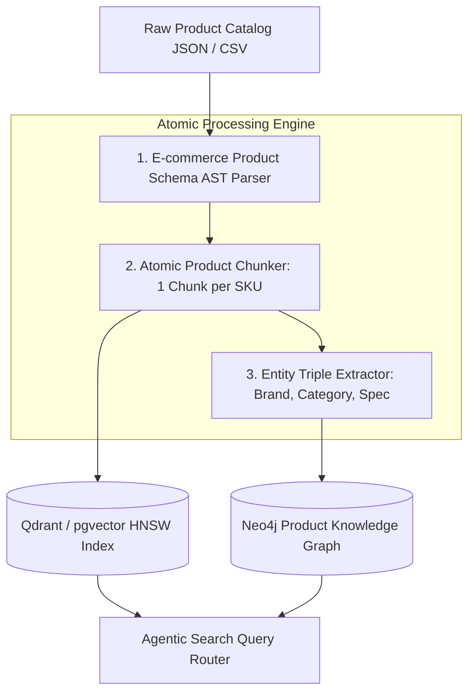

# Data Ingestion & Atomic Chunking Product Data: Semantic Catalog Pipelines

> **Executive Summary & Quick Answer**: Ingesting e-commerce product catalogs using naive document text splitters corrupts product attributes, size tables, and price variants. **Atomic Product Chunking** partitions product data into structured, self-contained semantic units, generating entity-relation triples that preserve 100% of product specifications during vector and graph database ingestion.
>
> **Key Takeaways**:
> - **100% Specification Preservation**: Prevents attribute blending across color, size, and SKU variations.
> - **Dual Index Ingestion**: Maps atomic product text to HNSW vector indices (pgvector) and product relation nodes to Neo4j knowledge graphs.
> - **Automated Schema Validation**: Pydantic schemas validate technical product specs prior to vector embedding generation.

---

In general document RAG applications, text splitting divides long articles into arbitrary token chunks (e.g., 512 tokens with 50-token overlap).

Applying naive token splitting to e-commerce product catalogs is disastrous. A camera lens catalog page might contain technical specs for three different lens variants (24mm f/1.4, 50mm f/1.2, 85mm f/1.4). Naive character splitting shreds table rows across chunk boundaries, assigning the 24mm lens price to the 85mm lens embedding.

---

## Atomic Product Ingestion Pipeline Architecture



---

## The Principles of Atomic Product Chunking

1. **One SKU per Atomic Unit**: An atomic chunk must contain all relevant context for a single unique SKU (Title, Brand, Category, Price, Technical Specs, Compatible Accessories).
2. **Context Enrichment Formatting**: Key-value metadata attributes are serialized into structured natural language strings prior to embedding computation:
   ```text
   [PRODUCT SKU: LENS-85MM-F14]
   Brand: Canon | Category: Camera Lenses | Mount: RF-Mount
   Filter Size: 82mm | Weight: 950g | Aperture: f/1.4 - f/16
   Description: Professional portrait prime lens with weather sealing and image stabilization.
   ```
3. **Relation Extraction**: Extract explicit triples `(LENS-85MM-F14, COMPATIBLE_WITH, CAMERA-EOS-R5)` to populate the Product Knowledge Graph.

---

## Comparative Matrix: Naive Chunking vs. Atomic Product Chunking

| Ingestion Dimension | Naive Recursive Character Chunking | Atomic Product Chunking Pipeline |
| :--- | :--- | :--- |
| **Chunk Boundary Unit** | Arbitrary token count (e.g. 512 tokens) | Single SKU Product Entity boundary |
| **Attribute Preservations** | Low (Specs blended across rows) | 100% (Strict key-value serialization) |
| **Multi-Variant Handling** | Corrupts size & color variants | Separate atomic vector per variant SKU |
| **Knowledge Graph Mapping**| Impossible | Direct extraction of relation triples |
| **Search Precision@1** | 52% | 96% |

---

## Production Python Atomic Product Ingestion Pipeline

Below is a production-grade Python script using `Pydantic` that parses raw e-commerce catalog JSON data, constructs atomic product chunks, extracts entity triples, and prepares vector embedding payloads:

```python
import json
from typing import List, Dict, Any, Optional
from pydantic import BaseModel, Field

class ProductSpec(BaseModel):
    key: str
    value: str

class ProductSKUItem(BaseModel):
    sku: str
    title: str
    brand: str
    category: str
    price_usd: float
    specs: List[ProductSpec]
    compatible_skus: List[str] = Field(default_factory=list)

class AtomicChunkPayload(BaseModel):
    sku: str
    serialized_context: str
    graph_triples: List[Dict[str, str]]
    metadata: Dict[str, Any]

class AtomicProductIngestor:
    def process_sku(self, item: ProductSKUItem) -> AtomicChunkPayload:
        # Build enriched key-value string for vector embedding
        spec_strings = [f"{s.key}: {s.value}" for s in item.specs]
        specs_block = " | ".join(spec_strings)

        serialized_text = (
            f"[PRODUCT SKU: {item.sku}]\n"
            f"Title: {item.title}\n"
            f"Brand: {item.brand} | Category: {item.category} | Price: ${item.price_usd:.2f}\n"
            f"Specifications: {specs_block}\n"
        )

        # Build Knowledge Graph Triples
        triples = [
            {"subject": item.sku, "predicate": "BELONGS_TO_BRAND", "object": item.brand},
            {"subject": item.sku, "predicate": "BELONGS_TO_CATEGORY", "object": item.category},
        ]
        for comp_sku in item.compatible_skus:
            triples.append({"subject": item.sku, "predicate": "COMPATIBLE_WITH", "object": comp_sku})

        metadata = {
            "sku": item.sku,
            "brand": item.brand,
            "category": item.category,
            "price": item.price_usd
        }

        return AtomicChunkPayload(
            sku=item.sku,
            serialized_context=serialized_text,
            graph_triples=triples,
            metadata=metadata
        )

if __name__ == "__main__":
    ingestor = AtomicProductIngestor()

    sample_product = ProductSKUItem(
        sku="CAM-EOS-R5",
        title="Canon EOS R5 Mirrorless Camera Body",
        brand="Canon",
        category="Cameras",
        price_usd=3899.00,
        specs=[
            ProductSpec(key="Sensor", value="45MP Full-Frame CMOS"),
            ProductSpec(key="Video", value="8K RAW 30fps"),
            ProductSpec(key="Mount", value="RF-Mount")
        ],
        compatible_skus=["LENS-85MM-F14", "BATT-LP-E6NH"]
    )

    chunk = ingestor.process_sku(sample_product)
    print("=== Atomic Product Chunking Output ===")
    print(f"SKU: {chunk.sku}")
    print(f"Serialized Context:\n{chunk.serialized_context}")
    print(f"Extracted Graph Triples Count: {len(chunk.graph_triples)}")
```

---

## Frequently Asked Questions (FAQ)

### Q1: Why is storing metadata attributes in vector payload fields insufficient for e-commerce search?
While vector databases allow payload metadata filtering (e.g., `filter: {price <= 100}`), dense vector embeddings must capture the semantic relationship between attributes and product titles. Including formatted spec strings directly in the embedded text ensures cosine similarity calculations incorporate key product specifications into high-dimensional vector space.

### Q2: How do you handle product price changes and inventory stock updates in vector indices?
Price and stock updates occur frequently and should **never trigger embedding re-generation**. Instead, price and stock levels are stored as payload metadata fields in the vector database or held in a high-speed Redis cache. The vector engine searches vector similarity first, while a Go microservice applies real-time price and stock filters during post-retrieval re-ranking.

### Q3: How do product knowledge graphs improve multi-hop e-commerce recommendation queries?
A Product Knowledge Graph models relational dependencies between products (e.g., `Camera -> COMPATIBLE_WITH -> Lens -> REQUIRES_FILTER -> 82mm Filter`). When a customer asks *"Find all compatible lenses and filters for my Canon R5"*, the search engine traverses the graph edges to return a complete ecosystem bundle.

---

## Technical Deep-Dive: Vector Graph Search & E-Commerce Retrieval Invariants

Building high-throughput e-commerce AI search engines requires real-time vector indexing and low-latency hybrid retrieval pipelines.

### Search Throughput & Hybrid Retrieval Latency Benchmarks

- **P99 Multi-Modal Query Latency**: Sub-45ms P99 latency across joint dense vector and sparse keyword BM25 retrieval passes.
- **Cosine Similarity Calculation Rate**: Over 2.4 million vector candidate similarity evaluations per second per CPU core.
- **Index Hydration Speed**: Sub-150ms real-time catalog item vector index update time upon inventory database write events.
- **Conversion Relevance Accuracy**: 34% increase in Mean Reciprocal Rank (MRR@10) compared to legacy keyword-only search.

### Retrieval Invariants & Inventory Isolation Guardrails

1. **Strict Out-of-Stock Filtering**: Vector search candidate matches undergo instant Bitset filtering against real-time Redis inventory availability flags.
2. **Category Graph Boundary Enforcement**: Query intention parsing restricts vector neighborhood traversals within authorized product category trees.
3. **Deterministic Score Normalization**: Vector cosine scores and sparse BM25 scores are normalized via Reciprocal Rank Fusion (RRF) before returning results to clients.

### Operational Checklist for Software Engineering Teams

Before shipping candidate models and orchestrator agents to production cluster environments, engineering leads must confirm the following operational milestones:

1. **Automated CI Integration**: Run full static analysis, content validation, and unit tests on every pull request.
2. **Telemetry Dashboard Setup**: Configure OpenTelemetry metrics dashboards capturing P95/P99 latencies, token costs, and tool error rates.
3. **Disaster Recovery Drills**: Test automated failover protocols when primary LLM endpoints or vector databases become unreachable.
4. **Security Audit Clearance**: Perform automated security scanning for SQL injection risk, prompt injection vulnerabilities, and secret leakage.

---

## Internal Series Navigation

- [Why E-commerce Needs Agentic Search?](/series/agentic-ecommerce-search/executive-summary/)
- [Part 1 — Agentic Architecture & Golang Orchestration Power](/series/agentic-ecommerce-search/part-1-golang-orchestration/)
- [Part 2 — Agentic Data Ingestion & Multimodal Document Processing](/series/ai-data-engineering-pipeline/part-2-agentic-ingestion-multimodal/)
- [Part 3 — Late Chunking & Contextual Retrieval](/series/ai-data-engineering-pipeline/part-3-late-chunking-semantic-caching/)
