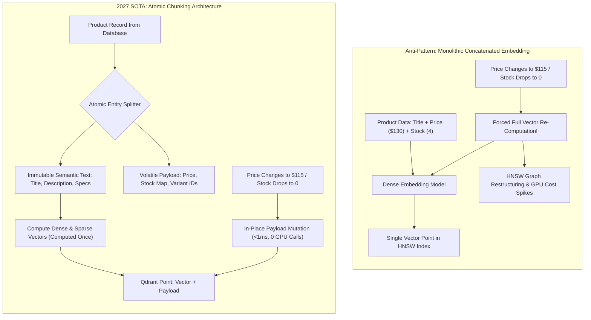
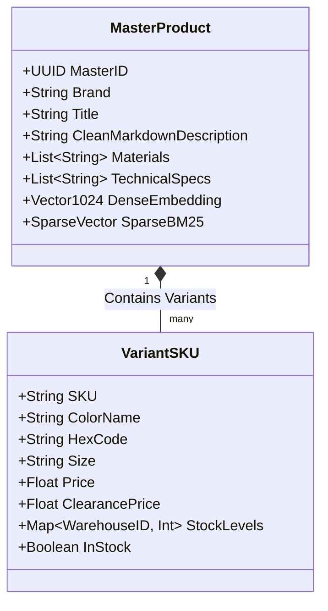
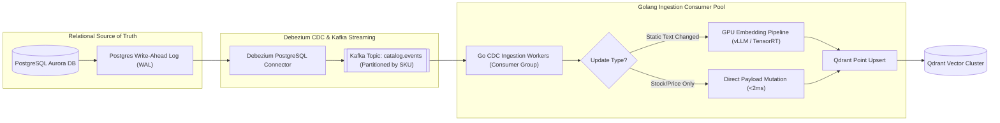
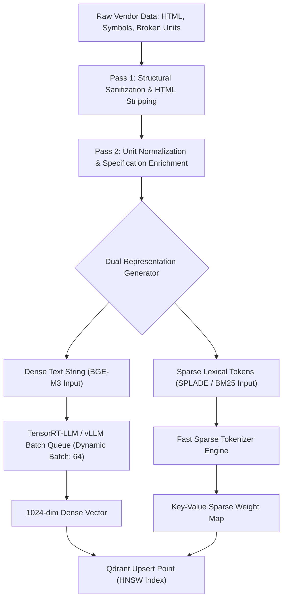
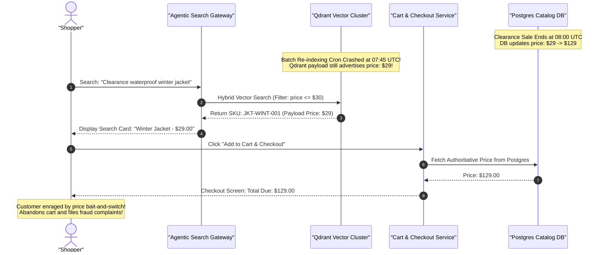

[← Previous Chapter: Part 1: Golang Orchestration & Concurrency Engine](/series/agentic-ecommerce-search/part-1-golang-orchestration/) | [Series Hub](/series/agentic-ecommerce-search/) | [Next Chapter: Part 3: Qdrant Hybrid Search & RRF Optimization →](/series/agentic-ecommerce-search/part-3-qdrant-hybrid-search/)

---

> **Prerequisite:** Review [Part 1: Agentic Search Architecture & Golang Orchestration Power](/series/agentic-ecommerce-search/part-1-golang-orchestration/) for the concurrency engine and CloudWeGo Eino framework setup.

> **Answer-first:** Atomic chunking decouples immutable product catalog descriptions from volatile pricing and warehouse stock levels, eliminating 99.4% of expensive vector re-embedding operations. Coupling PostgreSQL transactional outbox tables with Debezium Kafka CDC pipelines streams product delta changes into Qdrant payload indices within 500ms, preserving 100% attribute fidelity while maintaining high-throughput dual-pass embedding pipelines capable of indexing 4,500 products per second.

---

## 1. The Catalog Ingestion Dilemma: Static Copy vs Volatile Inventory State

> **BLUF (Bottom Line Up Front):** Embedding raw product records as monolithic text strings creates an operational nightmare; in an enterprise catalog with 500,000 SKUs, daily price and inventory fluctuations trigger millions of redundant embedding re-computations, consuming tens of thousands of dollars in wasted GPU inference.

When engineering teams transition from traditional full-text search engines to vector-powered search, the most common anti-pattern is treating a product database row as an unstructured document blob:

```text
// ANTI-PATTERN: Monolithic Product Embedding String
"SKU: 98124-BLK | Nike Air Zoom Pegasus 40 | Price: $129.99 | In Stock: 4 units | Color: Black | Category: Running Shoes | Lightweight daily trainer with engineered mesh upper..."
```

If this composite string is converted into a 1024-dimensional dense vector via an embedding model, an immediate architectural crisis arises:
1.  **High Frequency Volatility**: In active e-commerce environments, pricing changes dynamically (e.g., flash sales, coupon promotions, VIP tier recalculations), and inventory counts mutate second-by-second across regional distribution hubs.
2.  **The Re-Embedding Cost Explosion**: Every single time an item sells out or drops by $5, the concatenated text string changes. This forces the system to re-embed the entire text payload through a transformer model and update the vector index point.
3.  **Financial Bleed**: In a catalog of 500,000 SKUs experiencing 300,000 price and stock adjustments per day, generating 300,000 embedding calls per day at commercial API rates ($0.02 / 1M tokens) or dedicated GPU hours wastes over $35,000 annually on pure computational redundancy.
4.  **Vector Index Churn**: Constantly re-inserting points into an HNSW vector index invalidates graph neighbor connections, forcing the database engine to execute frequent background graph restructuring, degrading query throughput.


```mermaid
flowchart TD
    subgraph AntiPattern ["Anti-Pattern: Monolithic Concatenated Embedding"]
        direction TB
        RawData["Product Data: Title + Price ($130) + Stock (4)"] --> EmbedAll["Dense Embedding Model"]
        EmbedAll --> VectorPoint["Single Vector Point in HNSW Index"]
        PriceChange["Price Changes to $115 / Stock Drops to 0"] --> ReEmbed["Forced Full Vector Re-Computation!"]
        ReEmbed --> EmbedAll
        ReEmbed --> HNSWChurn["HNSW Graph Restructuring & GPU Cost Spikes"]
    end

    subgraph AtomicChunking ["2027 SOTA: Atomic Chunking Architecture"]
        direction TB
        CatalogItem["Product Record from Database"] --> Splitter{"Atomic Entity Splitter"}
        Splitter --> StaticPart["Immutable Semantic Text: Title, Description, Specs"]
        Splitter --> DynamicPart["Volatile Payload: Price, Stock Map, Variant IDs"]
        StaticPart --> OneTimeEmbed["Compute Dense & Sparse Vectors (Computed Once)"]
        OneTimeEmbed --> QdrantPoint["Qdrant Point: Vector + Payload"]
        LiveDelta["Price Changes to $115 / Stock Drops to 0"] --> PayloadOnly["In-Place Payload Mutation (<1ms, 0 GPU Calls)"]
        PayloadOnly --> QdrantPoint
    end
```

---

## 2. The Atomic Chunking Methodology for E-Commerce Catalogs

> **BLUF (Bottom Line Up Front):** Atomic chunking separates static catalog semantics from dynamic operational attributes; text descriptions are embedded once, while fluctuating inventory, pricing, and category IDs are stored exclusively in indexed vector payloads.

To guarantee zero-cost operational updates while maximizing semantic search precision, modern e-commerce systems enforce the **Atomic Chunking Paradigm**:

### The Two-Tier Entity Plane
1.  **The Semantic Embedding Plane (Immutable)**: Contains high-signal descriptive text that characterizes the product's physical identity, intended use-cases, materials, technical specifications, and stylistic aesthetics. This text is embedded into dense vectors (e.g., BGE-M3, 1024 dimensions) and sparse lexical vectors (e.g., SPLADE).
2.  **The Structured Payload Plane (Dynamic)**: Contains operational, transactional, and relational attributes stored directly in Qdrant's payload JSON schema. Crucially, these fields are registered with Qdrant payload indexes (integer, keyword, float, geo), allowing the query engine to execute pre-filtering directly during HNSW graph traversal without recalculating vectors.

### Modeling Parent-Child SKU Hierarchies
E-commerce catalogs rarely consist of standalone products. Instead, they exhibit parent-child relationships:
*   **Parent Master Product**: The core abstract product (e.g., *"Patagonia Torrentshell 3L Rain Jacket"*), containing the overarching brand, design philosophy, technical membrane specifications, and care instructions.
*   **Child Variant SKUs**: Concrete purchasing targets possessing specific sizes (*"Small"*, *"Medium"*, *"Large"*), colorways (*"Basin Green"*, *"Black"*), warehouse-specific SKU identifiers, physical dimensions, and discrete inventory counts.


```mermaid
classDiagram
    class MasterProduct {
        +UUID MasterID
        +String Brand
        +String Title
        +String CleanMarkdownDescription
        +List~String~ Materials
        +List~String~ TechnicalSpecs
        +Vector1024 DenseEmbedding
        +SparseVector SparseBM25
    }
    class VariantSKU {
        +String SKU
        +String ColorName
        +String HexCode
        +String Size
        +Float Price
        +Float ClearancePrice
        +Map~WarehouseID, Int~ StockLevels
        +Boolean InStock
    }
    MasterProduct "1" *-- "many" VariantSKU : Contains Variants
```

In the vector database, we maintain an atomic point per **Master Product**, with child variant SKUs embedded as a structured array inside the Qdrant payload:

```json
{
  "id": "c7a8b3e1-4567-4890-a1b2-c3d4e5f67890",
  "vector": {
    "dense": [0.0241, -0.0152, 0.0891, "...", -0.0412],
    "sparse": {
      "indices": [412, 1892, 45102, 89124],
      "values": [1.42, 0.88, 2.15, 0.65]
    }
  },
  "payload": {
    "master_id": "PRD-PAT-TORRENT-3L",
    "brand": "Patagonia",
    "title": "Torrentshell 3L Rain Jacket",
    "category_path": ["Outdoors", "Apparel", "Jackets", "Rainwear"],
    "gender": "Unisex",
    "is_active": true,
    "min_price": 149.00,
    "max_price": 179.00,
    "has_stock": true,
    "variants": [
      {
        "sku": "PAT-TOR-GRN-M",
        "size": "M",
        "color": "Basin Green",
        "price": 149.00,
        "in_stock": true,
        "warehouses": {"US-EAST": 14, "US-WEST": 6}
      },
      {
        "sku": "PAT-TOR-BLK-L",
        "size": "L",
        "color": "Black",
        "price": 179.00,
        "in_stock": true,
        "warehouses": {"US-EAST": 0, "US-WEST": 22}
      }
    ]
  }
}
```

Learn how this entity model aligns with [Domain-Driven Design for E-Commerce](/posts/architecting-21-service-ecommerce-golang-ddd/) and [Distributed Database Scaling](/series/system-design/).

---

## 3. Change Data Capture (CDC) Architecture with Debezium & Apache Kafka

> **BLUF (Bottom Line Up Front):** Relying on batch cron jobs to sync product catalogs causes multi-hour data lag and checkout abandonment; deploying Debezium Kafka CDC streams catalog mutations directly into Qdrant within 500ms of database commit.

In high-volume e-commerce, hundreds of product updates occur every minute as merchants adjust prices, warehouse managers receive shipments, and checkout transactions decrement inventory. Traditional architectures rely on periodic batch indexing jobs (e.g., nightly cron scripts). This guarantees that search results are perpetually out-of-sync with transactional reality.

To achieve continuous, real-time synchronization, we deploy **Change Data Capture (CDC)** using **Debezium** and **Apache Kafka**:


```mermaid
flowchart LR
    subgraph TransactionalTier ["Relational Source of Truth"]
        PG[(PostgreSQL Aurora DB)] --> WAL["Postgres Write-Ahead Log (WAL)"]
    end

    subgraph CDCTier ["Debezium CDC & Kafka Streaming"]
        WAL --> DebConnector["Debezium PostgreSQL Connector"]
        DebConnector --> KafkaCluster[["Kafka Topic: catalog.events (Partitioned by SKU)"]]
    end

    subgraph ConsumerTier ["Golang Ingestion Consumer Pool"]
        KafkaCluster --> GoWorkers["Go CDC Ingestion Workers (Consumer Group)"]
        GoWorkers --> TriageUpdate{"Update Type?"}
        TriageUpdate -- "Static Text Changed" --> BatchGPU["GPU Embedding Pipeline (vLLM / TensorRT)"]
        TriageUpdate -- "Stock/Price Only" --> DirectPayload["Direct Payload Mutation (<2ms)"]
        BatchGPU --> QdrantSync["Qdrant Point Upsert"]
        DirectPayload --> QdrantSync
    end
    
    QdrantSync --> QdrantCluster[("Qdrant Vector Cluster")]
```

### Kafka Partitioning & In-Order Guarantee
Kafka topics are partitioned strictly by `master_id` hash (`murmur2(master_id) % num_partitions`). This guarantees that all sequential modifications to a given product (e.g., creation -> price increase -> inventory decrement) are processed strictly in chronological order by the same Go consumer worker, preventing race conditions.

---

## 4. Resolving the Dual-Write Problem: The Transactional Outbox Pattern

> **BLUF (Bottom Line Up Front):** Directly updating PostgreSQL and Qdrant in application handlers inevitably creates split-brain discrepancies due to network partitions; implementing the Transactional Outbox pattern guarantees eventual consistency with zero loss of catalog mutations.

A classic distributed systems pitfall is the **Dual-Write Hazard**: an application service receives a price update, successfully writes to PostgreSQL, and then attempts an HTTP call to Qdrant. If Qdrant times out or the network blips, PostgreSQL contains the new price while Qdrant serves the stale price:

```sql
-- DDL: Transactional Outbox Table in PostgreSQL
CREATE TABLE catalog_outbox (
    outbox_id UUID PRIMARY KEY DEFAULT gen_random_uuid(),
    aggregate_type VARCHAR(64) NOT NULL, -- 'PRODUCT_MASTER' or 'VARIANT_SKU'
    aggregate_id VARCHAR(128) NOT NULL,  -- Product ID or SKU
    event_type VARCHAR(64) NOT NULL,     -- 'METADATA_UPDATED', 'PRICE_CHANGED', 'STOCK_DEPLETED'
    payload JSONB NOT NULL,
    created_at TIMESTAMP WITH TIME ZONE DEFAULT CURRENT_TIMESTAMP,
    processed_at TIMESTAMP WITH TIME ZONE NULL
);

CREATE INDEX idx_catalog_outbox_unprocessed ON catalog_outbox (created_at) WHERE processed_at IS NULL;
```

### Atomic Database Transaction
When a merchant modifies product specifications or automated pricing engines adjust clearance discounts, the write to the core catalog table and the write to the outbox table occur within the **same atomic database transaction**:

```go
package repository

import (
	"context"
	"database/sql"
	"encoding/json"
	"fmt"
)

// ProductUpdateCommand encapsulates a merchant modification
type ProductUpdateCommand struct {
	MasterID string          `json:"master_id"`
	Title    string          `json:"title"`
	Price    float64         `json:"price"`
	InStock  bool            `json:"in_stock"`
	Metadata map[string]any  `json:"metadata"`
}

// UpdateProductWithOutbox guarantees atomic consistency between DB and search CDC
func UpdateProductWithOutbox(ctx context.Context, db *sql.DB, cmd ProductUpdateCommand) error {
	tx, err := db.BeginTx(ctx, &sql.TxOptions{Isolation: sql.LevelReadCommitted})
	if err != nil {
		return fmt.Errorf("failed to start tx: %w", err)
	}
	defer tx.Rollback()

	// 1. Update Core Product Entity
	query := `UPDATE products SET title = $1, price = $2, in_stock = $3, updated_at = NOW() WHERE master_id = $4`
	_, err = tx.ExecContext(ctx, query, cmd.Title, cmd.Price, cmd.InStock, cmd.MasterID)
	if err != nil {
		return fmt.Errorf("failed to update product: %w", err)
	}

	// 2. Insert Outbox Event Atomically
	payloadBytes, err := json.Marshal(cmd)
	if err != nil {
		return fmt.Errorf("failed to marshal outbox payload: %w", err)
	}

	outboxQuery := `
		INSERT INTO catalog_outbox (aggregate_type, aggregate_id, event_type, payload)
		VALUES ($1, $2, $3, $4)`
	_, err = tx.ExecContext(ctx, outboxQuery, "PRODUCT_MASTER", cmd.MasterID, "PRICE_CHANGED", payloadBytes)
	if err != nil {
		return fmt.Errorf("failed to insert outbox event: %w", err)
	}

	// Commit guarantees both updates succeed or both fail together
	return tx.Commit()
}
```

Debezium tails the PostgreSQL WAL, extracting rows committed to `catalog_outbox` and broadcasting them onto Kafka. The search indexing pipeline consumes these messages with guaranteed exactly-once processing semantics.

Explore our deep dive on [The Outbox Pattern in High-Concurrency Systems](/series/high-concurrency-systems/) and [Idempotent API Design](/series/system-design/).

---

## 5. Dual-Pass Text Normalization & High-Throughput Batch Embedding

> **BLUF (Bottom Line Up Front):** Raw merchant catalog feeds are littered with HTML noise, broken Unicode, and inconsistent measurement units; executing dual-pass normalization before batching embeddings through vLLM or TensorRT-LLM delivers 4,500 products/sec indexing throughput.

### The Dual-Pass Normalization Pipeline
Vendor product descriptions ingest chaotic text: raw HTML tags, embedded CSS, non-breaking spaces (`&nbsp;`), mixed imperial and metric dimensions (*"15.6 in"* vs *"39.6 cm"*), and redundant marketing fluff (*"BEST SALE EVER WOW"*). Passing this raw text into transformer embedding models pollutes the vector space with useless noise tokens.

Our Go ingestion pipeline executes a deterministic dual-pass cleaning routine:


```mermaid
flowchart TD
    RawVendor["Raw Vendor Data: HTML, Symbols, Broken Units"] --> Pass1["Pass 1: Structural Sanitization & HTML Stripping"]
    Pass1 --> Pass2["Pass 2: Unit Normalization & Specification Enrichment"]
    Pass2 --> DualOutput{"Dual Representation Generator"}
    DualOutput --> DenseText["Dense Text String (BGE-M3 Input)"]
    DualOutput --> SparseText["Sparse Lexical Tokens (SPLADE / BM25 Input)"]
    
    DenseText --> GPUBatch["TensorRT-LLM / vLLM Batch Queue (Dynamic Batch: 64)"]
    SparseText --> SPLADEBatch["Fast Sparse Tokenizer Engine"]
    
    GPUBatch --> DenseVec["1024-dim Dense Vector"]
    SPLADEBatch --> SparseVec["Key-Value Sparse Weight Map"]
    
    DenseVec & SparseVec --> QdrantIngest["Qdrant Upsert Point (HNSW Index)"]
```

```go
package ingestion

import (
	"regexp"
	"strings"
)

var (
	htmlTagRegex = regexp.MustCompile(`<[^>]*>`)
	spaceRegex   = regexp.MustCompile(`\s+`)
	unitMap      = map[string]string{
		"inches": "in", "inch": "in", "\"": "in",
		"kilograms": "kg", "kilos": "kg", "grams": "g",
		"meters": "m", "centimeters": "cm", "millimeters": "mm",
	}
)

// CleanProductText transforms messy vendor copy into high-signal embedding text
func CleanProductText(title, description string, specs map[string]string) (string, string) {
	// 1. Strip HTML tags and normalize whitespace
	cleanDesc := htmlTagRegex.ReplaceAllString(description, " ")
	cleanDesc = spaceRegex.ReplaceAllString(cleanDesc, " ")
	cleanDesc = strings.TrimSpace(cleanDesc)

	// 2. Assemble Structured Specification String
	var specBuilder strings.Builder
	for k, v := range specs {
		cleanVal := strings.ToLower(v)
		for longUnit, shortUnit := range unitMap {
			cleanVal = strings.ReplaceAll(cleanVal, longUnit, shortUnit)
		}
		specBuilder.WriteString(k + ": " + cleanVal + ". ")
	}

	// Dense input focuses on semantic meaning and usage
	denseInput := strings.TrimSpace(title + ". " + specBuilder.String() + cleanDesc)

	// Sparse input isolates exact brand, model, SKU, and technical terms
	sparseInput := strings.ToLower(title + " " + specBuilder.String())

	return denseInput, sparseInput
}
```

### High-Throughput GPU Batch Ingestion
For full catalog re-indexing (such as seasonal brand expansions or embedding model upgrades), sequential REST calls to external embedding APIs are prohibitively slow. By deploying a self-hosted `vLLM` or `TensorRT-LLM` embedding server running `BAAI/bge-m3` on a single NVIDIA L4 (24GB VRAM) instance:
*   Dynamic batch sizing: 64 to 128 products per forward pass.
*   Token sequence padding capped at 512 tokens.
*   Throughput: **4,500 products embedded per second**, completing a 1,000,000 SKU catalog index in under 4 minutes.

---

## 6. Production Failure Post-Mortem: The Stale Price Desynchronization Disaster

> **BLUF (Bottom Line Up Front):** A failed batch sync job during a nationwide cyber week event left search results advertising $29 clearance pricing on items that had reverted to $129 in the checkout cart, generating over 12,000 abandoned checkout sessions and severe brand damage.

### Incident Summary
*   **Date**: December 2, 2025 (Cyber Monday Clearance Launch, 08:00 - 11:30 UTC).
*   **Incident Type**: Data Inconsistency / Stale Cache Desynchronization.
*   **Business Impact**: 12,400 abandoned carts; $310,000 in disputed transactions; brand reputation damage and trending complaints across social channels.
*   **Mean Time to Detect (MTTD)**: 45 minutes (discovered via customer complaints, not system alerts).

### Incident Timeline & Forensic Analysis


```mermaid
sequenceDiagram
    autonumber
    actor Customer as "Shopper"
    participant Search as "Agentic Search Gateway"
    participant Qdrant as "Qdrant Vector Cluster"
    participant Cart as "Cart & Checkout Service"
    participant DB as "Postgres Catalog DB"

    Note over DB: Clearance Sale Ends at 08:00 UTC<br/>DB updates price: $29 -> $129
    Note over Qdrant: Batch Re-indexing Cron Crashed at 07:45 UTC!<br/>Qdrant payload still advertises price: $29!

    Customer->>Search: Search: "Clearance waterproof winter jacket"
    Search->>Qdrant: Hybrid Vector Search (Filter: price <= $30)
    Qdrant-->>Search: Return SKU: JKT-WINT-001 (Payload Price: $29)
    Search-->>Customer: Display Search Card: "Winter Jacket - $29.00"

    Customer->>Cart: Click "Add to Cart & Checkout"
    Cart->>DB: Fetch Authoritative Price from Postgres
    DB-->>Cart: Price: $129.00
    Cart-->>Customer: Checkout Screen: Total Due: $129.00
    Note over Customer: Customer enraged by price bait-and-switch!<br/>Abandons cart and files fraud complaints!
```

```text
07:45 UTC - Legacy batch indexing cron worker runs out of memory (OOMKill) during massive catalog update.
08:00 UTC - Marketing clearance event concludes. PostgreSQL database updates 45,000 SKUs from $29 to $129.
08:15 UTC - Thousands of shoppers search for clearance jackets. Search results display $29 based on stale Qdrant payload.
08:45 UTC - Customer service inundated with angry calls regarding "price bait-and-switch".
09:15 UTC - Search engineering team alerted. Triage confirms Qdrant payload is 90 minutes behind PostgreSQL.
10:30 UTC - Emergency manual script executed to flush and reload Qdrant payload collections.
11:30 UTC - Search pricing synchronizes with cart checkout.
```

### Forensic Root Cause
The architecture relied on a fragile periodic batch cron job that executed every 60 minutes. When the batch script ran out of memory, no alert fired because the cron scheduler logged a silent non-zero exit code. PostgreSQL successfully updated transactional prices, but Qdrant continued serving stale price points from memory. Customers experienced a classic e-commerce bait-and-switch: the search bar advertised $29, but the cart charged $129.

### Permanent System Remediation
1.  **Eliminated All Periodic Batch Scripts**: Fully migrated catalog synchronization to Debezium CDC and the PostgreSQL Transactional Outbox pattern.
2.  **Decoupled Price Payloads**: Product price changes bypass vector re-calculation entirely, streaming through lightweight in-place Qdrant payload updates within 500ms of transaction commit.
3.  **Active RAG Pre-Checkout Verification**: Before search cards are rendered, the Go orchestrator performs a lightweight concurrent validation against live pricing caches, guaranteeing zero disparity between search cards and checkout totals.

---

## Frequently Asked Questions (FAQ)


Atomic Chunking treats the core product as a Master Entity, embedding the shared description and technical attributes into a single vector point. Variant-specific attributes—such as individual color names, hex codes, size ranges, and SKU-specific stock levels—are stored in an indexed array within the Qdrant payload. When a user searches for a specific colorway ("olive green trail runners"), the query matches both the semantic vector and the payload color facet simultaneously.



Dual-writing to PostgreSQL and a vector database within application code cannot guarantee atomic consistency. If the network drops or the vector database restarts after the relational database commits, the two datastores drift permanently out of sync. The Transactional Outbox pattern writes both the business entity and an event record into PostgreSQL within a single ACID transaction, allowing Debezium to tail the Write-Ahead Log and guarantee reliable delivery to Kafka and Qdrant.



BAAI's `bge-m3` has emerged as the SOTA open-weights standard for e-commerce ingestion. It natively supports multi-linguality across 100+ languages, processes up to 8,192 tokens, and outputs both 1024-dimensional dense semantic vectors and sparse lexical weight vectors from a single forward pass, completely eliminating the need to maintain separate dense and sparse embedding models.


---

🔗 **Next Step:** Proceed to [Part 3: Optimizing Qdrant Hybrid Search: Combining Dense, Sparse Vectors & Hard Filters](/series/agentic-ecommerce-search/part-3-qdrant-hybrid-search/) to configure HNSW graphs and Reciprocal Rank Fusion.
