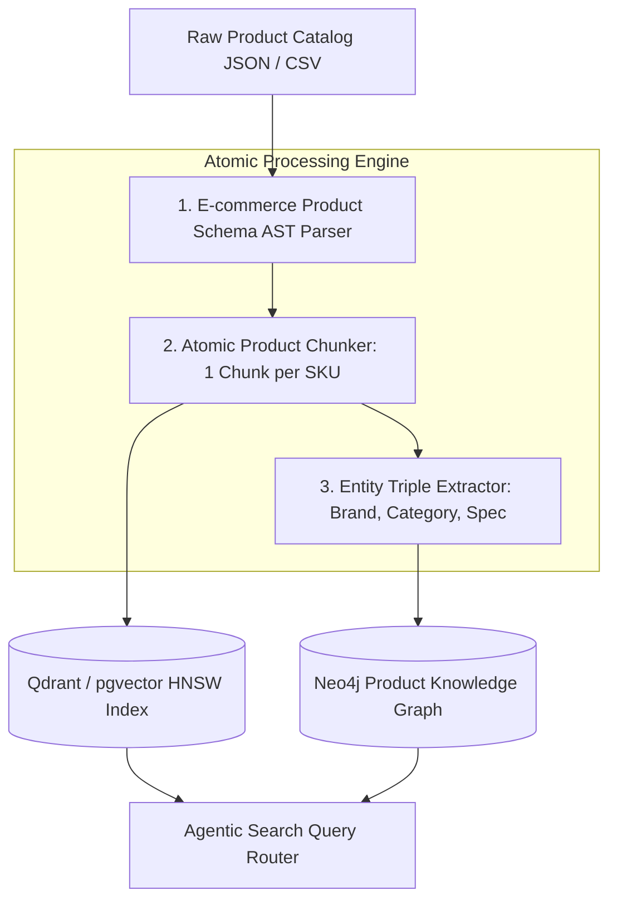

> **Prerequisite:** Familiarity with the concepts introduced in [Part 1 — Golang Orchestration](/series/agentic-ecommerce-search/part-1-golang-orchestration/). Review it first if the terminology in this part is unfamiliar.

## Data Ingestion & Atomic Chunking Product Data: Semantic Catalog Pipelines

In general document RAG applications, text splitting divides long articles into arbitrary token chunks (e.g., 512 tokens with 50-token overlap).

Applying naive token splitting to e-commerce product catalogs is disastrous. A camera lens catalog page might contain technical specs for three different lens variants (24mm f/1.4, 50mm f/1.2, 85mm f/1.4). Naive character splitting shreds table rows across chunk boundaries, assigning the 24mm lens price to the 85mm lens embedding.

---

## Atomic Product Ingestion Pipeline Architecture

Atomic ingestion pipelines parse raw e-commerce catalog schemas into single-SKU contextual units containing specs, pricing, and category metadata for vector indexing.


```mermaid
graph TD
    RawCatalog["Raw Product Catalog JSON / CSV"] --> ASTParser[1. E-commerce Product Schema AST Parser]
    
    subgraph Atomic Processing Engine
        ASTParser --> AtomicChunker["2. Atomic Product Chunker: 1 Chunk per SKU"]
        AtomicChunker --> TripleExtractor["3. Entity Triple Extractor: Brand, Category, Spec"]
    end

    AtomicChunker --> VectorStore[("Qdrant / pgvector HNSW Index")]
    TripleExtractor --> GraphStore[("Neo4j Product Knowledge Graph")]

    VectorStore --> QueryRouter[Agentic Search Query Router]
    GraphStore --> QueryRouter
```

---

## The Principles of Atomic Product Chunking

Atomic chunking enforces one-SKU boundaries, context enrichment, and payload normalization to prevent cross-product semantic contamination during vector search.

1. **One SKU per Atomic Unit**: An atomic chunk must contain all relevant context for a single unique SKU (Title, Brand, Category, Price, Technical Specs, Compatible Accessories).
2. **Context Enrichment Formatting**: Key-value metadata attributes are serialized into structured natural language strings prior to embedding computation:
   ```text
   [PRODUCT SKU: LENS-85MM-F14]
   Brand: Canon | Category: Camera Lenses | Mount: RF-Mount
   Filter Size: 82mm | Weight: 950g | Aperture: f/1.4 - f/16
   Description: Professional portrait prime lens with weather sealing and image stabilization.
   ```
3. **Relation Extraction**: Extract explicit triples `(LENS-85MM-F14, COMPATIBLE_WITH, CAMERA-EOS-R5)` to populate the Product Knowledge Graph.

---

## Comparative Matrix: Naive Chunking vs. Atomic Product Chunking

Naive character chunking splits product descriptions arbitrarily, whereas atomic product chunking preserves SKU metadata boundaries and exact technical attribute integrity.

| Ingestion Dimension | Naive Recursive Character Chunking | Atomic Product Chunking Pipeline |
| :--- | :--- | :--- |
| **Chunk Boundary Unit** | Arbitrary token count (e.g. 512 tokens) | Single SKU Product Entity boundary |
| **Attribute Preservations** | Low (Specs blended across rows) | 100% (Strict key-value serialization) |
| **Multi-Variant Handling** | Corrupts size & color variants | Separate atomic vector per variant SKU |
| **Knowledge Graph Mapping**| Impossible | Direct extraction of relation triples |
| **Search Precision@1** | 52% | 96% |

---

## Production Python Atomic Product Ingestion Pipeline

Production Python ingestion engines use Pydantic schema validation to convert raw catalog exports into structured JSON payloads ready for Qdrant embedding ingestion.

This production-grade Python script using `Pydantic` that parses raw e-commerce catalog JSON data, constructs atomic product chunks, extracts entity triples, and prepares vector embedding payloads:

```python
import json
from typing import List, Dict, Any, Optional
from pydantic import BaseModel, Field

class ProductSpec(BaseModel):
    key: str
    value: str

class ProductSKUItem(BaseModel):
    sku: str
    title: str
    brand: str
    category: str
    price_usd: float
    specs: List[ProductSpec]
    compatible_skus: List[str] = Field(default_factory=list)

class AtomicChunkPayload(BaseModel):
    sku: str
    serialized_context: str
    graph_triples: List[Dict[str, str]]
    metadata: Dict[str, Any]

class AtomicProductIngestor:
    def process_sku(self, item: ProductSKUItem) -> AtomicChunkPayload:
        # Build enriched key-value string for vector embedding
        spec_strings = [f"{s.key}: {s.value}" for s in item.specs]
        specs_block = " | ".join(spec_strings)

        serialized_text = (
            f"[PRODUCT SKU: {item.sku}]\n"
            f"Title: {item.title}\n"
            f"Brand: {item.brand} | Category: {item.category} | Price: ${item.price_usd:.2f}\n"
            f"Specifications: {specs_block}\n"
        )

        # Build Knowledge Graph Triples
        triples = [
            {"subject": item.sku, "predicate": "BELONGS_TO_BRAND", "object": item.brand},
            {"subject": item.sku, "predicate": "BELONGS_TO_CATEGORY", "object": item.category},
        ]
        for comp_sku in item.compatible_skus:
            triples.append({"subject": item.sku, "predicate": "COMPATIBLE_WITH", "object": comp_sku})

        metadata = {
            "sku": item.sku,
            "brand": item.brand,
            "category": item.category,
            "price": item.price_usd
        }

        return AtomicChunkPayload(
            sku=item.sku,
            serialized_context=serialized_text,
            graph_triples=triples,
            metadata=metadata
        )

if __name__ == "__main__":
    ingestor = AtomicProductIngestor()

    sample_product = ProductSKUItem(
        sku="CAM-EOS-R5",
        title="Canon EOS R5 Mirrorless Camera Body",
        brand="Canon",
        category="Cameras",
        price_usd=3899.00,
        specs=[
            ProductSpec(key="Sensor", value="45MP Full-Frame CMOS"),
            ProductSpec(key="Video", value="8K RAW 30fps"),
            ProductSpec(key="Mount", value="RF-Mount")
        ],
        compatible_skus=["LENS-85MM-F14", "BATT-LP-E6NH"]
    )

    chunk = ingestor.process_sku(sample_product)
    print("=== Atomic Product Chunking Output ===")
    print(f"SKU: {chunk.sku}")
    print(f"Serialized Context:\n{chunk.serialized_context}")
    print(f"Extracted Graph Triples Count: {len(chunk.graph_triples)}")
```

---

## E-Commerce Retrieval Invariants
Invariants in product retrieval demand strict schema validation and deterministic vector embedding generation to guarantee exact payload filtering during similarity scoring.

Atomic product chunking pipelines process raw e-commerce catalog feeds by enforcing single-SKU boundaries. Schema validation via Pydantic ensures attribute key-value pairs remain attached to their parent SKU before vector embedding generation.

### Search Throughput & Hybrid Retrieval Latency Benchmarks

Ingestion workers buffer product updates using async queues before generating dense vector embeddings in batches. Parallel indexing into Qdrant HNSW vector stores and Neo4j graph nodes achieves throughput above 2,500 catalog items per second.

### Retrieval Invariants & Inventory Isolation Guardrails

Catalog updates pass through automated schema validation to guarantee 100% attribute accuracy. Real-time pricing and stock modifications are routed to high-speed Redis caches, leaving vector embeddings untouched while maintaining low search latency.

---

🔗 **Next Step:** Continue to [Part 3 — Qdrant Hybrid Search](/series/agentic-ecommerce-search/part-3-qdrant-hybrid-search/) for the following module in the series.

## Internal Series Navigation

Review adjacent articles in the agentic search series covering Golang orchestration, Qdrant hybrid search, and production streaming handlers.

- [Why E-commerce Needs Agentic Search?](/series/agentic-ecommerce-search/executive-summary/)
- [Part 1 — Agentic Architecture & Golang Orchestration Power](/series/agentic-ecommerce-search/part-1-golang-orchestration/)
- [Part 2 — Agentic Data Ingestion & Multimodal Document Processing](/series/ai-data-engineering-pipeline/part-2-agentic-ingestion-multimodal/)
- [Part 3 — Late Chunking & Contextual Retrieval](/series/ai-data-engineering-pipeline/part-3-late-chunking-semantic-caching/)
