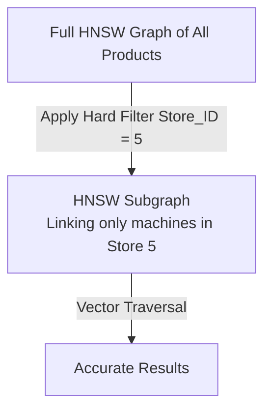

In [Part 2: Data Ingestion & Atomic Chunking - Bringing Product Data into the AI Environment](/series/agentic-ecommerce-search/part-2-ingestion-chunking/), we established a clean data synchronization pipeline from PostgreSQL to Qdrant via Kafka CDC. But the journey of building a standard e-commerce search engine has just begun.

When a user enters: *"Asus ROG Zephyrus G14 laptop under $1500 in stock"*
*   If using purely **Dense Vector Search**: The system might return other Asus ROG Zephyrus laptops priced at $2000, or even older out-of-stock models, because the Embedding model only understands general semantic similarity and cannot process strict mathematical comparisons (Hard Filters like `price < 1500` and `in_stock = true`).
*   If using purely **Lexical Search (BM25)**: The system fails when the user searches by intent, such as *"thin and light high-performance gaming laptop"*, because these keywords do not appear directly in the product description text.

The optimal solution for e-commerce is **Hybrid Search** — combining Dense Search (semantic understanding), Sparse Search/BM25 (exact keyword and SKU matching), and **Filterable HNSW** (high-performance hard attribute filtering).

This article will guide you on how to configure and deploy an advanced Hybrid Search architecture using the **Qdrant Go Client** and the **Reciprocal Rank Fusion (RRF)** mechanism.

---

## 1. Collection Configuration: Dense & Sparse Vectors in Parallel

Since Qdrant v1.7.0, we can configure a Collection to contain both Dense Vectors and Sparse Vectors simultaneously. Sparse Vectors do not require a fixed dimension size because they are stored as arrays of keyword indices and their statistical weights (values).

Below is how to initialize a Collection supporting Hybrid Search using the Qdrant Go SDK:

```go
package search

import (
	"context"
	"fmt"

	"github.com/qdrant/go-client/qdrant"
)

type QdrantSearchClient struct {
	client         *qdrant.Client
	collectionName string
}

func NewQdrantSearchClient(client *qdrant.Client, collectionName string) *QdrantSearchClient {
	return &QdrantSearchClient{
		client:         client,
		collectionName: collectionName,
	}
}

// CreateHybridCollection initializes a collection with both dense and named sparse vectors
func (q *QdrantSearchClient) CreateHybridCollection(ctx context.Context) error {
	err := q.client.CreateCollection(ctx, &qdrant.CreateCollection{
		CollectionName: q.collectionName,
		// 1. Configure Dense Vector for semantic search (e.g., 384-dimension model)
		VectorsConfig: qdrant.NewVectorsConfigMap(map[string]*qdrant.VectorParams{
			"dense-embeddings": {
				Size:     384,
				Distance: qdrant.Distance_Cosine,
			},
		}),
		// 2. Configure Named Sparse Vector for BM25 / SPLADE
		SparseVectorsConfig: qdrant.NewSparseVectorsConfigMap(map[string]*qdrant.SparseVectorParams{
			"sparse-bm25": {
				Index: &qdrant.SparseIndexParams{
					OnDisk: qdrant.PtrBool(true), // Save RAM by putting the sparse index on disk
				},
			},
		}),
	})
	if err != nil {
		return fmt.Errorf("failed to create collection: %w", err)
	}
	return nil
}
```

*Note:* Sparse Vectors must use the **Dot Product** distance metric (this is Qdrant's default value for sparse configurations).

---

## 2. Understanding Universal Query API & Reciprocal Rank Fusion (RRF)

To combine results from two different search algorithms (Dense and Sparse), we use **Reciprocal Rank Fusion (RRF)**. RRF operates based on the rank of data points in each result list, rather than directly adding raw scores (which have completely different scales).

The RRF score formula for a document $d$:
$$RRF\_Score(d) = \sum_{m \in M} \frac{1}{k + r_m(d)}$$
*Where:*
*   $M$ is the set of search methods (Dense and Sparse).
*   $r_m(d)$ is the rank of document $d$ in search method $m$.
*   $k$ is a smoothing constant (usually defaulting to $60$), which helps reduce the impact of documents with very low ranks.

### Calling Hybrid Search using the Prefetch mechanism in Go

Qdrant provides a **Universal Query API** allowing us to perform multi-stage queries via the `Prefetch` parameter. We will send two parallel sub-queries to the server, then request the server to automatically merge the results using the RRF algorithm.

Here is how to implement the Hybrid search function using the Qdrant Go Client:

```go
// SearchParams holds the Hybrid query information from the user
type SearchParams struct {
	DenseQuery  []float32
	SparseQuery *qdrant.SparseVector
	StoreID     int32
	Limit       uint64
}

func (q *QdrantSearchClient) HybridSearch(ctx context.Context, params SearchParams) ([]*qdrant.ScoredPoint, error) {
	// 1. Define the Dense (Semantic) sub-query
	densePrefetch := &qdrant.Prefetch{
		Query: qdrant.NewQueryDense(params.DenseQuery),
		Using: qdrant.PtrString("dense-embeddings"),
		Limit: qdrant.PtrUint64(100), // Fetch top 100 candidates from semantic search
	}

	// 2. Define the Sparse (Lexical) sub-query
	sparsePrefetch := &qdrant.Prefetch{
		Query: qdrant.NewQuerySparse(params.SparseQuery.Indices, params.SparseQuery.Values),
		Using: qdrant.PtrString("sparse-bm25"),
		Limit: qdrant.PtrUint64(100), // Fetch top 100 candidates from exact keywords
	}

	// 3. Execute QueryPoints combining RRF and Hard Filters
	res, err := q.client.Query(ctx, &qdrant.QueryPoints{
		CollectionName: q.collectionName,
		// Use Prefetch to run 2 sub-queries in parallel
		Prefetch: []*qdrant.Prefetch{densePrefetch, sparsePrefetch},
		// Merge results using the Reciprocal Rank Fusion (RRF) algorithm
		Query: qdrant.NewQueryRRF(), 
		// Hard filter store_id to ensure safe multi-tenancy
		Filter: &qdrant.Filter{
			Must: []*qdrant.Condition{
				qdrant.NewFieldFilterMinInteger("store_id", int64(params.StoreID)),
			},
		},
		Limit: qdrant.PtrUint64(params.Limit),
	})
	if err != nil {
		return nil, fmt.Errorf("hybrid query failed: %w", err)
	}

	return res, nil
}
```

*Advanced Tip:* Qdrant v1.14+ supports configuring weights for each prefetch (RRF Weights). For example: if you want to prioritize semantic search results over exact keywords, you can pass a `Weights` array into the API's fusion configuration.

---

## 3. Optimizing Hard Filters With Filterable HNSW & Payload Indexing

Although Qdrant has extremely fast vector search speeds, its performance will degrade significantly if you perform Metadata filtering (Payload Filters) without proper configuration.

### How Filterable HNSW Works

Normally, if you filter data after a vector search (Post-filtering), you might suffer from missing results (For example: Fetching the top 10 most similar products, then filtering for those under $1000. If all 10 machines are over $1000, you get an empty list).

If you filter data before a vector search (Pre-filtering) via sequential scanning: The speed will be agonizingly slow for large datasets.

Qdrant solves this problem with **Filterable HNSW**. During the HNSW graph index building process, Qdrant constructs additional links (subgraphs) based on Payload values. When filtering, the graph traversal algorithm will only pass through nodes that satisfy the filter condition, maintaining nearly perfect accuracy (Recall) and query speeds at the millisecond level.



### Implementing Payload Index Creation in Golang

For Filterable HNSW to operate at maximum efficiency, you **must** create a Field Index (Payload Index) for attributes that frequently appear in `Filter` clauses (such as product categories, inventory status, and price ranges). Without a Payload Index, Qdrant will have to perform a Full-Scan to find data points satisfying the filter before entering the graph.

Below is the code to initialize Payload Indexes using the Go Client:

```go
// CreatePayloadIndexes configures hard search indexes for e-commerce
func (q *QdrantSearchClient) CreatePayloadIndexes(ctx context.Context) error {
	// 1. Create a Keyword index for store_id (used to filter multi-tenant partitions)
	_, err := q.client.CreateFieldIndex(ctx, &qdrant.CreateFieldIndexCollection{
		CollectionName: q.collectionName,
		FieldName:      "store_id",
		FieldType:      qdrant.PayloadSchemaType_Keyword.Enum(),
		Wait:           qdrant.PtrBool(true),
	})
	if err != nil {
		return fmt.Errorf("failed to create store_id index: %w", err)
	}

	// 2. Create a Keyword index for category_id
	_, err = q.client.CreateFieldIndex(ctx, &qdrant.CreateFieldIndexCollection{
		CollectionName: q.collectionName,
		FieldName:      "category_id",
		FieldType:      qdrant.PayloadSchemaType_Keyword.Enum(),
		Wait:           qdrant.PtrBool(true),
	})
	if err != nil {
		return fmt.Errorf("failed to create category_id index: %w", err)
	}

	// 3. Create a Float/Integer index for price (to serve greater than/less than comparison filters)
	_, err = q.client.CreateFieldIndex(ctx, &qdrant.CreateFieldIndexCollection{
		CollectionName: q.collectionName,
		FieldName:      "price",
		FieldType:      qdrant.PayloadSchemaType_Float.Enum(),
		Wait:           qdrant.PtrBool(true),
	})
	if err != nil {
		return fmt.Errorf("failed to create price index: %w", err)
	}

	// 4. Create a Bool index for in_stock (filtering available products)
	_, err = q.client.CreateFieldIndex(ctx, &qdrant.CreateFieldIndexCollection{
		CollectionName: q.collectionName,
		FieldName:      "in_stock",
		FieldType:      qdrant.PayloadSchemaType_Bool.Enum(),
		Wait:           qdrant.PtrBool(true),
	})
	if err != nil {
		return fmt.Errorf("failed to create in_stock index: %w", err)
	}

	return nil
}
```

---

## Summary & Key Takeaways from Part 3

1.  **Don't choose one or the other, choose both:** E-commerce requires a combination of semantic understanding (Dense vector) and exact keyword/SKU matching (Sparse vector).
2.  **RRF is the gold standard:** Use Reciprocal Rank Fusion to combine two different score spaces without fear of ratio distortion.
3.  **Leverage Prefetch:** Using Qdrant's Prefetch API allows performing parallel Hybrid Search on the server with only a Single Network Roundtrip.
4.  **Field Indexing is Mandatory:** Qdrant's Filterable HNSW graph only achieves maximum performance when hard filter attributes are fully Payload Indexed (`Keyword`, `Float`, `Bool`).

Our Vector Database and Hybrid Search system are now capable of extremely accurate searching. But how do we turn these raw search results into an intelligent and directly interactive chat experience? How does the LLM know when to call the search API, and when to check real-time promotions?

In **[Part 4: Active RAG & Strict Tool Calling: Connecting LLMs to Real-time APIs](/series/agentic-ecommerce-search/part-4-active-rag-tool-calling/)**, we will proceed to program AI Agent orchestration using the **Eino (CloudWeGo)** framework to connect LLMs directly with Go microservices via type-safe Function Calling mechanisms.
