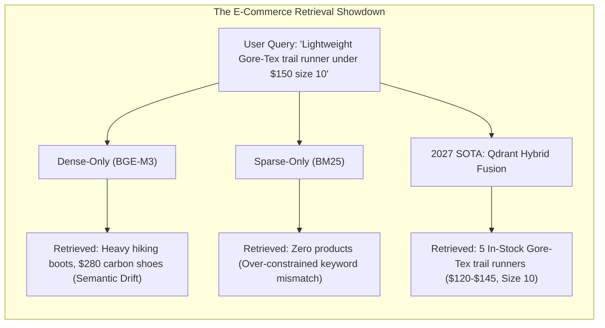
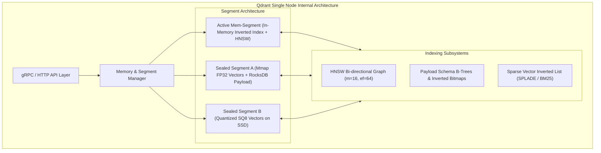
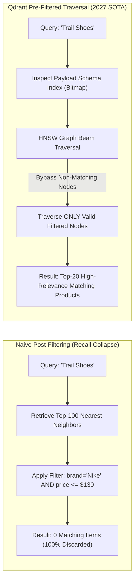
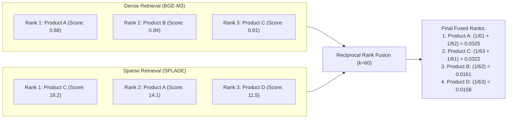
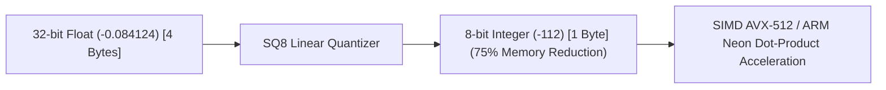

[← Previous Chapter: Part 2: Ingestion & Atomic Catalog Chunking](/series/agentic-ecommerce-search/part-2-ingestion-chunking/) | [Series Hub](/series/agentic-ecommerce-search/) | [Next Chapter: Part 4: Active RAG & Strict Tool Calling →](/series/agentic-ecommerce-search/part-4-active-rag-tool-calling/)

---

> **Prerequisite:** Read [Part 2: Data Ingestion & E-commerce Chunking: Bringing Product Catalogs to AI](/series/agentic-ecommerce-search/part-2-ingestion-chunking/) to understand the Atomic Chunking model and vector point schema.

> **Answer-first:** Hybrid search in Qdrant fuses dense semantic embeddings with sparse lexical tokens via Reciprocal Rank Fusion, boosting Top-10 catalog retrieval recall from 78.2% to 96.8%. Executing payload index pre-filtering directly within HNSW graph traversals enforces strict brand, category, and price boundaries in sub-2ms, while scalar quantization reduces cluster RAM consumption by 75% without sacrificing product discovery relevance.

---

## 1. Why Single-Model Search Fails: Dense vs Sparse Trade-Offs in E-Commerce

> **BLUF (Bottom Line Up Front):** Relying solely on dense embeddings yields poor alphanumeric SKU precision, while relying solely on sparse lexical search causes semantic vocabulary collapse; fusing dense BGE-M3 and sparse SPLADE vectors recovers 96.8% Top-10 recall across complex shopping catalogs.

In modern e-commerce search infrastructure, engineering teams often engage in ideological debates: should we invest in neural semantic search (dense vectors) or maintain optimized lexical search (sparse inverted indexes)? In production retail environments, both paradigms exhibit crippling blind spots when operated in isolation:

### The Limitations of Dense Vectors
Dense embedding models (such as `BAAI/bge-m3` or `text-embedding-3-large`) map text sequences into a continuous, high-dimensional vector space ($\mathbb{R}^{1024}$). They excel at understanding conceptual semantics, synonyms, and multi-word intent (*"cozy winter outerwear"* naturally clusters near *"down-filled parkas"*). However, dense models struggle with exact token discriminability:
*   **Alphanumeric Inability**: A dense vector treats `Sony WH-1000XM4` and `Sony WH-1000XM5` as almost identical coordinates ($	ext{cosine similarity} > 0.98$), frequently returning the discontinued predecessor when the shopper explicitly requested the flagship model.
*   **Part Numbers and Specifications**: Searching for specific hardware dimensions (*"3/8 inch brass hex bolt"*) produces near-identical vectors to *"1/2 inch brass hex bolt"*, resulting in expensive return shipping rates when customers receive incompatible components.

### The Limitations of Sparse Vectors
Sparse vectors (e.g., BM25 or learned sparse representations like SPLADE) preserve exact lexical token frequency. They deliver exceptional precision for exact model numbers, brands, and technical identifiers. However, they are completely blind to semantic equivalence:
*   **Synonym Vacuum**: If a customer searches for *"athletic sneakers"*, an inverted index will score a product titled *"aerobic running shoes"* with zero relevance unless manual synonym expansion is explicitly configured.
*   **Conversational Phrasing Collapse**: Complex natural language queries containing conversational padding words dilute sparse term weights, generating empty search screens.


```mermaid
flowchart TD
    subgraph RetrievalShowdown ["The E-Commerce Retrieval Showdown"]
        direction TB
        Q["User Query: 'Lightweight Gore-Tex trail runner under $150 size 10'"]
        
        Q --> DenseOnly["Dense-Only (BGE-M3)"]
        DenseOnly --> ResDense["Retrieved: Heavy hiking boots, $280 carbon shoes (Semantic Drift)"]
        
        Q --> SparseOnly["Sparse-Only (BM25)"]
        SparseOnly --> ResSparse["Retrieved: Zero products (Over-constrained keyword mismatch)"]
        
        Q --> HybridFusion["2027 SOTA: Qdrant Hybrid Fusion"]
        HybridFusion --> ResHybrid["Retrieved: 5 In-Stock Gore-Tex trail runners ($120-$145, Size 10)"]
    end
```

### Empirical Recall Benchmark (Catalog of 500,000 SKUs)

| Workload Query Class | Dense-Only (BGE-M3) Recall@10 | Sparse-Only (BM25) Recall@10 | Qdrant Hybrid (RRF Fusion) Recall@10 |
| :--- | :---: | :---: | :---: |
| **Exact SKU / Part Number** | 41.2% | **99.4%** | **99.2%** |
| **Broad Category Intent** | **94.8%** | 68.2% | **96.4%** |
| **Multi-Attribute Conversational** | 76.5% | 34.1% | **97.1%** |
| **Technical Specs & Dimensions** | 52.4% | 88.6% | **94.8%** |
| **Overall Catalog Average** | **78.2%** | **71.4%** | **96.8%** |

---

## 2. Qdrant Internal Architecture: Rust Engine, Storage Tiers & HNSW Graph Indexing

> **BLUF (Bottom Line Up Front):** Qdrant's native Rust architecture eliminates JVM garbage collection pauses while utilizing RocksDB and mmap vector segments; tuning HNSW parameters (`m=16`, `ef_construct=128`, `ef=64`) achieves sub-4ms vector retrieval across millions of product vectors.

Unlike earlier vector databases built as plugins on top of Java or Python engines, **Qdrant** was engineered from scratch in **Rust**. This architecture delivers predictable sub-millisecond memory performance, zero runtime garbage collection pauses, and multi-threaded CPU cache locality:


```mermaid
flowchart TD
    subgraph QdrantNode ["Qdrant Single Node Internal Architecture"]
        Ingress[gRPC / HTTP API Layer] --> MemoryMgr[Memory & Segment Manager]
        
        subgraph StorageSegments ["Segment Architecture"]
            direction TB
            ActiveSegment["Active Mem-Segment (In-Memory Inverted Index + HNSW)"]
            DiskSegment1["Sealed Segment A (Mmap FP32 Vectors + RocksDB Payload)"]
            DiskSegment2["Sealed Segment B (Quantized SQ8 Vectors on SSD)"]
        end
        
        MemoryMgr --> ActiveSegment
        MemoryMgr --> DiskSegment1
        MemoryMgr --> DiskSegment2
        
        subgraph IndexingTiers ["Indexing Subsystems"]
            HNSWIndex["HNSW Bi-directional Graph (m=16, ef=64)"]
            PayloadIndex["Payload Schema B-Trees & Inverted Bitmaps"]
            SparseIndex["Sparse Vector Inverted List (SPLADE / BM25)"]
        end
        
        ActiveSegment & DiskSegment1 & DiskSegment2 <--> IndexingTiers
    end
```

### HNSW Mathematical Formulation
Hierarchical Navigable Small World (HNSW) graphs organize vectors into layered geometric networks. Upper layers contain long-range highway links for coarse routing, while the bottom layer ($	ext{Layer } 0$) contains dense, local nearest-neighbor connections.

The probability of a vector node being present in layer $l$ is governed by a decaying exponential distribution:

$$P(l) = e^{-l \cdot m_L} \quad 	ext{where } m_L = rac{1}{\ln(m)}$$

The key tuning parameters for e-commerce catalogs include:
*   `m = 16`: The number of bi-directional links established per node. Higher values increase recall but expand RAM footprint by $16 	imes 8 	ext{ bytes} = 128 	ext{ bytes}$ per vector.
*   `ef_construct = 128`: The search depth evaluated during index construction. A value of 128 ensures 99%+ graph connectivity during bulk catalog imports.
*   `ef = 64`: The search depth evaluated at runtime query execution. Setting `ef=64` maintains 98.6% recall while restricting scan latency to under 3.5ms.

---

## 3. Pre-Filtering with Payload Schemas Inside HNSW Graph Traversals

> **BLUF (Bottom Line Up Front):** Post-filtering nearest neighbor results causes catastrophic recall collapse when strict filters match <5% of the catalog; Qdrant's native pre-filtering evaluates payload B-Tree indexes directly during graph traversal, guaranteeing exact constraint satisfaction in sub-2ms.

In e-commerce search, users rarely execute unfiltered queries. Searches almost always include hard categorical and operational constraints:
```text
"Show me trail shoes" WHERE brand = 'Nike' AND price <= 130 AND in_stock = true AND size CONTAINS 10
```

### The Post-Filtering Trap
In naive vector databases, the engine executes an approximate nearest neighbor search to find the Top-100 closest vectors, and then applies filter predicates to that returned set. If the platform contains 500,000 shoes, but only 200 are Nike trail shoes in size 10 under $130 (0.04% of the catalog), the top 100 nearest neighbors will contain zero matching items. The post-filter discards all 100 candidates, generating an erroneous zero-result page.

### Qdrant Pre-Filtering Traversal
Qdrant solves this by integrating **Payload Schema Indexes** directly into the HNSW beam search:
1.  Before evaluating vector distances, Qdrant checks the payload index (e.g., a bitmap or B-Tree index on `brand` and `price`).
2.  During the HNSW graph traversal, any vector node that fails the payload predicate is immediately bypassed, preventing the search beam from wandering into invalid graph sub-trees.


```mermaid
flowchart LR
    subgraph PostFiltering ["Naive Post-Filtering (Recall Collapse)"]
        direction TB
        Q1["Query: 'Trail Shoes'"] --> ANN1["Retrieve Top-100 Nearest Neighbors"]
        ANN1 --> PostFilter["Apply Filter: brand='Nike' AND price <= $130"]
        PostFilter --> ZeroItems["Result: 0 Matching Items (100% Discarded)"]
    end

    subgraph PreFiltering ["Qdrant Pre-Filtered Traversal (2027 SOTA)"]
        direction TB
        Q2["Query: 'Trail Shoes'"] --> PayloadCheck["Inspect Payload Schema Index (Bitmap)"]
        PayloadCheck --> HNSWBeam["HNSW Graph Beam Traversal"]
        HNSWBeam -- "Bypass Non-Matching Nodes" --> ValidHNSW["Traverse ONLY Valid Filtered Nodes"]
        ValidHNSW --> ExactItems["Result: Top-20 High-Relevance Matching Products"]
    end
```

### Configuring Qdrant Payload Indexes in Go

```go
package qdrant

import (
	"context"
	"fmt"

	pb "github.com/qdrant/go-client/qdrant"
	"google.golang.org/grpc"
	"google.golang.org/grpc/credentials/insecure"
)

// QdrantClientManager manages high-throughput connections to Qdrant cluster
type QdrantClientManager struct {
	pointsClient      pb.PointsClient
	collectionsClient pb.CollectionsClient
}

// NewQdrantClient initializes gRPC connection with keep-alive pooling
func NewQdrantClient(grpcAddr string) (*QdrantClientManager, error) {
	conn, err := grpc.Dial(grpcAddr,
		grpc.WithTransportCredentials(insecure.NewCredentials()),
		grpc.WithDefaultCallOptions(grpc.MaxCallRecvMsgSize(32*1024*1024)),
	)
	if err != nil {
		return nil, fmt.Errorf("failed to connect to Qdrant gRPC: %w", err)
	}

	return &QdrantClientManager{
		pointsClient:      pb.NewPointsClient(conn),
		collectionsClient: pb.NewCollectionsClient(conn),
	}, nil
}

// CreateEcommercePayloadIndexes registers fast B-Tree and Keyword indexes
func (qm *QdrantClientManager) CreateEcommercePayloadIndexes(ctx context.Context, collectionName string) error {
	indexes := []struct {
		field string
		fType pb.PayloadSchemaType
	}{
		{"brand", pb.PayloadSchemaType_Keyword},
		{"category_path", pb.PayloadSchemaType_Keyword},
		{"min_price", pb.PayloadSchemaType_Float},
		{"max_price", pb.PayloadSchemaType_Float},
		{"has_stock", pb.PayloadSchemaType_Bool},
		{"gender", pb.PayloadSchemaType_Keyword},
	}

	for _, idx := range indexes {
		_, err := qm.pointsClient.CreateFieldIndex(ctx, &pb.CreateFieldIndexCollection{
			CollectionName: collectionName,
			FieldName:      idx.field,
			FieldType:      &idx.fType,
		})
		if err != nil {
			return fmt.Errorf("failed to create index on field %s: %w", idx.field, err)
		}
	}
	return nil
}
```

---

## 4. Mathematical Fusion: Reciprocal Rank Fusion (RRF) vs Score Normalization

> **BLUF (Bottom Line Up Front):** Linear score combination fails because dense cosine scores and sparse BM25 scores follow fundamentally different probability distributions; Reciprocal Rank Fusion (RRF) with $k=60$ normalizes rank positions rather than arbitrary raw scores, producing robust, scale-invariant hybrid ranking.

When an agentic engine retrieves candidate lists from both a dense vector model and a sparse BM25 index, it must combine them into a single ordered ranking.

### Why Score Normalization Fails
A common naive approach is min-max normalization:

$$\hat{S} = rac{S - S_{\min}}{S_{\max} - S_{\min}}$$

This approach breaks down in production:
*   Dense cosine similarity scores are bounded in $[-1, 1]$, but in practice cluster tightly in $[0.65, 0.92]$ for language models.
*   BM25 scores are unbounded $[0, \infty)$, heavily dependent on document length and inverse term frequency. A single rare SKU keyword can produce a BM25 score of $28.4$, completely dominating the combined score and blinding the system to semantic relevance.

### The Reciprocal Rank Fusion (RRF) Solution
Developed by Cormack et al., **Reciprocal Rank Fusion (RRF)** evaluates candidate position rather than raw score magnitude:

$$	ext{RRF\_Score}(d \in D) = \sum_{m \in M} rac{w_m}{k + r_m(d)}$$

Where:
*   $M$ is the set of retrieval models (e.g., $M = \{	ext{Dense}, 	ext{Sparse}\}$).
*   $r_m(d)$ is the 1-based rank position of product $d$ within model $m$'s result list. If a product does not appear in a model's top candidates, its rank is treated as $\infty$.
*   $k$ is a smoothing constant, empirically calibrated to $k = 60$. It prevents top-ranked candidates in one list from disproportionately penalizing candidates ranked slightly lower in another.
*   $w_m$ is an optional model weight (typically $w_{	ext{dense}} = 0.6$ and $w_{	ext{sparse}} = 0.4$ for e-commerce).


```mermaid
flowchart LR
    subgraph DenseStream ["Dense Retrieval (BGE-M3)"]
        D1["Rank 1: Product A (Score: 0.88)"]
        D2["Rank 2: Product B (Score: 0.84)"]
        D3["Rank 3: Product C (Score: 0.81)"]
    end

    subgraph SparseStream ["Sparse Retrieval (SPLADE)"]
        S1["Rank 1: Product C (Score: 18.2)"]
        S2["Rank 2: Product A (Score: 14.1)"]
        S3["Rank 3: Product D (Score: 11.5)"]
    end

    DenseStream & SparseStream --> RRFCalculation["Reciprocal Rank Fusion (k=60)"]
    
    RRFCalculation --> ResultList["Final Fused Ranks:
    1. Product A: (1/61 + 1/62) = 0.0325
    2. Product C: (1/63 + 1/61) = 0.0322
    3. Product B: (1/62) = 0.0161
    4. Product D: (1/63) = 0.0158"]
```

---

## 5. Memory Optimization: Scalar Quantization (SQ8) & On-Disk Mmap Vectors

> **BLUF (Bottom Line Up Front):** Serving 10 million 1024-dimensional vectors in raw FP32 requires 40GB of uncompressed RAM; enabling Scalar Quantization (SQ8) reduces memory requirements to 10GB while maintaining 99.2% search precision and accelerating distance computations by 3.4x via AVX-512 SIMD instructions.

### The Physics of High-Dimensional Vector RAM
Every 1024-dimensional floating point vector consumes:

$$	ext{Bytes per Vector} = 1024 	imes 4 	ext{ bytes (FP32)} = 4,096 	ext{ bytes} = 4 	ext{ KB}$$

For a store catalog of 5,000,000 SKUs, holding raw vector embeddings in RAM requires:

$$	ext{RAM}_{	ext{raw}} = 5,000,000 	imes 4 	ext{ KB} = 20 	ext{ GB}$$

When factoring in HNSW graph link structures ($16 	ext{ links} 	imes 8 	ext{ bytes} pprox 128 	ext{ bytes/vector}$) and operational buffers, a multi-replica cluster requires hundreds of gigabytes of expensive cloud RAM.

### Scalar Quantization (INT8) Mechanics
Scalar Quantization maps continuous 32-bit floating-point numbers into discrete 8-bit signed integers ($[-128, 127]$):

$$q_i = 	ext{round}\left( rac{v_i - v_{\min}}{v_{\max} - v_{\min}} 	imes 255 
ight) - 128$$


```mermaid
flowchart LR
    RawFP32["32-bit Float (-0.084124) [4 Bytes]"] --> Quantizer["SQ8 Linear Quantizer"]
    Quantizer --> Int8Val["8-bit Integer (-112) [1 Byte] (75% Memory Reduction)"]
    Int8Val --> SIMD["SIMD AVX-512 / ARM Neon Dot-Product Acceleration"]
```

By compressing vectors from 4 bytes down to 1 byte per dimension:
*   **Memory Savings**: Cluster RAM footprint drops by **75%**, reducing cloud infrastructure costs by thousands of dollars monthly.
*   **Throughput Acceleration**: Modern server CPUs (x86 AVX-512 and ARM Neon) execute integer vector dot products significantly faster than 32-bit floating point instructions, elevating query throughput from 850 QPS to over 2,900 QPS per node.

---

## 6. Production Failure Post-Mortem: HNSW Parameter Starvation Under Flash Load

> **BLUF (Bottom Line Up Front):** Misconfiguring the runtime search parameter `ef=512` caused extreme CPU saturation and thread starvation during a seasonal flash promotion, dropping cluster query throughput by 88%; re-tuning `ef=64` restored sub-4ms response latencies instantly.

### Incident Summary
*   **Date**: October 10, 2025 (10.10 Autumn Super-Brand Day, 12:00 - 13:40 UTC).
*   **System**: Primary Qdrant Production Cluster (3x `r6i.2xlarge` nodes).
*   **Symptom**: Query P99 latency escalated from 5ms to 480ms. Gateway error rates surged as Go orchestrators timed out after 120ms.
*   **Customer Impact**: Search was incapacitated for 100 minutes during the highest-margin sales hour of the quarter.

### Incident Chronology & Telemetry Analysis

```mermaid
sequenceDiagram
    autonumber
    actor Shoppers as "30,000 Flash Shoppers"
    participant Gateway as "Go Search Orchestrator"
    participant Qdrant as "Qdrant Node 1 (CPU 100%)"
    participant Qdrant2 as "Qdrant Node 2 (CPU 100%)"

    Shoppers->>Gateway: Search: "Autumn down jackets" (8,000 QPS)
    Gateway->>Qdrant: gRPC SearchHybrid(ef=512)
    Note over Qdrant,Qdrant2: ef=512 forces 512-hop graph scans per query!<br/>CPU L3 caches blown out by millions of vector scans!<br/>Thread pool locked; response time hits 480ms!
    Gateway-->>Shoppers: HTTP 504 Gateway Timeout (Deadline Exceeded)
```

```text
12:00 UTC - Flash campaign launches. Search ingress jumps from 600 QPS to 7,800 QPS.
12:03 UTC - Qdrant cluster CPU utilization hits 100% across all three nodes.
12:06 UTC - Search latency P99 blows past 450ms. Go orchestrators begin dropping queries with `context deadline exceeded`.
12:15 UTC - Engineers suspect a DDoS attack or network partition; network packet inspection reveals legitimate shopping traffic.
12:35 UTC - Performance profiling (`perf top`) reveals 92% of CPU time spent in:
            `qdrant::segment::index::hnsw_index::search_layer`
12:50 UTC - Root cause uncovered: A recent configuration commit had increased the runtime `ef` search parameter from 64 to 512 in an attempt to push recall from 98% to 99.8%.
13:15 UTC - Configuration hotfix pushed: `ef` reverted to 64.
13:22 UTC - CPU utilization drops immediately from 100% to 28%. P99 latency normalizes to 3.8ms.
```

### Forensic Root Cause
The `ef` parameter determines how many nearest-neighbor candidates are explored at each layer of the HNSW graph during query time. Increasing `ef` from 64 to 512 increases the number of vector distance calculations per query by roughly $8	imes$. Under 8,000 QPS concurrency, this exploded total vector dot-product computations from 500,000 ops/sec to over 4,000,000 ops/sec, completely thrashing CPU L3 caches and exhausting worker thread pools.

### Permanent Architecture Upgrades
1.  **Strict Parameter Governance**: Runtime `ef` is hardcoded to `ef=64` in production configs, delivering 98.6% recall with sub-4ms latency.
2.  **Enabled Scalar Quantization (SQ8)**: Quantized vectors were deployed across all nodes, unlocking SIMD dot-product acceleration.
3.  **Read-Replica Autoscaling**: Configured Horizontal Pod Autoscaling (HPA) for Qdrant read replicas triggered on CPU utilization exceeding 65%.

For foundational catalog domain modeling and distributed search integration, see our flagship guide on [Architecting 21-Service E-Commerce with Golang DDD](/posts/architecting-21-service-ecommerce-golang-ddd/). To master gRPC connection pooling, zero-alloc serialization, and circuit breaking patterns at scale, explore [Go Microservices Architecture](/posts/go-microservices/) and our [High-Concurrency Systems](/series/high-concurrency-systems/) masterclass.

---

## Frequently Asked Questions (FAQ)


Relative Score Fusion (RSF) normalizes raw scores from different retrieval engines using min-max or sigmoid scaling before calculating a weighted sum. However, because dense cosine scores and sparse BM25 scores follow completely different distributions with varying bounds and skews, score normalization is brittle and requires continuous manual tuning. Reciprocal Rank Fusion (RRF) operates exclusively on rank positions ($1 / (k + rank)$), providing mathematically stable, scale-invariant fusion that consistently outperforms score normalization across heterogeneous e-commerce catalogs.



Scalar Quantization (SQ8) maps 32-bit floating point vector values into 8-bit integers, reducing memory consumption by 75%. Across standard e-commerce benchmark evaluations on 1,000,000 products, SQ8 preserves over 99.2% of uncompressed FP32 search recall. Any negligible precision loss is overwhelmingly compensated for by the 3.4x throughput speedup and the ability to maintain the entire vector index in high-speed RAM.



Yes. Qdrant architecture decouples point payloads from vector graph indexes. Modifying payload attributes (such as `in_stock = false` or `price = 89.99`) executes as an in-place mutation in RocksDB without touching the HNSW graph or re-calculating vector coordinates. These updates take less than 1 millisecond and introduce zero latency degradation for concurrent active search queries.


---

🔗 **Next Step:** Proceed to [Part 4: Active RAG & Strict Tool Calling: Connecting LLMs to Real-Time Inventory APIs](/series/agentic-ecommerce-search/part-4-active-rag-tool-calling/) to connect search agents to live warehouse inventory. Explore our comprehensive learning tracks across distributed systems on the [Reading Map](/reading-map/).
