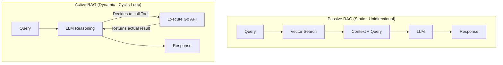

In [Part 3: Qdrant Hybrid Search - Solving Semantic and Hard Filters](/series/agentic-ecommerce-search/part-3-qdrant-hybrid-search/), we successfully built a powerful Hybrid search engine combining Dense Semantic and Sparse Lexical Search. However, a practical e-commerce search system goes far beyond merely retrieving static documents from a vector database.

For example, a user asks: *"I want to buy a 400L Samsung Inverter refrigerator available at the District 1 branch that has an active promotion."*
If we rely solely on a Vector Database, we face two critical errors:
1.  **Static data is out-of-date**: Inventory status at District 1 changes constantly every second via POS transactions, making it impossible to continuously update the Vector Index without wasting immense resources.
2.  **Dynamic promotion information**: Flash Sales or discount vouchers are typically calculated in real-time based on the user's account, marketing campaigns, and current shopping cart.

To solve this problem thoroughly, the system must shift from the **Passive RAG** model to **Active RAG (Agentic RAG)** using **Strict Tool Calling** in Golang. This article will guide you on setting up this mechanism via the **Eino (CloudWeGo)** framework.

---

## 1. The Difference Between Passive RAG and Active RAG

Before diving into code, let's clarify the architectural boundaries between these two models:



*   **Passive RAG (Linear RAG)**: The user enters a query -> The system performs a Vector Search to get Context -> Appends Context to the Prompt -> The LLM returns an answer. This model is entirely passive and linear. If the data retrieved from the Vector DB is incorrect or outdated, the LLM will confidently return false information (Hallucination).
*   **Active RAG (Agentic RAG)**: The LLM acts as the controlling brain (Reasoning Engine). Upon receiving a query, the LLM parses the intent and decides which tools it needs to call. It might call a product search tool, discover the product is in stock but lacking a promotional price, continue by calling a voucher calculation tool, and only then synthesize the final answer for the user.

---

## 2. Defining Tools In Golang With Eino

The **Eino** framework uses Go's Reflection mechanism to automatically map Structs into JSON Schemas sent to the LLM. To define a Tool, we need:
1.  **Input Struct**: Defines the API input parameters accompanied by Struct Tags so the LLM understands the data type and description of each field.
2.  **Callback Function**: The actual processing logic (calling a database, microservice, or third-party API).

Below is the implementation of two practical Tools: `CheckLiveInventory` and `GetActivePromotions`.

```go
package agent

import (
	"context"
	"fmt"
)

// CheckInventoryInput defines parameters for the inventory check tool
type CheckInventoryInput struct {
	SKU      string `json:"sku" jsonschema:"required" jsonschema_description:"Unique identifier SKU of the product"`
	Location string `json:"location" jsonschema:"required" jsonschema_description:"District name or store branch (e.g., 'District 1', 'District 3')"`
}

// CheckLiveInventory executes a call to the Inventory Microservice via gRPC/REST
func CheckLiveInventory(ctx context.Context, input *CheckInventoryInput) (string, error) {
	// Simulate an actual API call to the DB/Microservice
	// In reality, you would initialize a gRPC client here
	if input.SKU == "" || input.Location == "" {
		return "", fmt.Errorf("missing required parameters SKU or Location")
	}

	// Simulate results returned from a real-time inventory database
	stock := 12
	if input.Location == "District 3" {
		stock = 0
	}

	return fmt.Sprintf("Product SKU '%s' at branch '%s' currently has: %d items in stock.", 
		input.SKU, input.Location, stock), nil
}

// GetPromotionsInput defines parameters for the promotion check tool
type GetPromotionsInput struct {
	SKU string `json:"sku" jsonschema:"required" jsonschema_description:"Product SKU code to apply promotions"`
}

// GetActivePromotions executes the actual promotion campaign calculation
func GetActivePromotions(ctx context.Context, input *GetPromotionsInput) (string, error) {
	// Simulate calling the Promotion service
	return fmt.Sprintf("SKU '%s' is currently under the campaign: 'Radiant Summer' - Get 10%% off up to 500,000 VND when paying via bank card.", input.SKU), nil
}
```

---

## 3. Strict Schema Binding With Strict Tool Calling

Commercial LLMs like OpenAI GPT or Gemini support the **Strict Function Calling** feature (OpenAI `strict: true`). This feature forces the JSON Schema defining parameters to include the property `"additionalProperties": false`, meaning the LLM is not allowed to generate any phantom parameters outside the defined fields.

In Eino (v0.5.4+), we use the `utils.InferTool` function along with the `WithSchemaModifier` configuration to automatically append the `"additionalProperties": false` property to the JSON Schema generated from the Go Struct:

```go
package agent

import (
	"reflect"

	"github.com/cloudwego/eino/components/tool"
	"github.com/cloudwego/eino/components/tool/utils"
	"github.com/invopop/jsonschema"
)

// BuildStrictTools initializes a list of tools with strict Schema Modifiers
func BuildStrictTools() ([]tool.BaseTool, error) {
	// Configure Schema Modifier to enforce "additionalProperties: false"
	strictModifier := utils.WithSchemaModifier(func(name string, t reflect.Type, tag reflect.StructTag, s *jsonschema.Schema) {
		if s.Type == "object" {
			s.AdditionalProperties = jsonschema.AdditionalPropertiesFalse
		}
	})

	// 1. Initialize Inventory Tool
	inventoryTool, err := utils.InferTool(
		"check_inventory",
		"Check the real-time physical inventory of a product at a specific branch",
		CheckLiveInventory,
		strictModifier,
	)
	if err != nil {
		return nil, err
	}

	// 2. Initialize Promotion Tool
	promotionTool, err := utils.InferTool(
		"get_promotions",
		"Retrieve information on active discount and promotion campaigns applied to a product",
		GetActivePromotions,
		strictModifier,
	)
	if err != nil {
		return nil, err
	}

	return []tool.BaseTool{inventoryTool, promotionTool}, nil
}
```

---

## 4. Setting Up the ReAct Loop Using Eino Graph

For the LLM to perform Reasoning and Action multiple times dynamically, we will build a cyclic **Eino Graph** orchestration graph instead of a standard linear Chain.

Below is the architecture for the Agentic Search orchestration graph:

```go
package agent

import (
	"context"
	"fmt"

	"github.com/cloudwego/eino/compose"
	"github.com/cloudwego/eino/components/model"
	"github.com/cloudwego/eino/schema"
)

// OrchestrateAgentGraph builds the complete ReAct Loop graph
func OrchestrateAgentGraph(ctx context.Context, chatModel model.ChatModel, tools []tool.BaseTool) (compose.Runnable[[]*schema.Message, *schema.Message], error) {
	// 1. Create a node to process Tools
	toolsNode, err := compose.NewToolsNode(ctx, &compose.ToolsNodeConfig{
		Tools: tools,
	})
	if err != nil {
		return nil, fmt.Errorf("failed to create tools node: %w", err)
	}

	// 2. Initialize the Graph taking an array of Messages as input and outputting the final message
	g := compose.NewGraph[[]*schema.Message, *schema.Message]()

	// Add functional nodes to the graph
	g.AddChatModelNode("llm_reasoning", chatModel)
	g.AddToolsNode("tools_execution", toolsNode)

	// Configure initial static flow: The starting point sends data straight to the LLM
	g.AddEdge(compose.START, "llm_reasoning")

	// 3. Build a Conditional Branch
	// After reasoning, the LLM outputs a Message:
	// - If the Message contains tool requests (ToolCalls) -> route to "tools_execution" node
	// - If it contains no ToolCalls -> end the graph (END) and return the answer to the User
	reactBranch := compose.NewGraphBranch(func(ctx context.Context, msg *schema.Message) (string, error) {
		if len(msg.ToolCalls) > 0 {
			return "tools_execution", nil
		}
		return compose.END, nil
	}, map[string]bool{
		"tools_execution": true,
		compose.END:        true,
	})

	// Attach this conditional branch right after the LLM Node
	g.AddBranch("llm_reasoning", reactBranch)

	// After Tools finish running, ToolMessages return to the LLM
	// creating a continuous ReAct Loop cycle
	g.AddEdge("tools_execution", "llm_reasoning")

	// 4. Compile the graph with a safety limit to prevent infinite loops (Max Steps)
	runnable, err := g.Compile(ctx, compose.WithMaxRunSteps(20))
	if err != nil {
		return nil, fmt.Errorf("failed to compile graph: %w", err)
	}

	return runnable, nil
}
```

---

## 5. Practical Operation Scenario

Let's observe the execution cycle of the Agentic Graph when a user asks:
*"Give me the promotion info and check the stock at the District 1 branch for SKU 'SAMSUNG-RF400'."*

1.  **Turn 1 (LLM Reasoning)**: 
    *   The LLM analyzes the query and identifies two intents: fetching promotions and checking inventory.
    *   Thanks to **Strict Tool Calling**, the LLM returns an accurate list of `ToolCalls` in a clean JSON format:
        *   `check_inventory(sku: "SAMSUNG-RF400", location: "District 1")`
        *   `get_promotions(sku: "SAMSUNG-RF400")`
2.  **Turn 2 (Tools Execution & Loopback)**:
    *   The graph branches to `tools_execution`. Eino automatically executes the two Go functions `CheckLiveInventory` and `GetActivePromotions` in parallel.
    *   The two results return as `ToolMessage`s and are appended to the call history.
    *   The graph follows the edge `AddEdge("tools_execution", "llm_reasoning")` to send data back to the LLM.
3.  **Turn 3 (Synthesizing the answer)**:
    *   The LLM reads the feedback from the two Tools: *"12 refrigerators left"* and *"10% discount max 500,000 VND"*.
    *   The LLM decides no further tools are needed (`ToolCalls` length is 0).
    *   The branch routes to `compose.END`.
    *   The system returns a natural, 100% accurate real-time response to the user.

---

## Summary & Key Takeaways from Part 4

1.  **Dynamic data requires Active RAG**: Avoid injecting constantly changing data (inventory, prices, promotions) into the Vector Database. Use Tool Calling to query internal APIs in real-time.
2.  **Strict Mode is Mandatory**: Adding the `"additionalProperties": false` constraint via `utils.WithSchemaModifier` ensures your backend system never crashes due to anomalous parameters from the LLM.
3.  **Eino Graph enables flexible routing**: Use `compose.Graph` to construct type-safe ReAct loops, allowing Agents to auto-correct or call multiple nested tools.
4.  **Control Loop Iterations**: Use `compose.WithMaxRunSteps` during compilation to guarantee the system safely disconnects if the LLM falls into an infinite loop, saving on API costs.

However, what if the LLM still answers incorrectly due to an internal logic error, or if data returned by a Tool has a weird format confusing the LLM? How can an Agent perform Self-Reflection and double-check its response before sending it to the customer?

In **[Part 5: Critique Loop: Preventing LLM Hallucination](/series/agentic-ecommerce-search/part-5-critique-loop/)**, we will set up an independent "Retrieve-Critique-Regenerate" Loop in Eino to guarantee output quality reaches absolute perfection before displaying it to the end user.
