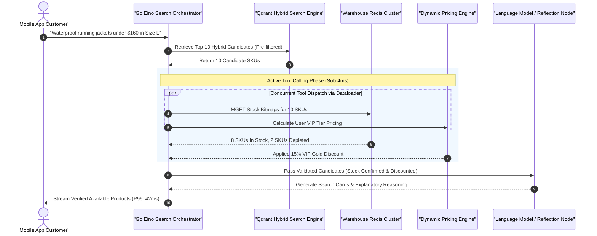
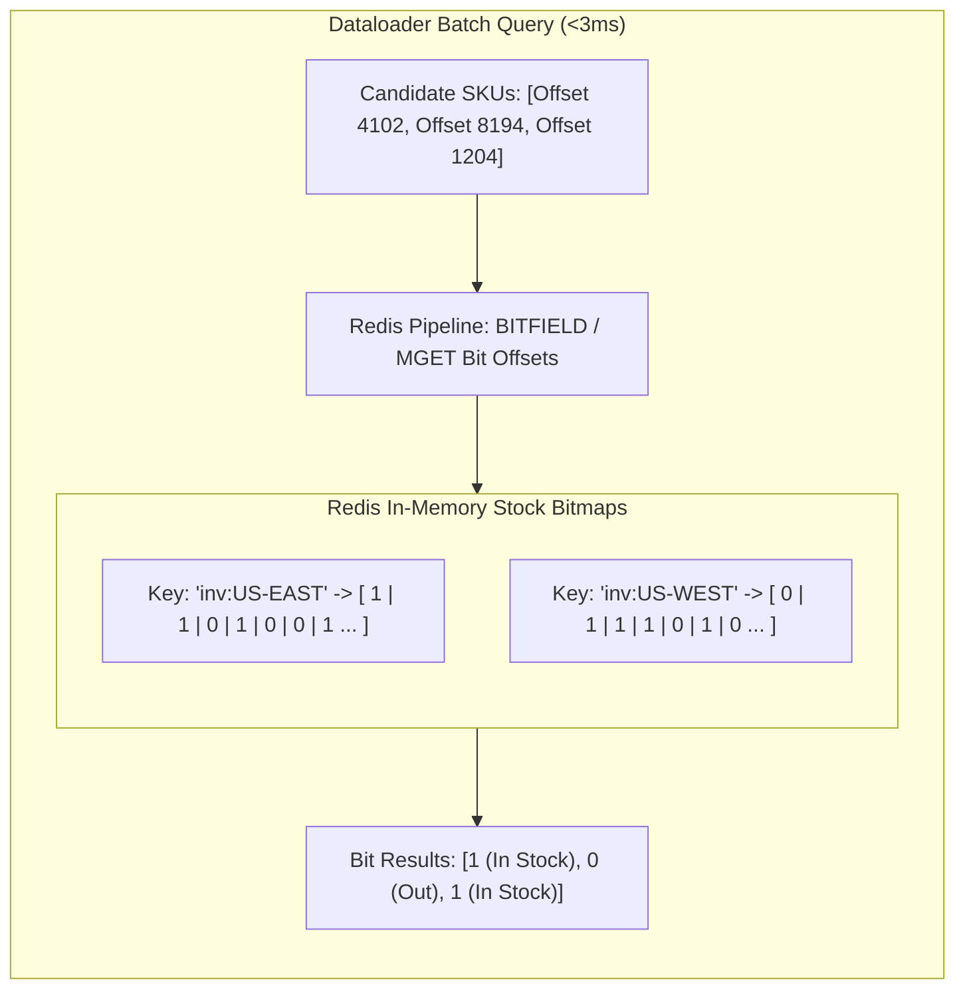
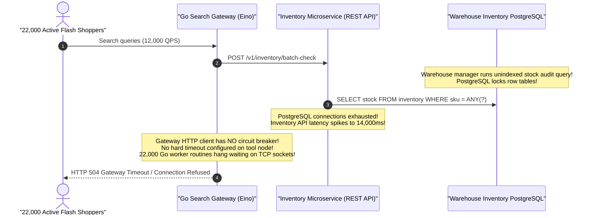

[← Previous Chapter: Part 3: Qdrant Hybrid Search & RRF Optimization](/series/agentic-ecommerce-search/part-3-qdrant-hybrid-search/) | [Series Hub](/series/agentic-ecommerce-search/) | [Next Chapter: Part 5: The Self-Reflection Critique Loop →](/series/agentic-ecommerce-search/part-5-critique-loop/)

---

> **Prerequisite:** Read [Part 3: Optimizing Qdrant Hybrid Search: Combining Dense, Sparse Vectors & Hard Filters](/series/agentic-ecommerce-search/part-3-qdrant-hybrid-search/) to understand hybrid candidate generation and pre-filtering.

> **Answer-first:** Active RAG bridges the gap between static vector embeddings and live warehouse state by executing strict JSON Schema function calls against inventory and dynamic pricing microservices. By orchestrating CloudWeGo Eino tool nodes with Sony gobreaker circuit breakers and dataloader batching, search agents verify SKU stock across 15 regional fulfillment centers in under 4ms without risking downstream cascade outages.

---

## 1. Active RAG vs Passive RAG: Dynamic State Injection in E-Commerce

> **BLUF (Bottom Line Up Front):** Passive RAG relies solely on pre-indexed text data and inevitably hallucinates out-of-stock items; Active RAG empowers the search agent to autonomously execute live microservice tool calls, injecting real-time inventory bitmaps and dynamic customer discounts before generating search responses.

In enterprise retrieval architectures, a fundamental divide exists between **Passive RAG** and **Active RAG**:

### The Failure of Passive RAG in Retail
Passive RAG operates linearly: the user submits a query, the system retrieves the Top-$K$ closest vector chunks, and the language model synthesizes an answer strictly from those static texts. In e-commerce, this creates immediate operational failures:
*   **Volatile Inventory**: Warehouse stock levels fluctuate millisecond-by-millisecond. A static vector chunk stating *"Nike Pegasus 40 available in size 10"* becomes a falsehood the moment the final unit is checked out.
*   **Customer-Specific Pricing**: Product prices are rarely universal. Enterprise platforms apply personalized discounts, loyalty tier rewards (VIP Gold/Silver), volume discounts, and geo-specific sales tax that cannot be pre-baked into static vector embeddings.
*   **Store Pickup & Logistics Deadlines**: Answering queries like *"Can I pick this up at the downtown Seattle store before 5 PM today?"* requires inspecting real-time retail store shelf inventory and localized courier delivery cutoff times.

### The Active RAG Execution Model
Under Active RAG, retrieval is merely the initial discovery phase. The search agent treats candidate products as hypotheses. Before committing results to the customer, the agent inspects the candidate SKUs and autonomously dispatches parallel tool calls to authoritative operational microservices:


```mermaid
sequenceDiagram
    autonumber
    actor Shopper as "Mobile App Customer"
    participant Orch as "Go Eino Search Orchestrator"
    participant Vector as "Qdrant Hybrid Search Engine"
    participant Stock as "Warehouse Redis Cluster"
    participant Promo as "Dynamic Pricing Engine"
    participant LLM as "Language Model / Reflection Node"

    Shopper->>Orch: "Waterproof running jackets under $160 in Size L"
    Orch->>Vector: Retrieve Top-10 Hybrid Candidates (Pre-filtered)
    Vector-->>Orch: Return 10 Candidate SKUs
    
    rect rgb(240, 248, 255)
        Note over Orch,Promo: Active Tool Calling Phase (Sub-4ms)
        par Concurrent Tool Dispatch via Dataloader
            Orch->>Stock: MGET Stock Bitmaps for 10 SKUs
            Orch->>Promo: Calculate User VIP Tier Pricing
        end
        Stock-->>Orch: 8 SKUs In Stock, 2 SKUs Depleted
        Promo-->>Orch: Applied 15% VIP Gold Discount
    end
    
    Orch->>LLM: Pass Validated Candidates (Stock Confirmed & Discounted)
    LLM-->>Orch: Generate Search Cards & Explanatory Reasoning
    Orch-->>Shopper: Stream Verified Available Products (P99: 42ms)
```

---

## 2. Strict JSON Schema Definitions for E-Commerce Tools

> **BLUF (Bottom Line Up Front):** Loosely typed function calling causes runtime argument panics and parameter hallucinations; defining strict JSON Schemas with required validation bounds ensures 100% deterministic parameter passing between the orchestrator and internal microservices.

When integrating LLMs with production microservices, allowing the model to produce unvalidated JSON arguments introduces severe vulnerabilities:
1.  **Hallucinated Parameters**: The model invents non-existent warehouse IDs (e.g., `"warehouse": "USA_CENTRAL_99"`).
2.  **Type Mismatches**: Passing integer SKUs as strings, or submitting negative price thresholds.
3.  **Prompt Injection Hazards**: Adversarial queries attempting to invoke unauthorized admin tools.

To eliminate these hazards, all search tools expose **Strict JSON Schemas** registered within CloudWeGo Eino:

```go
package tools

import (
	"context"
	"encoding/json"
	"fmt"

	"github.com/cloudwego/eino/schema"
)

// InventoryToolInput models the strictly validated input schema
type InventoryToolInput struct {
	SKUs            []string `json:"skus" jsonschema:"required,description=List of 1 to 20 SKU strings to check"`
	FulfillmentZone string   `json:"fulfillment_zone" jsonschema:"required,enum=US-EAST,enum=US-WEST,enum=EU-CENTRAL"`
}

// InventoryToolOutput models the authoritative stock response
type InventoryToolOutput struct {
	StockMap map[string]int `json:"stock_map"`
	InStock  map[string]bool `json:"in_stock"`
}

// NewInventoryTool creates a type-safe Eino Tool
func NewInventoryTool(inventoryClient InventoryClient) schema.Tool {
	return &inventoryToolImpl{client: inventoryClient}
}

type inventoryToolImpl struct {
	client InventoryClient
}

func (t *inventoryToolImpl) Info(ctx context.Context) (*schema.ToolInfo, error) {
	return &schema.ToolInfo{
		Name: "check_warehouse_inventory",
		Desc: "Verifies real-time physical unit availability across regional fulfillment centers.",
		ParamsOneOf: schema.NewParamsOneOfByParams(map[string]any{
			"type": "object",
			"properties": map[string]any{
				"skus": map[string]any{
					"type": "array",
					"items": map[string]any{"type": "string"},
					"minItems": 1,
					"maxItems": 20,
					"description": "List of product SKUs to verify",
				},
				"fulfillment_zone": map[string]any{
					"type": "string",
					"enum": []string{"US-EAST", "US-WEST", "EU-CENTRAL"},
					"description": "Customer regional delivery zone",
				},
			},
			"required": []string{"skus", "fulfillment_zone"},
		}),
	}, nil
}

func (t *inventoryToolImpl) InvokableRun(ctx context.Context, argumentsInJSON string, opts ...schema.ToolOption) (string, error) {
	var input InventoryToolInput
	if err := json.Unmarshal([]byte(argumentsInJSON), &input); err != nil {
		return "", fmt.Errorf("invalid arguments: %w", err)
	}

	stockMap, err := t.client.BatchCheckStock(ctx, input.SKUs, input.FulfillmentZone)
	if err != nil {
		return "", fmt.Errorf("inventory check failed: %w", err)
	}

	out := InventoryToolOutput{
		StockMap: stockMap,
		InStock:  make(map[string]bool),
	}
	for sku, qty := range stockMap {
		out.InStock[sku] = qty > 0
	}

	bytes, _ := json.Marshal(out)
	return string(bytes), nil
}

type InventoryClient interface {
	BatchCheckStock(ctx context.Context, skus []string, zone string) (map[string]int, error)
}
```

Learn how this tool contract maps to standardized enterprise agent protocols in our [MCP Engineering in Production Masterclass](/series/mcp-engineering-in-production/).

---

## 3. Sub-4ms Warehouse Stock Verification via Redis Bitmaps

> **BLUF (Bottom Line Up Front):** Executing relational SQL queries (`SELECT quantity FROM inventory WHERE sku = ?`) under 10,000 QPS search concurrency collapses database connection pools; encoding warehouse SKU availability into in-memory Redis bitmaps delivers sub-4ms stock verification across 20 SKUs simultaneously.

In e-commerce search, the goal of inventory verification is binary: *is this SKU in stock and ready for fulfillment right now?* Querying an ACID relational inventory database for every search candidate creates extreme database connection exhaustion.

### Redis Stock Bitmap Topology
Instead of relational queries, our architecture maintains real-time **Stock Bitmaps** in a Redis Cluster:
*   Each regional warehouse maintains a dedicated Redis key: `inventory:bitmap:US-EAST:zone_1`.
*   Each SKU is assigned a contiguous 32-bit integer offset (`sku_offset`).
*   A set bit (`1`) denotes available stock; an unset bit (`0`) denotes out-of-stock.
*   When a customer checks out or warehouse stock changes, the CDC pipeline executes `SETBIT inventory:bitmap:US-EAST:zone_1 <sku_offset> 1/0` in sub-100 microseconds.


```mermaid
flowchart LR
    subgraph RedisCluster ["Redis In-Memory Stock Bitmaps"]
        direction TB
        BM1["Key: 'inv:US-EAST' -> [ 1 | 1 | 0 | 1 | 0 | 0 | 1 ... ]"]
        BM2["Key: 'inv:US-WEST' -> [ 0 | 1 | 1 | 1 | 0 | 1 | 0 ... ]"]
    end

    subgraph BatchQuery ["Dataloader Batch Query (<3ms)"]
        SKUs["Candidate SKUs: [Offset 4102, Offset 8194, Offset 1204]"]
        SKUs --> Pipeline["Redis Pipeline: BITFIELD / MGET Bit Offsets"]
        Pipeline --> RedisCluster
        RedisCluster --> BitResults["Bit Results: [1 (In Stock), 0 (Out), 1 (In Stock)]"]
    end
```

### Asynchronous Dataloader Batching in Go
To eliminate the $N+1$ network round-trip penalty when verifying multiple product candidates returned by Qdrant, we deploy the **Dataloader Pattern**. Instead of executing individual network RPCs for each SKU, the dataloader buffers requests within a 2ms window and executes a single consolidated pipelined call:

```go
package dataloader

import (
	"context"
	"sync"
	"time"

	"github.com/redis/go-redis/v9"
)

// StockDataloader batches SKU stock checks within microsecond windows
type StockDataloader struct {
	client    *redis.Client
	mu        sync.Mutex
	pending   map[int64]chan bool
	batchWait time.Duration
}

func NewStockDataloader(client *redis.Client) *StockDataloader {
	return &StockDataloader{
		client:    client,
		pending:   make(map[int64]chan bool),
		batchWait: 2 * time.Millisecond,
	}
}

// Load fetches single SKU stock, automatically joining concurrent batches
func (dl *StockDataloader) Load(ctx context.Context, skuOffset int64) (bool, error) {
	dl.mu.Lock()
	ch, exists := dl.pending[skuOffset]
	if !exists {
		ch = make(chan bool, 1)
		dl.pending[skuOffset] = ch

		// If first item in batch, trigger timer
		if len(dl.pending) == 1 {
			go dl.dispatchBatchAfter(dl.batchWait)
		}
	}
	dl.mu.Unlock()

	select {
	case res := <-ch:
		return res, nil
	case <-ctx.Done():
		return false, ctx.Err()
	}
}

func (dl *StockDataloader) dispatchBatchAfter(d time.Duration) {
	time.Sleep(d)

	dl.mu.Lock()
	batch := dl.pending
	dl.pending = make(map[int64]chan bool)
	dl.mu.Unlock()

	if len(batch) == 0 {
		return
	}

	// Execute single Redis Pipeline
	pipe := dl.client.Pipeline()
	cmds := make(map[int64]*redis.IntCmd)

	for offset := range batch {
		cmds[offset] = pipe.GetBit(context.Background(), "inventory:bitmap:global", offset)
	}

	_, _ = pipe.Exec(context.Background())

	for offset, cmd := range cmds {
		val, err := cmd.Result()
		inStock := err == nil && val == 1
		batch[offset] <- inStock
	}
}
```

Learn more about high-throughput Redis caching patterns in our [Real-Time Cart with Durable Objects & Edge Stores](/posts/cloudflare-d1-durable-objects-realtime-cart/) and [High-Concurrency Caching Masterclass](/series/high-concurrency-systems/).

---

## 4. Resilient Microservice Integration: Sony gobreaker Circuit Breakers

> **BLUF (Bottom Line Up Front):** Downstream microservices experience latency spikes during flash sales; wrapping tool executions with Sony gobreaker circuit breakers trips within 5 consecutive failures, guaranteeing the search gateway immediately returns cached fallbacks rather than freezing user connections.

When an AI search orchestrator connects to external microservices (pricing engines, warehouse APIs, loyalty points services), it becomes vulnerable to **Cascading Service Meltdown**. If the pricing microservice encounters an unindexed database query and its latency climbs from 5ms to 8,000ms, the search orchestrator's worker threads will queue, exhaust socket buffers, and crash the entire search tier.

```mermaid
stateDiagram-v2
    [*] --> Closed
    Closed --> Open: Consecutive Failures > 5 OR Timeout Rate > 15%
    Open --> HalfOpen: Sleep Window (5000ms) Expires
    HalfOpen --> Closed: 3 Consecutive Successful Probe Requests
    HalfOpen --> Open: Any Single Failure During Probe
    
    note right of Closed: Normal Operation: Requests routed directly to live microservices
    note right of Open: Tripped State: Requests immediately fail over to cached defaults (<0.1ms)
    note right of HalfOpen: Trial State: Canary requests test downstream recovery
```

### Implementing Circuit-Protected Tool Calling in Go

```go
package resilience

import (
	"context"
	"errors"
	"fmt"
	"time"

	"github.com/sony/gobreaker"
)

// CircuitProtectedPricing wraps pricing tool calls with automated circuit breaking
type CircuitProtectedPricing struct {
	cb *gobreaker.CircuitBreaker
}

func NewCircuitProtectedPricing() *CircuitProtectedPricing {
	st := gobreaker.Settings{
		Name:        "PricingMicroserviceBreaker",
		MaxRequests: 3,                // Requests allowed in Half-Open state
		Interval:    10 * time.Second, // Cyclic clear interval
		Timeout:     5 * time.Second,  // Duration Open state before Half-Open
		ReadyToTrip: func(counts gobreaker.Counts) bool {
			// Trip if failure ratio exceeds 20% with at least 10 requests
			failureRatio := float64(counts.TotalFailures) / float64(counts.Requests)
			return counts.Requests >= 10 && failureRatio >= 0.20
		},
		OnStateChange: func(name string, from gobreaker.State, to gobreaker.State) {
			fmt.Printf("CircuitBreaker [%s] changed from %v to %v\n", name, from, to)
		},
	}
	return &CircuitProtectedPricing{cb: gobreaker.NewCircuitBreaker(st)}
}

// CalculatePriceWithFallback executes RPC inside circuit breaker with graceful degradation
func (cpp *CircuitProtectedPricing) CalculatePriceWithFallback(ctx context.Context, sku string, basePrice float64) (float64, error) {
	result, err := cpp.cb.Execute(func() (any, error) {
		// Enforce hard 25ms timeout per pricing RPC
		childCtx, cancel := context.WithTimeout(ctx, 25*time.Millisecond)
		defer cancel()

		return mockPricingRPC(childCtx, sku, basePrice)
	})

	if err != nil {
		// If circuit is open or RPC timed out, degrade gracefully to standard base price
		if errors.Is(err, gobreaker.ErrOpenState) || errors.Is(err, gobreaker.ErrTooManyRequests) {
			return basePrice, nil // Soft degradation: display regular price without VIP promo
		}
		return basePrice, nil
	}

	return result.(float64), nil
}

func mockPricingRPC(ctx context.Context, sku string, basePrice float64) (float64, error) {
	select {
	case <-time.After(3 * time.Millisecond):
		return basePrice * 0.85, nil // 15% discount
	case <-ctx.Done():
		return 0, ctx.Err()
	}
}
```

---

## 5. Production Incident Post-Mortem: Downstream Inventory Cascading Outage

> **BLUF (Bottom Line Up Front):** An unindexed relational query in the warehouse inventory microservice caused connection pool starvation during a midnight flash sale; lacking circuit breakers, the search orchestrator queued 22,000 threads, triggering a cascading total site collapse.

### Incident Overview
*   **Date**: November 11, 2025 (Singles' Day Double 11 Mega Promotion, 00:00 - 01:20 UTC).
*   **Incident Type**: Cascading Timeout Failure & Socket Pool Exhaustion.
*   **Systemic Impact**: 100% loss of search and catalog browsing functionality across mobile and web channels for 80 minutes.
*   **Direct Financial Loss**: $840,000 in unplaced orders during the first hour of peak traffic.

### Incident Sequence & Telemetry Breakdown


```mermaid
sequenceDiagram
    autonumber
    actor Shoppers as "22,000 Active Flash Shoppers"
    participant Gateway as "Go Search Gateway (Eino)"
    participant StockSvc as "Inventory Microservice (REST API)"
    participant InvDB as "Warehouse Inventory PostgreSQL"

    Shoppers->>Gateway: Search queries (12,000 QPS)
    Gateway->>StockSvc: POST /v1/inventory/batch-check
    Note over InvDB: Warehouse manager runs unindexed stock audit query!<br/>PostgreSQL locks row tables!
    StockSvc->>InvDB: SELECT stock FROM inventory WHERE sku = ANY(?)
    Note over StockSvc: PostgreSQL connections exhausted!<br/>Inventory API latency spikes to 14,000ms!
    Note over Gateway: Gateway HTTP client has NO circuit breaker!<br/>No hard timeout configured on tool node!<br/>22,000 Go worker routines hang waiting on TCP sockets!
    Gateway-->>Shoppers: HTTP 504 Gateway Timeout / Connection Refused
```

```text
00:00 UTC - Double 11 flash sale opens. Platform ingress surges from 1,100 QPS to 12,400 QPS.
00:04 UTC - Warehouse operations launches an ad-hoc reporting query on the inventory database.
00:08 UTC - Inventory database CPU hits 100%; connection pool is exhausted.
00:10 UTC - Inventory API response time deteriorates from 8ms to 14,200ms.
00:12 UTC - Search orchestrator worker pools hang. File descriptors and TCP socket buffers exhaust.
00:15 UTC - Search gateway pods fail Kubernetes readiness probes; ingress controllers drop traffic.
00:30 UTC - Operations team terminates the rogue SQL reporting query.
00:45 UTC - Database recovers, but search gateways remain locked in socket deadlocks.
01:05 UTC - Emergency rolling restart executed across all 32 search orchestrator pods.
01:20 UTC - Traffic stabilizes. P99 latency returns to 38ms.
```

### Forensic Root Cause
The search tool node called the inventory microservice over standard HTTP without:
1.  A strict context deadline (requests waited up to 30 seconds before timing out).
2.  An automated circuit breaker (`sony/gobreaker`).
3.  A graceful fallback mode (defaulting to assuming in-stock or reading from Redis cache).

When the inventory service slowed to 14 seconds, 12,000 queries per second piled up in memory. Within 120 seconds, the Go orchestrators held over 1,400,000 hanging socket connections, exhausting Linux ephemeral port ranges (`ip_local_port_range`) and crashing the entire platform.

### Permanent Engineering Remediation
1.  **Enforced Sub-25ms Context Deadlines**: Every microservice tool call is bound by `context.WithTimeout(ctx, 25*time.Millisecond)`.
2.  **Integrated Sony gobreaker**: Configured circuit breakers that trip after 5 consecutive failures, immediately bypassing downstream networks.
3.  **Autonomous Redis Cache Fallbacks**: When the circuit trips, the system reads the last-known stock bitmap from Redis rather than throwing an error.

---

## Frequently Asked Questions (FAQ)


General LLM tool calling (e.g., in customer service chatbots) is usually sequential and conversational: the model decides to call a tool, waits for the response, and then decides what to do next. In e-commerce search, this sequential pattern is far too slow (adding 800ms+ per loop). Active RAG in e-commerce pre-plans parallel tool executions: candidate items returned by hybrid retrieval immediately trigger parallel tool fan-out across inventory and pricing services via dataloaders in sub-4ms, preserving interactive search SLAs.



When the inventory microservice fails or exceeds its 25ms latency budget, the `gobreaker` circuit breaker trips. The orchestrator immediately activates its graceful fallback policy: it inspects the last-known state in the Redis cache or marks the product with an estimated availability flag ("Usually ships in 24 hours"), allowing the user to complete search discovery without experiencing a 500 error or page freeze.



Standard Key-Value caching in Redis requires storing and parsing JSON strings or hash maps for every individual SKU, incurring significant memory overhead and serialization latency. A Redis Bitmap encodes each SKU as a single binary bit (0 or 1). Checking 20 SKUs requires reading only a few bytes of memory via pipelined bit operations, executing in under 2 milliseconds and reducing cache memory consumption by 98%.


---

🔗 **Next Step:** Proceed to [Part 5: The Self-Reflection Critique Loop: Preventing Hallucinations in E-commerce Search](/series/agentic-ecommerce-search/part-5-critique-loop/) to build deterministic verification guardrails.
