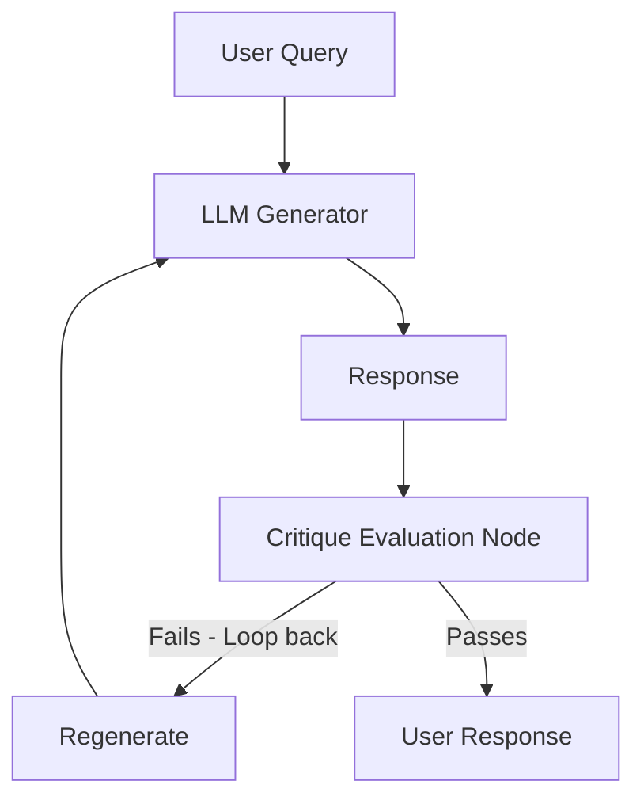

In [Part 4: Active RAG & Strict Tool Calling - Connecting LLMs to Real-time APIs](/series/agentic-ecommerce-search/part-4-active-rag-tool-calling/), we successfully built a cyclic ReAct graph allowing the LLM to call APIs to check inventory and promotions in real-time. However, in a real-world production environment, giving an LLM access to Tools is not enough to guarantee absolute accuracy.

A very common phenomenon is **Hallucination** or **constraint omission**: The LLM receives data indicating zero inventory from a Tool, yet in its final synthesized answer, it still recommends that product to the customer; or it ignores the maximum price filter explicitly requested by the user in the initial query.

To completely eradicate this issue, we must deploy a **Self-Reflection** model via a closed **Critique Loop (Retrieve - Critique - Regenerate)**. This article will guide you on setting up this system using ByteDance's **Eino (CloudWeGo)** framework.

---

## 1. The Nature of Hallucination in E-commerce Search

In e-commerce search, LLM hallucinations typically manifest in 3 forms:
1. **Inventory logic errors**: The LLM ignores actual data from the API and fabricates the stock status (e.g., the Tool reports "out of stock in District 1" but the LLM answers "the product is available in District 1").
2. **Constraint omission errors**: Ignoring hard filter criteria like price, color, or size requested by the customer.
3. **Output format errors**: Returning data that does not match the frontend's expected JSON structure.

The **Retrieve-Critique-Regenerate** cycle acts as an independent Auditor:



Every response from the Generator is not sent directly to the user but must pass through the Critique Node. If it fails the quality check, the response along with the error reasoning is pushed back for the Generator to self-correct and regenerate the answer.

---

## 2. Managing Loop State With Pointer-Based State

Unlike Python frameworks like LangGraph that use dictionary overwriting or merging, Eino manages the flow state via a Go Pointer-Based State Struct. This state is initialized exactly once using `compose.WithGenLocalState` when declaring the Graph and is safely mutated using `compose.ProcessState[S]`.

Below is the definition of the Agent's state and its initialization:

```go
package agent

import (
	"context"

	"github.com/cloudwego/eino/compose"
	"github.com/cloudwego/eino/schema"
)

// Product represents e-commerce product information
type Product struct {
	SKU     string  `json:"sku"`
	Name    string  `json:"name"`
	Price   float64 `json:"price"`
	InStock bool    `json:"in_stock"`
}

// AgentState stores the state of the critique loop
type AgentState struct {
	OriginalQuery  string `json:"original_query"`  // The original user request
	LatestResponse string `json:"latest_response"` // The latest answer from the Generator
	Feedback       string `json:"feedback"`        // Detailed feedback from the Critique Node
	Iterations     int    `json:"iterations"`      // Current iteration count
	ShouldStop     bool   `json:"should_stop"`     // Flag signaling termination
}

// InitializeGraph initializes the graph with a local state generator
func InitializeGraph() {
	g := compose.NewGraph[[]*schema.Message, *schema.Message](
		// Initialize AgentState for each invocation
		compose.WithGenLocalState(func(ctx context.Context) *AgentState {
			return &AgentState{
				Iterations: 0,
				ShouldStop: false,
			}
		}),
	)
	_ = g
}
```

---

## 3. Defining the Critique Node With InvokableLambda & MessageJSONParser

The Critique Node analyzes the Generator's answer against the user's request to return a Structured Output evaluation. We will define a Go Struct containing the score and reasoning, wrap the execution logic using `compose.InvokableLambda`, and use `schema.NewMessageJSONParser` to extract the data.

### Step A: Define the response evaluation structure

```go
package agent

import (
	"context"
	"fmt"

	"github.com/cloudwego/eino/callbacks"
	"github.com/cloudwego/eino/compose"
	"github.com/cloudwego/eino/schema"
)

// CritiqueResult defines the JSON output structure of the Critique Node
type CritiqueResult struct {
	Score      int    `json:"score" jsonschema:"required" jsonschema_description:"Evaluation score from 0 to 100 based on accuracy"`
	Feedback   string `json:"feedback" jsonschema:"required" jsonschema_description:"Detailed feedback on any logic errors or misinformation"`
	ShouldStop bool   `json:"should_stop" jsonschema:"required" jsonschema_description:"Set to true if the answer is perfect or cannot be improved further"`
}
```

### Step B: Build the Critique Node execution function

The handler function reads the message content, decodes it into the `CritiqueResult` struct, and uses `compose.ProcessState` to mutate the global state of the flow directly:

```go
// RunCritiqueNode performs the audit and updates the loop counter
func RunCritiqueNode(ctx context.Context, input *schema.Message) (*schema.Message, error) {
	// 1. Initialize JSON Parser to parse the structured response from the auditing LLM
	parser := schema.NewMessageJSONParser[CritiqueResult](&schema.MessageJSONParseConfig{
		ParseFrom: schema.MessageParseFromContent,
	})

	critique, err := parser.Parse(ctx, input)
	if err != nil {
		// In reality, if the LLM generates a format error, we return feedback asking for a format correction
		_ = compose.ProcessState[*AgentState](ctx, func(ctx context.Context, state *AgentState) error {
			state.Iterations++
			state.Feedback = "Error: Cannot parse the evaluation result. Please ensure a valid JSON format is returned."
			return nil
		})
		return input, nil
	}

	// 2. Safely mutate the state
	err = compose.ProcessState[*AgentState](ctx, func(ctx context.Context, state *AgentState) error {
		state.Iterations++
		state.Feedback = critique.Feedback
		state.LatestResponse = input.Content

		// Terminate if the score meets the minimum (e.g., 85 points) or the stop flag is present
		if critique.ShouldStop || critique.Score >= 85 {
			state.ShouldStop = true
		}
		return nil
	})
	if err != nil {
		return nil, fmt.Errorf("failed to process state in critique: %w", err)
	}

	return input, nil
}
```

---

## 4. Conditional Routing & Setting Safe Loop Limits

After the Critique Node finishes running and updating the state, the graph requires a routing branch (`compose.NewGraphBranch`) to make a decision:
*   Proceed to the **Generator** node to regenerate the answer (along with a Prompt containing the critique feedback).
*   End at **compose.END** to return the result to the user.

Simultaneously, to mitigate the risk of the LLM falling into an infinite loop (draining tokens and hanging the system), Eino provides the graph compilation option `compose.WithMaxRunSteps(steps)` to safely disconnect when the execution steps exceed the defined threshold.

```go
package agent

import (
	"context"
	"fmt"

	"github.com/cloudwego/eino/compose"
	"github.com/cloudwego/eino/components/model"
	"github.com/cloudwego/eino/schema"
)

// OrchestrateReflectedGraph assembles the complete self-auditing graph
func OrchestrateReflectedGraph(ctx context.Context, generatorModel model.ChatModel, auditorModel model.ChatModel) (compose.Runnable[[]*schema.Message, *schema.Message], error) {
	
	// Initialize Graph with local AgentState
	g := compose.NewGraph[[]*schema.Message, *schema.Message](
		compose.WithGenLocalState(func(ctx context.Context) *AgentState {
			return &AgentState{
				Iterations: 0,
				ShouldStop: false,
			}
		}),
	)

	// Wrap the audit handler function into an Eino Lambda Node
	critiqueNode := compose.NewInvokableLambda(RunCritiqueNode)

	// Register nodes to the graph
	g.AddChatModelNode("llm_generator", generatorModel)
	g.AddChatModelNode("llm_auditor", auditorModel) // LLM Node acting as the Critique
	g.AddLambdaNode("critique_processor", critiqueNode) // Node handling state mutation

	// Set up the initial static flow
	g.AddEdge(compose.START, "llm_generator")
	g.AddEdge("llm_generator", "llm_auditor")
	g.AddEdge("llm_auditor", "critique_processor")

	// Build a conditional routing branch based on the updated state
	routingBranch := compose.NewGraphBranch(func(ctx context.Context, msg *schema.Message) (string, error) {
		var nextNode string
		err := compose.ProcessState[*AgentState](ctx, func(ctx context.Context, state *AgentState) error {
			// Stop if quality is met or loop count exceeds the safe threshold (e.g., max 3 loops)
			if state.ShouldStop || state.Iterations >= 3 {
				nextNode = compose.END
			} else {
				nextNode = "llm_generator"
			}
			return nil
		})
		return nextNode, err
	}, map[string]bool{
		"llm_generator": true,
		compose.END:     true,
	})

	// Connect the Critique Processor to the conditional routing branch
	g.AddBranch("critique_processor", routingBranch)

	// Compile the graph with a safety limit of a maximum of 15 processing steps across the graph (WithMaxRunSteps)
	runnable, err := g.Compile(ctx, compose.WithMaxRunSteps(15))
	if err != nil {
		return nil, fmt.Errorf("failed to compile reflected graph: %w", err)
	}

	return runnable, nil
}
```

---

## 5. Practical Data Flow During Logic Error Handling

Let's observe the actual operational scenario when a user sends a search query:
*"Find me an Asus ROG laptop under $1500 in stock at the District 1 branch."*

1.  **Iteration 1 (Generation)**:
    *   `llm_generator` returns: *"Here is the Asus ROG Strix G15, priced at $1400, in stock at the District 3 branch."*
    *   `llm_auditor` analyzes it and detects a severe logic error: The user requested a store in **District 1**, but the Generator proposed a product in **District 3**.
    *   The Auditor's analysis result: `{ "score": 40, "feedback": "The proposed product is located in District 3, violating the customer's request for District 1.", "should_stop": false }`.
    *   `critique_processor` updates the state: `Iterations = 1`, saves `Feedback`, flag `ShouldStop = false`.
    *   The routing branch sees it hasn't passed, redirecting the flow back to the start: `llm_generator`.

2.  **Iteration 2 (Regeneration)**:
    *   `llm_generator` receives the error warning feedback and automatically self-corrects in the subsequent prompt.
    *   The new response: *"Apologies for the confusion. The District 1 store currently has the Asus ROG Flow X13 priced at $1450, ready for you."*
    *   `llm_auditor` re-audits: The product matches all criteria (Asus ROG, < $1500, exact District 1 branch).
    *   The new analysis result: `{ "score": 95, "feedback": "The result is perfectly accurate.", "should_stop": true }`.
    *   `critique_processor` updates the state: `Iterations = 2`, flag `ShouldStop = true`.
    *   The routing branch directs the flow to `compose.END`.
    *   A high-quality response is delivered to the customer.

---

## Summary & Key Takeaways from Part 5

1.  **State Mutation in Go is extremely clear**: The `compose.ProcessState` mechanism makes tracking state, incrementing loop counts, and updating feedback in Eino intuitive and strongly-typed.
2.  **Always use a Message Parser**: `schema.NewMessageJSONParser` simplifies decoding complex audit directives from JSON Strings into Go Structs.
3.  **WithMaxRunSteps is the final failsafe**: Never omit safety limits when compiling a cyclic graph. This is how you protect your LLM API account from unexpected thousand-dollar bills caused by infinite logic loops.

With a robust self-auditing mechanism in place, how do we push this RAG Agent system into a large-scale production environment? How do we solve the LLM's slow response time with Token Streaming, optimize costs via Semantic Caching, and trace the entire execution path using OpenTelemetry?

Join us in **[Part 6: Production Agentic Search Optimization in Go](/series/agentic-ecommerce-search/part-6-production-operations/)** to complete the final practical operational puzzle piece for your Agentic Search system!
